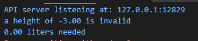

## 2021년 06월02일 golang 함수의 이해와 포인터 이해  
## Printf와 Sprintf를 사용한 출력 형식 지정  
- **Printf**  
```
fmt.Println(1.0/3.0)
0.3333333333333 소수점이 많이 나온다.

fmt 패키지에서 Printf 를 사용할 것이다.
Print, wiht Formatting의 약자로 
이함수는 문자열에 하나 이상의 값들을 삽입해 정해진 방식으로 형식화 후 출력

fmt.Printf("%0.2f\n".1.0/3.0)
-> 0.33 // 소수점 두자리 까지만 출력하기 
```
- **Sprintf**  
```
이것은 값을 출력하는 대신 형식화된 문자열을 반환한다는 점 빼고는 printf와 동일하게
작동

resultString := fmt.Sprintf("num : %0.2f",1.0/3.0)
fmt.Printf(resultString)
```
```
여기서 보면 형식동사와 값너비가 나오는데
형식동사 위 문자열의 동사는 %0.2f
값 너비 동사 사이에 있는 0.2가 너비
```
## 형식 동사  
```
출력값 지정할 때 사용
대부분의 문자는 문자 그대로 출력되지만 
백분율 기호(%)로 시작하는 형식 동사는 문자열을 특정한 형식의 값으로 대체

문자열 다음에 오는 나머지 인자는 이 동사가 사용할 값
```
- **형식 동사 종류**  
```
%f : 부동 소수점 숫자
%d : 십진수 정수
%s : 문자열
%t : 부울 (true 또는 false)
%v : 값의 타입에 따라 적절히 형식화된 값
%#v : Go 프로그램 코드에 나타나는 그대로 형식화된 값
%T : 제공된 값의 타입
%% : 백분율 기호 리터럴(백분율 기호 문자 그자체)
```
## 형식 값 너비  
```
%f 형식 동사는 부동 소수점 숫자를 위한 동사 
필요한 페인트의 양을 출력할 때 %f 동사를 사용할 수 있음

fmt.Printf("%f liters needed\n", 1.8199999999999998)
```

```
이렇게 해도 6자리 까지 나옵니다. 이를 적절히 해주는 방법을 소개 합니다.
package main

import "fmt"

func main() {
	fmt.Printf("%12s | %s\n", "Product", "Cost in Cents")
	fmt.Printf("---------------------------------------\n")
	fmt.Printf("%12s | %2s\n", "Stamps", "10")
	fmt.Printf("%12s | %2s\n", "Paper", "3")
	fmt.Printf("%12s | %2s\n", "gules", "99")
}
```

## 소수 자릿수 너비 지정하기  

## 함수 선언하기
```
func funcName(){
	fmt.Println("Hi")
}

func : 함수 키워드
funcName : 함수명 사용자들이 원하는 대로 해도됨

함수명이 대문자로 시작하면 외부로 노출 되어 외부 패키지에서 호출 가능
함수명이 소문자로 시작하면 내부에서만 사용가능하고 
카멜케이스 컨벤션을 따름
```
## 함수 매개변수 선언하기  
```
func reLine(line string, times int){// 이런식으로 매개변수 선언
}

-------
package main

import "fmt"

func paint(width float64, height float64) {
	area := width * height
	fmt.Printf("%.2f liters needed\n", area/10.0)
}

func main() {
	paint(4.2, 3.0)
	paint(1.54, 3.0)
}
```
```
함수를 이용하면 두번이상이더라도 빠르게 할 수 있다.
```

## 함수 반환 값
```
func double(number float64)float64{
	return number*2
}
저렇게 반환값을 매개변수뒤에 명시해주고 그 반환값에 맞춰서 리턴하면된다.
```
```go
package main

import "fmt"

func double(number float64) float64 {
	return number * 2
}

func main() {
	dozen := double(2.5)
	fmt.Println(dozen)
	fmt.Println(double(1.5))
}
```

## 에러가 생기는 경우  
```go
func paintNeeded(width float64, height float64)float64{
	area := width * height
	return area / 10.0
}
------------------------
- return area / 10.0 이 없는 경우 : 반환값을 지정 해서 있어야한다.
- return문이 제일 마지막이 아닌 경우 : 반환 타입을 설정했다면 return 이 마지막
- 반환 타입 선언 제거 : 반환 타입이 없는데 return이 있는 경우
- 반환 되는 타입이랑 선언한 타입이 다른 경우
```
## 에러 처리 하기  
```
인자의 유효성을 검사하고 에러를 보고 받는 방법에 대해서 알아보자.

이전에 문자열을 정수로 변환하는 strconv.Atoi 함수는 변환이 성공하면 프로그램 계속
의미의 nil 에러 값 반환
반대로 에러값이 nil이 아닌경우 문자열을 숫자로 변환 안되는 경우 에러 값 출력후 종료

guess, err :=strconv.Atoi(input)
if err != nil{
	log.Fatal(err)
}

구현해야하는 것
1. 에러 값을 생성하는 기능
2. 여러 개의 값을 반환하는 기능
```
## 에러값  
```
에러 값을 생성하는 가장 간단한 방법은 errors 패키지의 New 함수에 문자열을 
전달해 새로운 에러 값을 생성하는 것

import "errors"

err:= errors.New("height can't be negative")
fmt.Println(err.Error())

이렇게 하면 에러값을 반환 할 수 있다.
```

```
log.Fatal(err)해주면 에러메세지를 출력하고 프로그램 종료를 해줌
```

## 에러메시지에 다른 값의 형식 지정  
```go
err := fmt.Errorf("a heght of %0.2f  is invalid",-2.33333)
fmt.Println(err.Error())
fmt.println(err)
```

## 다중 반환 값 선언  
```
다중 반환 값을 선언하려면 함수 선언부의 두 번째 괄호 안에 반환 값 
타입들을 쉼표로 구분해 지정해 주면됨
반환 값 선언부를 괄호로 감사는 건 반환 값이 하나인 경우에는 선택
두개 이상인 경우 필수 

func manyReturn()(int, bool, string){
	reutrn 1, true, "hello"
}
func main(){
	myInt, myBool, myString := mayReturn()
	fmt.Println(myInt, myBool, myString)
}
그리고 좀 더 의미를 분명하게 하기 위해서 
매개변수 처럼 반환 값에 이름을 부여할 수 있음

func funcTest(number float64)(intPart int, boolPart bool){
	whoNumber := math.Floor(number)
	return int(whoNumber), number - whoNumber
}
```
```go
package main

import "fmt"

func paintNeeded(width float64, height float64) (float64, error) {
	if width < 0 {
		return 0, fmt.Errorf("a width of %0.2f is invalid", width)
	}
	if height < 0 {
		return 0, fmt.Errorf("a height of %0.2f is invalid", height)
	}
	area := width * height
	return area / 10.0, nil
}
func main() {
	amount, err := paintNeeded(4.2, -3.0)
	fmt.Println(err)
	fmt.Printf("%0.2f liters needed\n", amount)
}
```

## 항상 에러를 처리  
```
package main

import "fmt"

func paintNeeded(width float64, height float64) (float64, error) {
	if width < 0 {
		return 0, fmt.Errorf("a width of %0.2f is invalid", width)
	}
	if height < 0 {
		return 0, fmt.Errorf("a height of %0.2f is invalid", height)
	}
	area := width * height
	return area / 10.0, nil
}
func main() {
	amount, err := paintNeeded(4.2, 3.0)
	if err != nil {
		fmt.Println(err) //log.Fatal(err)해서 끝내도됨
	} else {
		fmt.Printf("%0.2f liters needed\n", amount)
	}
}
```
```
이런식으로 에러 걸릴때 에러 동작하게 쓰기 위해서 이다.
```
``go
package main

import (
	"errors"
	"fmt"
)

func divide(dividend float64, divisor float64) (float64, error) {
	if divisor == 0.0 {
		return 0, errors.New("can't divide by 0")
	}
	return dividend / divisor, nil
}

func main() {
	quotient, err := divide(5.6, 0.0)
	if err != nil {
		fmt.Println(err)
	} else {
		fmt.Printf("%0.2f \n", quotient)
	}
}

## 함수의 매개변수는 인자의 복사본을 받음  
```
매개변수를 가진 함수를 호출할 때에는 인자를 전달해야함
각 인자값은 위치에 맞는 각 매개변수로 복사
이방식을 pass - by - value라고 부른다. 
C언어에서는 call by value랑 비슷한듯

이렇게 되면 넘긴 값은 그대로 유지되어 값이 안바뀜 이를 주소값을 이용한
포인터로 이용해서 아래서 부터 계속
```
## 포인터  
```
Go의 주소 연산자인 &(앤드 기호)를 사용하면 
변수의 주소 값을 가져 올 수 있음

amount := 6
fmt.Println(amount) //변수의 값
fmt.Println(&amount) // 변수의 주소값

즉 주소는 우리가 집을 찾아가기위해서 주소를 알아야 찾아가듯이
메모리상에서도 이런 주소값을 가지고 존재하는것이다. 그래야 접근을 할 수 있으니까

이런 변수의 주소를 나타내는 값을 포인터 라고 한다.
즉, 변수가 존재하는 위치를 가리키고 있음을 의미
```
## 포인터 타입  
```
포인터 타입은 포인터가 가리키고 있는 변수의 타입 앞에 *(에스크리터라고불리는) 기호를
붙임
예로 int 타입의 포인터는 *int로 쓸 수 있음 
당연한 말이지만 이를 인트포인터라고 읽는다.
```
```go
package main

import (
	"fmt"
	"reflect"
)

func main() {
	var myInt int
	fmt.Println(reflect.TypeOf(&myInt))
}
```

```go
package main

import (
	"fmt"
)

func main() {
	var myInt int
	var myIntPointer *int
	myIntPointer = &myInt
	fmt.Println(myIntPointer)
}
```

## 포인터 단축 변수 선언  
```
var myBool bool
myBoolPointer := &myBool
fmt.Println(myBoolPointer
```
## 포인터 값 가져오거나 변경하기  
```
myInt := 4
myIntPointer := &myInt
fmt.Println(myIntPointer)
fmt.Println(*myIntPointer)

//주소값
//4라는 값이 나온다.

여기서 *myIntPointer = 8 하면 
myInt의 값도 8로 바뀐다.
```
## 함수에서 포인터 사용하기  
## 반환값  
```
함수 선언부에서 반환 값 타입을 포인터 타입으로 변경하면
함수는 포인터를 반환할 수 있음

func createPointer() *float64{
	var myFloat = 98.5
	return &myFloat //반환시 주소값으로 전달
}
func main(){
	var myFloatPointer *float64 = createPointer()
	fmt.Println(*myFloatPointer)//포인터로 값 출력
}
```
## 매게 변수  
```
func printerPointer(myBoolPointer *bool){
	fmt.Println(*myBoolPointer)
}
func main(){
	var myBool bool = true
	printPointer(&myBool)
}
```
## 포인터를 사용해 double 함수 문제 해결하기  

```
이렇게 해서 문제를 해결할 수 있다. 전에는 값에 의한 전달로 amount가 실제로 
바뀌지 않았으나
주소 값의 전달로 실제적으로 amount가 바뀜을 알 수 있다.
```

```
포인터를 이용해서 바꿀 수 있다.
```

