## 2021년 06월02일 visual code에 go환경 구축 조건문, 반복문  
## 고랭 설치  
[고랭 설치](https://golang.org/) 링크   


```
여기에 들어가서 Download Go를 눌러줍니다.
```

```
현재 만든 디렉토리에서 code. 해서 비주얼 코드에 들어간다.
그러면 설치가 진행되고 아래와 같이 화면이 뜨게 된다.
```

## Extentions 부분에 가서 go 설치  

```
ctrl + ` 누르면 터미널 창이 아래 켜진다.
```
```
go version 명령어를 입력해서 go가 제대로 설치 되어 있는지 확인해보자.
```


```go
package main

import (
	"fmt"
)

func main() {
	fmt.Println(1111)
}
```
```
원래는 
go fmt hello.go
go build hello.go
./hello
또는
hello.exe
로 해서 실행을 한다.
./hello 경우 리눅스나 맥os
hello.exe는 윈도우 환경인데 비주얼코드에서는 ./hello로 실행 된다. 
```

## 한번에 실행하기  
```go
go run hello.go
```

```
위와 같이 명령을 하더라도 빠르게 실행이 가능하다.
여기까지 설치는 완료
```
##  2. 조건문과 반복문  
## 메서드 호출하기  
```
메서드란 주어진 타입의 값과 연관된 함수
Go의 메서드는 다른 언어에서의 객체에 속해 있는 메서드와 비슷한 개념이나 간단하다.

time 패키지에는 날짜(연,월,일)와 시간(시간,분,초)을 나타내는 Time이라는 타입 있다.
time.Time 값은 연도를 반환하는 Year 메서드 가지고 있음
```
- **Year 메서드를 사용해서 연도 출력**  
```go
package main

import(
	"fmt"
	"time"
)

func main(){
	var now time.Time = time.Now()
	var year int = now.Year()
	fmt.Println(year)
}
```

```
우리가 이런식으로 변수 선언한것도 배웠기 때문에
	now := time.Now()  //var now time.Time = time.Now()
	year := now.Year() //var year int = now.Year()
이렇게 해도 될까? 
당연히 된다. 무튼 저렇게 하면 편하지만 정확한 타입을 초보자들은 알기 힘들다.
처음은 저렇게 선언해보고 연습해보자.

time.Now함수는 현재 날짜 및 시간을 나타내는 Time 값을 반환
이값을 now가 참조하는 값에서 Year매서드를 호출

now.Year()
now : time.Time 값을 가지고 있음
Year() : time.Time값에서 Year() 메서드 호출
```
- **년 월일 을 나오게 해보자 **   
```go
package main

import (
	"fmt"
	"time"
)

func main() {
	var now time.Time = time.Now()
	var year int = now.Year()
	var month int = int(now.Month())
	var day int = now.Day()
	fmt.Println(year, month, day)
}
```
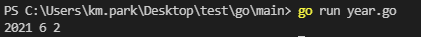
## Replacer  
```
string 패키지의 Replacer는 부분 문자열을 찾아 해당 문자열을 
다른 문자열로 치환해주는 기능이 있다.
아래 실습에서 모든 문자열에 포함되 모든 # 를 o로 치환해보자
```
```go
package main

import(
	"fmt"
	"strings"
)

func main(){
	broken := "G# r#ocks!"
	replacer := string.NewReplacer("#", "o")
	fixed := replacer.Replace(broken)
	fmt.Println(fixed)
}
```
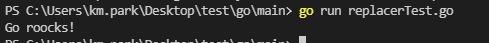
```
메서드 호출 문법을 보면 패키지 함수 호출 문법과 비슷하다.
. (점)은 오른쪽에 무언가가 왼쪽의 무언가에 속해 있음을 나타냄

now.Year()
replacer.Replace(broken)
```
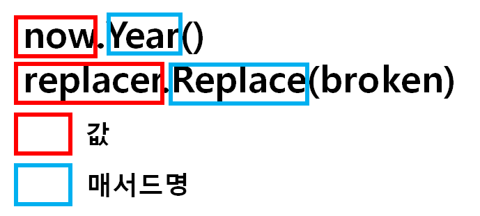
## 주석  
```
우선 파일을 생성하면 소스코드 파일 가장 위에 프로그램에 대한 설명을 추가
당연한 소리이지만 
Go 프로그램의 소스 코드에는 프로그램을 유지보수하는 사람을 위한
프로그램의 기능 설명이 주석의 형태로 포함되어 있음
이 주석은 컴파일할 때 무시
```
- **일반 주석**  
```
var a int //정수형을 가진 a 변수 입니다.
//이렇게 주석만 사용도 가능 합니다.
```
- **블록 주석**  
```
/*
var a int //정수형 a 변수
vat b int //정수형 b 변수
*/
var c int //정수형 c 변수 
/* */를 이용해서 한번에 주석 처리 할 수 있다.
```
## 사용자로부터 성적 입력 받기
```
사용자로부터 백분율 성적 입력받는 부분을 구현해보고 
이해해 봅시다.
```
```go
//pass_fail 프로그램은 성적의 합격 여부를 알려 줍니다.
package main

import (
	"bufio"
	"fmt"
	"os"
)

func main() {
	fmt.Print("Enter a grade: ")        //사용자에게 성적 입려하라고 알려줌
	reader := bufio.NewReader(os.Stdin) //키보드로 부터 텍스트 읽어오기
	input := reader.ReadString('\n') //엔터키가 눌리면 입력된 문자 반환
	fmt.Println(input)                  // 사용자가 입력한 값 출력
}
```
```
원래 보면 
input:= reader.ReadString('\n')
이렇게 되어있는데 이러면 에러가 생긴다
input, _ := reader.ReadString('\n')
이렇게 해줘야 정확히 이해를 한다.
```
## 함수 및 메서드에서 여러 개의 값 반환하기  
```
현재 위에서 말했듯이 input := reader.ReadString('\n')
이 부분이 에러가 난다.

여기서 문제는 ReadString 메서드는 두개의 값을 반환하는데
반환 값을 하나의 변수에 할당하려고 한것이 문제임

대부분 언어는 함수와 메서드가 하나의 값만 반환 할 수 있음
반면 Go는 여러 개의 값을 반환 가능
```
## 다중 반환 하는 경우  
```
가장 일반적인 상황은 함수 또는 메서드를 실행하는 도중 문제가 발생했는지
확인할 수 있는 추가적인 에러 값을 같이 반환하는 경우
예시는 아래서 계속~~!

bool, err := strconv.ParseBool("true") //문자열 부울로 변환 못하면 에러 반환
file, err := os.Open("myfile.txt") //파일을 열 수 없는 경우 에러 반환
response, err := http.Get("http://golang.org") //페이지를 못 가져 오면 에러 반환
```
```
여기서 그냥 에러 값 받을 변수 하나 추가하고 무시하면 되는거 아닌가?
생각이 들 수 있다. 하지만 Go에서는 미사용 변수를 선언할 수 없다.
즉 err 변수를 선언했는데 사용하지 않으면 에러가 생긴다.
그래서 input, err := reader.ReadString('\n') 
하면 err를 사용안하면 에러가 발생한다.
```
## 첫 번째 옵션 : 빈 식별자를 사용해 에러 반환 값 무시하기   
```
이때 사용하는 것이 빈 식별자(blank identifier)를 사용 할 수 있다.
이것을 사용하면 빈 식별자에 값을 할당하면 값은 버려지고,
코드를 읽는 사람역시 사용하지 않는다는 걸 알 수 있다.
즉,
input, _ := reader.ReadString('\n')
```
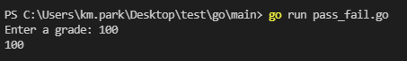
## 두 번째 옵션 : 에러 처리하기  
```
위의 빈 식별자를 이용하면 쉽게 처리 할 수 있지만 진짜 error가 생겼을 때 알 수 없다.
여기서는 log패키지를 이용해서 에러 메시지를 출력한 뒤 프로그램 종료하는 Fatal 함수 
사용을 해보자.
import 부분에 "log"추가
main() 부분에서
input, err := reader.ReadString('\n')
log.Fatal(err)
```
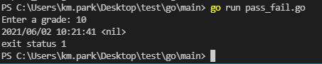
## 조건문  
```
현재 위에 사진을 보게 되면 읽는데는 아무런 문제가 없는데 실행이 중단이 된다.
여기서 error 는 nil 인데 nil인 경우에만 프로그램 종료하게 하면된다.
```
## 조건문의 구조  
```
사실 C나 C언어 java, python이랑 비슷한데
느낌은 python과c을 결합한 느낌

C언어 : if(ture){}
python : if ture :
go : if ture {}
go 언어에서도 if, else if, else 사용가능 
if ture {
}else if flase{
}else{
}
- if, else if, else 구문이다. -
```
## 조건문의 표현  
```
이것 역시 일반적인 언어와 비슷하다.
if 1 == 1 {}, if 1 > 2{}, if 1 < 2 {}, if 1>=2 {}, if 1<=2 {}
if !true {}, if !false {}
if true && true {}, if true || true {}

일반적인 대소비교나 not 연산이나 논리 연산자를 사용할 수 있음
괄호의 경우 우선순위를 지정하는게 아니라면 지워져 버린다.
```
## nil 조건을 제외하고 출력하기  
```go
//pass_fail 프로그램은 성적의 합격 여부를 알려 줍니다.
package main

import (
	"bufio"
	"fmt"
	"log"
	"os"
)

func main() {
	fmt.Print("Enter a grade: ")          //사용자에게 성적 입려하라고 알려줌
	reader := bufio.NewReader(os.Stdin)   //키보드로 부터 텍스트 읽어오기
	input, err := reader.ReadString('\n') //엔터키가 눌리면 입력된 문자 반환
	if err != nil{
		log.Fatal(err)
	}
	fmt.Println(input) // 사용자가 입력한 값 출력
}
```
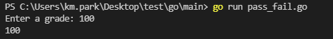
## 파일의 사이즈 정보 가져오기  
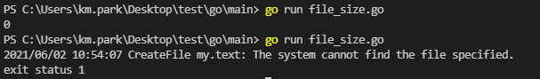
```go
package main

import (
	"fmt"
	"log"
	"os"
)

func main() {
	fileinfo, err := os.Stat("my.text")
	if err != nil {
		log.Fatal(err)
	}
	fmt.Println(fileinfo.Size())
}
```
## 이름 섀도잉 피하기   
```
왜 error로 안하고 err로 하는가?
그 이유는 변수명을 error라고 명명하게 되면
error라는 타입의 이름을 가리기(shadow) 때문이다.

이게 중요한것이 변수 선언 했는데,
만약 같은 스코프에 동일한 이름의 함수, 패키지, 타입 또는 변수가 이미 존재하면
이 변수는 잉미 존재하는 대상을 가림

즉, 기존에 이미 같은 이름으로 선언된 것보다 더 우선시됨
예를 들면 
var int int = 3
var append string = "ddd"
var fmt string ="ccc"
int, append, fmt를 변수들이 가려버린다.
```
## 새도잉 피하기 더 이해하기  
```go
package main

func main() {
	var int int = 1
	var append string = "aaa"
	var fmt string = "ccc"
	var count int = 2
	var lan = append([]string{}, "english")
	fmt.Println(int, append, "on", fmt, lan)
}
```
```
위에와 같이 하면 당연히 안된다. 그러기 때문에 변수명이 스코프와 겹치지 않게 해준다.
```
```go
package main

import (
	"fmt"
)

func main() {
	var number int = 1
	var aString string = "aaa"
	var cString string = "ccc"
	var lan = append([]string{}, "english")
	fmt.Println(number, aString, "on", cString, lan)
}
```
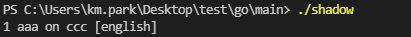
## 문자열을 숫자로 변환하기  
```go
//pass_fail 프로그램은 성적의 합격 여부를 알려 줍니다.
package main

import (
	"bufio"
	"fmt"
	"log"
	"os"
)

func main() {
	fmt.Print("Enter a grade: ")          //사용자에게 성적 입려하라고 알려줌
	reader := bufio.NewReader(os.Stdin)   //키보드로 부터 텍스트 읽어오기
	input, err := reader.ReadString('\n') //엔터키가 눌리면 입력된 문자 반환
	if err != nil {
		log.Fatal(err)
	}
	fmt.Println(input) // 사용자가 입력한 값 출력
	if input >=60{
		status : = "pass"
	}else{
		status :="fail"
	}
	fmt.Println(status)
}
```
```
이렇게 하면 에러가 생긴다 이유는 키보드로 가져오는것은 문자열이고
그래서 숫자와 비교를 할 수 없는 것 이다.

우선 사용자가 값을 입력하고 엔터를 누를 때 추가되는 줄 바꿈 문자 없애고
문자열을 부동 소수점 숫자 타입으로 변환 해야 된다.
```
## 줄 바꿈 문자 없애기  
```
strings 패키지를 이용해서 문자열의 처음과 끝에
존재하는 모든 공백 문자(줄 바꿈, 탭, 기타 공백 문자)를 제거해주는 
TrimSpace 함수를 쓰면된다.

s := "/t formerly surround by space \n"
fmt.Println(s)
fmt.Println(strings.TrimSpace(s))

즉, input = strings.TrimSpace(input)
```
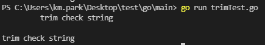
## 문자열 숫자로바꾸기  
```
strconv 패키지의 ParseFloat 함수를 이용하여 
문자열을 float64 타입값으로 변환 

grade, err := strconv.ParseFloat(input,64)
grade는 float64 타입이고 input이 저 타입으로 바뀌어 들어간다.
단 이거 실행시 "12" 문자열이 아닌 "hi" 이런 문자열이면 에러 생김
```
## 블록과 변수 스코프  
```
선언된 모든 변수들은 스코프를 갖는데
스코프란 코드에서 변수가 보이는(변수에 접근할 수 있는)영역의 범위
선언된 변수는 해당 변수가 속한 스코프 내에서는 어디서든지 접근 가능하지만
스코프 밖에서는 접근할 수 없다. 접근시 에러가 생김

책에서는 어렵게 말을 풀었는데 결국은 전역변수와 지역변수의 차이를 이해하면 쉽다.
- 지역 변수 
if a {
// 이안에서 선언된 변수는 이 지역에서만 사용된다. 
// 이 블록이라는 구역을 넘어가면 위에서 말하는것 처럼 사용이 불가하다. 
// 사실상 메모리에서 사라지는것과 비슷하다. stack영역에 대게 저장된다.
}
- 전역 변수
var a int =1
if true {
	fmt.Println(a)
	a=2
}
완벽한 전역변수라고 할 수 없지만 블록 밖에서 쓰여있다면 저것은 블록 안에서도 
가능하다. 
그냥 쉽게 내 지역에서 태어나면 그 지역안에 있는 곳에서는 뭐든 할 수 있지만
그게 아니라면 아무것도 못한다 정도 ?
```
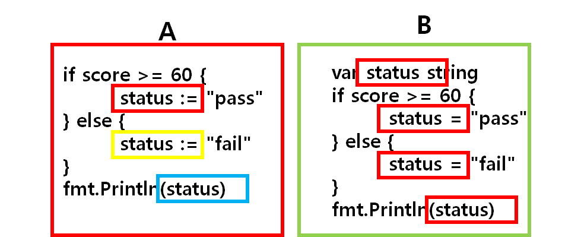
## 단축 변수 선언에서 변수는 단 한 번만 새로 선언  
```
이말이 무슨 말인가 했는데 
a :=1
a :=2 이렇게 선언하면 에러가 나는 것 입니다.
근데  앞에서 
input, err := ~
score, err := ~
이렇게 했었는데 단축 변수 선언의 경우에는 가능하다고 한다.
이런 경우 새로운 변수명은 선언으로, 
기존 변수명은 할당으로 처리 

a:=1 
b, a:=2, 3
a, c:=4, 5
이렇게 있다하면 C언어로 풀어서 설명하면
int a =1 // a생성 1 저장
int b = 2; a = 3; // b생성 2저장, a 3 저장
a = 4, int c = 5; // a 4 저장, c생성 5 저장
그래서 결국은 
a == 3, b == 2, c == 5 이렇게 된다는 소리
```
## 패키지명 VS 임포트 경로  
```
math/rand 패키지에 난수를 생성 할 수 있는 Intn라는 함수가 있음
우선 math/rand 패키지를 가져온 다음 
rand.Intn 함수를 사용
여기서 왜?? math/rand.Intn가 아니고
rand.Intn 인가? 그것은
math/rand는 임포트 경로이고, rand는 패키지 명이라서 
```
- **임포트 경로**  
```
패키지를 식별하기 위해 import문에서 사용하는 고유한 문자열
즉, 임포트 경로를 사용해 가져온 패키지는 패키지명으로 참조 할 수 있음

우리가 import "math/rand"을 했는데 이런경우는 
math/rand 임포트 경로를 사용하지만 rand라는 패키지명만 사용해서 접금
```
## 난수 생성하기  
```
1 ~ 100 까지 난수 생성
target := rand.Intn(100)+1
이렇게 해서 지금 난수를 생성하면 동일한 값이 계속 나오게 된다.

무작위성을 높이려면 아래와 같이 해야한다.
rand.Seed 함수를 사용해 시드 값을 지정해 줘야함 
하지만 Seed 값도 고정이 되면 위와 같은 상황이 발생한다.
그래서 Time 값을 반환하는 time.Now라는 함수를 이용해서 
시간이 변화함에 따라서 다른 시드를 생성하게 해야한다.
```
## 키보드 입력으로 들어온것 정수형으로   
```
이번에는 strconv의 패키지의 Atoi(문자열을 정수로 변환) 함수로 전달
```
```go
package main

import (
	"bufio"
	"fmt"
	"log"
	"math/rand"
	"os"
	"strconv"
	"strings"
	"time"
)

func main() {
	seconds := time.Now().Unix() //날짜 정수값으로 변환
	rand.Seed(seconds)           //시드생성
	target := rand.Intn(100) + 1 //난수 생성
	fmt.Println("I've chosen a random number between 1 and 100.")
	fmt.Println("Can you guess it?")
	fmt.Println(target)

	reader := bufio.NewReader(os.Stdin) //키보드 입력값 저장
	fmt.Print("Make a guess: ")
	input, err := reader.ReadString('\n') //엔터를 기준으로 입력 종료
	if err != nil {                       //에러 체크
		log.Fatal(err)
	}
	input = strings.TrimSpace(input)  //공백 제거
	guess, err := strconv.Atoi(input) //입력 문자열 정수값 반환
	if err != nil {                   //에러 체크
		log.Fatal(err)
	}

}
```
## 추측 값과 목표값 비교하기  
```
그냥 비교만 변수 비교 이기때문에
if guess < target{
	fmt.Println("Oops. Your guess was LOW")
}else if guess >target{
	fmt.Println("Oops, Your guess was HIGH")
}
```
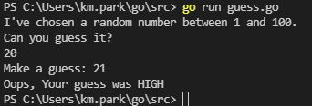
## 반복문  
```
이제 마지막으로 10번까지 추측할 수 있게 반복 시켜야한다.
반복문도 c언어에서 () 빠진거라 쉽다.
```

## 초기화문 과 후처리문  
```
이것은 while()문 같이 쓴다는 것 같은데

C언어 : 
int x = 1;
while(x<3){
	x++;
}

Golang :
x:=1
for x < 3 {
	fmt.Println(x)
	x++
}
```
## 에러가 생기는 경우   
```
for(x:=1 ; x<3 ; x++) : 괄호로 감싸면 안된다. 허용 안함
초기화문이 없다 : x=1 할당만 할 수 없다. 선언이 되어야 한다.
```
## continue와  break 를 사용한 루프 건너뛰기
```
이것은 continue 만나면 for문 상단으로 이동
break 만나면 그자리에서 반복문을 빠져 나온다 생각하면됨
```