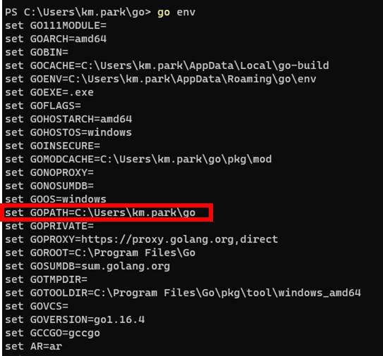
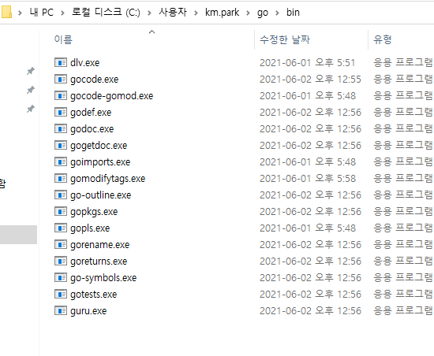

go get -u -v github.com/nsf/gocode
go get -u -v github.com/rogpeppe/godef
go get -u -v github.com/zmb3/gogetdoc
go get -u -v github.com/golang/lint/golint
go get -u -v github.com/lukehoban/go-outline
go get -u -v sourcegraph.com/sqs/goreturns
go get -u -v golang.org/x/tools/cmd/gorename
go get -u -v github.com/tpng/gopkgs
go get -u -v github.com/newhook/go-symbols
go get -u -v golang.org/x/tools/cmd/guru
go get -u -v github.com/cweill/gotests/...
go get -u -v golang.org/x/tools/cmd/godoc
go get -u -v github.com/fatih/gomodifytags 

출처: https://believecom.tistory.com/352 [BelieveCom]

### 

go mod init src해서 go.mode 설치