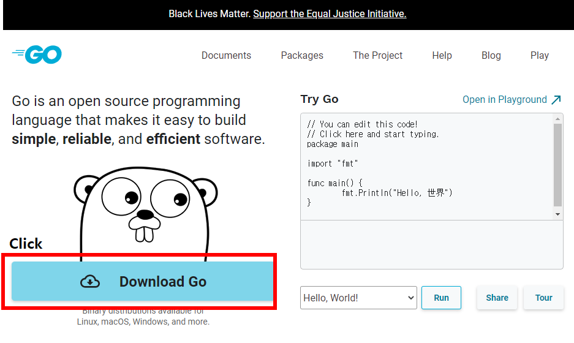
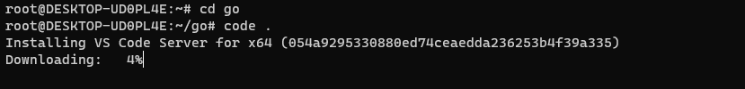
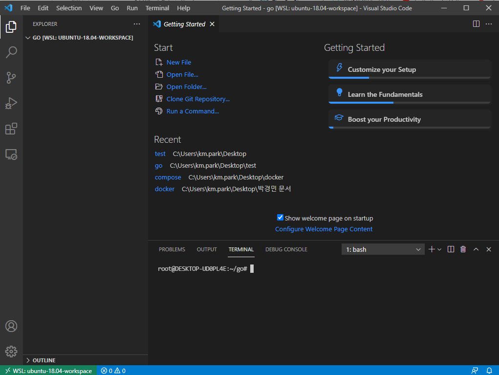
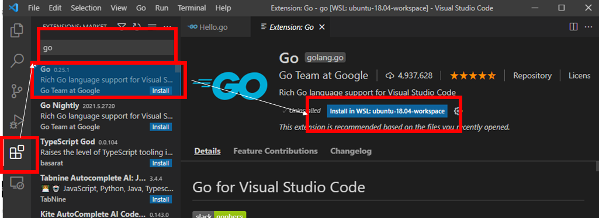
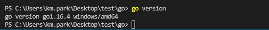
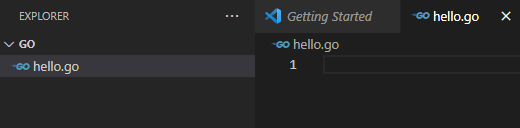
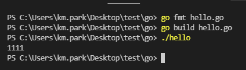
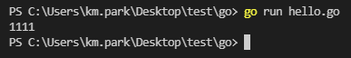

## 2021년 06월02일 visual code에 go환경 구축 조건문, 반복문, 함수와 포인터의 이해  
## 고랭 설치  
[고랭 설치](https://golang.org/) 링크   

```
여기에 들어가서 Download Go를 눌러줍니다.
```

```
현재 만든 디렉토리에서 code. 해서 비주얼 코드에 들어간다.
그러면 설치가 진행되고 아래와 같이 화면이 뜨게 된다.
```

## Extentions 부분에 가서 go 설치  

```
ctrl + ` 누르면 터미널 창이 아래 켜진다.
```
```
go version 명령어를 입력해서 go가 제대로 설치 되어 있는지 확인해보자.
```


```go
package main

import (
	"fmt"
)

func main() {
	fmt.Println(1111)
}
```
```
원래는 
go fmt hello.go
go build hello.go
./hello
또는
hello.exe
로 해서 실행을 한다.
./hello 경우 리눅스나 맥os
hello.exe는 윈도우 환경인데 비주얼코드에서는 ./hello로 실행 된다. 
```

## 한번에 실행하기  
```go
go run hello.go
```

```
위와 같이 명령을 하더라도 빠르게 실행이 가능하다.
여기까지 설치는 완료
```


