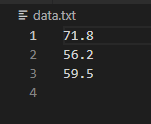

## 2021년 06월03일 Golang 배열 학습  
## 배열  
```
여기서는 주소목록, 상품 목록과 같은 목록 형태의 데이터를 다룸
이런 목록 데이터를 저장하는 방식에는 두가지가 있는데 
그 중 하나 배열에 대해서 알아보자.
for loop와 for range loop에대해서도 알아보자.
```
## 배열은 값의 컬렉션을 담고 있다.  
```
샘플값을 저장하는법 3개의 샘플을 저장한다고 했을때 
사실 변수 3개 활당하고 해도 되는데 100개 1000개라고 했을때 
번거롭고 귀찮다.
그래서 사용하는 것이 배열이다. 최고의 자료구조 중 하나라고 생각한다.
```
- **배열이란**  
```
모두 동일한 타입을 갖는 값의 모임
예를 들어 알약 상자에 각 칸막이를 배열 하나의 공간이라고 생각하고
그안에 들어가는 알약을 원소라고 생각하면된다.
이것에서 보관도 가능하고 빼는것도 가능하고 자체를 이동시키는 것도 가능한데,
그런것이 배열이라고 시각적으로 이해하자.
```
- **원소**  
```
배열이 가지고 있는 값을 말한다.
문자열 배열, 부울 배열 등
Go의 모든 타입에 대한 배열을 만들 수 있음

배열을 만들면 배열 전체를 단일 변수에 저장한 다음, 
필요할 때 배열 내의 특정 원소에 접근할 수 있음
```
## 배열은 값의 컬렉션을 담고 있음  
```
배열은 정해진 개수의 원소만 가진다. 그 개수를 늘리거나 줄일 수 없다.
즉, 선언할때 정해진 개수로 정해진다는 의미

배열 타입의 변수를 선언할 때에는 대괄호[]안에 원소의 개수를 지정하고 
다음 원소의 타입을 지정함
```
- **인덱스**  
```
배열의 원소는 0부터 시작하여 번호가 매겨지는데,
배열의 번호를 말함
```
## 문자열 배열 생성  
```go
var notes [7]string
notes[0] = "도"
notes[1] = "레"
notes[2] = "미"
fmt.Println(notes[0])
fmt.Println(notes[1])
```

## 정수 배열 생성  
```go
var primes [5]int 
primes[0] = 2
primes[1] = 3
fmt.Println(primes[0])
```
## time.Time값을 가진 배열  
```go
var dates [3]time.Time
dates[0] = time.Unix(1257894000,0)
dates[1] = time.Unix(1447920000,0)
fmt.Println(dates[1])
```
## 배열의 제로 값  
```
변수와 마찬가지로 배열을 만들 때 
배열에 포함된 모든 값은 
배열을 가진 타입의 제로값으로 초기화
배열 선언해서 대입하지 않으면 그냥 기본으로 초기값으로 0이 들어간다는 소리인데 
배열의 타입의 제로임
```
## 배열의 리터럴  
```
배열이 가질 값을 미리 알고 있는 경우 
배열 리터럴을 사용하여 배열을 초기화 할 수 있음
```


## 단축 변수 선언  
```go
	fmt.Println("단축변수 선언 입니다.")
	notes1 := [7]string{"do", "re", "mi", "fa", "sol", "la", "ti"}
	fmt.Println(notes1)
	notes2 := [5]int{1, 2, 3, 4, 5}
	fmt.Println(notes2)
	notes3 := [3]string{
		"abced",
		"가나다라",
	}
```

## fmt 패키지의 함수는 배열을 처리 할 수 있음  
```
이미 앞에서 했지만 앞에서 했던 것 처럼 개별적으로 출력 할 수도 있고
한번에 배열을 출력할 수 있다. 

fmt는 배열뿐만 아니라 슬라이스, 맵 그리고 다른 데이터 구조 또한 처리 할 수 있음
```
```
notes1 := [7]string{"do", "re", "mi", "fa", "sol", "la", "ti"}
fmt.Println(notes1)
가능하고 
Printf나 Sprintf에서 값의 형식을 Go코드에서 보이는 그대로 출력해주는 
%#v 동사를 이용해서 출력해보자.
fmt.Printf("%#v\n",notes)
fmt.Printf("%#v\n",primes)
```

## 루프 내에서 배열 원소에 접근하기  
```
notes := [7]string{"do","di","du"}
1. 상수로 접근
배열의 원소에 접근하는 방법에 대해서 말한다.
특정으로 상수 0, 1, 2를 써서 접근
notes[0]
notes[1]
2. 변수로 접근
index := 1
notes[index]
3. for 루프 이용해서 접근
for i=0; i<=2 ; i++{
	fmt.Println(i,notes[i])
}
```
## 패닉  
```
패닉이란 프로그램이 실행되는 동안 발생하는 에러
(컴파일시 발생하는 컴파일 에러와는 반대)

배열의 인덱스가 6까지 인데 7까지 접근했다면 생기는 것인데
C언어에서 스택오버플로우나 런타임에러와 비슷한 개념 같다.

Go에서는 패닉이 발생하면 프로그램이 중단되고 
에러 메시지가 출력됨
```
## Len 함수로 배열 길이 구하기  
```go
배열의 접근하기전 실제 원소 개수 확인하는 방법
len이라는 내장함수를 사용하면 된다.

fmt.Println("len 함수 실습")
for i := 0; i < len(notes); i++ {
	fmt.Println(i, notes[i])
}
여기서 주의 할것은 
notes[7]라면 len(notes)하면 7이나오는데 이때
for문으로 접근시 배열은 0 - 6 인덱스 이므로 
0 - 7로 배열에 접근하지 않게 잘 구현 해야한다.
```

## for...range 를 이용하여 안전하게 배열 순회  
```
range문에는 각 원소에 대한 인덱스를 나타내는 변수와 원소 자체의 값을 가진 변수
그리고 순회할 배열을 전달

for index, value : = range myArray {
}
```

```go
이 그림을 본다고 백퍼 이해할 수 없다. 무조건 실습을 해봐야 한다.

package main

import "fmt"

func main() {
	notes := [7]string{"do", "re", "mi", "fa", "sol", "ra", "ti"}
	for index, note := range notes {
		fmt.Println(index, note)
	}
}
```

```
사실 이렇게 보면 느낌이 오는게 range에서
notes의 실제 인데스 0 ~ len(notes)-1 까지 index에 넣어주고
note에는 note[index]값을 넣어주는 구조 이다.
사실상 뭔가 느낌상 변수를 이전의
for i:=0 ; i<len(notes);i++{
	fmt.Println(i,notes[i])
}
이것과 비교하면 변수를 하나더 사용해서 하는 느낌이라 메모리나 속도면에서 
좀 떨어지지 않을까 걱정이 되긴하다.
```
##  for .. range 루프에서 빈 식별자 사용  
```
책에서 너무 자세히 설명하려다 보니 이런것 까지 넣은것 같은데 
축약하자면 
for index, note := range notes{
	fmt.Println(index, note)
}
이렇게 하는데 저렇게 있으면 index나 note의 변수를 다 써야한다.  go 특성상
그래서 내가 index만 출력하고 싶다하면
for index, _ := range notes 해서 빈 식별자 쓴다는 거고
내가 note의 값만 알고 싶다하면
for _, note := range notes 라고 하는 것이다.
```


## 배열에 저장된 수들의 총합 구하기  


```
우선 작업 공간을 저렇게 설정해서 파일을 만들어 줍니다.
```


- **실행 파일 실행**


## 배열에 저장된 수들의 평균 구하기  
```go
평균은 완전 당연하지만 총합에/배열의 길이를 하면 된다.
여기서 주의할 것은
sum 값은 float64 이고 len(nubmers)는 int 형이다.
자료형이 다르기때문에 에러가 생기니 len(numbers)의 자료형을 바꿔야한다.
결국

result := sum / float64(len(numbers))
하고 이 값을 출력하면된다. 
```

```
이렇게 쉽게 할 수 있다.
```
## 실습 해보기  
```
정수형 배열 에  3 16 -2 10 23 12 가 있을때
10과 20사이의 모든 원소 출력
출력
1 16
3 10
5 12
가 나오게 해보세요.
```
- **정답**  
```go
package main

import "fmt"

const arrSize = 6

func main() {
	myIntArr := [arrSize]int{3, 16, -2, 10, 23, 12}
	for index, arrNum := range myIntArr {
		if 10 <= arrNum && arrNum <= 20 {
			fmt.Println(index, arrNum)
		}
	}
}
```

## 텍스트 파일 읽기  
```
상황은 더 많은 데이터가 생기는 상황
코드 수정할수 없고 심지어 Go도 설치 되지 않은 경우

이때, 우리가 이전에 표준 라이브러리의 os및 bufio 패키지를 사용해 
키보드로 부터 한번에 한줄씩 데이터를 읽은적이 있는데,
동일한 방법을 사용하면 텍스트 파일의 내용도 읽어 올 수있다.

에디터를 열고 data.txt라는 파일을 생성
71.8
56.2
89.5
입력한다.
```

## 파일 읽어오는 프로그램 작성하기  
```
data.txt와 같은 디렉터리에 readfile.go라는 새로운 프로그램을 생성
```

```go
package main

import (
	"bufio"
	"fmt"
	"log"
	"os"
)

func main() {
	file, err := os.Open("data.txt") //읽을 데이터 파일 열기
	if err != nil {
		log.Fatal(err)
	}
	scanner := bufio.NewScanner(file) //파일에 대한 Scanner 생성
	for scanner.Scan() {              //한줄씩 텍스트 읽어오기
		fmt.Println(scanner.Text())
	}
	err = file.Close() //파일을 닫아 자원을 반환
	if err != nil {    //파일 닫는중 에러 발생시
		log.Fatal(err)
	}
	if scanner.Err() != nil { //파일 읽는 도중 에러 발생시
		log.Fatal(scanner.Err())
	}
}
```


## 텍스트 파일에서 읽어 온 데이터 배열에 저장  
```
읽어온 문자열을 숫자로 변환하여 배열에 저장
이 작업을 수행하는 datafile이라는 패키지를 만들어 봅시다.

headfirstgo 폴더 아래에 datafile폴더 생성하고 floats.go 파일을 생성합니다.
```
```go
package datafile

import (
	"bufio"
	"os"
	"strconv"
)

func GetFloat(fileName string) ([3]float64, error) {
	var numbers [3]float64 // 반환할 배열 생성
	file, err := os.Open(fileName)
	if err != nil {
		return numbers, nil
	}
	i := 0
	scanner := bufio.NewScanner(file)
	for scanner.Scan() {
		numbers[i], err = strconv.ParseFloat(scanner.Text(), 64)
		//문자열 float64비트로 변환
		if err != nil {
			return numbers, err
		}
		i++
	}
	err = file.Close()
	if err != nil {
		return numbers, err
	}
	if scanner.Err() != nil {
		return numbers, scanner.Err()
	}
	return numbers, nil
}
```
## average 프로그램에서 텍스트 파일 읽기  
```
메인 프로그램에서 할 일
1. import문을 수정해서 datafile과  log 패키지 가져오기
2. 하드 코딩된 숫자 배열을 datafile.GetFloats("data.txt")의 반환값으로 대체
3. GetFloat 함수에 에러가 발생하면 에러를 보고한 다음 프로그램 종료
```
```go
package main

import (
	"fmt"
	"log"
	"src/github.com/headfirstgo/datafile"
)

func main() {
	numbers, err := datafile.GetFloat("data.txt")
	if err != nil {
		log.Fatal(err)
	}
	var sum float64 = 0
	for _, number := range numbers {
		sum += number
	}
	result := sum / float64(len(numbers))
	fmt.Printf("%.2f", result)
}
```

## 현재 프로그램은 세 개의 값만 처리 해결 방법은?  
```
파일에 개수가 몇개 들어올지 모르기 때문에 처리할 수 있는 방법은 배열의 크기를 
임의로 넉넉히 잡아서 해결하는 방법이 있고 앞으로 소개할 방법이 있음
하지만 go의 경우 넉넉히 잡아서하면 안될 것이다. 앞으로 천천히 알아보자.
```
2021년06월03일Golang배열 학습.assets