## 2021년 06월03일 Golang 패키지 학습  
## 패키지  
```
서로 연관된 코드를 한 곳에 모아 두기 위한 곳
패키지는 단순히 코드를 모아 놓은 것, 그 이상의 이점이 있음
패키지를 사용하면 프로그램 간뿐만 아니라 다른 개발자와도 쉽게 코드 공유 가능
```
## 다른 프로그램, 같은 함수  
```go
package main

import (
	"bufio"
	"fmt"
	"log"
	"os"
	"strconv"
	"strings"
)

func getFloat() (float64, error) {
	reader := bufio.NewReader(os.Stdin)
	input, err := reader.ReadString('\n')
	if err != nil {
		return 0, err
	}
	input = strings.TrimSpace(input)
	number, err := strconv.ParseFloat(input, 64)
	if err != nil {
		return 0, err
	}
	return number, nil
}

func main() {
	fmt.Println("Enter a grade: ")
	grade, err := getFloat()
	if err != nil {
		log.Fatal(err)
	}

	var status string
	if grade >= 60 {
		status = "passing"
	} else {
		status = "failing"
	}
	fmt.Println("A grade of", grade, "is", status)
}
```
```
키보드로부터 성적 읽어 오는 코드를 getFloat()라는 함수로 분리해서 사용
getFloat는 에러가 없을 경우 사용자가 입력한 부동 소수점 숫자를 반환
그 외에는 0과 함께 에러 값을 반환
에러가 반환되면 에러를 보고한 뒤 프로그램을 종료함
그 이외에는 같음
```
```go
package main

import (
	"bufio"
	"fmt"
	"log"
	"os"
	"strconv"
	"strings"
)

func getFloat() (float64, error) {
	reader := bufio.NewReader(os.Stdin)
	input, err := reader.ReadString('\n')
	if err != nil {
		return 0, err
	}
	input = strings.TrimSpace(input)
	number, err := strconv.ParseFloat(input, 64)
	if err != nil {
		return 0, err
	}
	return number, nil
}
func main() {
	fmt.Print("Enter a temperature in Fahrenheit: ")
	fahrenheit, err := getFloat()
	if err != nil {
		log.Fatal(err)
	}
	celsius := (fahrenheit - 32) * 5 / 9
	fmt.Printf("%0.2f degrees Celsius\n", celsius)
}
```


## 패키지를 사용한 프로그램 간 코드 공유  
```
앞서서 봤던 코드는 같은 getFloat함수를 쓰는데 버그가 발견이 되면,
두 곳을 고쳐야하는 번거로움이 있다.
이때 문제를 해결할 수 있는 방법이
공용 함수를 별도의 새로운 패키지로 만드는 것

쓰는 이유는 코드의 일부가 여러 프로그램 간에 공유되는 경우
코드를 패키지로 분리하는 것을 고려해 볼 수 있음
```
## 패키지 코드는 Go 작업 공간 디렉터리 내에 위치  
```
Go도구는 작업공간이라는 특수한 디렉토리(폴더)에서 패키지 코드를 검색
작업 공간 디렉터리의 기본값은 현재 사용자의 홈 디렉터리에 있는 go라는 디렉터리임

작업 공간은 디렉터리에는 bin, pkg, src 하위 디렉터리가 있음
- bin : 컴파일된 실행 가능한 바이너리 프로그램이 저장
- pkg : 컴파일된 바이너리 패키지 파일이 저장
- src : Go소스 코드가 위치

src 디렉터리 내에서 각 패키지의 코드는 별도의 하위 디렉터리에 위치
하위 디렉터리의 이름은 보통 패키지의 이름과 동일
그리고 각 패키지 디렉토리는 하나 이상의 소스코드 파일을 포함
소스 코드 파일명은 반드시 .go확장자로 써야함
```
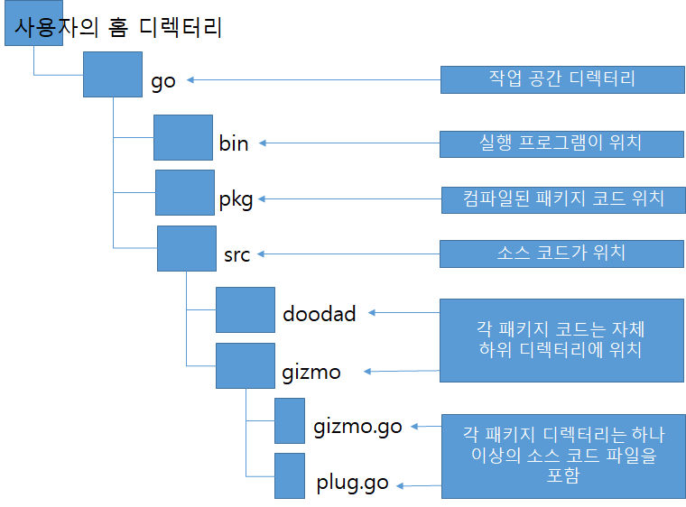
## 새로운 패키지 만들기  
```
만들 패키지는 다국어로 인사말을 출력하는 greeting이라는 패키지 생성해보자.
go env하면 path 경로에 가서 
go라는 디렉토리에 src 폴더 만들고 그안에 greeting 폴더 생성 그 안에 greeting.go 
파일 생성해보자.
```
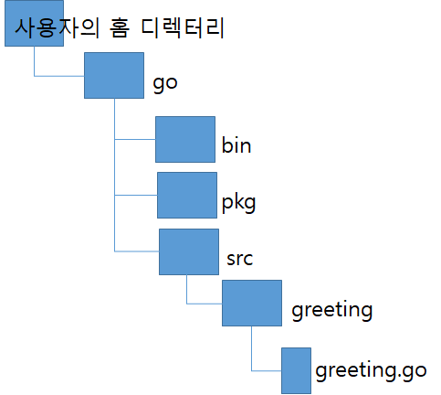
```
대략 이런식으로 만들면 된다.
```
## greeting.go  
```go
package greeting

import "fmt"

func Hello() {
	fmt.Println("Hello!")
}
func Hi() {
	fmt.Println("Hi!")
}
```
```
우선 저 파일을 만들어줍니다.
여기서 포인트는 main 패키지가 아니고 greeting 패키지라는 것이 다르고,
그리고 가장큰 다른점은 외부에 노출 시키고 싶다면 변수명을 대문자로 시작하는걸
앞에서 말했는데 대문자로 함수가 시작한것을 확인하고 구현하면 된다.
```
## 새로만든 패키지 가져오기
```
우선 src에 hi라는 폴더를 만들고 그안에 main.go를 생성해보자
대략 그림은 아래와 같다.
```
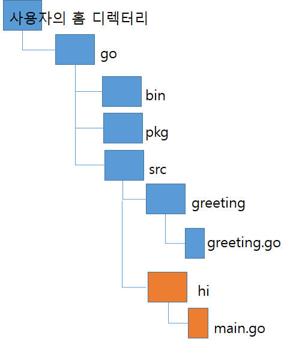
```go
package main

import (
	"src/greeting" //책에는 "greeting"으로만 되어있는데 알아서 fmt해준다.
)

func main() {
	greeting.Hello()
	greeting.Hi()
}
```
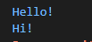
## 패키지는 동일한 파일 구조를 사용  
```
1. package절	package main
2. import문	import "fmt"
3. 실제코드	  func main(){
				fmt.Println("Hello")
			}
이런식으로 이루어져 있다.
패키지나 기존에 쓰는 형식은 다 비슷하다. 
```
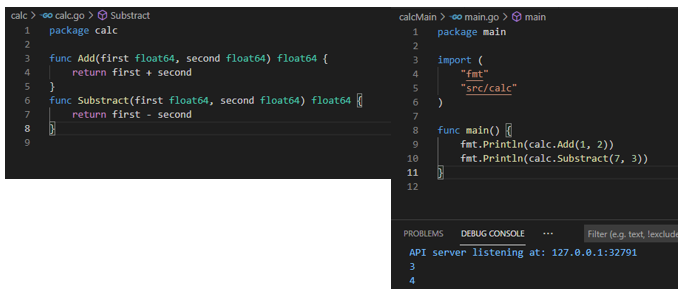
## 패키지 네이밍 컨벤션  
```
패키지를 사용하는 개발자는 해당 패키지에서 함수 호출시
함수 앞에 패키지의 이름을 붙임
예를 들어 
fmt.~ 이런식으로 fmt.을 붙이는데 Go에서는 패키지를 가능한 편리하게 사용하기 위해
패키지 이름이 따라야하는 규칙이 있다.
1. 패키지 이름에는 소문자만 사용
2. 의미가 명확한 경우 축약어 사용 (명확하지 않으면 제대로 써라 이말임)
3. 가능하면 한단어만 사용하고 두단어 사용시 밑줄로 구분 하지 않고 그냥씀
ex) str conv -> strconv 이런식
str int이면 strInt(X), str_int(X),strint(O) 이렇게 (O)같은 형식으로 하면됨
4. 임포트된 패키지의 이름이 로컬 변수명과 충돌하는 경우에는 해당 변수명 사용 X
ex) fmt패키지의 이름이 format이라면 해당 패키지를 사용하는 사람이 
로컬 변수의 이름을 format이라고 지정하는 경우 이름 충돌
그니까 좀 돌려말한것 같은데 같은 이름 쓰지마라! 라는 말
```
## 패키지 한정자  
```
다른 패키지에서 외부로 노출한 함수, 변수 등에 접근할 때에는 
함수 또는 변수의 이름 앞에 패키지의 이름을 지정해줘야함
반면, 현재 패키지에서 선언한 함수나 변수에 접근하는 경우 패키지 이름 지정할 필요 없음
```
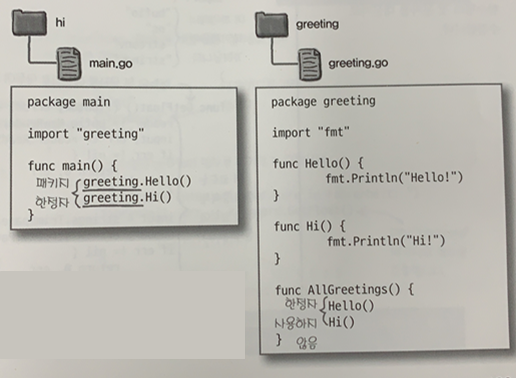

## 공용 코드를 패키지로 옮겨봅시다.  
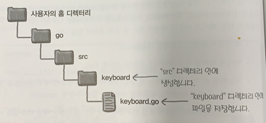
```go
위와 같이 keyboard폴더를 생성하고 keyboard.go파일을 생성
파일에 소스를 넣어봅시다.

package keyboard

import (
	"bufio"
	"os"
	"strconv"
	"strings"
)

func GetFloat() (float64, error) {
	reader := bufio.NewReader(os.Stdin)
	input, err := reader.ReadString('\n')
	if err != nil {
		return 0, err
	}
	input = strings.TrimSpace(input)
	number, err := strconv.ParseFloat(input, 64)
	if err != nil {
		return 0, err
	}
	return number, nil
}
```
```
이전의 소스를 이렇게 구성할 수 있습니다.
```
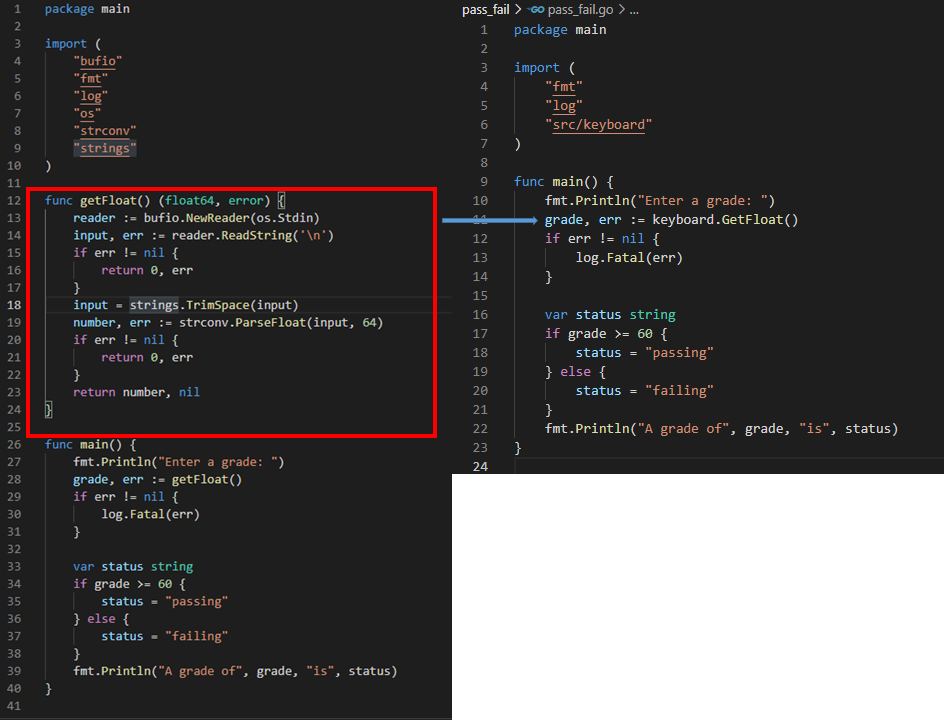
```
약간 이런식으로 간편하게 코드를 줄여서 쓸 수 있다.
```
## 상수  
```
많은 패키지가 외부로 상수를 제공
상수란? 말그대로 변수와 반대되는 개념으로 불변의 값

상수 선언은 변수 선언과 매우 유사하고,
이름과 선택적인 타입 그리고 상수의 값으로 이루어져 있음 
변수 선언가는 다른 규칙이 있다.

1. var 키워드 대신 const 키워드를 사용
2. 선언과 동시에 값을 할당해야 함
3. 상수 선언에서는 := 단축 변수 선언 사용 할 수 없음

const TriangleSides int = 3
const : 상수지정하는 키워드
TriangleSides : 상수명
int : 타입
3 : 값

변수 선언과 마찬가지로 타입은 생략이 가능 
const SqualLong = 4
자동으로 할당되는 값의 타입으로 자동 추론
```
```go
package dates

func WeeksToDay(weeks int) int {
	return weeks * 7
}
func DaysToWeeks(days int) float64 {
	return float64(days) / float64(7)
}
```
```
이렇게 하드 코딩된것이 있다고 했을때 
7이라는 숫자가 자주 쓰이는데 이걸 DayInWeek라고 상수로 해놓으면
그 이름만 봐도 의미가 이거구나 할 수 있는?

상수는 함수 외부의 패키지 레벨에서 선언할 수 있고 내부에서도 선언할 수 있음 
대부분은 패키지내의 모든 함수에서 접근할 수 있도록 패키지 레벨에 선언 
그니까 C언어로 말하면 전역변수로 해서 선언한다. 
```
```
package dates

const DayInWeek = 7

func WeeksToDay(weeks int) int {
	return weeks * DayInWeek
}
func DaysToWeeks(days int) float64 {
	return float64(days) / float64(DayInWeek)
}

그리고 이 자체 패키지를 다른 go에서 가져와서 그 상수를 쓸 수 있음
```
## 중첩된 패키지 디렉터리와 임포트 경로  
```
fmt 및 strconv와 같은 Go와 함께 제공되는 패키지를 사용할 때 패키지
이름은 보통 임포트 경로와 동일

하지만 무조건 임포트 경로와 패키지명이 동일할 필요 없음
예를 들어 수학 함수와 같은 유사한 카테고리로 묶임
그래서 이런 패키지는 "archive/" 또는  "math/"와 같은
공통 임포트 경로를 접두사로 하여 그룹화됨
```
## go install로 프로그램 실행 파일 설치하기  
```
go run의 경우 프로그램을 실행하기 전에 
프로그램과 프로그램이 의존하고 있는 패키지를 컴파일한 뒤 
완료되면 컴파일된 코드를 버림

go build 경우 코드를 컴파일 하고 
현재 디렉터리에 실행 가능한 바이러니 파일
(Go 없이도 실행 할 수 있는 실행파일 .exe)을 저장
이 명령어 과하게 사용시 Go 작업 공간 지저분해짐

go install 명령어도 컴파일된 바이너리 버전의 실행 프로그램을 저장하지만 
go build와는 다르게 명확히 정의되어 있고 쉽게 접근할 수 있는 위치
(Go 작업 공간의 bin 디렉터리)에 저장
다음 실행 프로그램에 대한 코드가 포함된 src 내의 디렉터리 이름을 지정한 뒤 
명령어 실행하면 됨
프로그램이 컴파일되어 생성된 실행 파일은 표준 디렉터리에 저장

go install은 
go run hi.go 이렇게 했던것 처럼하는게 아니고
go install hi 라고 디렉터리 이름을 해야함
```
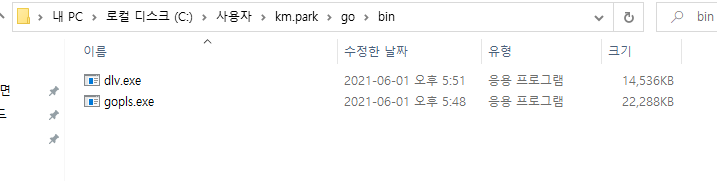
```
PS C:\Users\km.park\go\src> go install src/hi 
```
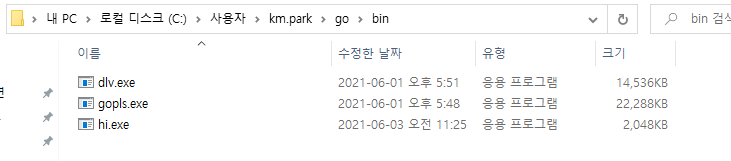
```
이렇게 bin폴더에 생성되고 bin 폴더 디렉토리로 가서 ./hi 해보자
```
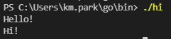
## GOPATH 환경 변수로 작업 공간 변경하기  
```  
Go 작업공간에 대해 검색하다 보면 여러 웹사이트에 작성되어 있는 
GOPATH 설정하기 글들을 볼 수 있는데 
GOPATH란 Go 도구가 작업 공간의 위치를 찾는데 사용하는 환경 변수

대부분은 모든 코드를 하나의 작업 공간에서 관리하며 기본 위치 그대로 사용
```
## GOPATH 설정하기  
```
코드가 기본 작업공간 외의 디렉터리에 저장된 경우 
Go 도구가 해당 위치에서 코드를 찾을 수 있도록 설정
GOPATH 환경 변수 설정으로 작업 공간 위치를 변경할 수 있음
```
- **Mac 또는 리눅스**  
```
export 명령어 사용
export GOPATH="/code"
```
- **윈도우**  
```
set명령어를 사용해 환경 변수를 설정
set GOPATH="C:\code"
```
- **주의할 점 **  
```
GOPATH 설정 값은 현재 터미널 또는 명령 프롬프트창에서만 유효
```
## 패키지 배포하기  
```
깃 같은데 배포를 했을때 이게 다른 사람이 쓰는 패키지 이름과 동일할 수 있다.
이런경우 다른 디렉토리 넣어서 해도되지만 
좀더 범용적인 패키지 식별자가 필요하다. 
예를 들면 http://github.com/headfirstgo/keyboard 에서만 사용할 수 있으니
이 URL을 슬래시로 나누고 나누어진 각 부분을 디렉터리 이름으로 한 것이다. 
```
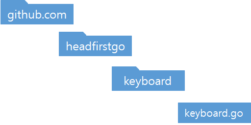
```
이렇게 쓰는 것이다.

임포트 경로만 바뀌게 되는데
"github/com/headfirstgo/keyboard"
임폴트해서 사용하면된다.

대게 이런건 안드로이드앱 만들때 패키지 할때 주로하는데 대게 자바에서 사용해왔음
```
## go get으로 패키지 다운로드 및 설치  
```
패키지의 호스팅 URL을 임포트 경로로 사용하는 데에는 또다른 이점이 있음
go 명령어에는 패키지를 자동으로 다운로드하고 설치할 수있는 명령이 있는데

https://github.com/headfirstgo/greeting
이 곧에 있다고 할때
go get github.com/headfirstgo/greeting 으로 해서 
go 작업공간의 src디렉터리에 저장

그리고 go get 명령은 Subversion, Mecurial 및 Bazaar 저장소에도 사용할 수 있음
```
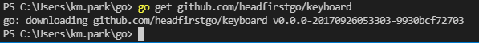
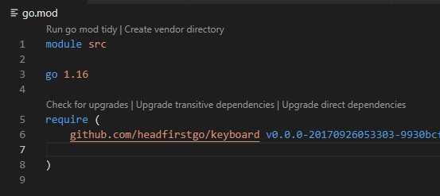
```
작업환경마다 다를것 같은데 원래는 명령을 실행하면 
bin 폴더가 생성되고 그곳에 들어가게되는데
visual code로 작성을 해서 따로 폴더가 생성은 안되는 것 같은데,
go.mod에 입력이 된다. 임폴트하는 법은 유사하니 그 점은 유의하자.
```
## 'go doc'으로 패키지 문서 읽어 오기  
```
go doc 라는 명령어를 사용하면 모든 패키지 또는 함수에 대한 사용 설명서를 출력
```
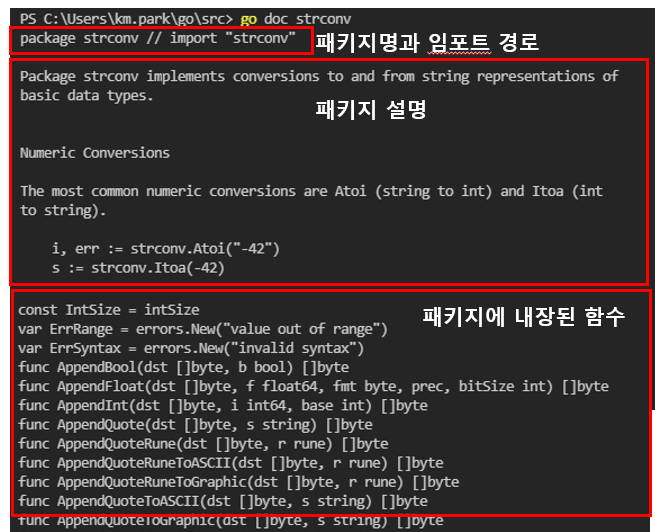
## 이전에 우리가 git에서 가져온 걸 확인해 보자  
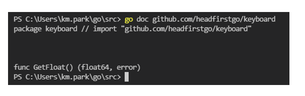
```
이렇게 보면 패키지에 대한 설명이 우리가 만든거라면 없습니다. 
이러면 정보에 대해 알 수 없습니다.
문서 주석으로 패키지 문서화 하는 법에서 알아보죠
```
## 문서 주석으로 패키지 문서화하기  
```
작업은 어렵지 않고 문서 주석만 추가하면됨
package절 또는 함수 선언 바로 앞에 나타나는 기본 주석들이 
문서 주석으로 처리되며 이 주석들이 go doc의 출력 텍스트에 나타남
```
```go
//이것은 실험을 위한 주석이고 이 함수는 키보드로 부터 사용자의 입력을 읽어온다.
package keyboard

import (
	"bufio"
	"os"
	"strconv"
	"strings"
)

//아래는 키보드로 부터 부동 소수점 숫자 읽어오고
//이함수는 읽은 숫자와 함께 에러 값도 반환한다.
func GetFloat() (float64, error) {
	reader := bufio.NewReader(os.Stdin)
	input, err := reader.ReadString('\n')
	if err != nil {
		return 0, err
	}
	input = strings.TrimSpace(input)
	number, err := strconv.ParseFloat(input, 64)
	if err != nil {
		return 0, err
	}
	return number, nil
}
```
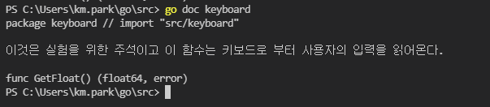

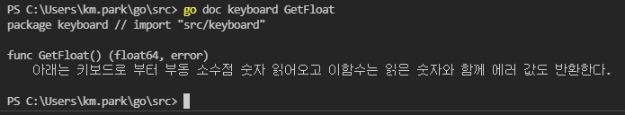

```
위와 같이 이렇게 적용 할 수 있다.
```
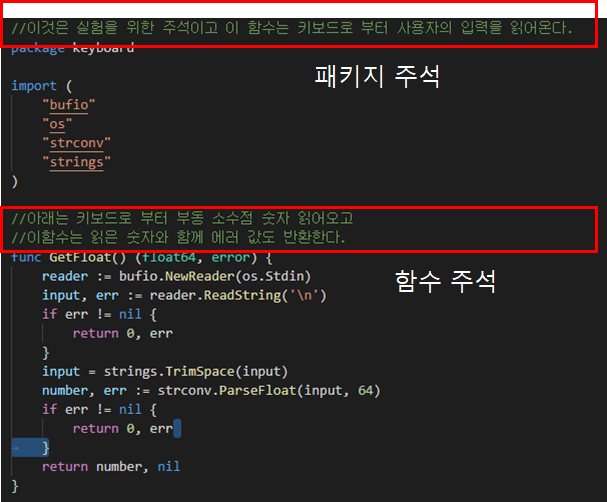
```
문서 추가시 규칙
- 주석은 완전한 문장이어야함
- 패키지 주석은 Package로 시작 하고 그뒤에 그 패키지 이름이 와야함
- 함수 주석은 헤더 함수의 이름으로 시작
- 들여쓰기를 통해 주석에 예제 코드 포함
- 예제 코드를 위한 들여쓰기 외에는 강조나 형식을 위한 부가적인 구두 추가 X
문서 주석은 일반 텍스트로 표시되고 일반 텍스트 형식을 따라야함

추가적으로 웹에서 보는 게 편하다 하면 아래 사이트를 참고해서 보면됨
```
[고랭 패키지 정보 확인 사이트](https://golang.org/pkg/fmt/)
## godoc 으로 HTML 문서 띄우기
```
go doc 과는 다르다 godoc 이다.
여기서 명령시 특수 옵션인
-http=:6060 추가해주면된다.

즉, godoc -http=:6060
```
[-현재 자체적으로 실행이 안되는걸로 봐서 찾아봐야할듯 크게 중요한것은 -]