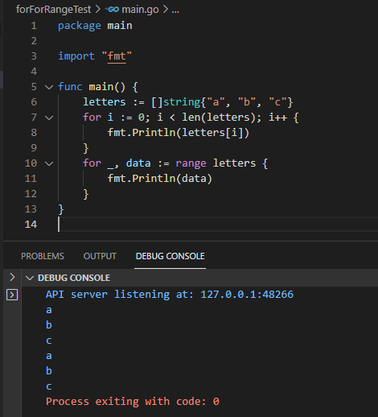
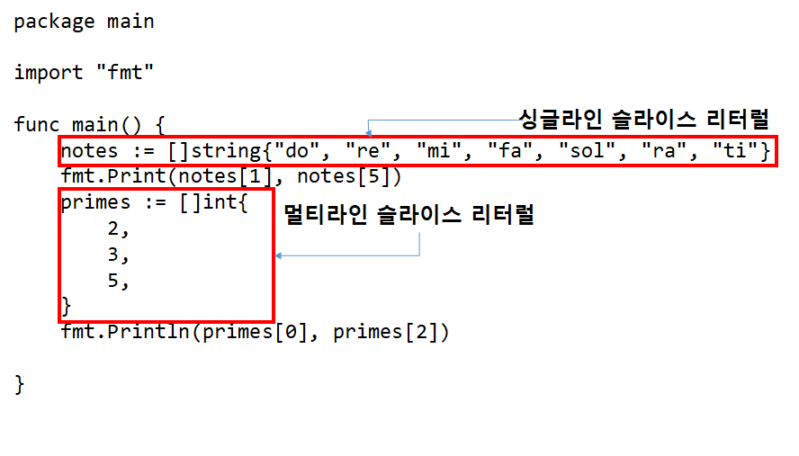
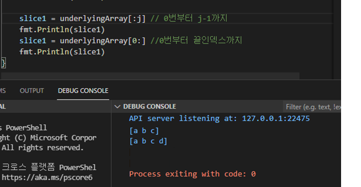

## 2021년 06월04일 golang 슬라이스  
```
파일에 몇 개의 데이터가 포함되었는지 미리 알 수 없는데
이를 알고 싶을때 사용하는 것 Go의 슬라이스

슬라이스는 확장 가능한 컬렉션타입이고,
이를 통해서 데이터를 좀 더 쉽게 전달할 수 있는 방법과
더 간편한 호출할 수 있는 함수를 작성하는 법을 배워보자.
```
## 슬라이스 란?  
```
Go에는 값을 추가하여 확장할 수 있는 데이터 구조

배열과 마찬가지로 슬라이스도 복수 개의 원소로 이루어지며,
모든 원소는 동일한 타입을 가짐

배열과의 차이점
슬라이스는 끝에 원소를 추가할 수 있는 함수를 사용할 수 있음
C의 기준으로 보면 List같은 자료구조와 비슷한 것 같다.
```
## 슬라이스 변수 선언  
```
배열에서는 크기를 지정했는데 그것 빼고는 배열 변수 선언과 동일하다.
배열: var myArray [5]int
슬라이스: var mySlice []int

슬라이스는 자동으로 변수를 생성하지 않기때문에,
make 내장 함수를 사용해 슬라이스를 명시적으로 생성해야함
```
- **make 함수**  
```
make 함수에는 생성하려는 슬라이스 값의 타입과 생성할 슬라이스 크기 전달
(생성된 값을 할당할 슬라이스 변수와 동일한 타입만 가능)
make([]int, 5) //5개의 정수를 갖는 슬라이스를 생성한 다음 변수에 할당한다.
ex) var notes []string 
notes = make([]string, 7)
// notes := make([]string, 7)
위와 같이 단축변수 선언을 사용하면 변수 선언과 할당을 한번에 할 수 있다.
```
## 슬라이스 길이 반환  
```
배열과 동일하게 len 내장 함수도 배열에서와 동일하게 동작
len에 슬라이스를 전달하면 슬라이스의 길이를 정수값으로 반환
ex1) 일반적인 정석 코드
var notes []string
notes = make([]string,5)
fmt.Println(len(notes))
ex2) 단축변수 선언 코드
notes := make([]string,5)
fmt.Println(len(notes))
```


## 슬라이스 for, for range 이용하여 순회하기  

## 슬라이스 리터럴  
```
배열과 마찬가지로 슬라이스에 들어갈 값을 미리 알고 있는 경우
슬라이스 리터럴을 사용하면됨
슬라이스를 만들고 바로 안에 넣는다는 의미이다.
```

## 슬라이스 연산자  
```
모든 슬라이스는 내부 배열을 기반으로 구현
내부 배열은 슬라이스의 데이터가 실제로 저장되는 공간이며,
슬라이스는 단지 이 배열 원소의 일부 또는 전체에 대한 추상화된 뷰 임

make함수 또는 슬라이스 리터럴로 슬라이스 생성하면 내부배열이 자동으로 생성
(슬라이스를 거치지 않고 직접 내부 배열에 접근할 수 는 없음)

그러나, 배열을 직접 생성한 다음 슬라이스 연산자를 사용하면 해당 배열을 기반으로 하는
슬라이스를 만들 수 있다.

슬라이스 연산자(슬라이싱)는 두 개의 인덱스를 사용한다는 점을 제외하면
개별 원소에 접근하는 구문은 유사
mySlice := myArray[1:3]
```



## 내부 배열
```
슬라이스는 자체적으로 데이터를 저장하지 않으며
단지 내부 배열의 원소에 대한 뷰일 뿐임
슬라이스는 슬라이드(내부배열)에 들어 있는 내용물의 특정 부분에 초점을 맞추는 현미경

내부 배열의 슬라이스를 사용하면 슬라이스를 통해 노출되는 내부 배열 원소의 일부만 
볼 수 있음
```
