## 2021년 06월07일 golang 맵  
## 데이터 라벨링  
```
목록을 만드는 일까지는 배웠습니다. 
이제 여기서 원하는 값을 찾기 위해서 편한 방법
즉, 모든 값에 라벨을 붙여서 하는 컬렉션 타입이 있는데 이러한 데이터를 다룰 수 있는
맵에 대해서 알아 봅시다.
```
## 개표하기  
```
이름이 나열되어있는 votes.txt 파일에 각 이름이 몇번 나왔는지 집계해보자.
```
## 파일에서 이름 읽어 오기  
-**string.go**
```go
이번에는 string으로 txt파일을 읽어오는 실습을 해봅시다.
package datafile

import (
	"bufio"
	"os"
)

func GetStrings(fileName string) ([]string, error) {
	var lines []string
	file, err := os.Open(fileName)
	if err != nil {
		return nil, err
	}
	scanner := bufio.NewScanner(file)
	for scanner.Scan() {
		line := scanner.Text()
		lines = append(lines, line)
	}
	err = file.Close()
	if err != nil {
		return nil, err
	}
	if scanner.Err() != nil {
		return nil, scanner.Err()
	}
	return lines, nil
}
```
- **main.go**
```go
package main

import (
	"fmt"
	"log"
	"src/github.com/headfirstgo/datafile"
)

func main() {
	lines, err := datafile.GetStrings("votes.txt")
	if err != nil {
		log.Fatal(err)
	}
	fmt.Println(lines)
}
```
```
여기서 보면 go install github.com/headfirstgo/count
라고 하라고 되어 있는데 안되는 경우가 있다.
그렇다면 해당 count까지 경로를 이동해서
그곳에 main.go가 있는데
거기서 go install main.go 하면된다. 그러면 
bin 폴더에 main.exe라는 파일이 생기고
bin 디렉토리 위치에서 ./main 하면 실행 시킬 수 있다.
```
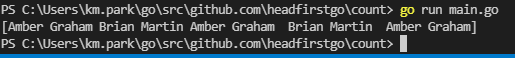
## 슬라이스로 투표 수 세기  
```
파일에서 각 이름이 나타나는 횟수를 집계할 것인데
슬라이스로 하는 방법과 맵으로 하는 방법을 알아보자

첫 번째 방법은 우선 동일한 개수와 동일한 순서를 갖는 두개의 슬라이스 변수 생성
1 슬라이스 names는 파일에서 읽어 온 이름의 목록을 저장하지만 이름은 한번만 저장
2 슬라이스 counts는 각 이름이 나온 횟수 저장
```
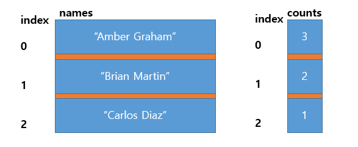
```go
위와 같이 구현할 예정이다.
package main

import (
	"fmt"
	"log"
	"src/github.com/headfirstgo/datafile"
)

func main() {
	lines, err := datafile.GetStrings("votes.txt")
	if err != nil {
		log.Fatal(err)
	}
	var names []string
	var counts []int
	for _, line := range lines {
		matched := false
		for i, name := range names {
			if name == line {
				counts[i]++
				matched = true
			}
		}
		if matched == false {
			names = append(names, line)
			counts = append(counts, 1)
		}
	}
	for i, name := range names {
		fmt.Printf("%s: %d\n", name, counts[i])
	}
}
```

```
동작하는 방식은 우선 이름이 있는지 확인 있으면 ++
아니면 처음 들어오는것 이므로 생성해주기 
```
## 맵  
```
그전의 슬라이스의 문제는 매번 n개의 슬라이스 사이즈를 가지고 있으면,
무조건 n번을 순회하는 문제가 있습니다.
그래서 Go에는 데이터 컬렉션을 저장하는 또다른 방식인 맵이라고 하는 자료구조를 사용

맵이란?
저장된 값을 키를 통해 접근할 수 있는 자료구조입니다.
대게 해쉬테이블과 비슷하다고 생각하시면 됩니다.

사전에서 zoo라는 단어를 찾으려면 어디에 있는지 모를때 
처음부터 단어를 찾아야합니다. 하지만 각 단어를 찾기 쉽게 a - z 의 인덱스를 표시를 
해놓은 다면 어떨까요? z로 가서 zoo를 찾으면 이전에 처음부터 찾는것보다
시간이 단축 될 것 입니다. 
맵은 저것보다더 더 나아가서 zoo라고 표시를 해놓는 것입니다.

그렇게 되는것은 맵에서는 모든 타입의 값을 키로 사용할 수 있기 때문
```
## 맵 선언  
```
var myMap map[string]float64

C++언어로 생각하면
#include<map>
map <string, float> myMap;과  비슷하다.
```
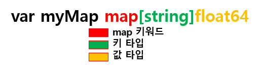
```
맵도 슬라이변수와 마찬가지로 맵 변수도 값이 자동으로 생성 되지 않음
make 함수를 사용해 맵 값을 직접 생성해야함
```
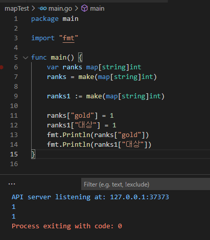
- **문자열 키, 문자열 값**  
```go
noddles := make(map[string]string)
noddles["신라면"]="블랙"
noddles["진라면"]="순한맛"
fmt.Println(noddles["신라면"])
```
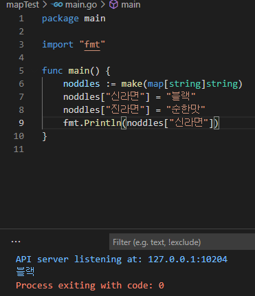
- **정수 키, 부울 값**  
```go
	isPrime := make(map[int]bool)
	isPrime[0] = false
	isPrime[1] = true
	fmt.Println(isPrime[1])
```
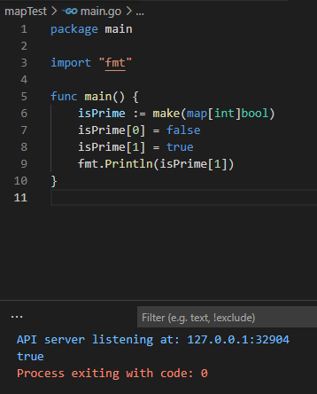
## 맵 리터럴  
```
myMap := map[string]float64{"a",1.2,"b",4.5} //이런식으로 생성할 수 있음

myMap := map[string]float64{} 빈 맵을 생성
```
## 맵에서의 제로 값  
```
아무값도 할당하지 않은 상태에서는 맵의 키에 접근하면 그 자료형의 제로값이 반환
string 은 ""
int 는 0 이런식
ex) numbers := make(map[string]int)
numbers["first"]=1
fmt.Println(numbers["first"])
fmt.Println(numbers["zero"])
```
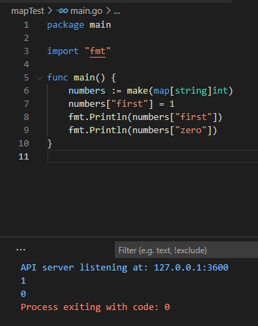
## 맵 변수의 제로 값은 nil  
```
슬라이스와 마찬가지로 맵 변수 자체의 제로 값은 nil
맵 변수를 선언만 하고 아무값도 할당하지 않으면 맵 변수의 값은 nil이됨

즉, 키/값을 추가할 수 있는 맵이 존재하지 않는다는 것을 의미
아래를 보면 다음코드는 패닉을 발생
```
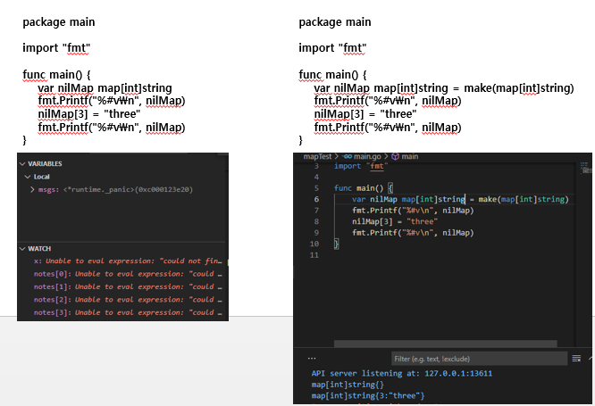
```
일단 무조건 맵을 생성해서 사용해라 이런말임
```
## 할당된 값과 제로 값 구분하는 방법  
```
제로값만으로 키 값이 제로 값으로 할당된것인지
아니면 키 자체가 존재하지 않는 건지 판단하기 어려움
아래 코드를 봐보자.
```

```
코드를 보면 Carl는 입력되지 않아서 원래 값이 0가 아니다. 
이처럼 아무것도 할당되지 않는 키와 값을 구분 못한다.
```
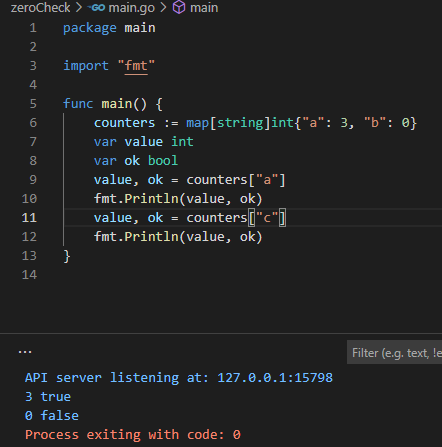
```
이렇게 하면 판단할 수 있다.
만약에 단순히 키의 존재 여부만 확인하고 싶은 경우에는 
빈 식별자를 사용해 반환 값을 무시하면 된다.

package main

import "fmt"

func main() {
	counters := map[string]int{"a": 3, "b": 0}
	var ok bool
	_, ok = counters["a"]
	fmt.Println(ok)
	_, ok = counters["c"]
	fmt.Println(ok)
}
```
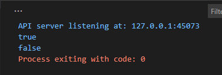
## 키의 존재여부 확인해서 판단하기  
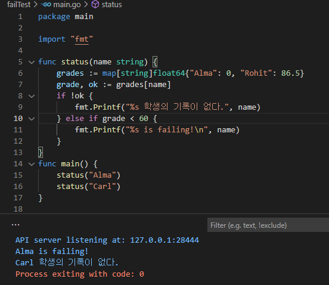
## 키/ 값 delet로 삭제 하기  
```
키값을 삭제하고 싶은 경우 어떻게 해야할까?
delete로 삭제를 할 수 있다. 삭제할 키를 가진 맵과 삭제할 키 값을 인자로 전달하면 됨
```
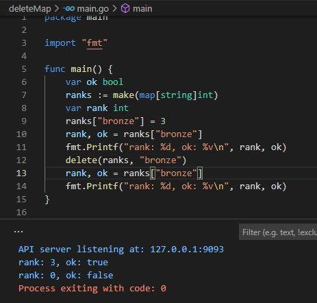
## 개표 프로그램 맵 사용하기  
```go
package main

import (
	"fmt"
	"log"
	"src/github.com/headfirstgo/datafile"
)

func main() {
	lines, err := datafile.GetStrings("votes.txt")
	if err != nil {
		log.Fatal(err)
	}
	counts := make(map[string]int)
	for _, line := range lines { //votes.txt 이름 정보 counts 키로 쓰임
		counts[line]++
	}
	fmt.Println(counts)
}
```
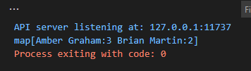
## 맵과 함께 for...range 사용해서 깔끔하게 값 만들기  
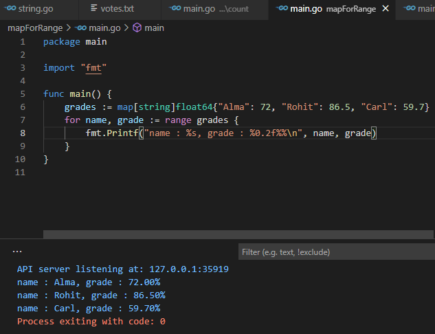
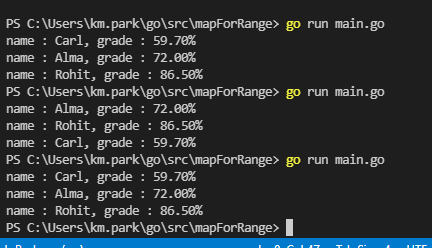
```
위를 잘 보면 랜덤으로 출력을 해주는것이 보일 것이다. 
이를 해결해보자.
```
## for...range 루프는 맵을 무작위 순서로 처리  
```
후보자의 이름을 항상 알파벳 순서로 출력하기 위해서는 
1번 루프에서 맵의 키를 순회하면서 각 키 값을 문자열 슬라이스에 추가
그다음 sort 패키지의 Strings 함수를 사용해 슬라이스에 저장된 이름을 알파벳 순 정렬
2번 루프는 맵이 아닌 슬라이스를 순회하면서 출력
```
## 소스코드  
```go
package main

import (
	"fmt"
	"sort"
)

func main() {
	grades := map[string]float64{"Alma": 72, "Rohit": 86.5, "Carl": 59.7}
	var names []string
	for name := range grades {
		names = append(names, name)
	}
	sort.Strings(names)
	for _, name := range names {
		fmt.Printf("name : %s, grade : %0.2f%%\n", name, grades[name])
	}
}
```
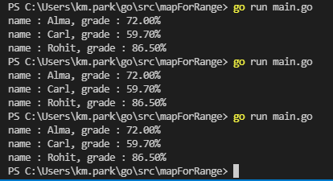
## 개표 프로그램 개선하기  
```go
package main

import (
	"fmt"
	"log"
	"src/github.com/headfirstgo/datafile"
)

func main() {
	lines, err := datafile.GetStrings("votes.txt")
	if err != nil {
		log.Fatal(err)
	}
	counts := make(map[string]int)
	for _, line := range lines { //votes.txt 이름 정보 counts 키로 쓰임
		counts[line]++
	}
	for name, count := range counts {
		fmt.Printf("투표자 정보 %s: %d\n", name, count)
	}
}
```
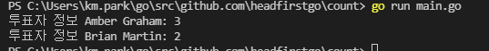

