## 2021년 06월07일 golang 슬라이스  
```
파일에 몇 개의 데이터가 포함되었는지 미리 알 수 없는데
이를 알고 싶을때 사용하는 것 Go의 슬라이스

슬라이스는 확장 가능한 컬렉션타입이고,
이를 통해서 데이터를 좀 더 쉽게 전달할 수 있는 방법과
더 간편한 호출할 수 있는 함수를 작성하는 법을 배워보자.
```
## 슬라이스 란?  
```
Go에는 값을 추가하여 확장할 수 있는 데이터 구조

배열과 마찬가지로 슬라이스도 복수 개의 원소로 이루어지며,
모든 원소는 동일한 타입을 가짐

배열과의 차이점
슬라이스는 끝에 원소를 추가할 수 있는 함수를 사용할 수 있음
C의 기준으로 보면 List같은 자료구조와 비슷한 것 같다.
```
## 슬라이스 변수 선언  
```
배열에서는 크기를 지정했는데 그것 빼고는 배열 변수 선언과 동일하다.
배열: var myArray [5]int
슬라이스: var mySlice []int

슬라이스는 자동으로 변수를 생성하지 않기때문에,
make 내장 함수를 사용해 슬라이스를 명시적으로 생성해야함
```
- **make 함수**  
```
make 함수에는 생성하려는 슬라이스 값의 타입과 생성할 슬라이스 크기 전달
(생성된 값을 할당할 슬라이스 변수와 동일한 타입만 가능)
make([]int, 5) //5개의 정수를 갖는 슬라이스를 생성한 다음 변수에 할당한다.
ex) var notes []string 
notes = make([]string, 7)
// notes := make([]string, 7)
위와 같이 단축변수 선언을 사용하면 변수 선언과 할당을 한번에 할 수 있다.
```
## 슬라이스 길이 반환  
```
배열과 동일하게 len 내장 함수도 배열에서와 동일하게 동작
len에 슬라이스를 전달하면 슬라이스의 길이를 정수값으로 반환
ex1) 일반적인 정석 코드
var notes []string
notes = make([]string,5)
fmt.Println(len(notes))
ex2) 단축변수 선언 코드
notes := make([]string,5)
fmt.Println(len(notes))
```
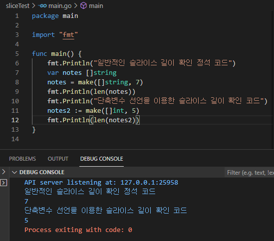

## 슬라이스 for, for range 이용하여 순회하기  
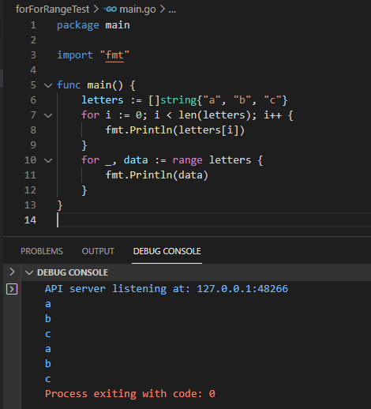
## 슬라이스 리터럴  
```
배열과 마찬가지로 슬라이스에 들어갈 값을 미리 알고 있는 경우
슬라이스 리터럴을 사용하면됨
슬라이스를 만들고 바로 안에 넣는다는 의미이다.
```
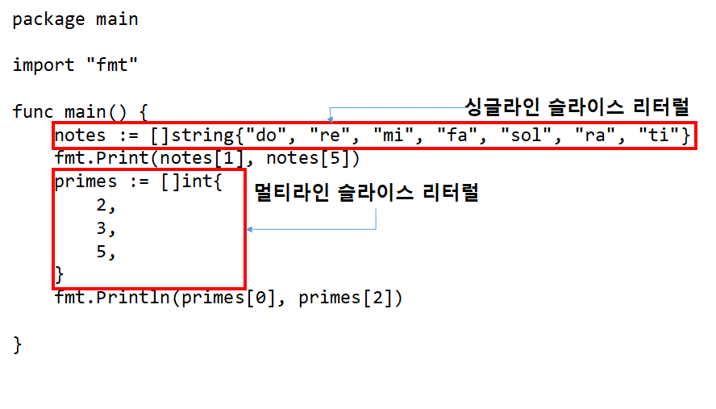
## 슬라이스 연산자  
```
모든 슬라이스는 내부 배열을 기반으로 구현
내부 배열은 슬라이스의 데이터가 실제로 저장되는 공간이며,
슬라이스는 단지 이 배열 원소의 일부 또는 전체에 대한 추상화된 뷰 임

make함수 또는 슬라이스 리터럴로 슬라이스 생성하면 내부배열이 자동으로 생성
(슬라이스를 거치지 않고 직접 내부 배열에 접근할 수 는 없음)

그러나, 배열을 직접 생성한 다음 슬라이스 연산자를 사용하면 해당 배열을 기반으로 하는
슬라이스를 만들 수 있다.

슬라이스 연산자(슬라이싱)는 두 개의 인덱스를 사용한다는 점을 제외하면
개별 원소에 접근하는 구문은 유사
mySlice := myArray[1:3]
```

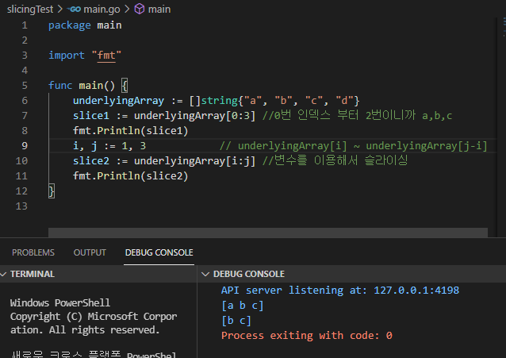

## 내부 배열  
```
슬라이스는 자체적으로 데이터를 저장하지 않으며
단지 내부 배열의 원소에 대한 뷰일 뿐임
슬라이스는 슬라이드(내부배열)에 들어 있는 내용물의 특정 부분에 초점을 맞추는 현미경

내부 배열의 슬라이스를 사용하면 슬라이스를 통해 노출되는 내부 배열 원소의 일부만 
볼 수 있음
```
```
array1 := [5]string("a","b","c","d","e")
slice1 := array1[0:3]
fmt.Println(slice1)
```

## 내부 배열을 변경하면 슬라이스도 변경  
```
슬라이스 사용시 주의할 점은
배열의 데이터에 대한 뷰 이기 때문에
배열의 값이 바뀌면 그 배열을 참조하고 있는 뷰의 값도
변하게 됩니다. 
```

```
슬라이스에는 이런 잠재적 문제가 있어서 배열을 먼저 만들고 슬라이스 연산자 사용보다,
make나 슬라이스 리터럴을 사용해 슬라이스를 만드는것이 더 좋다. 

그 이유는 make나 슬라이스 리터럴을 사용하면
내부 배열을 건드릴 일이 없기 때문이다.
```
## append 함수를 사용해 슬라이스에 원소 추가  
```
슬라이스에 값을 추가하는 방법에 대해서 알아보자.

Go에는 append라는 내장 함수 있음
이 함수는 슬라이스 하나와 스라이스 끝에 추가할 하나 이상의 값을 받아
추가된 새로운 슬라이스를 반환
```
```
slice := []string{"a","b"}
fmt.Println(slice, len(slice))
slice = append(slice,"c")
fmt.Println(slice, len(slice))
slice = append(slice,"d","e")
fmt.Println(slice, len(slice))
```

```
여기서도 주의할 점이 있다.
코드를 보게되면 append의 반환 값을 append에 인자로 넘긴 기존의
슬라이스 변수에 재할당하고 있음을 볼 수 있음

이렇게 하는 것은 append에서 반환된 슬라이스의 동작 방식으로
인한 잠재적인 일관성 문제를 피하기 위함이다.
```
```
슬라이스의 내부 배열은 크기를 변경할 수 없기 때문에 배열에 원소를 
추가할 공간이 부족해지면 모든 원소를 더 큰 배열에 복사한 다음
다음 슬라이스가 새로운 배열을 가리키도록 변경

하지만 이 모든 과정은 append 함수내부에서 이루어지기 때문에 
함수에서 반환된 슬라이스가 전달된 슬라이스와 동일한 내부 배열을 사용하는지,
크기가 변경된 다른 내부 배열을 사용하느지, 알 수 없음
따라서 원본 슬라이스와 append 함수에서 반환된 슬라이스를 
모두 사용하는 경우 예상치 못한 문제가 발생
```


```
다른 언어에서는 슬라이스 변수를 사용하기 전에 변수가
실제로 유효한 슬라이스 값을 가지고 있는지 확인해야 하는 경우도 있지만
Go의 내장 함수들은 nil 슬라이스 값을 마치 빈 슬라이스인 것 처럼 됨

예로 len함수의 경우 nil 슬라이스를 받으면 0을 반환
var intSlice []int
fmt.Println(lend(intSlice))
```


```
append 함수도 마찬가지로 nil 슬라이스를 빈 슬라이스처럼 처리
append 함수에 빈슬라이스를 전달하면 슬라이스에 값을 추가한 다음
하나의 원소를 갖는 슬라이스를 반환
append 함수에 nil 슬라이스를 전달하면 실제로는 값이 추가될 슬라이스
없더라도 하나의 원소가 추가된 슬라이스를 반환

예를 들면 
intSlice = append(intSlice,27)
fmt.Printf("intSlice: %#v\n",intSlice)
```


```
여기서 말하고 싶은것은 슬라이스를 다룰 때 슬라이스 변수가 빈 슬라이스
이지 nil 슬라이스인지 신경 쓸필요 없다.
두 슬라이스 모두 동일하게 취급하기 때문에 잘 동작하니까
```


## 슬라이스와 append 함수를 사용해 추가 데이터 읽어오기  

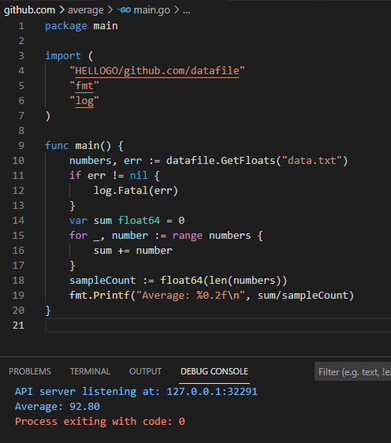
```
이제는 data.txt 파일에 항목을 추가하거나 빼도 제대로 동작을 하게 됩니다.
```
## 에러 발생 시 nill 슬라이스 반환하기  
```
GetFloats 함수를 한 번 더 개선 해보면, 
에러가 발생 할때, 현재는 numbers를 반환하고 있다 그래서 중도에 에러가 발생하면
유효하지 않은 데이터를 반환받는 경우가 있으니 바꿔보자.

GetFloats를 호출하는 코드는 반환된 에러 값이 nil인지 아닌지 확인하고,
에러가 발생했을때 반환된 슬라이스 데이터 무시하면된다.
```
- **GetFloats**  
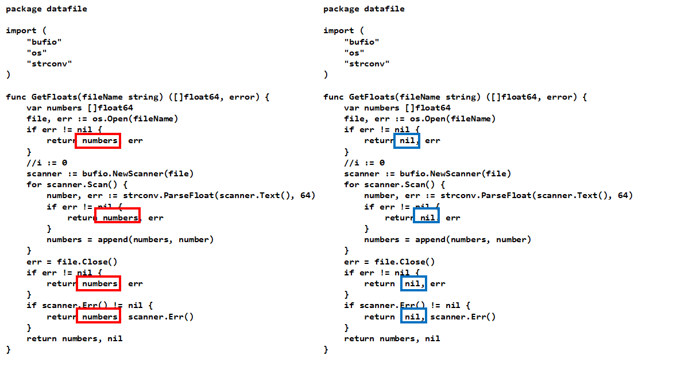
## 명령줄 인자  
```
많은 Go 함수에 인자를 전달함으로써 함수의 행동을 제어할 수 있는 것처럼
터미널이나 명령 프롬프트에서 실행하는 많은 프로그램에도 인자를 전달할 수 있음
이를 프로그램의 명령줄 인터페이스라고 함
```

## os.Args 슬라이스에서 명령줄 인자 가져오기  
```
명령줄을 읽어와서 평균을 계산하는 average2를 만들어봅시다.
os.Args라는 패키지라는 변수가 있음 우선 os.Args슬라이스 값을 출력해봅시다.
package main

import (
	"fmt"
	"os"
)

func main() {
	fmt.Println(os.Args)
}
```
```
사용자가 엔터할때마다 값이 달라짐을 알 수 있다.
```
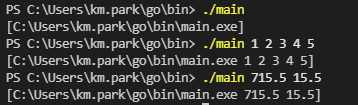

## 슬라이스 연자자는 슬라이스에도 사용 할 수 있음   
```
os.Args의 문제는 아주 잘 작동하지만 
첫번째 원소에 실행파일과 이름이 포함되는 문제가 있다.

그걸 하기위해서 앞전에 썼던 슬라이스를 특정위치를 가져오는 방법을 사용합시다.

underlyingArray := [5]string{"a","b","c","d","e}
slice5 := underlyingArray[1:]
fmt.Println(slice5)
이렇게 해서 첫번째 인자를 제거하는방법이 있다.
즉 그래서 소스를 아래와 같이 해보자.
```
```
package main

import (
	"fmt"
	"os"
)

func main() {
	fmt.Println(os.Args[1:])
}

이렇게 실행하면 첫번째 나오는 파일 이름이 사라질 것이다.
```
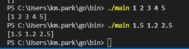

## 명령줄 인자를 사용하도록 수정하기  

```
이제는 이 인자값을 숫자 값으로 변환한 뒤 평균값을 계산해보자.
```
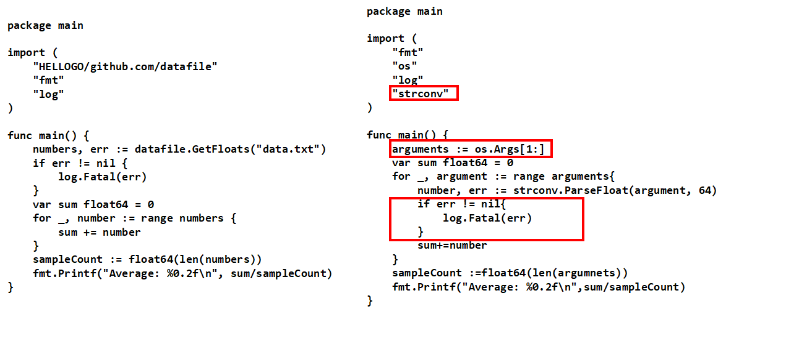
**사진 첨부**  
## 가변 인자 함수  
```
fmt.Println(1)
fmt.Println(1,2,3,4,5)

letters := []string{"a"}
letters = append(letters,"b")
letters = append(letters,"c","d","e","f")

이렇게 fmt.Println이나 append는 여러개의 인자를 받을 수 있다.
그렇다고 하더라도
모든 함수가 임의 개수의 인자를 받을 수 있는 것은 아님
왜냐하면 우리가 구현한 것들은 매개변수와 호출할 때의 인자의 수가 일치해야했음
```
```
어떻게 그럼 가변 인자를 받을 수 있을까?
가변 인자 함수란? 임의 개수의 인자를 가지고 호출할 수 있는 함수인데
함수 선언 부의 마지막(혹은 단일) 매개변수의 타입 앞에 생략부호로 만들수 있다.

func myFunc(param1 int, param2 ...string){
}
... 이것이 생략부호이다.
```
## 가변 인자 함수 만들어 보기  
```
func severalStrings(strings ...string){
	fmt.Println(strings)
}

func main(){
	severalStrings("a")
	severalStrings("a","b","c")
	severalStrings()
}

가변인자는 무조건 마지막 매개변수로 지정해야한다. 그래야 제대로 동작하니 알자.
```
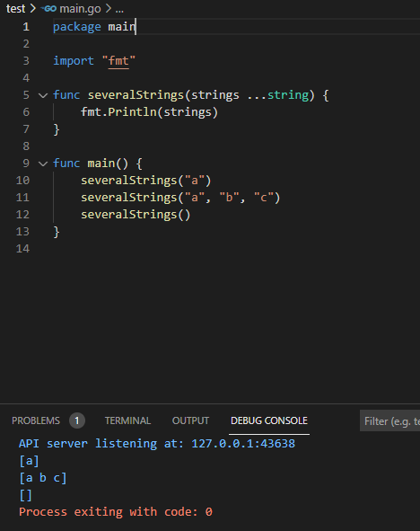

## 가변인자 이용해서 maximum구하기  
```
package main

import(
	"fmt"
	"math"
)

func maximun(numbers ...float64){
	max := math.Inf(-1)
	for _, number := range numbers{
		if number > max{
			max = number
		}
	}
	return max
}
func main(){
	fmt.Println(maximun(71.8,56.2,89.5))
	fmt.Println(maximun(90.7,89.7,98.5,92.3))
}
```
**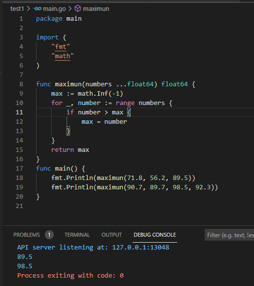**  
## 최소값 , 최대값 한번에 받기  
```go
package main
import "fmt"
func inRange(min float64, max float64, numbers ...float64)[]float64{
	var result []float64
	for _, number := range numbers{
		if number >= min&& number <=max{
			rusult = append(result, number)
		}
	}
	return result
}

func main(){
	fmt.Println(inRange(1,100, -12.5, 3.2,0, 50, 103.5))
	//1~100 범위의 최소, 최대값 
	fmt.Println(inRange(-10,10, 4.1,12,-12,-5.2))
	//-1~10 범위츼 최소,  최대값
}
```
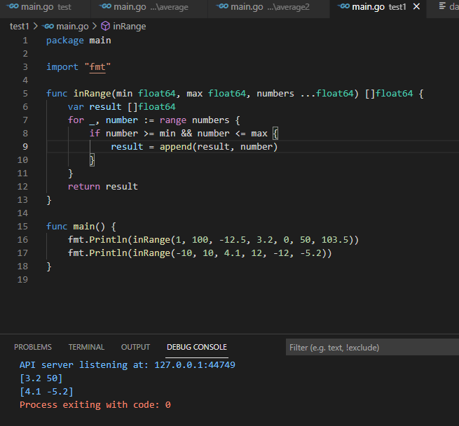
## 가변 인자 함수를 사용해 평균 계산하기  
```
package main

import "fmt"

func average(numbers ...float64) float64 {
	var sum float64 = 0
	for _, number := range numbers {
		sum += number
	}
	return sum / float64(len(numbers))
}
func main() {
	fmt.Println(average(100, 50))
	fmt.Println(average(90.7, 89.7, 98.5, 92.3))
}
```
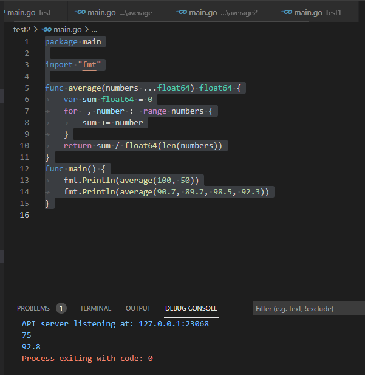
## 가변 인자 함수에 슬라이스 전달하기
```go
package main

import (
	"fmt"
	"log"
	"os"
	"strconv"
)

func average(numbers ...float64) float64 {
	var sum float64 = 0
	for _, number := range numbers {
		sum += number
	}
	return sum / float64(len(numbers))
}

func main() {
	arguments := os.Args[1:]
	var numbers []float64
	for _, argument := range arguments {
		number, err := strconv.ParseFloat(argument, 64)
		if err != nil {
			log.Fatal(err)
		}
		numbers = append(numbers, number)
	}
	fmt.Printf("Average: %0.2f\n", average(numbers))
}

이렇게 하면 함수는 하나이상의 float64인자를 받지만
float64슬라이스로 값을 받고 있지 않아 에러가 생긴다.
```
## 특별한 방법 으로 해결하기  
```
그렇다면 Go에서는 이래서 특별한 문법이 존재한다. 
가변 인자 함수를 호출할 때 가변 인자위치에서 슬라이스 뒤에 생략 부호 ... 붙여주면됨
    fmt.Printf("Average: %0.2f\n", average(numbers))
    fmt.Printf("Average: %0.2f\n", average(numbers...))
    이렇게 해주면 됩니다.
```
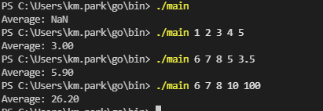