## 2021년 06월08일 golang 구조체  
```
서로 다른 타입을 가진 두 개 이상의 데이터를 함께 저장해야 하는 경우 있는데 이때 사용한다.

슬라이스와 구조체는 모두 한가지 타입의 값만 저장할 수 있었는데 떄로는 여러가지 타입이 필요하다.
예로
청구서, 영수증, 학생부 같은 것은 같은 자료형만 존재하지 않는 경우가 대표적인 예이다.
지금까지 슬라이스와 맵에서 서로 다른 타입의 값을 혼용해서 사용할 수 없지만 구조체를 이용하면 
서로 다른 타입의 값을 함께 사용할 수 있다.
```
## 슬라이스와 맵은 한 가지 타입의 값만 갖음  
```go
이름은 string이고 구독료는 floag64, 구독 여부는 bool 타입인 상황에서
하나의 슬라이스로 이 값들을 저장할 수 없는 상황이라고 해보자.

package main

func main() {
	subscriberSlice := []string{} //한가지 타입만 가질 수 있음
	subscriberSlice = append(subscriberSlice, "A")
	subscriberSlice = append(subscriberSlice, 4.99)
	subscriberSlice = append(subscriberSlice, true)

	subscriberMap := map[string]float64{}
	subscriberMap["name"] = "Aman singh"
	subscriberMap["rate"] = 4.99
	subscriberMap["active"] = true
}
```
```
이렇게 하면 무조건 에러가 생긴다.
그래서 이때 구조체를 사용한다.
```
## 여러 타입의 값으로 구성된 구조체  
```
구조체는 여러 타입의 값으로 구성된 값
슬라이스가 string 타입의 값만 저장할 수 있거나 
맵이 int 타입의 값만 저장할 수 있는 것과 다르게 

구조체는 string, int, float64, bool 등 여러 타입의 값들을 한번에 묶어 저장
```
- **구조체 선언**   
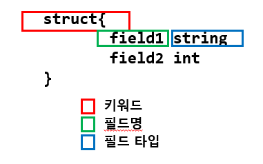
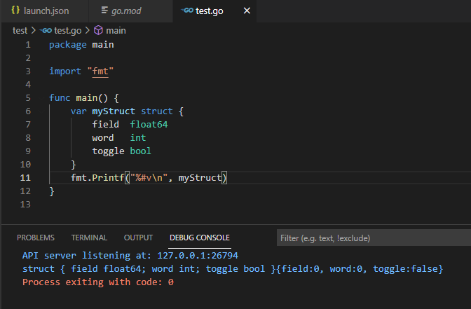
```
각 필드들이 자신의 타입에 대한 제로 값으로 초기화됨
```
## 도트(.) 연산자를 사용한 구조체 필드 접근  
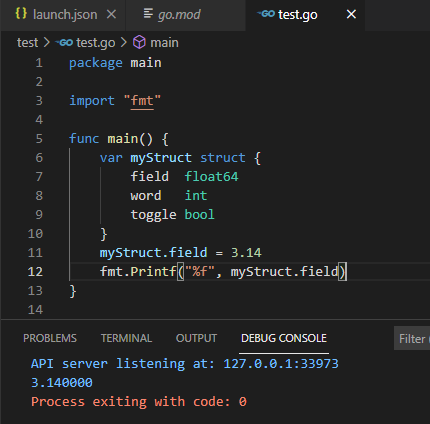
## 구조체에 구독자 정보 저장하기  
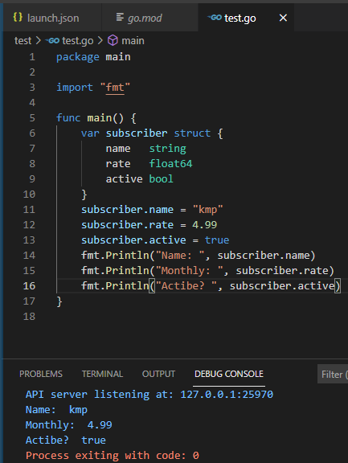
## 사용자 정의 타입과 구조체  
```
타입 정의를 사용하면 자신만의 타입을 만들 수 있고,
기본 타입에 기반한 사용자 정의 타입을 만들 수 있음
```
- **타입 정의**  
```
type myType struct{

}
이렇게 선언합니다.
```
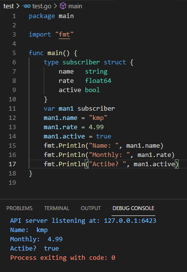
```
저렇게 type으로 설정하면 var man1 subscriber해서 사용 할 수 있습니다.
구조체 자체는 C언어와 비슷하기 때문에 쉽게 접근 가능하다.
```
## 함수에서 사용자 정의 타입 사용하기  
```
사용자 정의 타입은 변수의 타입뿐만 아니라 
함수의 매개변수와 반환 값의 타입으로도 사용 할 수 있음
```
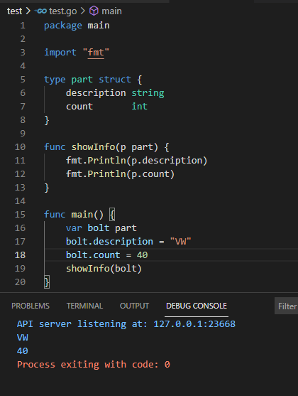

## 구조체 값 반환 하기  
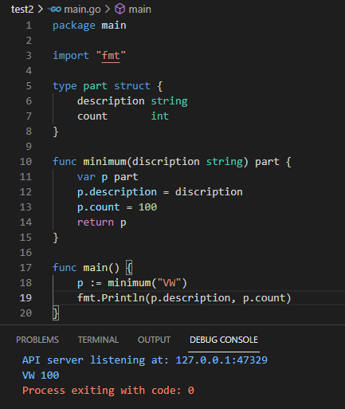
```go
package main

import "fmt"

type subscriber struct{
 name   string
 rate   float64
 active bool
}
func printInfo(s subscriber){
	fmt.Println("Name:", s.name)
	fmt.Println("Monthly:", s.rate)
	fmt.Println("Active? ",s.active)
}
func defaultSubscriber(name string) subscriber{
	var s subscriber
	s.name 
}
```
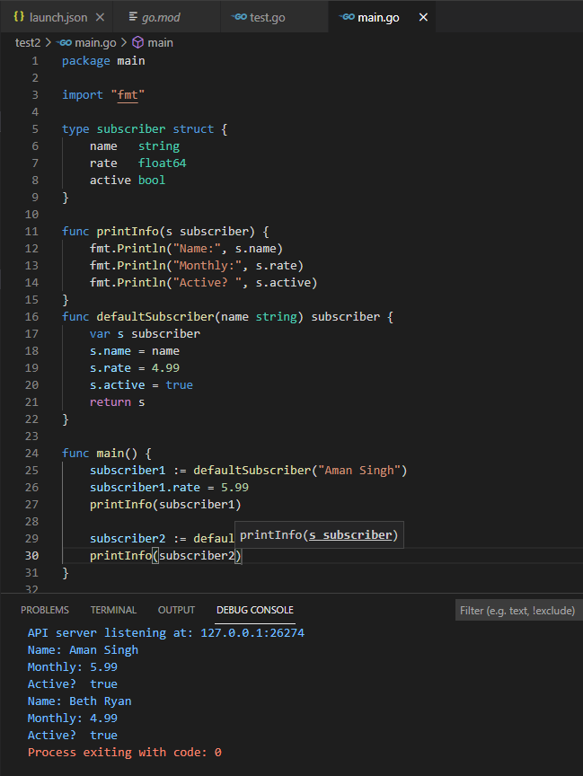

## 함수에서 구조체 변경하기
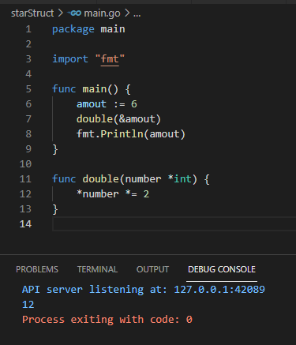
```
이런식으로 해서 값을 변경하려고 해야지 안그러면
passs by value 포인터를 빼면 값만 바뀌고 실제적으로 변화하지 않는다.
항상 이점은 유의 하자.
type sub struct{
...
}
func apply(s * sub){
s.rate = 4.99
}
var s sub
apply(&s)

아까랑 다른점은

*number *=2
s.rate =4.99
이차이인데 *로 아까는 접근해놓고 구조체는 그냥 하냐 이말인데
이 도트 표기법은 구조체 자체뿐만 아니라 구조체 포인터에서도 사용할 수 있다고 한다.
```
## 포인터를 통한 구조체 필드 접근  
```
포인터 변수를 출력하면 변수가 가리키는 메모리의 주소 값이 출력된다.
package main

import "fmt"

type myStruct struct {
	myField int
}

func main() {
	var value myStruct
	value.myField = 3
	var pointer *myStruct = &value
	fmt.Println(*pointer.myField)
}

이렇게 하면 에러가 생긴다. 
fmt.Println((*pointer).myField)
이렇게 해주면 된다. 하지만 번거롭긴하다.
fmt.Println(pointer.myField) // 구조체 필드에 접근하기
사실 이렇게 해줘도 된다.
pointer.myField = 9 // 포인터를 통해 구조체 필드에 값 할당하기

이렇게 되는것은 도트 연산자는 구조체 값에서 직접 필드를 직접 접근하는것 처럼
구조체 포인터에서도 필드에 접근을 허용한다. 그래서 괄호랑 * 를 생략할 수 있는 것
```
## 포인터를 사용한 큰 구조체 전달  
```
함수는 전달된 인자의 복사복을 사용하는데, 
구조체도 예외는 아니다.

필드가 많은 구조체의 경우 함수의 인자로 구조체 자체보다는 
구조체 포인터를 전달하는게 좋다.

구조체 포인터의 장점은 구조체의 복사본이 생겨나지 않음
그래서 메모리상에는 단 하나의 구조체만 존재
```
```go
type subscriber struct {
	name   string
	rate   float64
	active bool
}

func printInfo(s *subscriber) {
	fmt.Println("Name:", s.name)
	fmt.Println("Monthly:", s.rate)
	fmt.Println("Active? ", s.active)
}
func defaultSubscriber(name string) *subscriber {
	var s subscriber
	s.name = name
	s.rate = 4.99
	s.active = true
	return &s
}

이런 구조체 일때 저렇게 구조체 포인터를 이용해서 메모리 남비를 줄일 수 있다.
```

## 구조체 타입을 별도 패키지로 옮기기  
```
작업 공간 -> src -> github.com -> headfirstgo -> magazine -> magazine.go

type subscriber struct{
	name string
	rate float64
	active bool
}

main.go 는 다른 공간에 만들어줍니다.
```
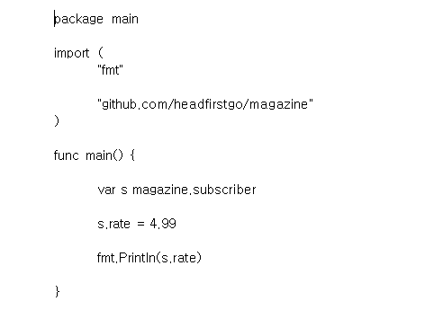

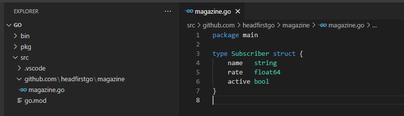

```
작업 공간이 완전 다른 곳에서 지금 이렇게 하면 구조체 자체는
외부 노출이 아니기 때문에 외부노출이 가능하도록
type Subscriber struct{
}
선언해줘야한다. 그렇지 않으면 이런 에러가 발생한다.
```
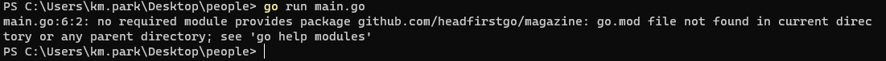
```go
package magazine

type Subscriber struct {
	name   string
	rate   float64
	active bool
}
외부 노출하려면 대문자로 시작해야한다.
```
## 구조체 필드를 노출할 땐 대문자를 사용  
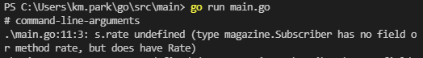
```go
보면 이런 에러가 있는데 이것도 구조체만 외부 노출 했다고 해서 필드의 이름은
외부 노출을 하지 않았기 때문에 나오는 에러이다. 
필드명 역시 대문자로 시작해 보자.

package magazine

type Subscriber struct {
	Name   string
	Rate   float64
	Active bool
}
```
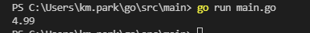
```
간혹 보면 이게 패키지가 안먹힐때가 있는데 그때는
그리고 이 패키지는 GOROOT 경로의 src에 들어있어야 제대로 동작을 한다.

패키지 경로는 다를 수 있지만 저렇게 해야 동작을 하긴 했다.
```
## 구조체 리터럴  
```
구조체를 정의하고 하나씩 값을 할당해 주는 일은 귀찮을 수 있다.

var subscriber magazine.Subscriber
subscriber.Name = "A"
subscriber.Rate = 4.99
subscriber.Active = true

구조체 리터럴을 이용해서 생성과 동시에 초깃값을 할당해보자.
```
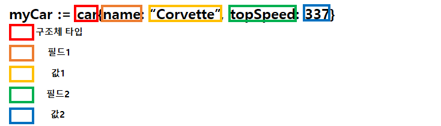
```
모든 필드를 다 입력할 필요 없고 한개의 필드만 입력해도 됩니다.
```
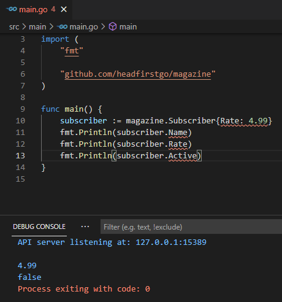
## Employee  구조체 타입 만들기  
```
대략 보면 도 다른 내용도 추가 하고 싶은 경우에는 
직원의 정보를 저장하는 구조체를 만들고 싶다면 이렇게 하면된다.
```
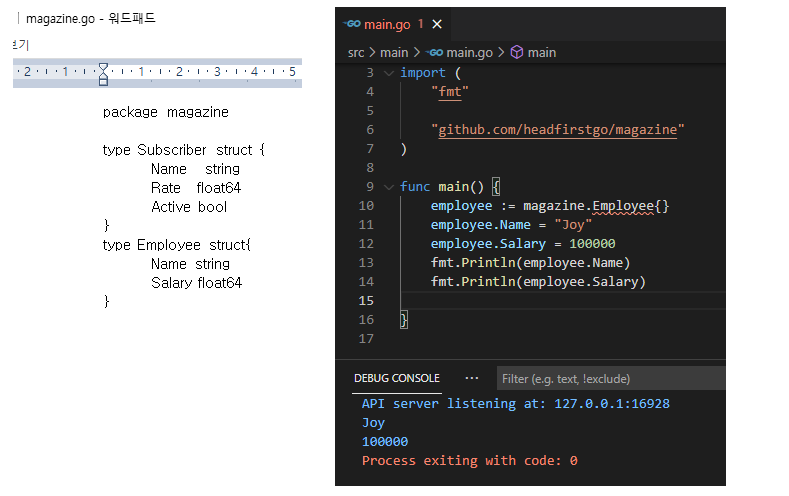
## Address 구조체 타입 만들기  
```
구독자랑, 직원 두 타입에 대해 우편 주소를 저장해야하는 상황이라고 해보자.
그렇다면 Address라는 구조체를 따로 만들어서 해도 된다.
하지만 이정보의 경우 직원과 구독자와 같은 정보를 제공하기 때문에
만들 Address 정보를 따로 또 선언해서 할필요 없이 그 구조체를 필드 타입으로 해서 
이전의 구독자, 직원 구조체에 포함 시키면된다. 예를들면 아래와 같다.
```
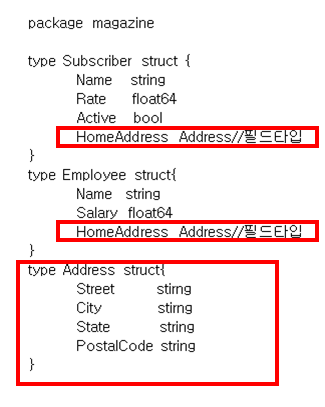
```
이렇게 필드 타입의 구조체로 만들면 
직원의 구조체의 맴버 즉, 필드였던것 처럼 사용 할 수 있다.
```
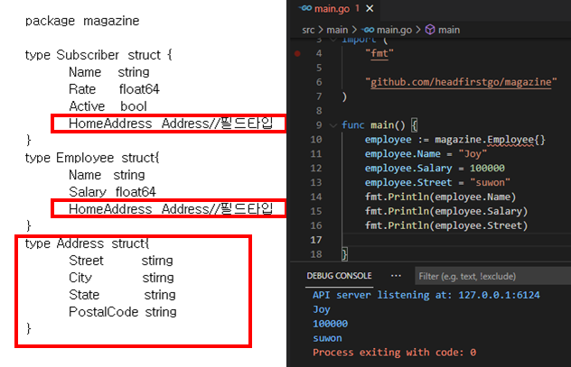
## 내부 구조체에 값 할당하기  
```
이번 실습은 Subscriber 구조체의 필드로 지정된 Address 구조체의 필드에 값을 할당
1. 별도의 Address 구조체 타입의 변수를 하나 만든다. 
그리고 Subscriber 구조체의 Address필드에 할당 하는 방법 이다.

address := magazine.Address{Street:"45 Street", City:
"suwon",State:"EW",PostalCode: "12345"}
```
```go
package main

import (
	"fmt"

	"github.com/headfirstgo/magazine"
)

func main() {
	address := magazine.Address{Street: "45 Street", City: "suwon", State: "EW", PostalCode: "12345"}
	subscriber := magazine.Subscriber{Name: "black"}
	subscriber.HomeAddres = address
	fmt.Println(address.HomeAddress)

}
```
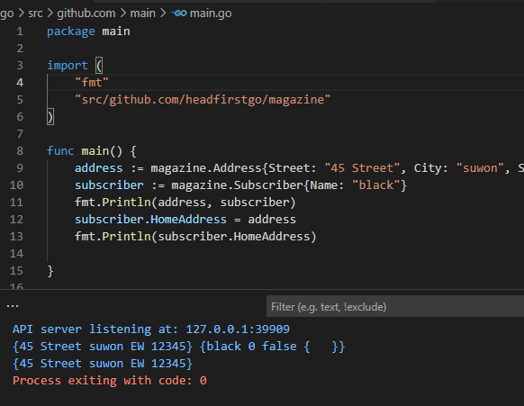
## 외부 구조체를 통해 내부 구조체의 필드에 값을 할당  
```
Subscriber 구조체가 생성되면 HomeAddress필드 또한 제로 값 필드를 가진
Address로 초기화 
이때, fmt.Printf에서 %#v 동사로 출력하면 구조체 리터럴 형태를 확인 가능

subscriber := magazine.Subscriber{}
fmt.Printf("%#v\n", subscriber.HomeAddress)
```
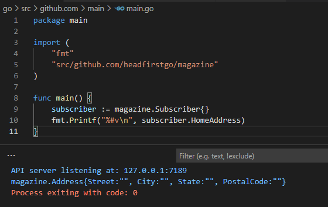
```
도트 연산자를 연쇄적 (체이닝, chaining)으로 사용하면 
Address 구조체의 필드에도 접근할 수 있음

subscriber.HomeAddress로 Address 구조체를 가져온 다음
이어서 도트 연산자와 접근할 Address 구조체의 필드를 지정해주면 됨

subscriber.HomeAddress.City ="suwon"
```

## 익명 구조체 필드  
```
외부 구조체를 통해 내부 구조체의 필드에 접근하는 일 또한 다소 번거롭다.
내부 구조체의 필드에 접근하기 위해서는 매번 내부 구조체 필드의 이름을 지정

Go는 익명 필드를 정의 할 수 있는데 
익명 필드란? 
이름은 없고 타입만 지정된 구조체의 필드를 의미
이렇게 쓰면된다.
```
- **익명 구조체 적용 구조체 예시**  
```go
package magazine
type Subscriber struct{
	Name string
	Rate float64
	Active bool
	Address
}
type Employee struct{
	Name string
	Salary float64
	Address
}
type Address struct{
	Street string
	City string
	State string
	PostalCode string
}
```
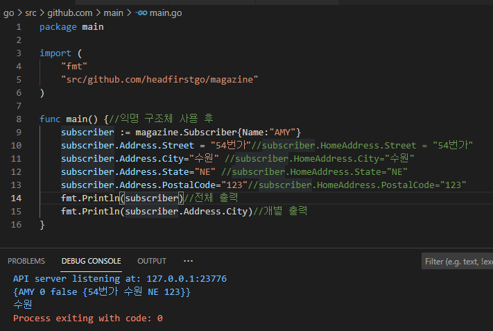
## 구조체 임베딩  
```
익명 필드는 구조체 정의에서 필드명 생략 말고도 많은것 제공
외부 구조체의 익명 필드로 선언된 내부 구조체를 외부 구조체 안에 임베딩 되었다고 함

임베딩된 구조체의 필드는 외부 구조체로 승격되는데,
승격되었다는 말은 내부 구조쳉의 필드를 마치 외부 구조체에 속해 있는것 처럼 접근 가능 

Address 구조체 타입은 Subscriber, Employee 구조체 타입에 임베딩 되었기 때문에 
subscriber.Address.City 대신 subscriber.City로도 가져올 수 있다.
```
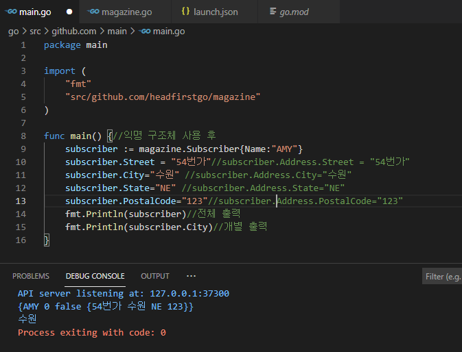
- **연습 문제 **
 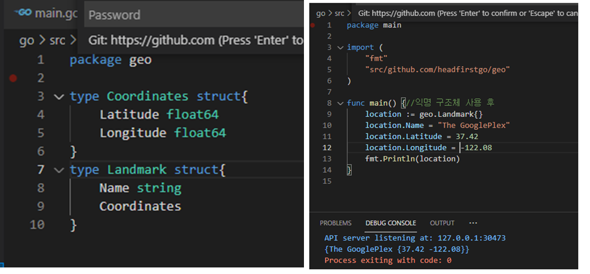