## 2021년 06월08일 golang 사용자 정의 타입  
```
구조체 이외 다른 타입을 기본 타입으로 갖는 경우 
특히 메서드 정의 방법에 대해서 알아보자.
```
## 실세계에서의 타입 에러  
```
숫자가 어떤 단위로 측정된 값인지 확신할 수 있어야함 
이 값의 단위가 리터인지 갤런인지 아니면 킬로미터, 파운드, 달러 또는 원 이런것 인지
```
##  기본 타입으로 정의한  사용자 정의 타입  
```
var fuel float64 = 10

이렇게만 본다면 리터인지 갤런인지 판별 하기 힘들다.
보통은 사용자 젖의 타입의 기본 타입으로 구조체를 많이 사용하지만
구조체뿐만 아니라 int, float64, string, bool등 존재하는 모든 타입을 
기본 타입으로 할 수 있음
단축변수 선언도 된다.
carFuel := Gallons(10.0)
```
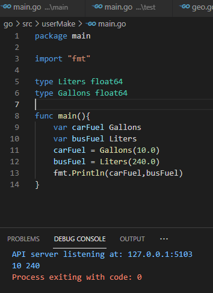
```
type Liters float64
type Gallons float64

func main() {
	var carFuel Gallons
	var busFuel Liters
	
	carFuel := Liters(1.0)
	busFuel := Gallons(1.0)
// 이런경우 같은 타입이긴하지만 선언이 달라서 안된다.
}
하지만 타입간 변환은 가능 대신 타입이 같아야함
Gallons(Liters(24.0)) == Gallons(24.0)
동일하게 취급한다.

여기서는 값을 그대로 둔채 단순히 타입만 변환하는게 아니라
변환할 값을 변환하려는 타입의 의미에 맞는 값으로 변환하는데 필요한 연산을 해라 임

리터는 갤런으로 
갤런은 리터로 하라는것인데

carFuel = Gallons(Liters(40.0)*0.264)
busFuel = Liters(Gallons(63.0)*3.785)
이렇게 해야한다는 것이다.
```
## 사용자 정의 타입과 연산자   
```
사용자 정의 타입은 기본 타입에서 사용할 수 있는 모든 연산자를 지원
예를 들어 
float64를 기반으로 하는 타입은 
산술 연산자 + - * / 더불어
비교 연산자 == > < 사용할 수 있음

Liters(1.2) + Liters(3.4)
Liters(1.2) > Liters(3.4) 이렇게? 사용할 수 있음
Liters(1.2) > 2 이렇게도 기본타입과 리터럴 값의 연산도 가능

이렇게 사용자 정의 타입을 하는것은 
서로 다른 타입을 혼용할 여지를 미연에 방지해주는 것
사용자 정의도 더하기 하려면 해당 타입으로 타입을 변환 해줘야한다.
```
- **연습문제**  
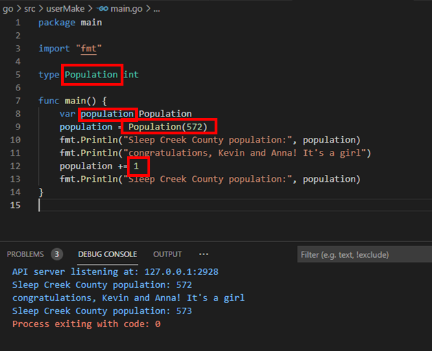
## 함수를 사용한 타입 변환  
```go
package main

type Liters float64
type Gallons float64

func main() {
	carFuel := Gallons(1.2)
	busFuel := liters(2.5)
	carFuel += Liters(8.0)
	busFuel += Fallons(30.0)
}

//이런 식으로 혼용해서 사용할 수 없다. 
사용을 하려면 
carFuel = Callons(Liters(40.0) * 0.264)
busFuel = Liters(Gallons(63.0)*3.785)
이렇게 해서 이전에 형변환 하는 것 처럼 해줘야한다.
```
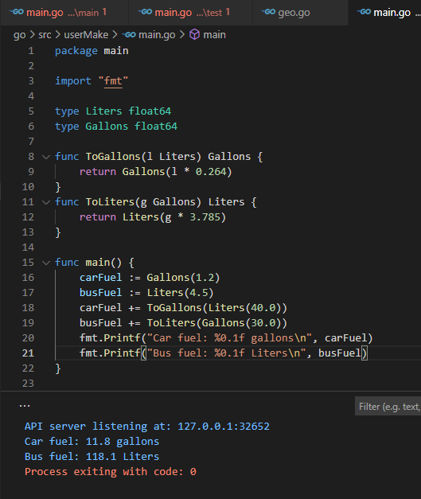
## 밀리리터를 선언하여 적용하는 상황  
```
type Milliliter float64

func ToGallons(m Milliliters)Gallons{
	return Gallons(m*0.000264)
}
이렇게 하면 당연히 에러가 생긴다. 그렇기 때문에 밀리리터를 선언을 하게 된다면
그만큼의 함수가 생겨나게 된다. 예를 들면 아래와 같다.
func LitersToFallons(l Liters)Gallons{
	return Gallons(l*0.264)
}
func MillilitersToGallons(m Milliliters) Gallons{
	return Gallons(m * 0.000264)
}
func GallonsToLiters(g Gallons) Liters{
	return Liters(g *3.785)
}
func GallonsToMilliliters(g Gallons) Milliliters{
	return Milliliters(g*3785.41)
}
```
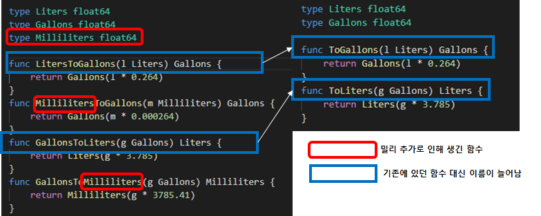
## 메서드를 사용한 함수명 충돌 방지  
```
지금까지는 ToGallons라는 이름의 함수를 여러 번 정의 할 수 없다는 이유로 변환하려는
타입의 이름이 포함된 긴 함수명을 사용했다.
하지만, 
LitersToGallons(Liters(2))
MillilitersToGallons(Milliliters(500))
이렇게 긴 함수명을 사용했지만 

타입별로 메소드를 정의하면 ToGallons라는 메서드를 여러 번 정의 할 수 있음
Liters(2).ToGallons()
Millilters(500).ToGallons()
이런식으로 뒤에 .ToGallons()로해서 문제를 해결하겠다는 거임
이걸 이렇게 하기에 앞서 정의하는 법에 대해서 알아 봅시다.
```
## 메서드 정의하기  
```
메서드 정의는 함수 정의와 매우 유사함
유일한 차이는 이름 앞에 리시버 매개변수를 추가로 선언해야한다.

func (m Mytpe) sayHi() {
	fmt.Println("Hi from", m)
}
```
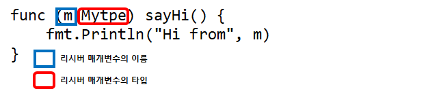
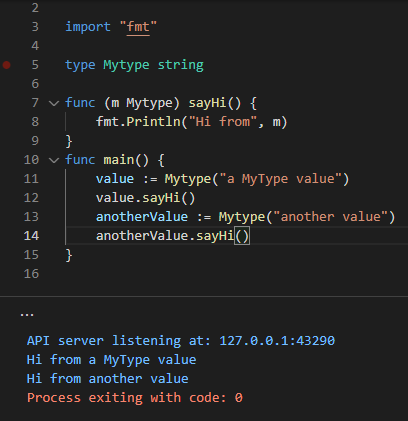
## 또 다른 매개변수인 리시버 매개변수  
```
리시버 매개변수의 타입은 매서드와 연관된 타입이다. 
그렇다고 해서 리시버 매개변수가 특별한 매개변수인 것은 아님
매서드에서는 리시버 매개변수를 함수의 다른 매개변수와 동일한 방식으로 접근하고 사용
```
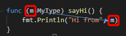
```
출력된 리시버의 값이 나오는 것이 보인다.
```
## 리시버 이름  
```
리시버의 매개변수의 이름에 아무 이름이나 사용할 수 있지만
가독성을 위해 하나의 타입에서 정의하는 모든 메서드에서는 동일한 
리시버 이름을 사용하는 게 좋다.

보통 리시버의 이름으로 리시버 타입의 첫 번째 문자를 소문자로 사용하는 
컨벤션을 따름
MyType 리시버의 매개변수는 m인것 처럼 말이다.
```
## 함수와 아주 유사한 메서드  
```
메서드는 리시버 위에서 호출한다는 점만 제외하면 함수와 아주 유사

다른 함수와 마찬가지로 메서드에도 추가 메개변수를 정의할 수 있음
메서드 블록에서는 리시버 매개변수와 함께 추가로 정의한 매게변수에 접근할 수 있다.
메서드를 호출할 때에는 각 매게변수로 인자를 전달해야함
```
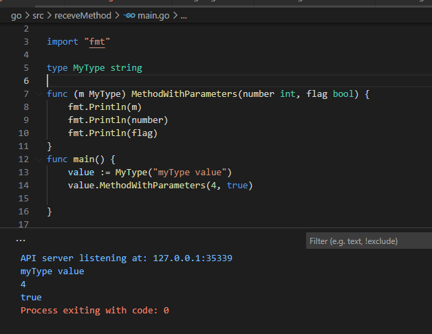
```
위와 같이 사용할 수 있고 일반적으로 하나 이상의 반환 값을 선언할 수 있다.
그냥 한말로 함수랑 동작이 같다 다만 리시버 매게변수가 있을뿐
```
- **연습문제**  
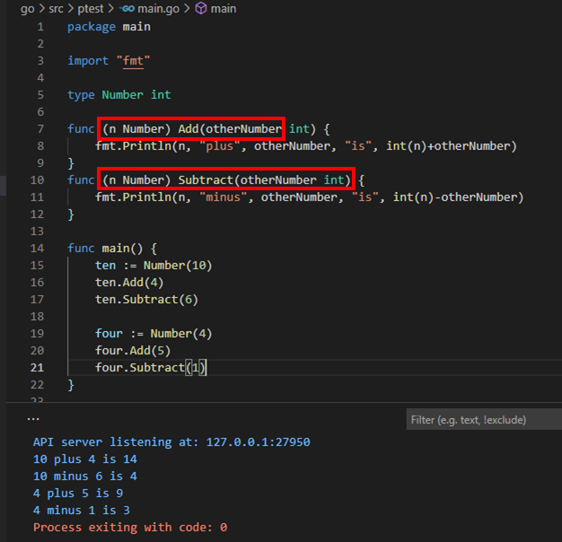
## 포인터 리시버 매개변수
```go
package main

import "fmt"

type Number int

func (n Number) Double() {
	n *= 2
}

func main() {
	number := Number(4)
	fmt.Println("원래 숫자:", number)
	number.Double()
	fmt.Println("두배된 함수 들어간 숫자:", number)
}
```
```
이렇게 하면 절대 값이 변하지 않는다 
그것은 pass by value 였던가 무튼 복사된 값만 바뀌는거라 
함수를 나오게 되면 사라지기때문에 실제적인 값이 바뀌는게 아니다.

그래서 앞서서 매번 했지만 포인터를 이용해서 바꿔야한다.
그냥 리시버 매게변수를 포인터 타입으로 바꾸고 하면된다. 아래와 같다.
```
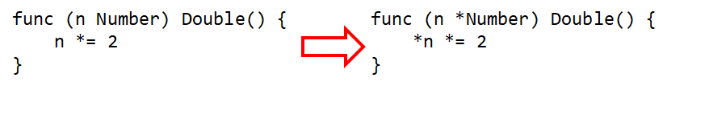
```
그냥 앞으로는 너무 당연한거니 어렵지 않다. 이렇게 해서 실행해보자.
```
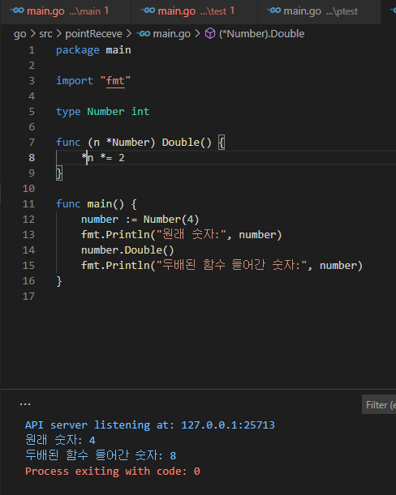
## 주의  
```
포인터 리시버 메서드를 호출하려면 값에서 포인터를 가져올 수 있어야 함

포인터는 변수에 저장된 값에서만 가져올 수 있음
변수에 저장되지 않은 값의 포인터 주소를 가져오려고하면 에러가 생김

&MyType("a value")

포인터 리시버 메소드를 호출 할 때에도 동일한 제약 적용
Go는 리시버 값이 변수에 저장된 경우에만 자동으로 값을 포인터로 변환해줌

중요한 점은 변수에 저장된것만 포인터로 변환해준다.이고
MyType("a value").pointerMethod()

저렇게 따로만 쓰면 안되고
value :=  MyType("a value")
value.pointerMethod()

이렇게하면 Go에서 value인 이값을 포인터로 변환
```
## 메소드를 사용해 Liters와 Milliliters 값 변환하기  
```
예제 앞서서 길게 이름을 썼던걸 고쳐 봅시다.
```
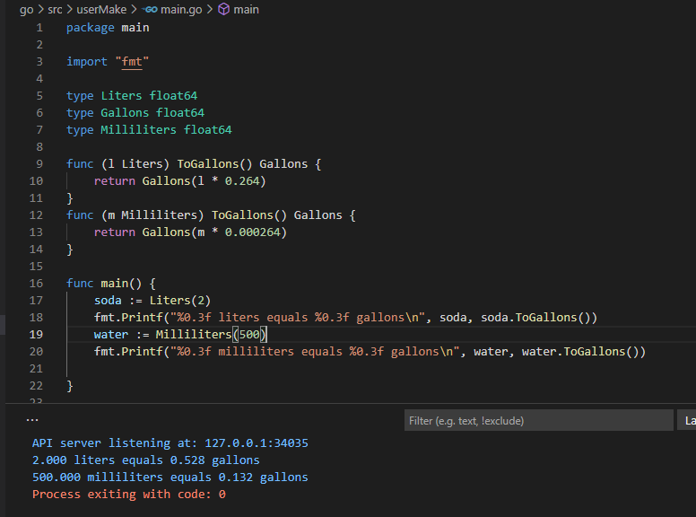
```
약간 느낌은 메소드 오버로딩 같은 느낌이지만 
무튼 이런식으로 짧게 좀 깔끔하게 적용 할 수 있음
```
## 메서드를 사용해 Gallons 값 변환하기  
```
이번에는 갤런을 리터와 밀리로 바꾸는 소스를 구현해보자
```
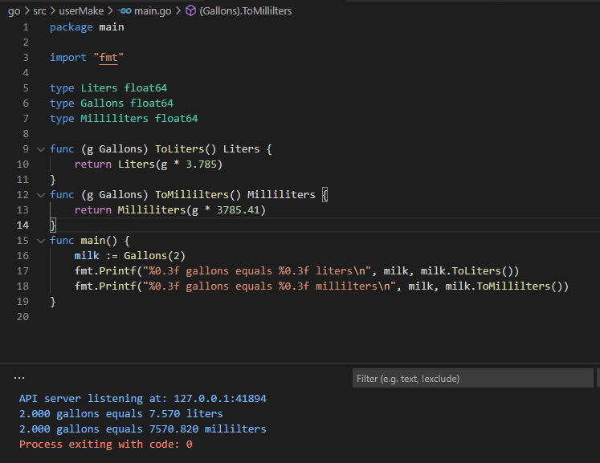
- **연습문제**  
  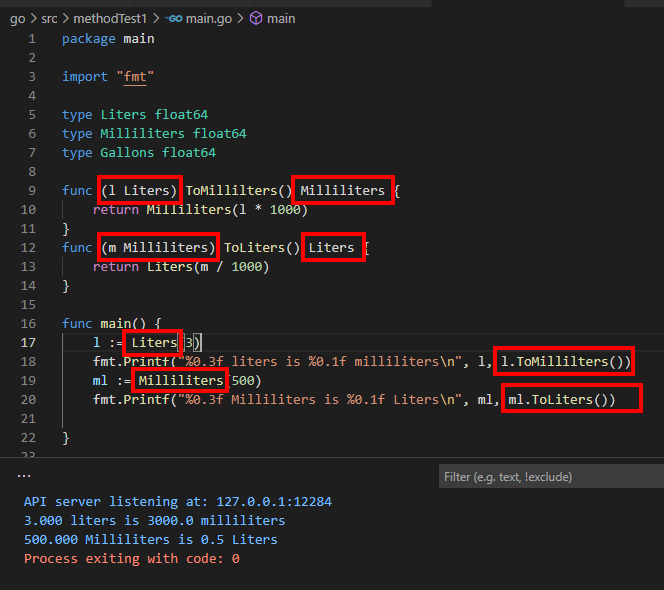
