## 2021년 06월09일 golang 인터페이스
```
그 값이 무엇인지보다는 그 값으로 어떤 일을 할 수 있는지에 대해 관심을 두는 경우 있음
즉, 어떤 값에서 특정 메서드를 호출할 수 있는지가 주요 관심사 이다.

어떤것으로 구성되어 있는지가 중요한것이 아니라 사용법 쓰는것이 중요하다는 말
그것이 인터페이스이다.

인터페이스를 사용하면 특정 메서드를 정의하는 모든 타입의 값을 저장할 수 있는 
변수 또는 매개변수를 정의 할 수 있음
```
## 동일한 메서드를 가진 서로 다른 타입
```go
// src/github.com/headfirstgo/gadget/ 디렉토리에 tape.go를 만든다.
package gadget

import "fmt"

type TapePlayer struct {
	Batteries string
}

func (t TapePlayer) Play(song string) {
	fmt.Println("Playing", song)
}

func (t TapePlayer) Stop() {
	fmt.Println("Stopped!")
}

type TapeRecorder struct {
	Microphones int
}

func (t TapeRecorder) Play(song string) {
	fmt.Println("Playing", song)
}
func (t TapeRecorder) Record() {
	fmt.Println("Recording")
}
func (t TapeRecorder) Stop() {
	fmt.Println("Stopped!")
}
```
## 한 가지 타입만 받을 수 있는 메서드 매개변수  
```
TapePlayer 타입의 값과 재생할 곡의 제목으로 이루어진 슬라이스를 받는
playList함수를 정의하고 있는데,
이 함수는 슬라이스 목록을 순회하면서 
각 제목을 TapePlayer의 Play메서드의 인자로 전달
목록에 있는 모든 곡의 플레이가 끝나면 TapePlayer의 Stop메서드를 호출
```
```go
package main

import "src/github.com/headfirstgo/gadget"

func playList(device gadget.TapePlayer, songs []string) {
	for _, song := range songs {
		device.Play(song)
	}
	device.Stop()
}

func main() {
	player := gadget.TapePlayer{}
	mixtape := []string{"Jessie's Girl", "Whip It", "9 to 5"}
	playList(player, mixtape)
}
```
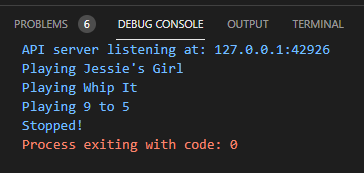
```
player := gadget.TapeRecorder{}
을 하면 에러가 생긴다. 당연한거지만 말이다.
```
## 인터페이스  
```
사용자가 프로그램과 상호 작용할 수 있도록 프로그램이 제공하는 제어장치르
인터페이스라고 부름
일반적인 방법은 값의 메서드를 사용하는 것이다.

Go의 인터페이스는 특정 값이 가지고 있기를 기대하는 메서드의 집합으로 정의됨
즉, 인터페이스는 동작을 수행할 수 있는 타입이 지녀야 하는 동작들의 집합이라고 함

사용법은 interface 키워드 다음으로는 메서드가 가지고 있기를 기대하는
매게변수 또는 반환 값과 함께 메서드 이름의 목록이 중괄호 안에 감싸여 옴
글보다는 눈으로 봅시다.
```
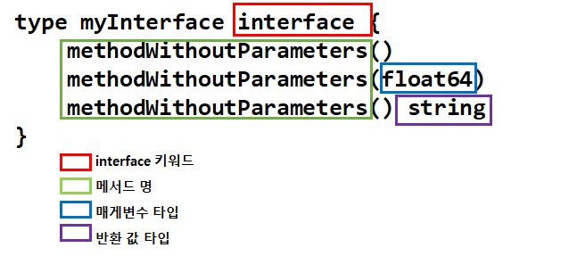
```
인터페이스 정의에 나열된 모든 메서드를 가진 타입은 
해당 인터페이스를 만족한다고 함

인터페이스를 만족하는 타입은 해당 인터페이스가 필요한 모든 곳에서 사용할 수 있음
```
## 인터페이스 만족 조건  
```
인터페이스에 정의된 매서드명
매개변수 타입(선택)
반환 값 타입(선택)
이 세가지가 모두 일치 해야한다. 

타입은 인터페이스 정의에 나열된 메서드 외에도 다른 메서드를 추가로 가질 수 있지만
인터페이스 정의에 나열된 메서드는 반드시 모두 구현해야 하며 하나도 구현 않하면
인터페이스 만족 할 수 없음
```
## 인터페이스를 만족하는 타입 정의  
```
아래의 구현한 Myinterface 인터페이스를 만족하려면
MethodWithoutParamters 메서드,
float64타입의 매개변수를 받는 MethodWithParameter 메서드
string타입을 반환하는 MethodWithReturn Value의 세 개의 메서드가 필요
```
```
package mypkg

import "fmt"

type MyInterface interface {
	MethodWithoutParameters()
	MethodWithoutParameters(float64)
	MethodWithoutParameters() string
}
type MyType int

func (m MyType) MethodWithoutParameters() {
	fmt.Println("MethodWithoutParameters called")
}
func (m MyType) MethodWithoutParameters(f float64) { //매게변수를 받는 경우
	fmt.Println("MethodWithoutParameters called with", f)
}
func (m MyType) MethodWithoutParameters() string { //반환값 받는 경우
	return "Hi method return "
}
func (my MyType) MethodNotInInterface() { // 인터페이스와 무관한 것
	fmt.Println("MethodNotInInterface called")
}
```
```
다른 많은 언어에서는 MyType이 MyInterface를 만족한다는 것을 직접 명시해야함
Go에서는 자동으로 처리 되기때문에 
어떤 타입의 특정 인터페이스에 선언된 메서드를 구현하고 있으면 추가로 선언 안해도 됨
해당 인터페이스가 필요한 곳에서는 사용할 수 있음
```
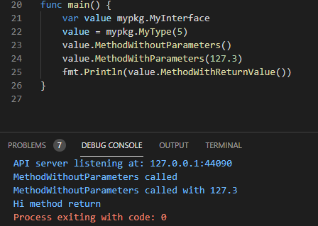
## 구체 타입, 인터페이스 타입  
```
이전 까지는 구체 타입이었다.
구체타입은 어떤 값이 무엇을 할 수 있는지뿐만 아니라 그 값이 무엇인지 또한 정의함
즉, 구체 타입에서는 값의 데이터가 저장될 기본타입을 지정함

하지만 인터페이스 타입은 값이 무엇인지는 기술하지 않음
기본타입이 무엇인지, 값이 어떻게 저장되는지는 아무런 정보도 기술하지 않으며
값이 무엇을 할 수 있는지만 기술함
즉, 메서드를 가지고 있는지만 기술할 뿐임 
```
## 인터페이스를 만족하는 타입 할당하기  
```go
package main

import "fmt"

type Whistle string

func (w Whistle) MakeSound() {
	fmt.Println("Tweet!")
}

type Horn string

func (h Horn) MakeSound() {
	fmt.Println("Honk!")
}

type NoiseMaker interface {
	MakeSound()
}

func main() {
	var toy NoiseMaker
	toy = Whistle("Toyco Canary")
	toy.MakeSound()
	toy = Horn("Toyco Blaster")
	toy.MakeSound()
}
```
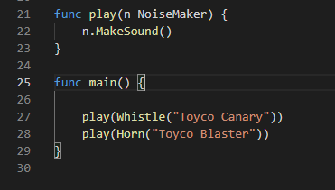
## 인터페이스에 정의된 매서드만 호출 할 수 있음  
```
인터페이스 타입의 변수에 값을 할당하고 나면 
해당 값에서는 인터페이스에 정의된 매서드만 호출 할 수 있음
```
```go
package main

import "fmt"

type Whistle string

func (w Whistle) MakeSound() {
	fmt.Println("Tweet!")
}

type Horn string

func (h Horn) MakeSound() {
	fmt.Println("Honk!")
}

type Robot string

func (r Robot) MakeSound() {
	fmt.Println("Beep Boop")
}

func (r Robot) Walk() {
	fmt.Println("Powering legs")
}

type NoiseMaker interface { // MakeSound 메서드를 가진 모든 타입 표현
	MakeSound()
}

func play(n NoiseMaker) {
	n.MakeSound()
	n.Walk()
}

func main() {

	play(Whistle("Toyco Canary"))
	play(Horn("Toyco Blaster"))
}

```
```
현재 이렇게 하면 동작을 제대로 하지 않는다 이유는 당연한것지만 
Robot은 Walk매소드를 가지고 있지만 
play 함수로 전달하는 값은 Robot 타입이 아닌 
NoiseMaker 타입이기 때문에 그렇다.

어떤 변수가 특정 인터페이스 타입으로 선언되었을 때 
해당 변수에서 확실히 호출 할 수 있다고 보장할 수 있는 메서드는 인터페이스에 정의된
매서드 밖에 없다.
즉, Go의 인터페이스 변수에서는 인터페이스에 정의된 메서드의 호출만 허용됨
```
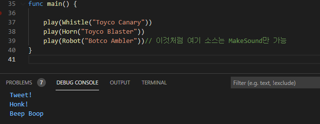
## 인터페이스를 사용해 playList 함수 수정하기  
```
먼저 main 패키지에서 Player라는 인터페이스를 선언
(gadget 패키지에서 선언할 수 있지만 직접 사용하려는 위치와
동일한 패키지에서 인터페이스를 정의하면 유연성이 좀더 향상 됨)

인터페이스는 string 타입의 매개변수를 받는 Play 메서드와 매개변수가 없는 Stop
메서드를 갖도록 정의

이는 TapePlayer 및 TapeRecorder 두 타입 모두 player인터페이스를 만족함을 의미

그리고 playList함수는 TapePlayer에 한정된 값이 아닌 
Player인터페이스를 만족하는 모든 값을 받을 수 있도록 수정해줌

player 변수의 타입도 마찬가지로 TapePlayer에서 Player로 수정
```
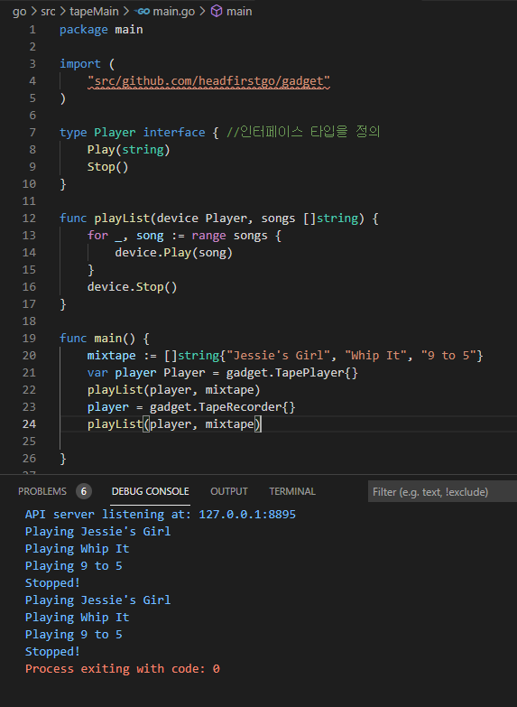
- **연습 문제**  
```go
package main

import "fmt"

type Car string

func (c Car) Accelerate() {
	fmt.Println("Speeding up")
}
func (c Car) Break() {
	fmt.Println("Stopping")
}
func (c Car) Steer(direction string) {
	fmt.Println("Turning", direction)
}

type Truck string

func (t Truck) Accelerate() {
	fmt.Println("Speeding up")
}

func (t Truck) Break() {
	fmt.Println("Stopping")
}

func (t Truck) Steer(direction string) {
	fmt.Println("Turning", direction)
}

func (t Truck) LoadCargo(cargo string) {
	fmt.Println("Loading", cargo)
}

/*
 to do sth...
*/
func main() {
	var vehicle Vehicle = Car("VW Golf")
	vehicle.Accelerate()
	vehicle.Break()
	vehicle.Steer("left")

	vehicle = Truck("Benz 5t")
	vehicle.Break()
	vehicle.Steer("right")
}
```
```
to do something 부분에 작성해서 
결과적으로 
Speeding up
Turning left
Stopping
Turning right
나오게 해보자.

type Vehicle interface {
	Accelerate()
	Break()
	Steer(string)
}

이렇게 인터페이스 선언을 해주면 된다.
```
## 타입 단언  
```
TapePlayer와 TapeRecorder 타입의 여러 메서드를 테스트하기 위해 
TryOut이라는 새로운 함수를 정의하자

TryOut은 Player 인터페이스 타입의 단일 매게변수를 가지고 있어서
TapePlayer 또는 TapeRecorder 타입의 값을 전달 할 수 있음

TryOut에서는 Player 인터페이스의 일부인 Play 및 Stop 메서드를 호출
그리고 Play 인터페이스에는 없고  TapeRecorder 타입에만 정의된 
Record 메서드 또한 호출하고 있음

현재는 TryOut에 TapeRecorder 타입에만 정의된 Record 메서드 또한 호출 한다.
TryOut에 TapeRecorder 타입의 값만 전달하고 있으니 괜찮을 것 같은데 아니다.

앞서 구체 타입의 값을 인터페이스 타입의 변수에 할당하면
(변수에는 함수의 매게 변수도 포함) 
구체 타입이 무슨 메서들르 가지고 있든지 해당 변수에서는 인터페이스의 일부로 
정의된 메서드만 호출 할 수 있다고 배움 
TryOut함수는 TapeRecorder(구체타입)의 값이 아닌  Player(인터페이스 타입)의
값을 사용하고 있음
그리고 Play 인터페이스는 Record 메서드를 가지고 있지 않다.
```
```go
메인문에 
func TryOut(player Player) {
	player.Play("Test Track")
	player.Stop()
	player.Record()
}
type Player interface { //인터페이스 타입을 정의
	Play(string)
	Stop()
}
func main(){
	TryOut(gadget.TapeRecorder{})
}
이렇게 두개 있는데 현재 Player에 인터페이스 일부가 아닌 Record는 실행 할수 없다는말

따라서 인터페이스 타입의 값으로 부터 Record 메서드를 가진 구체 타입의 값을
다시 가져오는 방법이 필요

이걸 해결해보기 위해서
Player 값을 TapeRecorder 값으로 변환하는 타입 변환을 시도 해 볼것
하지만 타입 변환은 인터페이스 타입에는 사용할 수 없기 때문에 에러 생김

func TryOut(player Player) {
	player.Play("Test Track")
	player.Stop()
	recorder := gadget.TapeRecorder(player)
	recorder.Record()
}
//타입변환을 하면되지만 인터페이스의 경우에는 동작하지 않고 에러가 발생

그렇다면 타입단언이란 무엇일까?
```
```
구체 타입의 값이 인터페이스 타입의 변수에 할당 되었을때 타입단언을 사용하면
구체 타입의 값을 가져올 수 있음
이것이 일종의 타입 변환이다. 

문법은 심지어 매서드 호출과 타입 변환을 섞어 놓은 것처럼 보인다.
무튼, 인터페이스 값 다음에 함께 구체 타입이 괄호로 감싸여 따라옴
정확히는 이를 값이 구체 타입이 무엇인지 주장 혹은 단언한다고 함
```
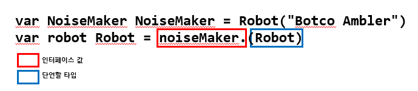
```
의미를 풀자면 이변수가 NoiseMaker 인터페이스 타입인 건 알지만, 
이 NoiseMaker 값이 실제로는 Robot 타입의 값이라는 것을 확신할 수 있음 이라는 것

타입단언을 사용해 구체 타입의 값을 가져오고 나면 
인터페이스에는 정의되지 않았지만 해당 구체 타입에는 정의되어 있는 메서드를 호출 가능

```
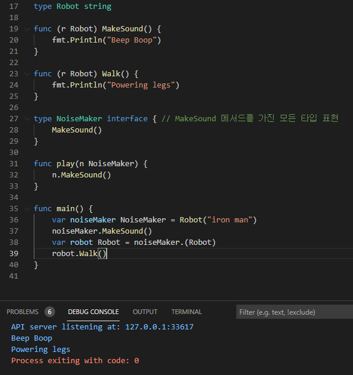
```
robot.Walk()
를 보면 알듯이 인터페이스가 아닌 구체 타입위에 정의된 메서드를 호출한다.
```
## 타입 단언 실패  
```
타입 단언을 선언해서 Record메서드를 호출 해보자
```
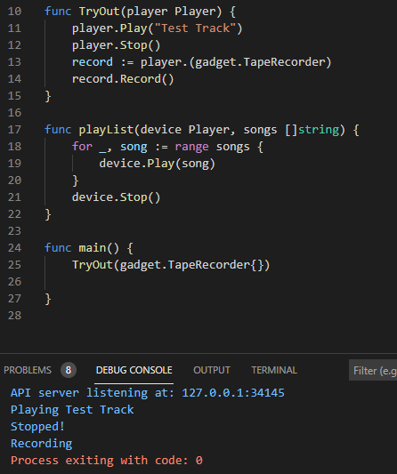
```
이렇게 타입 변환이 아니라 타입 단언을 이용해서 record를 메소드를 실행했다
그렇다면 
main문에 TryOut(gadget.TapePlayer{})하면 어떻게 될까 
컴파일은 성공을 하겠지만 런타임 패닉이 발생한다.
타입 단언이 선언되어 있으니 형식이 맞지 않으니 실패하는 것이다.
```
## 타입 단언 실패 시 패닉 방지하기  
```
하나의 반환 값을 받는 컨텍스트에서 타입 단언문을 사용하는 경우, 원래 타입과
단언하려는 타입이 일치하지 않으면 프로그램은 런타임 도중 패닉에 빠짐
예외 처리를 해주면 되는데 
여기서는 main 문에 패닉 발생하면 스트링 문장을 출력하게 했다.
	var player Player = gadget.TapePlayer{}
	recorder, ok := player.(gadget.TapeRecorder)
	if ok {
		recorder.Record()
	} else {
		fmt.Println("Player Was not a TapeRecorder")
	}
```
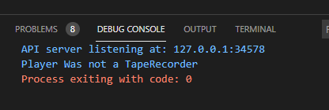
## 타입 단언으로 TapePlayers 및 TapeRecorders   타입 확인  
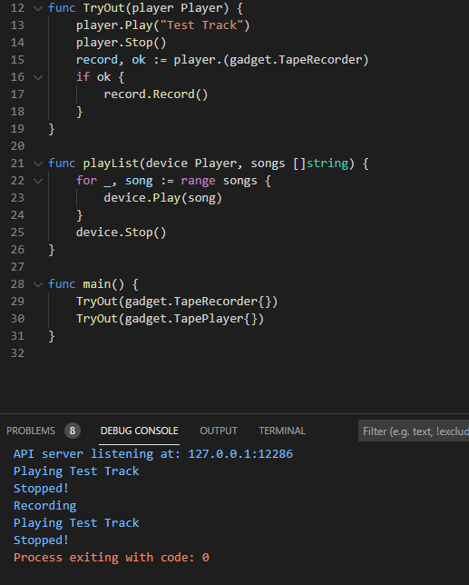
```
타입 단언을 통해서 두개의 경우에도 제대로 작동을 한다.
```
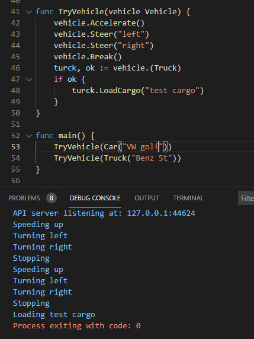
## error 인터페이스  
```
3장에서 에러 값을 만드는 방법을 배울 때
에러 값은 문자열을 반환하는 Error 라는 메서드를 가진 값이다라고 한적이 있다.
기억 안나도 상관은 없지만
err := fmt.Error("a height of %0.2f is invalid",-2.33333)
fmt.Println(err.Error())
fmt.Println(err)
이것도 특정 메서드를 가진 모든 값을 내포하는 타입이라 인터페이스의 일종이다.

type error interface{
	Error() string
}

아래 처럼 간단히 정의된 ComedyError  타입은 문자열을 반환하는 
Error 메서드를 가지고 있기 때문에 
error 타입의 값이 필요한 모든 곳에서 사용할 수 있음
```
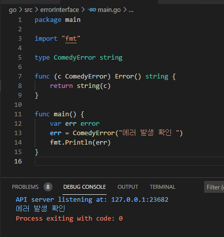
```
 에러 값이 필요함과 동시에 단순 에러 메시지 이상의 많은 정보를 추적해야 하는 경우에는
 error 인터페이스를 만족하면서 원하는 정보를 저장할 수 있는 타입을 만들면됨
```
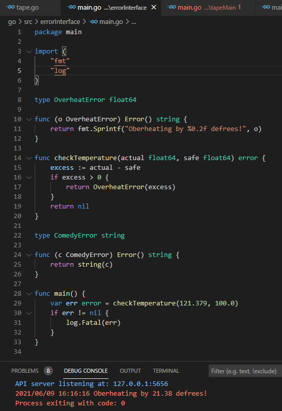
## Stringer 인터페이스  
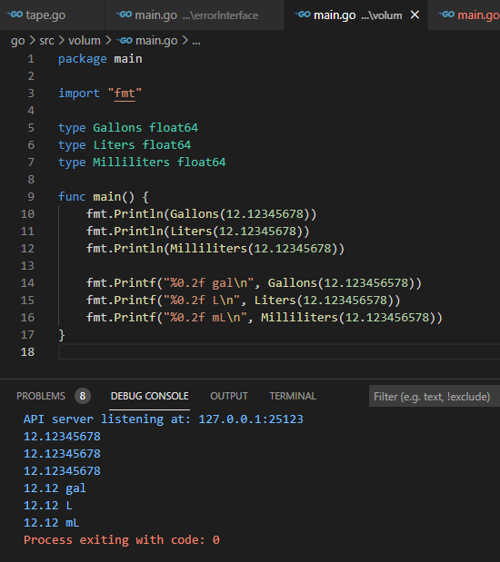
```
위의 예시를 보면 다른 것이지만 출력은 같고 
소수점도 너무 많아서 출력시 볼때 불편해서 
printf로 단위도 출력하고 소수점도 줄였다. 하지만 
이런 약어를 추가할 수 있지만 매번 같은 코드를 작성하는 것이 매우 번거롭다.

이와 같은 상황을 위해서 사용되는 것이 
fmt.Stringer 라는 인터페이스이다.
이 인터페이스를 사용하면 특정 타입의 출력 형식을 직접 지정할 수 있고,
문자열을 반환하는 String() 메서드만 정의하면 만족할 수 있다.
```
## Stringer 인터페이스 정의   
```
type Stringer interface{
	String() string
}
// 문자열을 반환하는 String 매서드를 가진 모든 타입은 
fmt.Stringer 인터페이스를 만족함
```
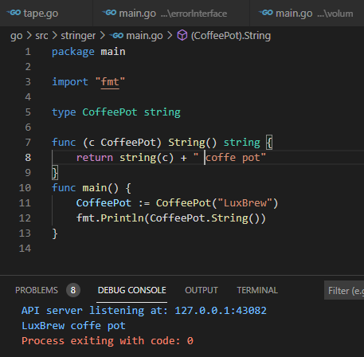
```
fmt 패키지의 많은 함수가 전달된 값이 Stringer 인터페이스를 만족하고 있는지 확인하고
만족하면 String 메서드를 호출
여기에는 Print, Println, Printf 함수도 포함
CoffePot 타입은 Stringer 인터페이스를 만족하고 있으므로 
CoffePot 값을 이 세 함수에 직접 전달 할 수 있고, 
값을 출력할 때 CoffePot의 String 매서드의 반환 값을 사용
```
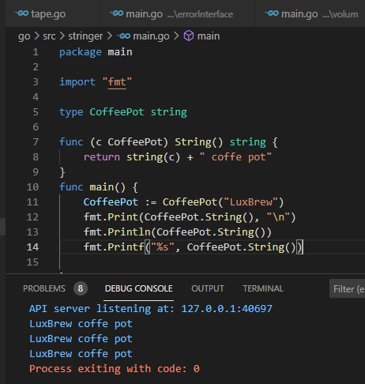
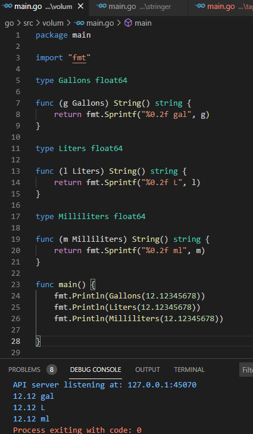
## 빈 인터페이스  
```
지금 까지 다 특정값만 가능했는데
fmt.Println()의 경우는 어떻게 모든 타입의 값을 받을 수 있는가?
fmt.Println(3.14, "string", true)
위와 같이 부동 소수점, 문자열, 부울값을 받는데 
```
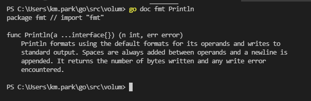
```
이전에 학습 했듯이 ...은 함수가 임의 개수의 매개변수를 받을 수 있는
가변 인자 함수임을 나타냄
interface{} 타입은 무엇이냐면?

우선 인터페이스 선언은 해당 인터페이스를 만족시키기 위해 타입이 가져야하는 메서드지정
NoiseMaker interface{
	MakeSound()
}
NoiseMaker 인터페이스는 MakeSound 메서드를 가진 타입이면 만족했음
매서드가 필요없는 경우
type Anything interface{
}
이 경우는 모든 타입이 이 인터페이스를 만족할 수 있게됨
위의 경우를 빈 인터페이스라고 한다.
따라서, 빈 인터페이스 타입의 매개변수를 받는 함수를 선언하면 인자로 
모든 타입의 값을 전달할 수 있음

func AcceptAnything(thing interface{}){
}

func main(){
	AcceptAnything(3.14579)
	AcceptAnything("String")
	AcceptAnything("true")
	AcceptAnything(Whistle("T C"))
}
```
```
그렇다고 해서 무작정 모든 매개변수에 인터페이스 타입을 사용은 하지 않는게 좋다.
빈 인터페이스 타입의 값으로는 할 수 있는게 많지 않다고 한다.
fmt 패키지의 함수 대부분은 빈 인터페이스 값을 허용한다. 
그래서 AcceptAnything 함수의 매게변수값을 전달할 수 있음

func AcceptAnything(thing interface{}){
	fmt.Println(thing)
}
func main(){
	AcceptAnything(3.141592)
	AcceptAnything(Whistle("T C"))
}
하지만 빈 인터페이스 값에서는 아무 메서드도 호출 할 수 없다.
즉, 인터페이스 타입의 값을 가진 값에서는 인터페이스에 정의된 메서드만 호출 가능
단 빈 인터페이스는 메서드가 없어서 어떤 메서드도 호출 할 수 없다.
그러니까
func AcceptAnything(thing interface{}){
	fmt.Println(thing)
	thing.MakeSound()//이런것 차제가 불가능한것이다.
}

빈인터페이스에서 매서드를 호출하려면 먼저 타입 단언으로 구체 타입의 값을 가져와야함

func AcceptAnything(thing interface{}){
	fmt.Println(thing)
	//thing.MakeSound()는 안된다.
	whistle, ok : = thing.(Whistle)
	if ok{
		whistle.MakeSound()
	}
}
```
```
여기까지 보면 빈 인터페이스 타입이 아닌 
특정 구체 타입의 값만 받는 함수를 작성하는게 좋다.
```
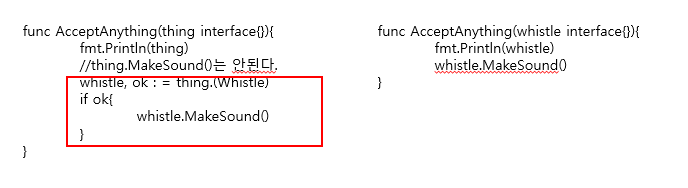
```
위와 같이 코드를 단순화 시킬 수 있고 타입변환이 필요가 없습니다.
```