## 2021년 06월09일 golang 캡슐화와 임베딩  
```
잘못된 데이터로부터 구조체 타입의 필드를 보호하기 위한 캡슐화
캡슐화를 사용하면 데이터 필드를 좀 더 안전하게 다룰 수 있음

그리고 구조체 타입에 다른 타입을 임베드할 수 있는 방법도 알아 보자.
우리가 만든 타입에 필요한 매서드가 이미 다른 타입에 정의 되어 있는 경우
메서드 코드를 복사 붙여넣기 할 필요없이
해당 타입을 임베딩하면  마치 직접 정의한 것 처럼 사용 가능
```
## Data 구조체 타입 만들기  

## 사용자가 Data 구조체 필드에 잘못된 값을 넣는 경우  
```
현재 위에 소스에 0이나 -999 값을 넣어도 동작을 한다. 
이게 원래 년도나 월이나 일인경우 유효한 숫자가 있는데
이때 필요한 것은 사용자가 입력한 값을 저장하기 전에
먼저 유효성을 확인하는 일이다.

컴퓨터사이언스에서 이를 가리켜 데이터 유효성 검증 이라고 함
```
## 설정자 메서드  
```
구조체 타입은 또 다른 사용자 정의 타입으로 다른 사용자 정의 타입과 
마찬가지로 메서드를 정의할 수 있음

Data 타입의 각 필드에 적절한 값을 설정하기 위해 
값을 검증하기 위한 SetYear, SetMonth, SetDay 메서드를 추가해 보자.
```

## 나머지 설정자 메서드 추가하기  
```
나머지 SetMonth, SetDay를 구현해보자.
```
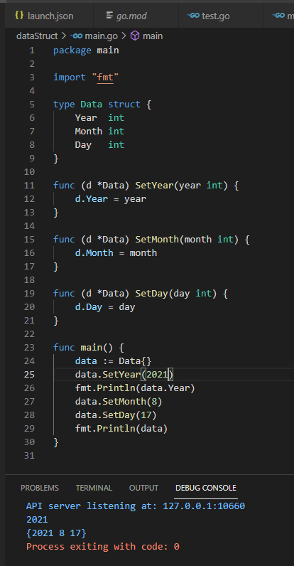
```
이렇게 했다고 해도 0이나 - 값을 예외로 할 수는 없다. 
```
## 설정자 메서드에 유효성 검증 추가하기  
```
설정자 메서드에 데이터 유효성 검증 로직을 추가하려면
각 설정자 메서드에서 전달받은 값이 유효한 범위 내에 속하는지 확인

유효 범위 내에 속하지 않은 경우 error 반환
유효한 경우 Data 구조체 필드에 값을 저장한 뒤 nil에러 반환 하면됨

조건은 메서드 블록에서는 전달 받은 year 매개변수의 값이 1보다 작은지 
검사해서 1보다 작으면 invalid year 메세지 에러 반환

err가 nil이 아니면 잘못 전달 된거라 에러 보고후 종료
```
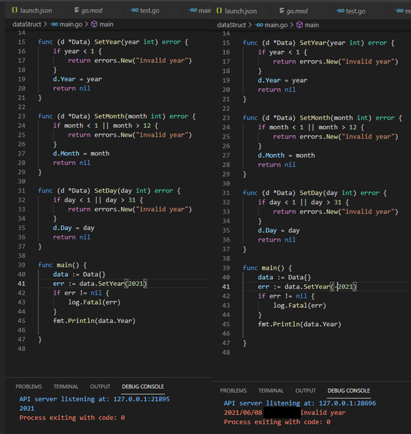
## 필드에 잘못된 값이 들어갈 여지가 있는 경우  
```
사용자가 설정자 메서드를 사용하는 경우에는
유효성을 검증할 수 있지만, 구조체 필드에 값을 직접 설정하는 
사용자가 있는 경우 잘못된 값이 들어오는 경우가 생김

구조체 필드를 직접 설정하는 경우 오류를 막을 방법이 없다. 
Data 타입을 사용하는 사용자가 설정자 메서드를 통해서만 필드를 설정할 수 
있도록 필드를 보호하는 방법이 필요.
	data = calendar.Data{Year: 0, Month: 0, Day: -2}
이렇게 선언하면 에러된 값도 들어간다는 소리

약간 자바로 따지면 은닉화와 비슷한것 같다. private로 해서 내부접근만 허용하는것

여기서 방법은 Data타입을 별도 패키지로 분리하고 
다음 필드를 모두 노출시키지 않는것이다.
```
## Data 타입 별도 패키지로 옮기기  
```
Go 작업 공간에 headfirstgo 디렉터리에 calendar 패키지를 저장하고 doat.go
파일을 생성하자.
```
## data.go  
```go
package calendar

import (
	"errors"
)

type Data struct {
	Year  int
	Month int
	Day   int
}

func (d *Data) SetYear(year int) error {
	if year < 1 {
		return errors.New("invalid year")
	}
	d.Year = year
	return nil
}

func (d *Data) SetMonth(month int) error {
	if month < 1 || month > 12 {
		return errors.New("invalid year")
	}
	d.Month = month
	return nil
}

func (d *Data) SetDay(day int) error {
	if day < 1 || day > 31 {
		return errors.New("invalid year")
	}
	d.Day = day
	return nil
}
```
## main.go  
```go
package main

import (
	"fmt"

	"src/github.com/headfirstgo/calendar"
)

func main() {
	data := calendar.Data{}
	data.Year = 2019
	data.Month = 8
	data.Day = 20
	fmt.Println(data)

	data = calendar.Data{Year: 0, Month: 0, Day: -2}
	fmt.Println(data)
}
```
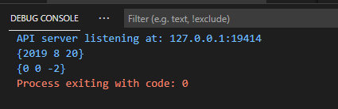
## Data 필드 숨기기  
```
필드 정의에서 모든 필드명의 첫문자를 소문자로 변경해 주기만 하면됨
```
## date.go 파일  
```go
package calendar

import "errors"

type Data struct {
	year  int
	month int
	day   int
}

func (d *Data) SetYear(year int) error {
	if year < 1 {
		return errors.New("invalid year")
	}
	d.year = year
	return nil
}

func (d *Data) SetMonth(month int) error {
	if month < 1 || month > 12 {
		return errors.New("invalid year")
	}
	d.month = month
	return nil
}
func (d *Data) SetDay(day int) error {
	if day < 1 || day > 31 {
		return errors.New("invalid year")
	}
	d.day = day
	return nil
}
```
## main.go 파일  
```go
package main

import (
	"fmt"

	"github.com/headfirstgo/calendar"
)

func main() {
	date := calendar.Data{}
	date.year = 2019
	date.month = 14
	date.day = 50
	fmt.Println(date)

	date = calendar.Data{year: 0, month: 0, day: -2}
	fmt.Println(date)
}
```
```
사실 이렇게 하면 필드에 직접 접근하면 컴파일 에러를 발생합니다.
이는 필드에 값을 직접 설정할 때나 구조체 리터럴을 사용할 때도 마찬가지임

하지만 간접적으로는 접근할 수 있다. 
노출되지 않은 변수, 구조체 필드, 함수, 메서드등은 동일한 패키지의 
노출된 함수 및 메서드를 통해 접근할 수 있음

즉, main 패키지 코드의 Date값에서 노출된 SetYear 메서드를 호출시
필드는 비록 패키지 외부로 노출되지 않았더라도 
SetYear가 Data 구조체의 year 필드를 변경할 수 있음
```
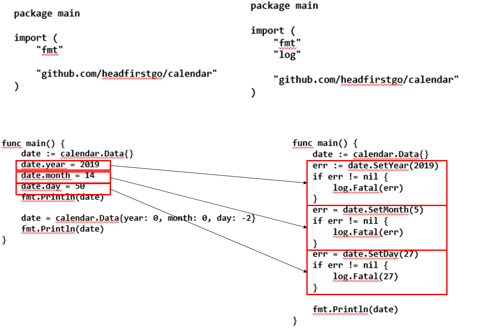
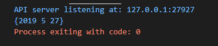
```
위에 메인처럼 직접 접근하지 않고 간단히 설명하면 메소드를 통해서 
간접으로 접근은 허용 하겠다라는 의미이다.
```
## 노출된 메서드를 통해 숨겨진 필드에 접근 2  
```
혹시나 잘못된 값을 전달을 하게 되면 어떻게 호출이 될까?
아래와 같이 나오게 된다. 그럼 실수로 잘못된 값이 입력이되지 않도록 
프로그램을 보호 할 수 있다.

이런것의 포인트는 잘못된 값을 변경했을때 컴파일자체로 에러가 생겨야하는데
그런 에러가 생기지 않아서 자체적으로 이상하게 오류를 찾기 힘들기 때문에
자바로 말하면 은닉화가 필요한 부분이다.
즉 외부에서 접근해서 변경하는 것은 허용 못하고 
내부적으로 클래스에 접근해서 . 으로 내부에서 접근하는것을 허용해줄게 같은 느낌?
```
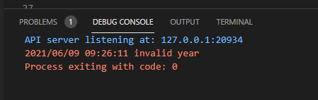
```
설정자 메서드를 통해 calendar 패키지의 노출되지 않은 필드를 설정할 수 있지만
필드 값을 가져오는 메서드는 아직 없음
```
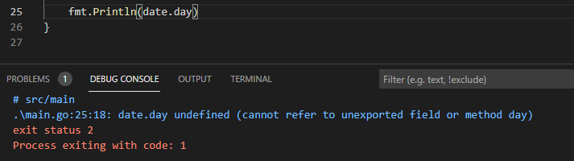
```
하지만 위처럼  date.year 또는 date.month, date.day 이렇게 해서 접근하면 
위와 같은 에러 메세지가 나오는데 필드가 노출되지 않았기 때문에 발생하는 에러이다.
```
## 접근자 메서드  
```
-설정자 메서드- 
구조체의 필드 또는 변수의 값을 설정하는 것이 주요 목적인 메서드

-접근자 메서드-
마찬가지로 구조체의 필드 또는 변수의 값을 가져오는 것이 주요 목적인 메서드
```
-  **설정자 메서드**  
```
설정자 메서드경우 매우 간단히 구현할 수 있는데 필드의 값을 반환해 주기만 하면됨
```
```
컨벤션에 따라 보통 접근자 메서드의 이름에는
접근하고자 하는 필드나 변수의 이름과 동일한 이름을 사용
하지만 메서드는 외부에서 접근할 수 있어야하므로 대문자로 시작
```
- **접근자 메서드**  
```
리시버의 값을 변경할 일이 없기 때문에 
리시버로 Date값을 사용해도 됨 

하지만 메서드 중 하나라도 포인터 리시버를 사용하고 있는 경우에는 일관성 유지를 위해
모든 리시버에 포이터 리시버를 사용하고 있어서 
접근자 메서드에도 포인터 리시버를 사용하겠음
```
```
func (d *Date) Year() int {
	return d.year //이런식으로 필드값을 반환하면되
}
	fmt.Println(date.Year())
	fmt.Println(date.Month())
	fmt.Println(date.Day())
위와 같이 설정자 메서드를 생성해 놓으면 메인문에서 개별적으로 필드에 접근할 수 있다.
```
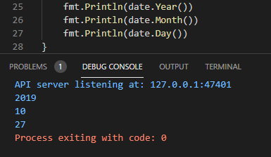
## 캡슐화   
```
프로그램의 한 영역에 있는 데이터를 다른 코드로부터 숨기는 것을 캡슐화라고 함
캡슐화는 잘못된 데이터로 부터 코드를 보호하는 데 사용할 수 있기 때문에 중요

또한 직접 접근할 수 없기 때문에 캡슐화된 영역을 수정할 때 다른 코드에 미치는
영향에 대해서도 걱정할 필요 없음

다른 언어에서는 데이터를 클래스 내에서 캡슐화 하지만
Go에서는 유사한 개념이지만 데이터 패키지 내에서 캡슐화하며
노출되지 않은 변수, 구조체 필드, 함수 및 메서드를 사용해 구현 함

다른 언어는 직접 접근해도 괜찮은 경우임에도 모든 필드에 대해 접근자 및 설정자를 
정의하는 정의하는 게 컨벤션인 경우도 있음

Go에서는 필드 데이터의 유효성 검증이 필요한 경우와 같이 
꼭 필요한 경우에만 캡슐화를 사용하는 경향이 있다.
```
- **연습문제**  
## geo.go 파일  
```go
package geo

import "errors"

type Coordinates struct {
	latitude  float64
	longitude float64
}

func (c *Coordinates) Latitude() float64 {
	return c.latitude
}

func (c *Coordinates) Longitude() float64 {
	return c.longitude
}

func (c *Coordinates) SetLatitude(latitude float64) error {
	if latitude < -90 || latitude > 90 {
		return errors.New("invalid latitude")
	}
	c.latitude = latitude
	return nil
}

func (c *Coordinates) SetLongitude(longitude float64) error {
	if longitude < -180 || longitude > 180 {
		return errors.New("invalid longitude")
	}
	c.longitude = longitude
	return nil
}
```
## main.go  
```
package main

import (
	"fmt"
	"log"
	"src/geo"
)

func main() { //익명 구조체 사용 후
	coordinates := geo.Coordinates{}
	err := coordinates.SetLatitude(37.42)
	if err != nil {
		log.Fatal(err)
	}
	err = coordinates.SetLongitude(-1122.08)
	if err != nil {
		log.Fatal(err)
	}
	fmt.Println(coordinates.Latitude())
	fmt.Println(coordinates.Longitude())
}
```
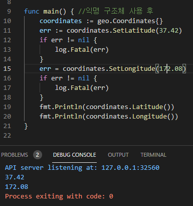
## Event 타입에 Data 타입 임베딩하기  
```
일정 정보에 제목을 추가하고 싶다면?
이전에 Address 타입을 외부 구조체 내에 익명 필드로 선언해서 임베딩했던것 처럼
하면된다. 우선 calendar 부분에 event.go를 생성해봅시다.
```
```go
package calendar

import "errors"

type Data struct {
	year  int
	month int
	day   int
}

이렇게 있는 Data를
package calendar

type Event struct {
	Title string
	Data  //데이트타입을 입베딩
}
event.go 에서 익명으로 임베딩하고
main에서 
package main

import "src/github.com/headfirstgo/calendar"

func main() {
	event := calendar.Event{}
	event.month = 5
}
// 하면 아마도 Data의 노출되지 않은 필드는 Event 타입으로 승격되지 않아 에러 생김
이걸 
event.Data.year = 2019 해도 에러가 생길것이다.
```
## 필드와 마찬가지로 노출된 메서드도 승격됨  
```
구조체 타입에 노출된 메서드를 가진 타입을 임베딩하면 
임베딩된 타입의 메서드는 외부 타입으로 승격되고,
승격된 메서드는 마치 외부 타입에서 정의된 것 처럼 호출 할 수 있음
```
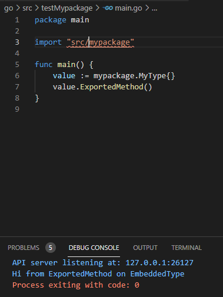
```go
package mypackage //아래 타입은 별도의 패키지에 속함

import "fmt"

type MyType struct {
	EmbeddedType //임베딩
}
type EmbeddedType string //임베딩할 타입을 선언

func (e EmbeddedType) ExportedMethod() { // 이 메서드는 MyType으로 승격
	fmt.Println("Hi from ExportedMethod on EmbeddedType")
}
func (e EmbeddedType) unexportedMethod() { //이 메서드는 승격 X

}
```
```
Date 타입의 필드는 노출되지 않기 때문에 Event 타입으로 승격되지 않지만,
Data 타입의 접근자 및 설정자 메서드는 노출되기 때문에 Event 타입으로 승격

즉, Event 값에서 Date 타입의 접근자 및 설정자 메서드를 사용할 수 있음을 의미
```
```go
package main

import (
	"fmt"
	"log"

	"src/github.com/headfirstgo/calendar"
)

func main() {
	event := calendar.Event{}
	err := event.SetYear(2019)
	if err != nil {
		log.Fatal(err)
	}
	err = event.SetMonth(10)
	if err != nil {
		log.Fatal(err)
	}
	err = event.SetDay(27)
	if err != nil {
		log.Fatal(27)
	}

	fmt.Println(event.Year())
	fmt.Println(event.Month())
	fmt.Println(event.Day())

	fmt.Println(event.Data.Year())
	fmt.Println(event.Data.Month())
	fmt.Println(event.Data.Day())

}
```
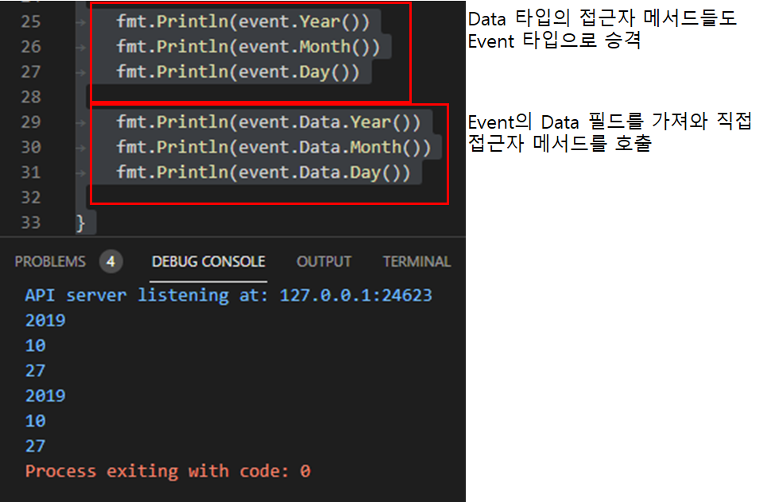
## Event 타입의 Title 필드 캡슐화 하기  
```
Event 구조체의 Title 필드는 노출되었기 때문에 직접 접근 가능
그래서 
func main(){
	event := calendar.Event{}
	envet.Title = "chicken"
	fmt.Println(event.Title)
}
```
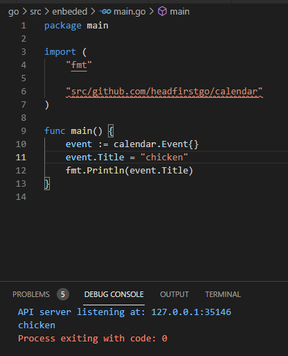
```
아래는 캡슐화 해서 유효성 검증을 추가해보자.
다음은 캡슐화를 적용한 수정된 Event타입이다.

필드가 노출되지 않도록 title로 하고 
접근자오 설정자 메서드를 추가하고 
설정자 메서드에서는 길이를 제한하기 위해 unicode/utf8 패키지의 
RuneCountInString 함수를 사용 해보자.
```
```go
package calendar

import (
	"errors"
	"unicode/utf8"
)

type Event struct {
	title string
	Data  //데이트타입을 입베딩
}

func (e *Event) Title() string { //접근자 메서드
	return e.title
}
func (e *Event) SetTitle(title string) error {
	if utf8.RuneCountInString(title) > 30 {
		return errors.New("invalid title")
	}
	e.title = title
	return nil
}
```
## 승격된 메서드는 외부 타입의 메서드와 공존  
```
title 필드에 대한 설정자와 접근자 메서드를 추가 했고,
30자 보다 길다면 에러가 발생한다.
```
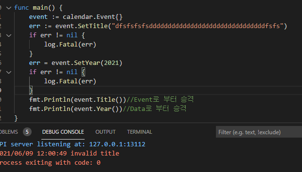

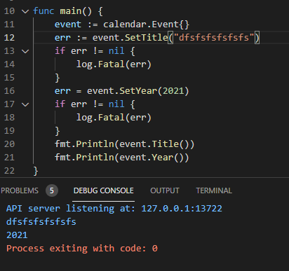

