## 2021년 06월10일 Unit Test  
# 1. 개요
## 학습 목표  
```
단위 테스트 환경을 구축할 수 있음
단위 테스트 작성을 위해 3A(Arrange, Act, Assert) 패턴 이해
단위 테스 작성 방법 이해
```
## 단위 테스트란?  
```
컴퓨터 프로그래밍 에서 소스 코드의 특정 모듈이 의도된 대로 
정확히 작동하는지 검증하는 절차

모든 함수, 메소드에 대한 테스트 케이스를 작성하는 절차
코드 변경으로 문제 생겨도 단시간 내에 이를 파악하고 해결 가능

모든 테스트가 클래스의 public 인터페이스로 왕복 테스트를 하는 
완전 자동테스트 여야함

각 테스트는 하나의 시나리오에 하나의 메소드 혹은 객체만 실행되게 함

이상적으로 각 테스트 케이스는 서로 분리 되어야 하고,
이를 위해 모의 객체를 생성함 
```
## 왜 배우고 테스트 자동화의 목표는 무엇인가?  
```
구현 코드는 기본적으로 테스트 자동화 되어야하고
단위 테스트 작성을 통해 테스트 가능한 코드가 무엇인지 알 수 있다.

- 품질향상에 도움
- 테스트 대상 시스템을 이해하는데 도움이되어야함
- 실행하기 쉬움
- 유지하기 쉬워야함
- 시스템 발전해 나감에 따라 필요한 유지 보수 비용이 최소화 되어야함
```
## 자동 단위 테스트에 대한 투자 수익이 좋은 프로젝트  
```
전체 비용이 줄어드는 비용 - 효과 절충을 볼수 있다.
```
## 자동 단위 테스트에 대한 투자 수익이 나쁜 프로젝트  
```
전체 비용이 늘어나는 비용 - 효과 절출을 볼 수 있다.
처음에는 새로운 기술과 실천 방법을 배우는 비용이 발생
하지만 한번 고비를 넘고 나면 추가적으로 드는 비용 전부를 이득으로 벌충할 수 있는
안정적이 상태에 도달
```
## TDD란?  
```
Test Driven Development (테스트 주도 개발)
테스트를 먼저 만들고 테스트를 통과하기 위한 것을 짜는것,
만드는 과정에서 우선 테스트를 작성하고 그것을 통과하는 코드를 만드는 것을 
반복하면서 제대로 동작하는지에 대한 피드백을 적극적으로 받는것
정확한 프로그래밍 목적을 디자인 단계에서 반드시 미리 정의해야만 한다.
```
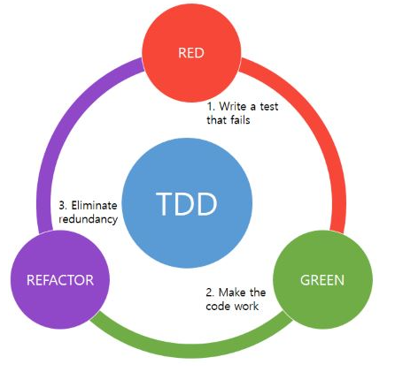
```
Red 는 실패하는 테스트를 만들기
GREEN은 테스트에 통과할 만한 작은 코드를 작성
REFACTOR은 반복되는 코드, 긴 메서드, 긴 클래스, 긴 매개변수 목록 등 
좀 더 효율적으로 바꾸기
```
## TDD 5단계 방법론  
```
1단계 : 입력과 출력 결정하기 
2단계 : 함수 시그니처 선택하기 - 매개변수와 반환값 결정
3단계 : 기능상 아주 작은 하나의 관점으로 판단하기 
- 목표로 가기위해 최대로 간단한 동작 생각하기
4단계 : 테스트 구현
5단계 : 코드 구현
```
## xUnit  
```
NUnit 코어 개발자가 독립해서 만듦
그전보다 작고 빠르고 단순하다.
```
# 2. 단위 테스트 프로젝트 만들기  
```
1. 단위 테스트 기본 환경 구축 , 단위 테스트 작성하고 비주얼과 콘솔에서 테스트
2. 영어문장쓰듯 Assert구문을 구현

두가지 프로젝트 진행하자.
```
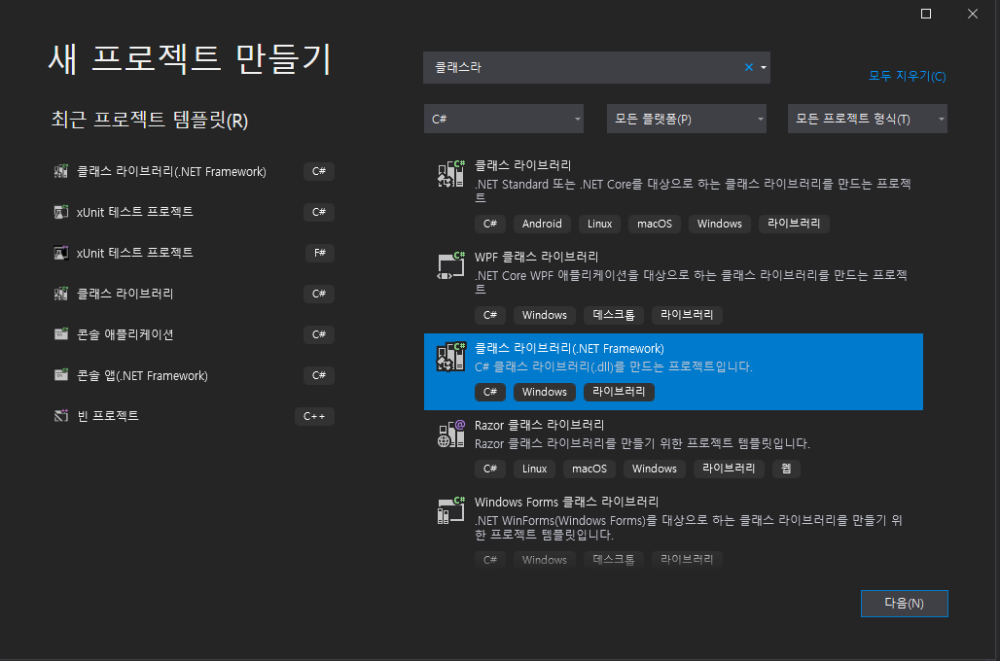
```
.NET Framework 로 해서 
Unit1.Tests라고 만들어봅시다.
단위 테스트 프로젝트 이름은 반드시 .Tests 접미사를 사용
```
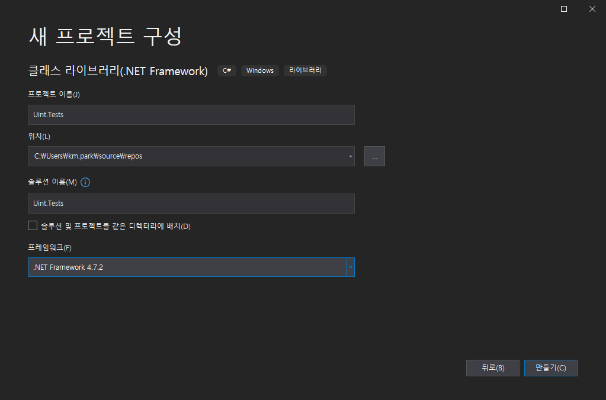
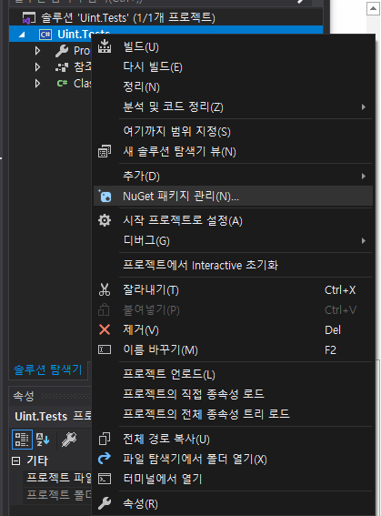
```
우선 NuGet 패키지 관리를 들어갑니다.
3가지를 설치할것입니다.

xuint 
xuint runner visualstudio
xuint runner console

그대신 이거 버전은 맞춰주세요.
```
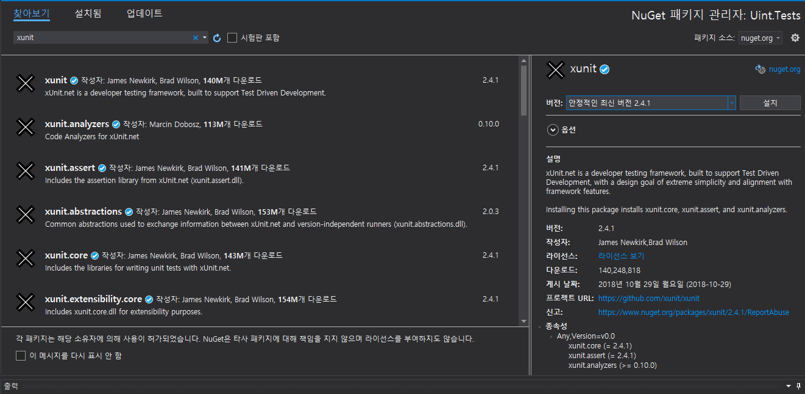
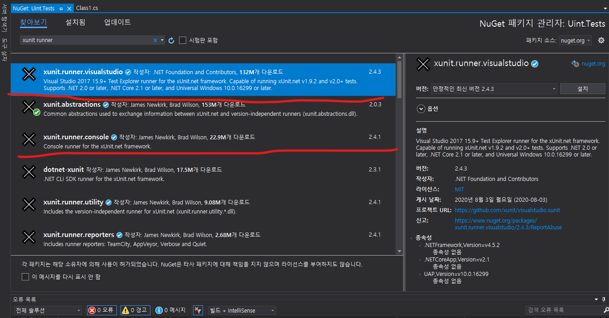
## 일단 클래스 추가
```
일단 일단적인 소스가 구현된 cs 파일하나더 생성 
이름은 Unit로 하고 .NeT프레임워크인 클래스라이브러리로 생성하자

using System;
using System.Collections.Generic;
using System.Linq;
using System.Text;
using System.Threading.Tasks;

namespace Unit
{
    public class Calculator
    {
        public int Add(int num1, int num2)
        {
            return num1 + num2;
        }
    }
}
```
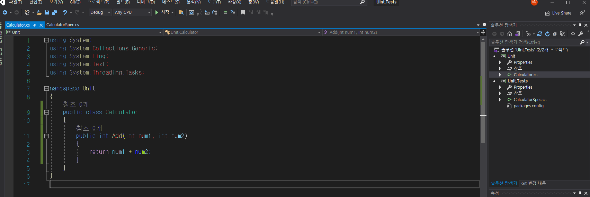

## 단위테스트 클래스 만들기  

```
클래스 이름은 Spec 접미사 사용

using System;
using System.Collections.Generic;
using System.Linq;
using System.Text;
using System.Threading.Tasks;
using Unit;
using Xunit;

namespace Uint.Tests
{
    public class CalculatorSpec
    {
        [Fact]
        public void Should_Add()
        {
            // Arrange: 준비
            Calculator calc = new Calculator();

            // Act: 수행
            int result = calc.Add(1, 2);

            // Assert: 확인
            Assert.Equal(3, result);
        }
    }
}

```
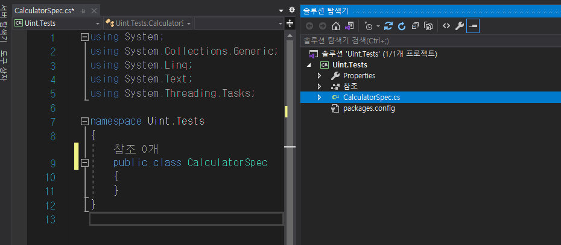
## 참조 추가하기  
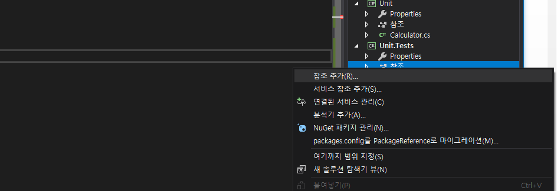
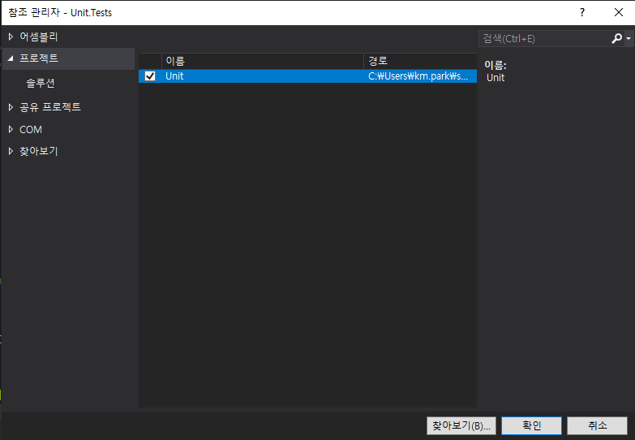
```
Unit.Tests 의 참조에 오른쪽 클릭해서 Unit를 참조하세요.
```
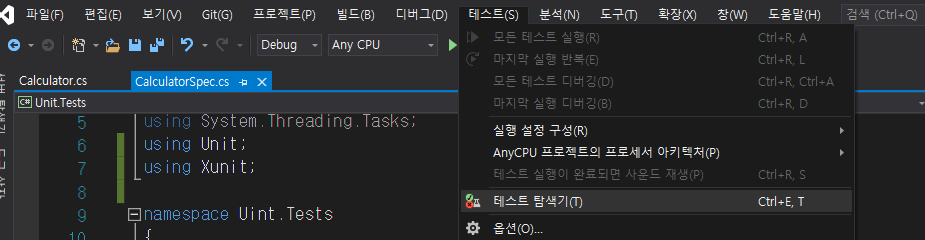
```
테스트 탐색기를 누르면 아래와 같이 나오는데 여기서 시작을 하면 된다.
```
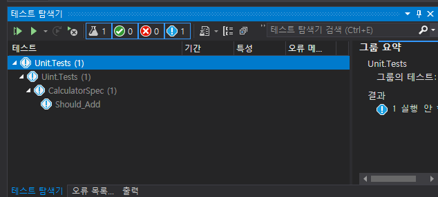

## 에러가 없으면 성공  
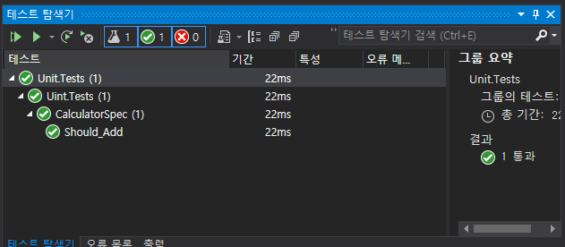
```
이렇게 나오면 정상적으로 작동하는 것이다.
```
## 에러가 있으면 실패  
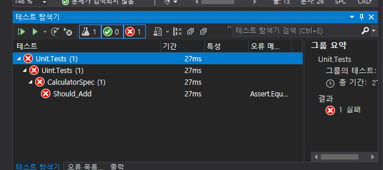
```
이렇게 되면 실패이다.
```
## 자동화를 위한 단계  
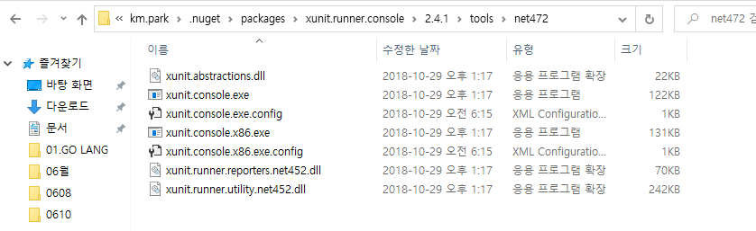

```
디렉터리 위치는 다를 수 있지만 여기에 와야하고 우리가 설치한것이 2.4.1 임을 확인해야함
```
## 프로젝트 위치 에서dll 찾기  
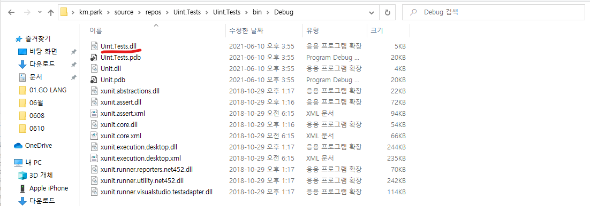
```
이렇게 두위치를 알고 있어야 한다.
그리고 나서 이제 콘솔창을 켜서 우선 이렇게 입력해보자

위에 xunit 디렉토리가 
C:\Users\km.park\.nuget\packages\xunit.runner.console\2.4.1\tools\net472
이거고 
프로젝트 dll 위치가
C:\Users\km.park\source\repos\Uint.Tests\Uint.Tests\bin\Debug
이것이다.

실행을 하려면
C:\Users\km.park\.nuget\packages\xunit.runner.console\2.4.1\tools\net472\xunit.console.exe C:\Users\km.park\source\repos\Uint.Tests\Uint.Tests\bin\Debug\Uint.Tests.dll
```
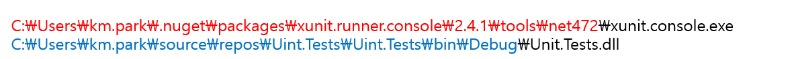
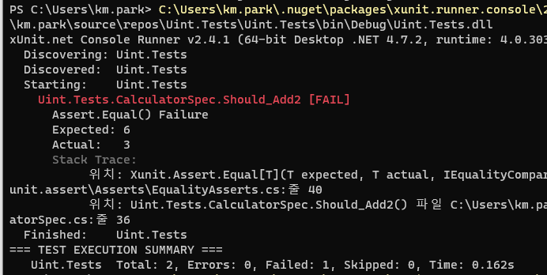
```
현재는 이름이 Unit이 Uint인데 제대로 만들면 되고 저 링크의 이름의dll을 하면된다.
위는 실패 사례가 나오는 경우이다.
```
## 2 프로젝트  
```
Assert 구문을 영어 문장 쓰듯이 구현한다.  가독성을 높인다. 뜻인데
Install-Package FluentAssertions -Version 4.19.3
추가 패키지를 설치해준다.
```
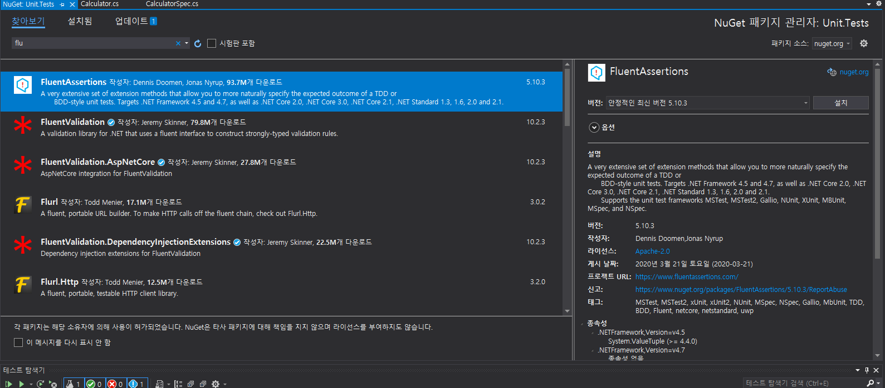
```
이것을 설치해준다.
using FluentAssertions;

추가를 해주고
result.Should().Be(3); //The result sholud be 3.이다라는것처럼 쓴다는것
이렇게 하면 간편하게도 가능하다.
```
# Assert 구현하기  
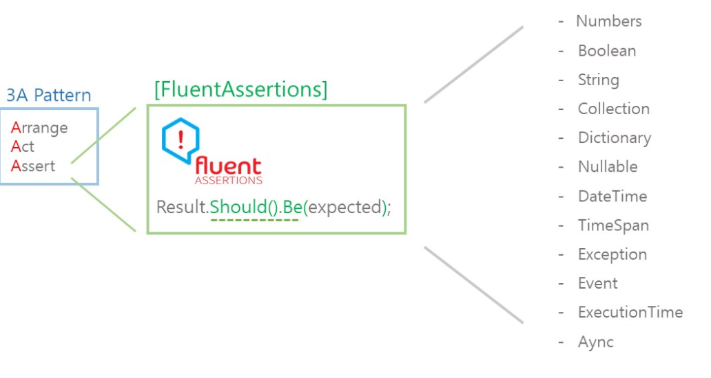 
## 정수 값 확인 방법  
```
            // Arrange
            Calculator calc = new Calculator();
            // Act
            int result = calc.AddInt(2, 3);

            //
            // Assert
            //

            // result == 5
            result.Should().Be(5);
            // result != 10
            result.Should().NotBe(10);
            // 1 <= result <= 10
            result.Should().BeInRange(1, 10);
            // result > 5 || result == 5
            result.Should().BeGreaterOrEqualTo(5);
            // result > 3 || result == 3
            result.Should().BeGreaterOrEqualTo(3);
            // result > 4
            result.Should().BeGreaterThan(4);
            // result < 5 || result == 5
            result.Should().BeLessOrEqualTo(5);
            // result < 6
            result.Should().BeLessThan(6);
            // result > 0
            result.Should().BePositive();
            // result == 3 || result == 5
            result.Should().BeOneOf(new[] { 3, 5 });
위와 같이 판별 할 수 있다.
```
## 실수 값 확인 방법  
```
[Fact]
public void Should_Assert_Flot()
{
    // Arrange
    Calculator calc = new Calculator();
    // Act
    float result = calc.AddFloat(1.0F, 3.1415927F);
    
    // result is 4.141593F.
    //result.Should().Be(4.1415927F);  // 실패
    result.Should().BeApproximately(4.14F, 0.01F);   // 기대 값, 정밀성
}
```
## 참/거짓 값은 BeTrue 와 BeFalse라는 명시적인 함수  
```
[Fact]
public void Should_Assert_Boolean()
{
    // Arrange
    Calculator calc = new Calculator();

    // Act
    bool result = calc.Add(2, 3);

    // Assert
    result.Should().BeTrue();
    result.Should().Be(true);
}
```
# 문자열 프로젝트, Collection 프로젝트
```
프로덕션코드 String
        public string Add(int a, int b)
        {
            return string.Format("The result is {0}.", a + b);
        }
테스트 코드 아래부터 계속
        [Fact]
        public void Should_Assert_String()
        {
            // Arrange
            Calculator calc = new Calculator();

            // Act
            string result = calc.Add(1, 6);
         }
-------------------------------------------------------         
프로덕션 코드 Collection
 public class Calculator
    {
        public IEnumerable<int> GenerateNumbers()
        {
            return new List<int> {1, 2, 5, 8};
        }
    }
테스트 코드
   public class CalculatorSpec
    {
        [Fact]
        public void Should_Assert_Collection()
        {
            // Arrange
            Calculator calc = new Calculator();
            // Act
            IEnumerable<int> result = calc.GenerateNumbers();
            // {1, 2, 5, 8};
	}
```
### Null 확인  
```
(Collection도 동일)
result.Should().NotBeNull();//널이 아니면 참, 널이면 거짓
result.Should().BeNull();// 널이면 참, 널이 아니면 거짓
위와 반대되는 개념

개발중에 널이 들어가면 안될때 사용하는듯
```
### 빈 문자열 확인  
```
(Collection은 없음)
result.Should().NotBeEmpty();
result.Should().NotBeNullOrWhiteSpace();
// 빈 문자열이 없는 경우 체크

result.Should().BeEmpty();
result.Should().HaveLength(0);
result.Should().BeNullOrWhiteSpace();
//빈 문자열이 있는 경우 체크 
```
###  == 확인  
```
(String 경우)
string.Format("The result is {0}.", a + b);이렇게 되어 있으니

result.Should().Be("The result is 7.");
result.Should().NotBe("The result is 10.")

//대소문자 구분있는것은 The 랑 THE 랑 다르게 보겠다는 말임

result.Should().BeEquivalentTo("THE RESULT IS 7.")
//대소문자가 섞여있어도 무시하겠다는 말임

(Collection 경우)
result.Should().Equal(new List<int> { 1, 2, 5, 8 });
result.Should().Equal(1, 2, 5, 8);
result.Should().BeEquivalentTo(8, 2, 1, 5);//순서 상관없이 있는지
```
##  포함 유/무 확인  
``` 
(String)
result.Should().Contain("is");
result.Should().NotContain("IS");
//대소문자를 구분해서 저 단어가 포함하는지 아래는 저단어 포함 안하는지 확인

result.Should().ContainEquivalentOf("IS");
resutl.Should().NotContainEquivalentOf("are");
//대소 구문 없이 저문자 있는지 , 없는지 확인하는 것

(Collection)
result.Should().Contain(x => x > 3);//3 이상인 값을 포함하는지 
result.Should().NotContain(82);//82 포함하지 않는지  
//위 두개는 매개변수형식만 다를뿐 함수는 같음

result.Should().NotContainNulls();//NUll이 포함 여부
result.Should().NotContain(x => x > 10); //10초과 수가 업으면 참
result.Should().ContainInOrder(new[] {1, 5, 8});//1,5,8 포함하는지
result.Should().OnlyContain(x => x < 10);//10 미만이 값인지
result.Should().BeSubsetOf(new[] {1, 2, 3, 4, 5, 6, 7, 8, 9,});
//저것을 포함하는지 여부
```
## 시작/끝 값 확인
```
(String)
result.Should().StartWith("The");//대소문자 구분하고 The로 시작하는지 
result.Should().NotStartWith("This")//대소문자 구분하고 THis 시작안하는지

result.Should().StartWithEquivalent("the");//대소문자 무시 the로 시작하는지
result.Should(). NotStartWithEquivalent("this");
//대소문자 무시 this 시작 안하는지 체크

result.Should().EndWith("is 7."); // 대소문자 구분 끝이 저렇게 끝나냐
 result.Should().NotEndWith("is 10.");// 대소문자 구분 끝이 저렇게 안끝나냐

 result.Should().EndWithEquivalent("is 7.");//대소문자 무시 저렇게 끝나냐
 result.Should().NotEndWithEquivalentOf("is 10.");
 //대소문자 무시 저렇게 안끝나냐
 
(Collection)
result.Should().StartWith(1);//1로 시작하는지
result.Should().EndWith(8); // 8로 끝나는지
```
## Collection만 있는 것 타입확인  
```
result.Should().ContainItemsAssignableTo<int>();//타입이 맞는지 여부
```
## Collection만 있는 것 Count확인
```
result.Should().HaveCount(c => c > 3)
.And.OnlyHaveUniqueItems();
result.Should().HaveSameCount(new[] { 6, 2, 0, 5 });
3이상을 가졌고 중복되는 수가 없고, 마지막 배열과 같은 길이인가의 여부
```
## Collection 응용  
```
result.Should().Contain(8)
.And.HaveElementAt(2, 5)
.And.NotBeSubsetOf(new[] { 11, 56 });
// 8을 포함하고 2,5를 가지고 있고 11,56이 포함 되지 않은가 참여부

result.Should().NotBeEmpty()
.And.HaveCount(4)
.And.ContainInOrder(new[] { 2, 5 })
.And.ContainItemsAssignableTo<int>();

//공백이 없고, 4
```
## Dictionary  
```
프로덕션 코드
public Dictionary<int, string> GenerateDictionary()
{
    return new Dictionary<int, string>
    {
        { 1, "One" },
        { 2, "Two" }
    };
}
테스트 코드
[Fact]
public void Should_Assert_Dictionary()
{
    // Arrange
    Calculator calc = new Calculator();

    // Act
    Dictionary<int, string> result = calc.GenerateDictionary();
}
```
##  NULL 유무 확인  
```
result.Should().NotBeNull();
result.Should().NotBeEmpty();
//널이 없으면 참

result.Should().BeNull();
result.Should().BeEmpty();
//널이 있으면 참
```
## == 확인  
```
var dictionary2 = new Dictionary<int, string>
{
	{ 1, "One" },
	{ 2, "Two" }
};//{ 1, "One" }와 { 2, "Two" }위치 바꿔도 참으로 판단

var dictionary3 = new Dictionary<int, string>
{
	{ 3, "Three" },
};

result.Should().Equal(dictionary2);
result.Should().NotEqual(dictionary3);
// 각각 두개 있을때 result랑 같은지 다른지 여부 확인
```
## 포함 유/무 확인  
```
result.Should().ContainKey(1);//키가 1이 있는지 
result.Should().NotContainKey(9);//키가 9가 없으면 참
result.Should().ContainValue("One");//값이 one 있는지 
result.Should().NotContainValue("Nine");//값저거 포함안되어 있으면 참

 KeyValuePair<int, string> item = new KeyValuePair<int, string>
(1, "One");

 result.Should().Contain(item); //item 사전이랑 같은 항목을 포함하니?
 result.Should().Contain(2, "Two");//키와 벨류 있니?
 result.Should().NotContain(9, "Nine");//키와 벨류 포함 안되어 있으면 참
```
## Count 확인  
```
result.Should().HaveCount(2);
//2개의 키를 가지고 있으면 참
```
# Nullable 프로젝트  
```
프로덕션 코드 
public int? TheInt(int a)
{
    return null;
}
테스트 코드
 [Fact]
public void Should_Assert_Nullable()
{
    // Arrange
    Calculator calc = new Calculator();
    // Act
    var result = calc.TheInt(3);
}
```
## NUll 확인  
```
result.Should().NotHaveValue();// 값이 없는 널이면 참
result.Should().BeNull();

result.Should().HaveValue();//값을 가지면 참 널이면 거짓
result.Should().NotBeNull();
```
# DataAndTime 프로젝트  
```
프로덕션 코드
public DateTime Date { get; set; }

테스트 코드
[Fact]
public void Should_Assert_DateAndTime()
{
    // Arrange
    Calculator calc = new Calculator();

    // Act
    calc.Date = 1.March(2019).At(22, 15).AsLocal();
    var result = calc.Date;
}
```
## 날짜 확인  
```
(좀더 자세히 분석해봐야할듯)
result.Should().Be(1.March(2021).At(22, 15));//현재랑 같은 날짜시간인지?
result.Should().BeAfter(1.February(2019));//2019 2월 후인가?
result.Should().BeBefore(2.March(2019));// 1과 2의 차이도 구분
result.Should().BeOnOrAfter(1.March(2019));
result.Should().BeOnOrBefore(2.March(2019));
result.Should().BeSameDateAs(1.March(2019).At(22, 16));
result.Should().BeIn(DateTimeKind.Local);

result.Should().NotBe(1.March(2019).At(22, 16));
result.Should().NotBeAfter(2.March(2019));
result.Should().NotBeBefore(1.February(2019));
result.Should().NotBeOnOrAfter(2.March(2019));
result.Should().NotBeOnOrBefore(1.February(2019));
result.Should().NotBeSameDateAs(2.March(2019));

result.Should().BeOneOf(
    1.March(2019).At(21, 15),
    1.March(2019).At(22, 15),
    1.March(2019).At(23, 15)
);
```