## 2021년 06월10일 golang 실패 복구하기  
```
에러가 발생하는 경우를 포함해서 자원 정리 작업을 뒤로 지연(defer)시키는 방법과
적절한 상황에서 프로그램을 패닉(panic)시키는 방법과 프로그램을 패닉으로 부터
복구(recover)라는 방법을 알아보자.
```
## 파일에서 숫자 읽어오기  
```go
package main

import (
	"bufio"
	"fmt"
	"os"
	"strconv"
)

func Openfile(fileName string) (*os.File, error) {
	fmt.Println("Opening", fileName)
	return os.Open(fileName)
}

func Closefile(file *os.File) {
	fmt.Println("Closing file")
	file.Close()
}

func GetFloats(fileName string) ([]float64, error) {
	var numbers []float64
	file, err := Openfile(fileName)
	if err != nil {
		return nil, err
	}
	scanner := bufio.NewScanner(file)
	for scanner.Scan() {
		number, err := strconv.ParseFloat(scanner.Text(), 64)
		if err != nil {
			return nil, err
		}
		numbers = append(numbers, number)
	}
	Closefile(file)
	if scanner.Err() != nil {
		return nil, scanner.Err()
	}
	return numbers, nil

}
```
```
텍스트 파일로 부터 float64 값을 읽어와서 
모두 더한 뒤 총합을 출력하는 것이다. 
파일명은 명령줄 인자로 받도록 만들고 싶은데, 
이때는 프로그램을 실행할 때 전달한 모든 명령줄 인자가 저장되는 문자열 슬라이스
os.Args를 사용할 수 있음
따라서 main 함수에서는 첫번째 명령줄 인자인 os.Args[1]을 통해 파일명 가져옴
os.Args[0]에는 실행될 프로그램의 이름이 들어감

그다음 가져온 파일명을 GetFloats롤 전달해 float64 값이 담긴 슬라이스를 받아옴
```
## main문 작성  
```
package main

import (
	"bufio"
	"fmt"
	"log"
	"os"
	"strconv"
)

func Openfile(fileName string) (*os.File, error) {
	fmt.Println("Opening", fileName)
	return os.Open(fileName)
}

func Closefile(file *os.File) {
	fmt.Println("Closing file")
	file.Close()
}

func GetFloats(fileName string) ([]float64, error) {
	var numbers []float64
	file, err := Openfile(fileName)
	if err != nil {
		return nil, err
	}
	scanner := bufio.NewScanner(file)
	for scanner.Scan() {
		number, err := strconv.ParseFloat(scanner.Text(), 64)
		if err != nil {
			return nil, err
		}
		numbers = append(numbers, number)
	}
	Closefile(file)
	if scanner.Err() != nil {
		return nil, scanner.Err()
	}
	return numbers, nil
}
func main() {
	numbers, err := GetFloats(os.Args[1])
	if err != nil {
		log.Fatal(err)
	}
	var sum float64 = 0
	for _, number := range numbers {
		sum += number
	}
	fmt.Printf("Sum: %0.2f\n", sum)
}
```
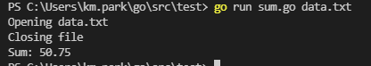
## 에러가 발생하면 파일이 닫히지 않음  
```
여기서 잘못된 형식으로 파일을 전달하면 문제가 발생함 

data.txt 파일에 hello라고 입력해보자
그리고 실행을 한다면 이렇게 뜰것이다.
```
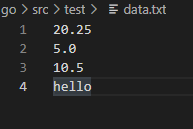
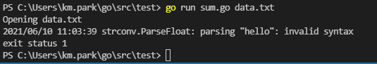
```
여기서 포인트는 파일은 오픈이 됬는데 파일이 클로즈가 안됬다
즉, CloseFile 함수가 호출되지 않았음을 의미하는데
문제는 float64로 변환할 수 없는 문자열로 
strconv, ParseFloat함수를 호출하면 에러를 반환한다는 것이다.

이경우 에러 반환이 CloseFile호출 보다 먼저 실행되기 때문에 파일은 안닫힌다.
```
## 함수 호출 지연시키기  
```
이런 에러 상황에서 파일이 안닫히는 경우 어떻게 해결해야할까요?
GetFloats함수는 파일을 읽는 도중 에러가 발생하면 CloseFile이 호출 안되도,
즉시 함수를 빠져나가도록 작성되어 있다.

함수 호출은 보통 호출문이 선언된 순서대로 실행된다. 즉, 다음 코드에
fmt.Println("Goodbye!")호출은 다른 두 fmt.Println 호출 보다 먼저 실행됨
```
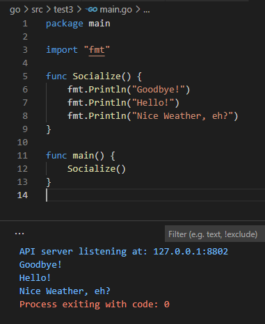
```
여기에 fmt.Println("Goodbye!")호출 앞에 defer 키워드를 추가하면,
이 호출은 Socialize 함수의 나머지 코드가 모두 실행되고 
Socialize 함수가 종료될 때 까지 실행되지 않는다.

이 defer키워드는 무슨 일이 있어도 실행되어야 하는 함수 호출에 사용할 수 있음
```
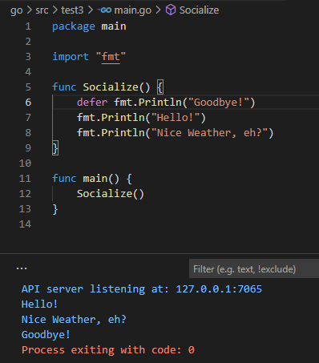
## 지연된 함수 호출을 사용해 에러 복구하기  
```
defer 키워드는 호출하고 있는 함수가 return 키워드로 인해 일찍 종료되어도
특정 함수의 호출이 수행됨을 보장

Socialize는 fmt.Println("Nice weather, eh?")호출이 실행되기 전에 종료
하지만 fmt.Println("Goodbye!") 호출 앞에 defer 키워드가 붙어 있어
Socialize 함수를 끝내기 전에 항상 "Goodbye!"를 출력
```
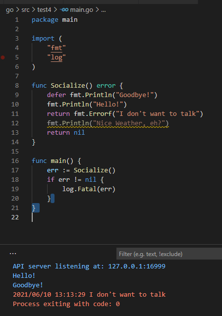
## 지연된 함수 호출을 사용해 파일 닫기 보장  
```
defer키워드는 무슨 일이 있어도 반드시 함수가 호출됨을 보장할 수 있음
보통 에러가 발생한 경우에도 실행해야 하는 코드에 사용함

흔한 예가 바로 열린 파일을 닫는 일
```
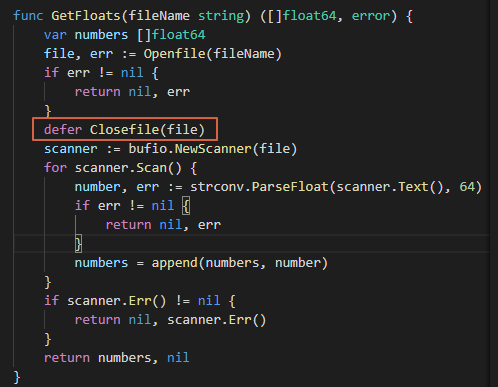
```
파일을 읽을때 float64가 아니여서 에러가 생기므로 그위에 구현을 해줘야함
```
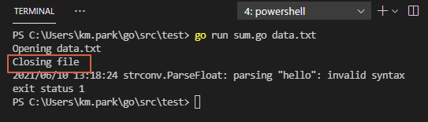
```
에러가 발생하더라도 파일이 닫히는것 까지 보장이된다.
```
## 디렉터리 내의 파일 나열하기  
```
우선 하나의 하위 디렉터리를 포함하는 my_directory라는 디렉터리 생성
아래 프로그램은 my_directory의 내용을 읽어와 디렉터리에 포함되어 있는
각 파일 또는 디렉터리의 이름을 출력

 io/ioutil 패키지에 있는 ReadDir라는 함수를 사용하면 디렉터리의 내용을 
읽어올 수 있음
ReadDir 함수에 디렉터리명을 전달하면 (에러 값과 함께) 디렉터리에 포함된 파일 또는
디렉터리의 목록이 포함된 슬라이스를 반환

슬라이스에 포함된 모든 값은 FileInfo 인터페이스를 만족하며,
이 인터페이스는 파일명을 반환하는 Name 메서드와 해당 파일이 디렉터리인 경우 true를 
반환하는  IsDir 메서드를 가지고 있음

아래는 ReadDir를 호출하면서 인자로 my_directory를 전달
그 다음 반환받은 슬라이스를 순회하면서 IsDir가 true인 경우에는
"Directory:"와 파일명을 , false인 경우에는  "File:"의 파일명 출력
```
## main.go  
```go
package main

import (
	"fmt"
	"io/ioutil"
	"log"
)

func main() {
	files, err := ioutil.ReadDir("my_directory")
	if err != nil {
		log.Fatal(err)
	}
	for _, file := range files {
		if file.IsDir() {
			fmt.Println("Directory:", file.Name())
		} else {
			fmt.Println("File:", file.Name())
		}
	}
}
```
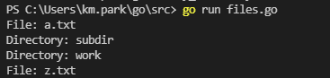
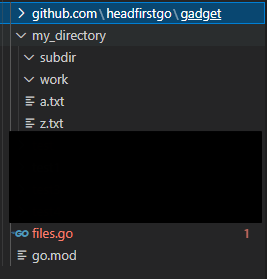
```
디렉터리 상태는 저렇게 my_dirctory랑 files.go랑 같은 위치에 있어야함
```
##  하위 디렉터리 내의  파일 나열하기  
```
단일 디렉터리의 내용을 읽는 프로그램은 별로 복잡하지는 않는다. 
하지만 Go 작업 공간처럼 좀 더 복잡한 디렉터리 구조의 내용을 읽어 와야하는 경우 있음
```

```
이 로직은 길게 가면 너무 깊이 중첩이되어 있기 때문에 충분한 윤곽수준을 잡을 수 없다.

디렉토리 기준으로 
디렉터리 내 파일 목록 가져옴
 A 다음 파일 가져옴
 B 파일 디렉터리인가?
  1. 맞다면: 해당 디렉터리 내의 파일 목록 가져옴
  	a. 다음 파일 가져옴
  	b. 파일이 디렉터리인가?
      01. 맞다면: 해당 디렉터리 내의 파일 목록 가져옴
  2. 아니면: 파일명 출력
이렇게 같은 내용이 반복이 되고

오른쪽 순서도 기준으로는 
 A 다음 파일 가져옴
 B 파일 디렉터리인가?
  1. 맞다면: 이 디렉토리 기준으로 1번과정을 반복
      01. 맞다면: 해당 디렉터리 내의 파일 목록 가져옴
  2. 아니면: 파일명 출력

이런식으로 더 간단히 구현을 할 수 있다.
새로운 디렉터리를 가지고 처음 로직을 반복한다. 
딱 봐도 좀 프로그래밍을 해봤다면 재귀로 하면된다는 생각이 들것이다.
```
## 재귀 함수 호출  
```
재귀는 자기 자신을 호출하는 개념으로 
재귀를 주의 깊게 사용하지 않으면 함수가 자기 자신을 무한정 호출함
```
```go 
package main

import "fmt"

func recurses() {
	fmt.Println("oh, no, I'm stuck")
	recurses()
}

func main() {
	recurses()
}
```
```
이렇게 구현하면 진짜 큰일 나니까 주의 깊게 구현해야합니다.
그래서 스스로 멈출수 있는 탈출 조건을 만들어서 재귀를 멈추게 해야합니다.
```
## 재귀로 구현한 count 함수  
```go
package main

import "fmt"

func recurses() {
	fmt.Println("oh, no, I'm stuck")
	recurses()
}

func main() {
	recurses()
}
```
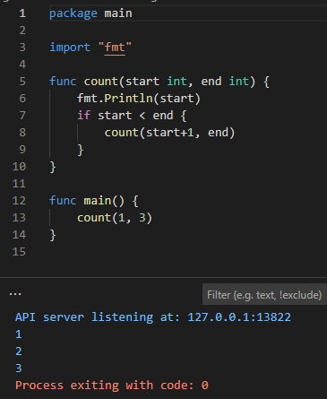
## 재귀 함수에서 에러 처리  
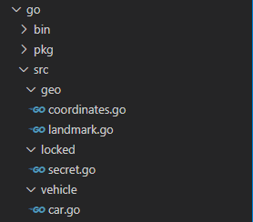
```
파일 구성은 이렇게 해놓고 재귀로 구현합시다.

package main

import (
	"fmt"
	"io/ioutil"
	"log"
	"path/filepath"
)

func scanDirectory(path string) error {
	fmt.Println(path)
	files, err := ioutil.ReadDir(path)
	if err != nil {
		fmt.Printf("Returning error from scandirectory(\"%s\" call\n", path)
		return err
	}

	for _, file := range files {
		filePath := filepath.Join(path, file.Name())
		if file.IsDir() {
			err := scanDirectory(filePath)
			if err != nil {
				fmt.Printf("Returning error from scandirectory(\"%s\" call\n", path)
				return err
			}
		} else {
			fmt.Println(filePath)
		}
	}
	return nil
}

func main() {
	err := scanDirectory("go")
	if err != nil {
		log.Fatal(err)
	}
}
```
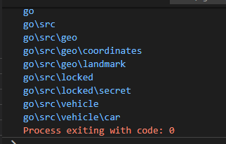
## 패닉 시작하기  
```
프로그램에서 패닉이 발생하면 현재 함수는 실행을 중단하고 
프로그램은 에러 메시지를 출력한 뒤 크래시를 발생시킴

package main

func main(){
	panic("oh no, we're going down")
}
```
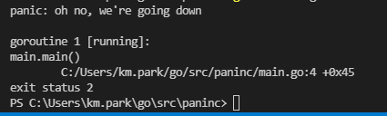
```
위에 처럼 직접 패닉을 일으킬 수 있다.
panic 함수는 빈 인터페이스를 만족하는 단일 인자를 받음
즉, 어느 값이나 전달 가능
인자는 필요할 경우 문자열로 변환되며 패닉 로그 메시지의 일부로 출력
```
## 스택 트레이스  
```
호출된 함수는 자기 자신을 호출한 함수로 되돌아가야한다.
이를 위해 Go는 다른 프로그래밍 언어와 마찬가지로 특정 시점에서 
활성화된 함수 호출의 목록을 저장하는 호출 스택을 유지

프로그램에서 패닉 발생시 스택 트레이스 또는 호출 스택 목록이 
패닉 에러 메시지에 포함이 된다.
```

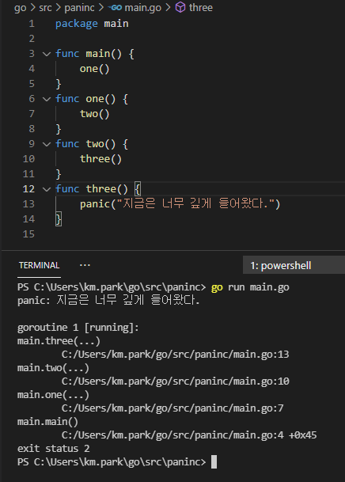
```
패닉이 생기기전에 저장된 목록이 에러 메시지로 나오는게 보인다.
```

## 지연된 호출은 크래시가 발생하기 전에 실행  
```
프로그램에서 패닉이 발생해도 모든 지연된 함수 호출은 계속해서 실행
만약 지연된 호출이 두개 이상이라면 지연된 순서의 역순으로 실행
```
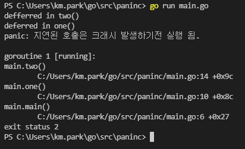
## scanDirectory 에서 panic 사용  
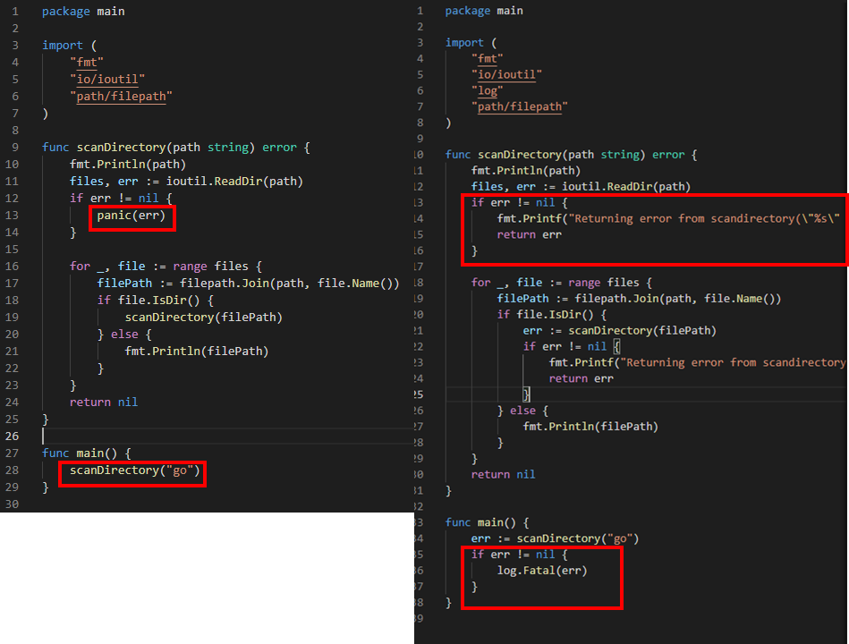
```
저렇게 panic으로 대체 할 수 있다.
```
## 언제 패닉을 사용하는가  
```
패닉을 사용하면 코드는 간단해지지만 프로그램에 크래시가 발생
그냥 error 값을 통해 처리하는게 맞다.
panic은 보통 사용자의 실수나 의도와는 무관한 프로그램 자체의 버그를
나타내는 제어 불가능한 상황에서 사용해야함

예를 들어 잘못된 값이 들어가면 패닉을 생성하는게 맞다.
```
## recover 함수  
```
scanfDirectory 함수가 에러를 반환하는 대신 패닉을 사용하도록 수정하면
에러 처리 코드가 아주 간단해짐

단 패닉은 복잡한 스택트레이스와 함께 프로그램을 중단 시킴

Go에서는 패닉 상태에 빠진 프로그램을 복구할 수 있는 recover라는 내장 함수가 존재
패닉을 발생시키는 프로그램을 우아하게 종료하려면 recover를 사용해야함

정상적인 상태에서
fmt.Println(recover())
하면 <nil>을 반환한다.

프로그램이 패닉 상태일 때 recover를 호출하면 패닉을 멈출 수 있음
하지만 함수에서 panic을 호출하면 함수는 즉시 실행을 중단
따라서 패닉 상태가 계속 이어지기 때문에
panic을 호출하는 함수와 동일한 함수에서 recover를 호출하는 것은 의미가 없음
```
```go
package main

import "fmt"

func freakOut() {
	panic("oh no")
	recover()
}
func main() {
	freakOut()
	fmt.Println("Exiting normally")
}
```
```
이렇게 한다면 recover이 실행이 안되서 크래시가 발생하므로 의미가 없다.
```
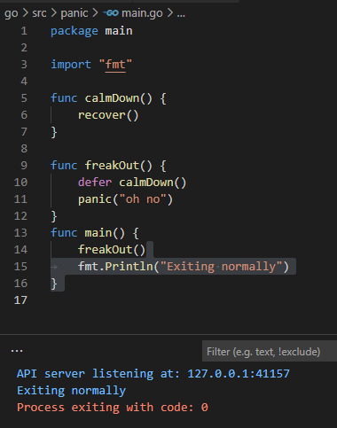
```
이렇게 하면 패닉이 발생해도 정상적으로 종료가 된다.
그리고 패닉이 일어나면 그뒤에 코드는 실행되지 않고 
패닉이 발생한 함수를 빠져나오고 실행된다.
```
## 패닉 값은 recover에서 반환  
```
패닉이 없을 때는 recover를 호출하면 nil이 나오는데 
패닉이 발생하면 recover에는 패닉에서 발생된것이 저장이 됩니다.

그리고 패닉이나 recover 경우 빈 인터페이스라서 받는건 모든지 가능하지만
메서드 호출은 안됩니다. 왜냐면 당연하게도 비어있으니까요

그래서 이때 타입 단언을 사용해서 기본 타입의 값으로 변환해야 합니다.
```
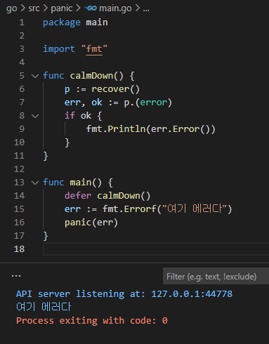
##  scanDirectory 에서 패닉 복구  
```go
func reportPanic(){
	p := recover()
	if p == nil {
		return 
	}
	err, ok := p.(error)
	if ok{
		fmt.Println(err)
	}
}
해서 크래시가 안나오게 하면된다.

여기에는 잠재적인 문제가 하나있긴 하다.

func main(){
 defer reportPanic()
 panic("some other issue")
 scanDirectory("go")
}
이렇게 하면 출력값이 아무것도 안나온다.
그것은 이 함수가 scanDirectory에서 발생하지 않은 패닉까지도 모두 처리하고 있고,
또한 패닉 값을 error 타입으로 변환하지 못할 경우 reportPanic은 아무값도 처리를 
못하는 것이다.

즉 그래서 복궤 대비하지 않은, 예상치 못한 패닉을 다루기 위한 일반 전략은
새로운 패닉을 발생시키는 것이다.
대비하지 못한 패닉은 결국 예상치 못한 상황이기 때문에 다시 패닉을 발생시키는
대처는 대게 적절하다고 볼 수 있다.

예상치 못한 패닉을 처리하는 것은 아래와 같이 하면된다.
```
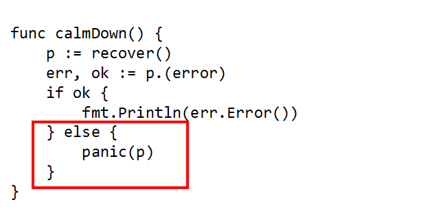
```
빨간 상자 라인을 추가하면 만약에 패닉 값이 에러 타입이 아니면
같은 값으로 한번 더 패닉을 일으키는 것이다.
```