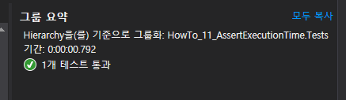
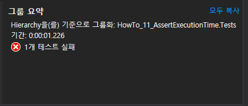
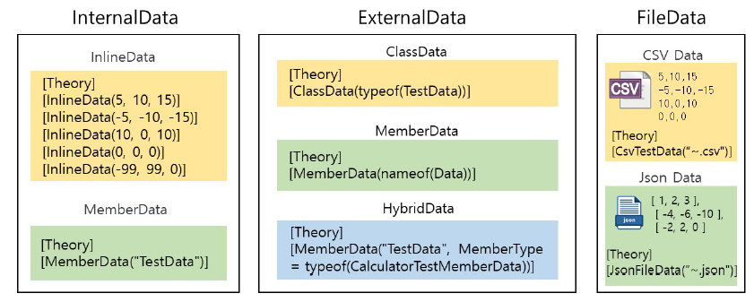
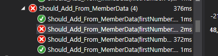
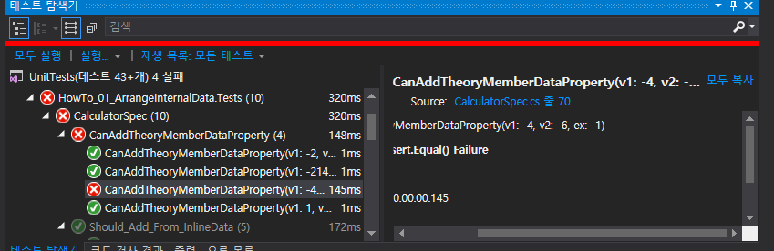
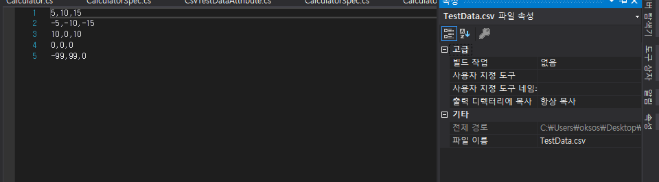
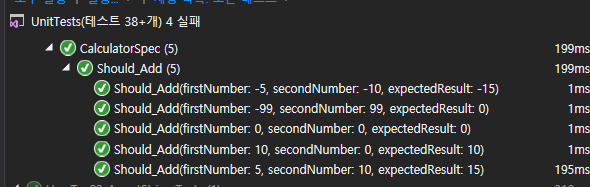
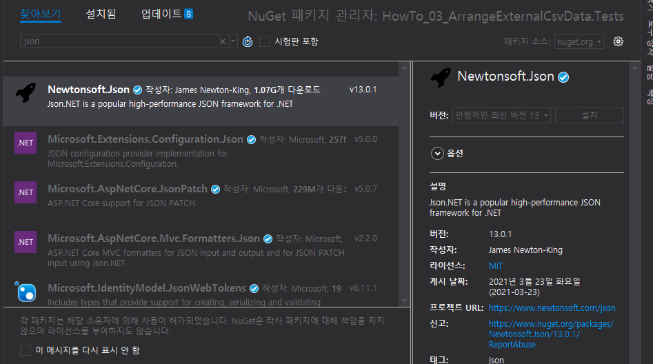
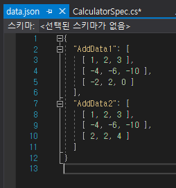
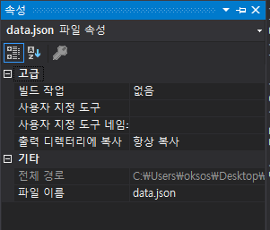

## 2021년 06월11일 C# UnitTest  
# Date And Time  
```
프로덕션 코드
public class Calculator
{
    public DateTime Date { get; set; }
}
테스트 코드
[Fact]
        public void Should_Assert_DateAndTime()
        {
            // Arrange
            Calculator calc = new Calculator();

            // Act
            calc.Date = 1.March(2019).At(22, 15).AsLocal();
            var result = calc.Date;
            //The Result is {2019-03-01 오후 10:15:00};
            // Assert
}
```
## 날짜 확인  
```
(세부적인 기능 확인하기)
result.Should().Be(1.March(2019).At(22, 15));
result.Should().BeAfter(1.February(2019));
result.Should().BeBefore(2.March(2019));
result.Should().BeOnOrAfter(1.March(2019));
result.Should().BeOnOrBefore(2.March(2019));
result.Should().BeSameDateAs(1.March(2019).At(22, 16));
result.Should().BeIn(DateTimeKind.Local);
result.Should().NotBe(1.March(2019).At(22, 16));
result.Should().NotBeAfter(2.March(2019));
result.Should().NotBeBefore(1.February(2019));
result.Should().NotBeOnOrAfter(2.March(2019));
result.Should().NotBeOnOrBefore(1.February(2019));
result.Should().NotBeSameDateAs(2.March(2019));
result.Should().BeOneOf(
	1.March(2019).At(21, 15),
	1.March(2019).At(22, 15),
	1.March(2019).At(23, 15)
);
```
## 날짜나 시간의 특정 부분 확인  
```
 result.Should().HaveDay(1); //1일인지 확인
 result.Should().HaveMonth(3);//3월인지 확인
 result.Should().HaveYear(2019);//2019년 인지 확인
 result.Should().HaveHour(22);//22시인지 확인
 result.Should().HaveMinute(15);//15분인지 확인
 result.Should().HaveSecond(0);//0초인지 확인
 result.Should().NotHaveDay(2);//2일이 아니면 참
 result.Should().NotHaveMonth(4);//4월이 아니면 참
 result.Should().NotHaveYear(2020);//2020년이 아니면 참
 result.Should().NotHaveHour(23);//23시가 아니면 참
 result.Should().NotHaveMinute(16);//16분이 아니면 참
 result.Should().NotHaveSecond(1);//1초가 아니면 참
```
## 시간 비교 확인  
```
var otherDatetime = 1.March(2019).At(22, 10).AsLocal();
var deadline = 4.March(2019).At(22, 15).AsLocal();
var deliveryDate = 5.March(2019).At(22, 15).AsLocal();
var appointment = 2.March(2019).At(22, 15).AsLocal();

result.Should().BeLessThan(10.Minutes()).Before(otherDatetime); // Equivalent to <
result.Should().BeWithin(2.Hours()).After(otherDatetime);       // Equivalent to <=
result.Should().BeMoreThan(1.Days()).Before(deadline);          // Equivalent to >
result.Should().BeAtLeast(2.Days()).Before(deliveryDate);       // Equivalent to >=
result.Should().BeExactly(24.Hours()).Before(appointment);
```
## 지정된 시간 이내에 있는지 확인  
```
result.Should().BeCloseTo(1.March(2019).At(22, 15), 2000);
// 2000 milliseconds 2000ms
result.Should().BeCloseTo(1.March(2019).At(22, 15));
// default is 20 milliseconds 안쓰면 20ms 
```
# TimeSpan  
```
프로덕션 코드
public class Calculator
{
    public TimeSpan TimeSpan { get; set; }
}
테스트 코드
[Fact]
public void Should_Assert_DateAndTime()
{
    // Arrange
    Calculator calc = new Calculator();

    // Act
    calc.TimeSpan = new TimeSpan(12, 59, 58);
    var result = calc.TimeSpan;
    //The Result is {12:59:58};

    // Assert

}
```
## TimeSpan 비교  
```
result.Should().BePositive();
//result.Should().BeNegative();
//result.Should().Be(12.Hours());
result.Should().NotBe(1.Days());

var someOtherTimeSpan = new TimeSpan(12, 59, 59);

result.Should().BeLessThan(someOtherTimeSpan);//미만
12 59 58 < 12 59 59
result.Should().BeLessOrEqualTo(someOtherTimeSpan);//이하
12 59 58 <= 12 59 59
result.Should().BeGreaterThan(someOtherTimeSpan);//초과
12 59 58 > 12 59 59 (거짓)
//result.Should().BeGreaterOrEqualTo(someOtherTimeSpan);//이상
12 59 58 >= 12 59 59 (거짓)
```
# Exception 프로젝트   
```
프로덕션 코드
public void ThrowException()
{
    throw  new DivideByZeroException("Hi, MyException");
}
테스트 코드
[Fact]
public void Should_Assert_Exception()
{
    // Arrange
    Calculator calc = new Calculator();

    // Act
    Action act = () => calc.ThrowException();

    // Assert

}
```
## 예외 발생 유/무 확인  
```
act.ShouldThrow<DivideByZeroException>();
//act.ShouldNotThrow();
```
## 예외 메시지 == 확인  
```
act.ShouldThrow<DivideByZeroException>().WithMessage("Hi, MyException");
예외 매시지 다르면 테스트 실패
```
## 예외메시지 시작 /끝 확인  
```
act.ShouldThrow<DivideByZeroException>()
	.Where(exp => exp.Message.StartsWith("Hi"));
// 예외메시지 시작이 Hi이냐
act.ShouldThrow<DivideByZeroException>()
	.Where(exp => exp.Message.EndsWith("MyException"));
// 예외 메시지 끝이 MyException 이냐
```
# EventMonitoring 프로젝트  
```
(이부분도 복습시 자세히)
특정 이벤트를 발생시켰는지 모니터링 할 수 있음
using구문과 Monitor()메서드를 사용하여 모니터링 함
MVVM구현을 다루고 있다고 가정할 때,
특정 속성에 대한 PropertyChanged 이벤트를 발생시켰는지 테스트 할 수 있음

테스트 코드
  [Fact]
public void Should_Assert_Event()
{
    // Arrange
    var subject = new MainViewModel();

    // Act
    // Monitor()는 FluentAssertions 5.0.0 부터 사용가능하다.
    using (var monitoredSubject = subject.Monitor())
    {
        subject.Foo();
}        
```
## monitoredSubject를 모니터링  
```
monitoredSubject.Should().Raise("FocusRequested");
monitoredSubject.Should().NotRaise("FocusRequested");
```
## PropertyChanged 이벤트 확인  
```
monitoredSubject.Should().RaisePropertyChangeFor(x => x.ColumnCount);
monitoredSubject.Should().NotRaisePropertyChangeFor(x => x.ColumnCount);
```
# ExecutionTime 프로젝트  
```
프로덕션 코드
public void LongRunning()
{
    Thread.Sleep(500);
}
테스트 코드
[Fact]
public void Should_Assert_Int()
{
    // Arrange
    Calculator calc = new Calculator();

    // Act
    Action act = () => calc.LongRunning();
    // Thread.Sleep(500);

    // Assert
}
```
## 함수 실행 시간 초과 유무 테스트   
```
act.ExecutionTime()
	.ShouldNotExceed(600.Milliseconds());
```
## 500 <= 600 성공  

## 500 <= 300 실패  
```
act.ExecutionTime()
	.ShouldNotExceed(300.Milliseconds());
```

# Async 프로젝트  
```
(자세히 볼 필요 있음)
프로덕션 코드  
public async Task<int> AddAsync(int x, int y)
{   // 여기는 Main Thread 영역이다.
    
    return await Task.Run(() =>
        {   // 여기는 Worker Thread 영역이다.
            Thread.Sleep(500);
            return x + y;
        });
}
테스트 코드
1. async/await 키워드를 이용하여 비동기 단위테스트 함수 구현
리턴 타입이 반드시 async Task 이어야함
비동기 함수를 호출할 때 await 키워드 사용 
[Fact]
 public async Task Should_AddAsync_By_Keyword()
 {
     // Arrange
     Calculator calc = new Calculator();

     // Act
     int result = await calc.AddAsync(1, 6);

     // Assert
     result.Should().Be(7);
 }
2. Result또는 Wait()함수를 호출하여 비동기 함수가 종료 될 때까지 대기
 [Fact]
 public void Should_AddAsync_By_Result()
 {
     // Arrange
     Calculator calc = new Calculator();

     // Act
     int result = calc.AddAsync(1, 6).Result;

     // Assert
     result.Should().Be(7);
 }
```
## Arrange 구현하기

```
프로덕션 코드 
public class Calculator
{
    public int Add(int a, int b)
    {
        return a + b;
    }
}
테스트 코드 
// InlineData는 int, float, double, string, bool 등 타입만 가능한다.
// DateTime, 사용자 정의 클래스 등을 전달할 수 없다.
[Theory]
[InlineData(5, 10, 15)]
[InlineData(-5, -10, -15)]
[InlineData(10, 0, 10)]
[InlineData(0, 0, 0)]
[InlineData(-99, 99, 0)]
public void Should_Add_From_InlineData(int firstNumber, int secondNumber, int expectedResult)
{
    // Arrange
    Calculator calc = new Calculator();

    // Act
    int result = calc.Add(firstNumber, secondNumber);

    // Assert
    result.Should().Be(expectedResult);
}
    public static IEnumerable<object[]> TestData
    {
        get
        {
            yield return new object[] { 5, 10, 15 };
            yield return new object[] { -5, -10, -15 };
            yield return new object[] { 10, 0, 10 };
            yield return new object[] { 0, 0, 0 };
            yield return new object[] { -99, 99, 0 };
        }
    }

// MemberData는 
//int, float, double, string, bool 등과 DateTime, 사용자 정의 클래스 등을 전달할 수 있다.
    [Theory]
    [MemberData("TestData")]
//[MemberData(nameof(TestData))]// VS2015부터 제공하는 nameof 키워드 사용
    public void Should_Add_From_MemberData(int firstNumber, int secondNumber, int expectedResult)
    {
        // Arrange
        Calculator calc = new Calculator();

        // Act
        int result = calc.Add(firstNumber, secondNumber);

        // Assert
        result.Should().Be(expectedResult);
    }
}
```
# ArrangeInternalData 프로젝트  
## InIineData Attribute  
```
[Theory]
[InlineData(5, 10, 15)]
public void SAFInlineData(int f, int s, int e){...}

[Theory] 생략하면 안되고, InlineData의 매개변수와 메소드의 매개변수 일치해야함
```
## MemberData Attribute  
```
MemberData를 이용하면 InIineData으로 전달할 수 없는 데이터까지 전달 가능
DateTime이나 사용자 정의 클래스 전달 가능

public static IEnumerable<object[]> TestData
{
    get
    {
        yield return new object[] { 5, 10, 15 };
        yield return new object[] { -5, -10, -15 };
        yield return new object[] { 10, 0, 10 };
        yield return new object[] { 0, 0, 0 };
        yield return new object[] { -99, 99, 0 };
    }
}
이런식으로 해서 
 [Theory]
[MemberData("TestData")]
//[MemberData(nameof(TestData))]        // VS2015부터 제공하는 nameof 키워드 사용
public void SAFMemberData(int f, int s, int e){}
이렇게 사용한다.
```
# ExternalData 프로젝트  
## ClassData  
```
    public class CalculatorTestClassData : IEnumerable<object[]>
    {
        public IEnumerator<object[]> GetEnumerator()
        {
            yield return new object[] { 1, 2, 3 };
            yield return new object[] { -4, -6, 10 };
            yield return new object[] { -2, 2, 0 };
            yield return new object[] { int.MinValue, -1, int.MinValue };

        }
        IEnumerator IEnumerable.GetEnumerator() => GetEnumerator();
    }
    
[Theory]
[ClassData(typeof(CalculatorTestClassData))]
public void Should_Add_From_MemberData(int firstNumber, int secondNumber, int expectedResult){}

이렇게 사용할 수 있다. 
```

## MemberData Attribute의 MemberType 속성  
```
MemberType 속성을 통해 클래스 단위로 데이터를 분리 할 수 있음
추가 클래스를 만들지 않으려면 MemberData를 사용
모든 타입 사용 가능
```
```
 public static IEnumerable<object[]> Data =>
     new List<object[]> {
         new object[] {1,2,3 },
         new object[] {-4,-6,-1},
         new object[] {-2,2,0},
         new object[]{int.MinValue,-1, int.MaxValue},
    };

 [Theory]
 [MemberData(nameof(Data))]
 public void CanAddTheoryMemberDataProperty(int v1,int v2, int ex)
 {
     //Arrange
     var cal = new Calculator();
     //Act
     var result = cal.Add(v1, v2);
     //Assert
     Assert.Equal(ex, result);
 }
```

## Hybrid 유형  
```
(무언가 에러가 발생)
테스트 클래스의 속성이나 메서드에서 데이터를 로드하는 대신
다른 특정 유형의 속성이나 메서드에서 데이터를 로드
```
```
public class CalculatorTestMemberData
{
    public static IEnumerator<object[]> TestData
    {
    	get
   	 	{
        yield return new object[] { 5,10,15};
        yield return new object[] { -5,-10,-15 };
        yield return new object[] { 10,0,10 };
        yield return new object[] { 0,0,0 };
		}
    }
}
[Theory]
      [MemberData("TestData",MemberType =typeof(CalculatorTestMemberData)]
      public void Hybrid(int f, int s, int e)
      {
          // Arrange
          Calculator calc = new Calculator();

          // Act
          int result = calc.Add(f, s);

          // Assert
          result.Should().Be(e);
      }
      
```
# ExteralCsvData 프로젝트  
## DataAttrubute 클래스  
```
DataAttribute를 상속받아 사용자 정의 Attribute 만들 수 있음
Attribute 생성자로부터 CSV 파일 이름을 입력 받음
override GetData함수를 통해 CSV파일 데이터를 전달

프로덕션 코드
    public class Calculator
    {
        public int Add(int a, int b)
        {
            return a + b;
        }
    }
테스트 코드  
public class CsvTestDataAttribute : DataAttribute
{
    private readonly string _csvFileName;

    public CsvTestDataAttribute(string csvFileName)
    {
        _csvFileName = csvFileName;
    }

    public override IEnumerable<object[]> GetData(MethodInfo testMethod)
    {
        string[] csvLines = File.ReadAllLines(_csvFileName);

        var testCases = new List<object[]>();

        foreach (var csvLine in csvLines)
        {
            IEnumerable<int> values = csvLine.Split(',').Select(int.Parse);


            testCases.Add(testCase);
        }

        return testCases;
    }
}
```
## 사용자 정의 Attribute 클래스 사용   
```
//사용자 정의 Attribute 클래스 CsvTestDataAttribute 추가
//tribute 생성자로 CSV파일 이름 전달

[Theory]
[CsvTestData("TestData.csv")]
public void Should_Add(int firstNumber, int secondNumber, int expectedResult)
{
    // Arrange
    Calculator calc = new Calculator();

    // Act
    int result = calc.Add(firstNumber, secondNumber);

    // Assert
    result.Should().Be(expectedResult);
}
```
## CSV 파일 프로젝트에 추가하고 속성을 설정  
```
항상 복사 속성을 설정(빌드 경로에 파일을 복사시키기 위함)
```

## 단위 테스트 결과 확인  
```
CSV 파일에 있는 모든 데이터로 테스트 결과를 확인
```


# ExternalJsonData 프로젝트  
## Json Nuget패키지 설치   
(버전 문제로 안되는것 같음)

## json 모든 데이터 사용  
```
        [Theory]
        [JsonFileData("all_data.json")]
        public void CanAddAll(int value1, int value2, int expected)
        {
            // Arrange
            var calculator = new Calculator();

            // Act
            var result = calculator.Add(value1, value2);

            // Assert
            Assert.Equal(expected, result);
        }
```
## 특정값 지정  
```
        [Theory]
        [JsonFileData("data.json", "AddData1")]
        public void CanAdd(int value1, int value2, int expected)
        {
            // Arrange
            var calculator = new Calculator();

            // Act
            var result = calculator.Add(value1, value2);

            // Assert
            Assert.Equal(expected, result);
        }

        [Theory]
        [JsonFileData("data.json", "AddData2")]
        public void CanAdd2(int value1, int value2, int expected)
        {
            // Arrange
            var calculator = new Calculator();

            // Act
            var result = calculator.Add(value1, value2);

            // Assert
            Assert.Equal(expected, result);
        }
    }
```
## Json 파일 읽기  
```
namespace HowTo_04_ArrangeExternalJsonData.Tests
{
    public class JsonFileDataAttribute : DataAttribute
    {
        private readonly string _filePath;
        private readonly string _propertyName;
        public JsonFileDataAttribute(string filePath)
            : this(filePath, null) { }
        public JsonFileDataAttribute(string filePath, string propertyName)
        {
            _filePath = filePath;
            _propertyName = propertyName;
        }
        ...
```
## Json 파일 데이터 로드  



