## 2021년 06월11일 golang 고루틴과 채널  
```
한 번에 한가지 일을 처리하는 것이 항상 작업을 완료하는 가장 빠른 방법이 아니다.
고루틴을 사용하면 한 프로그램에서 한 번에 여러 개의 작업을 동시에 실행할 수 있음
고루틴은 채널을 사용해 작업을 조정할 수 있으며,
고루틴 간에 데이터를 동기화하여
한 고루틴이 다른 고루틴보다 앞서가지 않도록 제어할 수 있음

코루틴을 사용하면 멀티 프로세서의 이점을 최대로 사용하여 빠르게 실행 할 수 있다.
```
## 웹 페이지 가져오기  
```
package main

import (
	"fmt"
	"io/ioutil"
	"log"
	"net/http"
)

func main() {
	response, err := http.Get("https://example.com")
	if err != nil {
		log.Fatal(err)
	}
	defer response.Body.Close()
	body, err := ioutil.ReadAll(response.Body)
	if err != nil {
		log.Fatal(err)
	}
	fmt.Println(string(body))
}
```
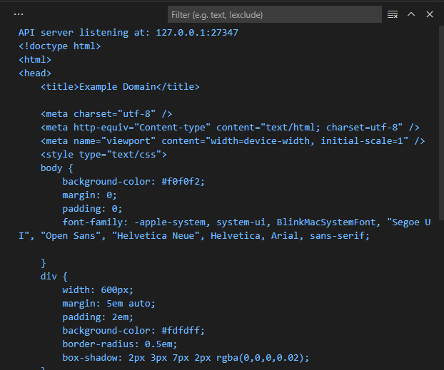
```
이렇게 웹 페이지를 가져올 수 있다.
좀더 자세한 함수와 타입을 알고 싶다면 
go doc http Get
go doc http Response
go doc io ReadCloser
go doc ioutil ReadAll
```
## 웹페이지 크기 계산하는 프로그램  
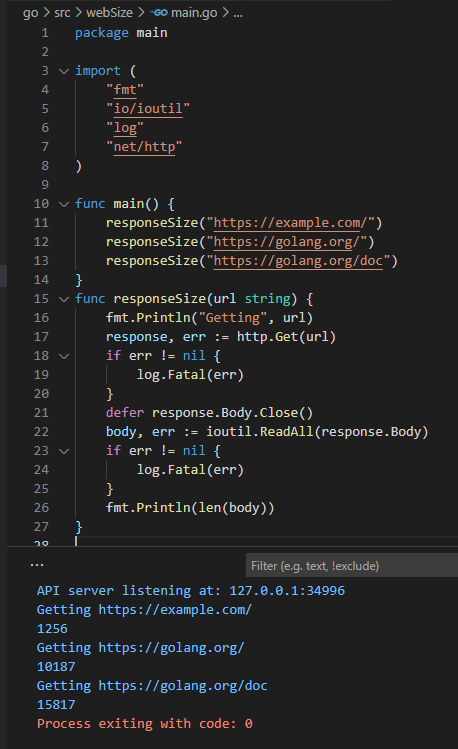
## 멀티태스킹  
```
이 장의 목표는 한번에 여러개의 작업을 수행함으로써 프로그램의 속도를 높이는 
방법을 찾는것
모든 코드가 세 번씩 반복되는 크고 긴 함수가 있다면
이 함수는 responseSize를 세 번 호출하는 것과 동일한 시간이 소요
```
## 고루틴을 사용한 동시성  
```
responseSize가 http.Get을 호출하면 프로그램은 웹사이트가 응답할 때 까지 
대기해야함
응답을 대기하는 동안에는 아무 일도 수행하지 않음

동시성을 활용하면 프로그램이 한 작업을 멈추고 다른 작업을 수행할 수 있도록 하는것

동시성을 지원하도록 작성된 프로그램은 여러 작업을 동시에 실행한느 
병렬성도 지원할 수 있음

큰 작업을 동시에 실행할 수 있는 작은 하위 작업들로 나누는 일은 종종 프로그램의 속도를
향상 시킬 수 있다.

Go에는 동시에 실행되는 작업을 고루틴이라고 함
다른언어에서는 스레드와 유사한 개념이지만 
고루틴은 스레드보다 좀더 적은 메모리를 사용하며 좀 더 빠른 시작 및 종료 시간을 
가졌기 때문에 한 번에 더 많은 고루틴을 실행 할 수 있음
```
## 고루틴 사용법   
```
함수 또는 메서드 호출 앞에 go 키워드만 붙여주면됨

go myFunction()
go otherFunction("argument")

go : 고루틴 사용 키워드
```
## 고루틴 사용하기  
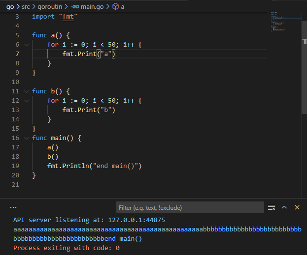
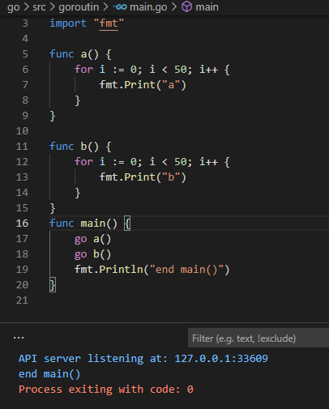
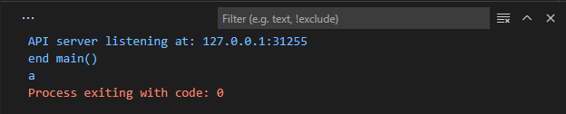
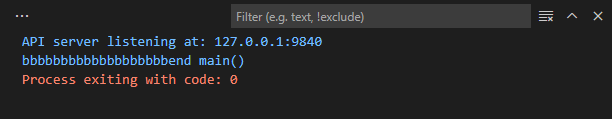
```
매번 실행할 때마다 다르게 동작을한다.
여기서 문제는 Go 프로그램은 main 고루틴이 종료되면 다른 고루틴이 아직
실행 중이더라도 그 즉시 중단한다. 
어떤 상황에서는 main함수가 먼저 실행되고 종료되서 
함수 a,b가 실행될 기회를 얻기도 전에 종료가 되는 것입니다.

그래서 a, b 함수를 실행하는 고루틴이 완료되기 전까지 main 고루틴을 실행 중인 상태로
유지해야한다.

이작업을 정석대로 하려면 Go의 또 다른 기능인 채널이라는 것을 사용해야함

일단은 main을 일정 시간 동안 일시 중지해서 해보자.
```
``` go
package main

import (
	"fmt"
	"time"
)

func a() {
	for i := 0; i < 50; i++ {
		fmt.Print("a")
	}
}

func b() {
	for i := 0; i < 50; i++ {
		fmt.Print("b")
	}
}
func main() {
	go a()
	go b()
	time.Sleep(time.Second)
	fmt.Println("end main()")
}

	time.Sleep(time.Second)
이것을 추가해주자. 대락main 고루틴을 1초간 일시중지
```
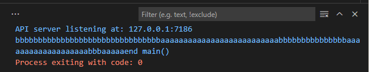
## responseSize 함수에 고루틴 사용하기  
```
우리가 앞서 구현했던 responseSize 앞에 go를 붙이고 
time.Sleep(5 * time.Second)해서 5초 지연시켜보자.
```
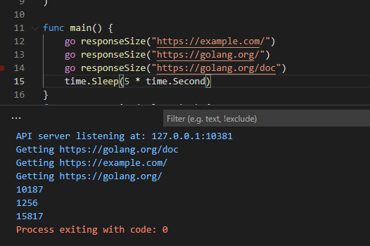
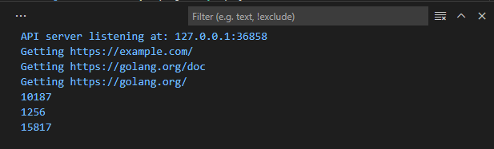
```
매번 다른 순서로 실행 될 수가 있다.
만에 하나로는 사이트로 부터 응답 받기전에 종료가 될 수도 있다.
```
## 고루틴의 실행 시점은 직접 제어 할 수 없음  
```
앞서 봤듯이 일반적인 환경세서 Go는 고루틴 간의 전환 시기와 전환 기간에 대해
아무것도 보장하지 않음
이는 고루틴이 어떤 방식으로든 가장 효율적으로 실행되도록 만들어줌

하지만 고루틴 간 실행 순서가 중요하다면 채널을 사용하여 동기화 해야함
```
## go문은 반환 값과 함께 사용할 수 없음  
```
고루틴으로의 전환은 또 다른 문제를 야기함 
go 문에는 반환 값을 가진 함수를 사용할 수 없음
페이지의 크기를 직접 출력하는 대신 값으로 반환하도록 변경해서 실행하면
컴파일 에러가 발생한다.

이는 적절한 에러인데 그것은 responseSize를 go문으로 호출한다는 것은
별도의 고루틴에서 실행하고 나는 현재 함수를 계속 실행하겠어 라는 것과 같다.

responsesize 함수는 웹사이트의 응답을 기다려야 하기 때문에 값을 즉시 반환 하지 
않는다.
하지만 main 고루틴 코드는 아직 존재하지도 않는 반환 값이 즉시 반환되길 기대

func greeting() string{
	return "hi"
}
func main(){
	fmt.Println(go greeting())
}

이런 경우 함수의 반환 값을 즉시 사용하려는 시도는 에러가 생김

하지만 Go에서도 고루틴끼리 서로 통신을 할 수 있는 방법이 존재
채널을 이용하면된다.

채널을 사용하면 한 고루틴에서 다른 고루틴으로 값을 전달할 수 있을 뿐만 아니라 
수신 고루틴이 값을 사용하기 전에 송신 고루틴이 값을 보냈음을 보장할 수 있음
```
## 채널 사용하기전 작업   
```
1. 채널 생성하기
2. 채널을 매게변수로 받는 함수 작성.
(이 함수는 별도의 고루틴에서 실행하여 채널에 값전달)
3. 고루틴에서 채널을 통해 전달한 값 수신하기

각 채널은 특정 타입의 값만 주고받을 수 있기 때문에 
int 값을 갖는 하나의 채널과 구조체 타입을 갖는 또다른 채널처럼 
별도의 채널들을 가질 수 있음

채널 변수를 선언하기 위해서는 chan 키워드 다음으로 채널이 주고 받을 값의
타입을 지정해 주면 됨

var myChannel chan float64

chan : 채널 키워드 
float64 : 채널이 주고 받을 값의 타입

실제로 사용할 수 있는 채널을 생성하려면 (맵과 슬라이스 생성 시에도 사용한)
make 함수를 사용해야함
make 함수에는 생성할 채널의 타입만 전달해 주면됨
(채널에 할당한 변수와 동일한 타입이어야함)

var myChannel chan float64 //채널 변수 선언
myChannel = makE(chan float64)//실제로 사용할 수 있는 채널을 생성

myChannel := make(chan float64) //이렇게 단축변수 선언이 더 편하다.
```
## 채널을 통해 값 주고 받기  
```
채널에 값을 전달할 때에는 <- 연산자를 사용
이는 보내는 값이 보낼 채널을 가리키는 것처럼 보임 

myChannel <- 3.14 

myChannel :  값을 보낼 채널
<- : 화살표(에로우) 연산자
3.14 : 채널을 통해 보낼 값

<-myChannel
<- : 화살표 연산자
myChannel : 값을 가져올 채널
```
## 채널을 이용한 값 전달 소스  
```
package main

import "fmt"

func greeting(myChannel chan string) {
	myChannel <- "hi"
}
func main() {
	myChannel := make(chan string)
	go greeting(myChannel)
	fmt.Println(<-myChannel)
}
```
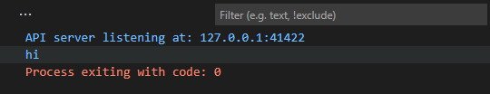
```
바로 값을 <-myChannel 할 필요없이 
receiveValue := <-myChannel 이렇게 수신한 값을 변수에 저장할 수도 있음
```
## 채널을 사용한 고루틴 동기화  
```
이전의 채널은 수신 고루틴이 값을 사용하기 전에 송신 고루틴이 값을 보냈음을 
보장할 수 없다고 했었는데,
채널은 현재 고루틴의 모든 작업을 중지하는 블로킹 으로 이를 보장할 수 있음

동기화 과정
어떤 채널에 대한 송신 연산은 다른 고루틴이 해당 채널에서 값을 가져가지 전까지
송신 고루틴을 블로킹 
그 반대도 수신 연산은 다른 고루틴이 해당 채널에 값을 보내기 전까지 수신 고루틴 블로킹
하여 동기화 할 수 있다.
즉 자신의 실행 타이밍을 조정할 수 있음
```
## 두개의 채널 생성 예측하여 출력하기   
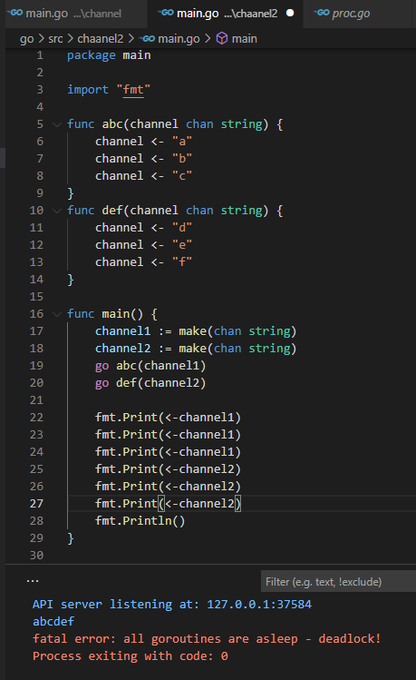
```
<-접근하면 abc를 예로 들면 a부터 c까지 순서대로 진행을 한다.
```
## 고루틴 동기화 관찰하기  
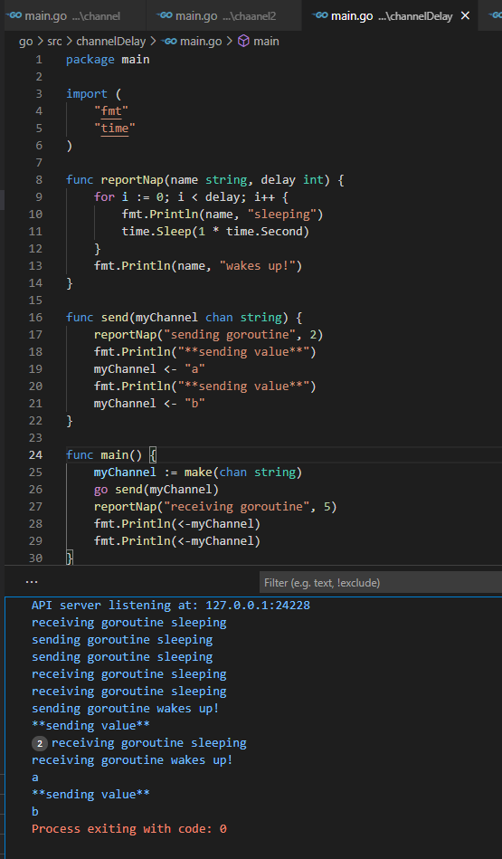
```
 위를 보면 일단 채널을 하나 생성해서 send함수로 전달
 그리고 reportNap을 호출하여 5초간 일시중지하고 다음 마지막으로 채널에서 
 두번의 수신 연산을 수행
 
위 프로그램이 실행하면 첫 2초동안 두 고루틴 모두 중지
2초 후에는 send 고루틴이 깨어나 채널에 값을 전달

하지만 send고루틴의 송신 연산은 main 고루틴이 채널에서 값을 받아가기 전까지 
send 고루틴을 블로킹 하여 아무것도 실행 안됨

main 고루틴은 3초간 더 중지되기 때문에 
당장은 아무 일도 일어나지 않음
그리고 3초 후 main 고루틴이 깨어나면 채널에서 값을 받아옴
그제서야 send 고루틴의 블로킹 해제 되고 두번째 값을 전달
```
## 연습문제   
``` 
1
3
2
4
로 출력하는 채널로 동작하는 프로그램 만들어라
```
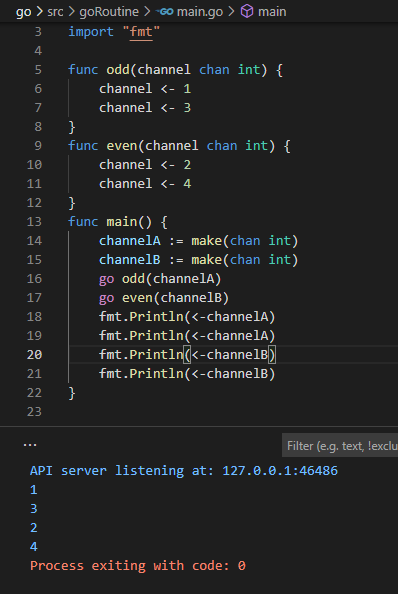
## 채널을 사용해서 웹페이지 크기 계산 개선하기  
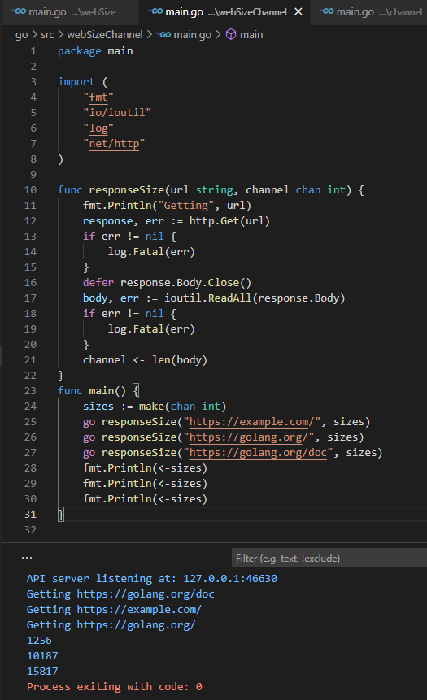
```
여기까지 하면 일단 속도가 개선이됨
```
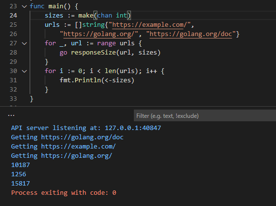
## 채널로 구조체 전달하기  
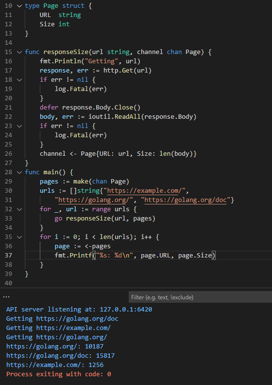
