## 2021년 06월11일 golang 자동 테스트  
```
새로운 버전의 소프트웨어를 배포하기 전에 새로운 기능들이 
모두 다 잘 동작하는지 확인하기 위해 해당 기능들을 테스트 해봤겠지만
기존 기능들 또한 잘 작동하는지 테스트 하는가?

자동테스트가 있으면 코드를 변경한 후에도 프로그램의 기능들이 정상적으로 동작한다는 것
보장할 수 있음

go의 testing 패키지와 go test  도구를 사용하면 이미 배운 기술들을 동원하여
자동 테스트를 더 쉽게 작성할 수 있음
```
## 자동 테스트는 사람보다 먼저 버그를 찾아냄   
```
코드가 잘못되면 경우에 따라서는 대참사가 발생할 수도 있고,
회사 평판 또한 타격을 받는다 
또한 버그를 고치는 데 시간을 많이 들여야 한다.
그래서 자동화 테스트가 필요하다.

자동화 테스트는 프로그램의 일부 코드를 자동으로 실행하여 프로그램이 
원래 목적에 맞게 잘 동작하는지 검증하기 위한 별도 프로그램이다.

매번 기존 기능을 모두 테스트하여 수정한 코드가 기존 기능을
망가뜨리지 않는다는 것을 확인하지 않는 한 그것만으로는 부족

자동테스트는 수동 테스트와 비교하여 시간을 많이 절약하고
일반적으로 수동 테스트보다 더 철저히 테스트 할 수 있음
```
## 자동 테스트가 필요한 함수  
```
우선 작업 공간에 -> src -> github.com -> headfirstgo -> prose -> join.go
만들어주세요.
package prose

import "strings"

func JoinWithCommas(phrases []string) string {
	result := strings.Join(phrases[:len(phrases)-1], ", ")
	result += "and"
	result += phrases[len(phrases)-1]
	return result
}
```
## main문 작성  
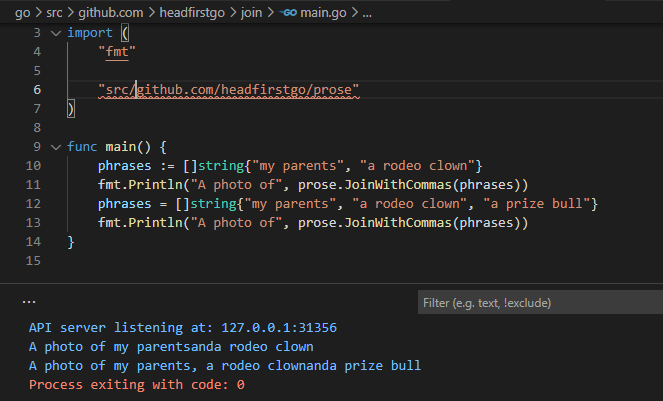
```
현재는 잘 작동한다 
하지만 한가지 문제가 있는데 저런식의 나열 방식은 해석상 오해의 소지가 생김

혼동을 피하기 위해 패키지코드를 수정해서 and 앞에도 쉼표를 추가해보자
	result += ", and"
join.go에 저렇게 바꿔줍니다.
```
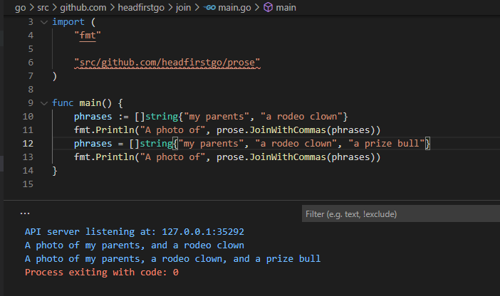
## 버그 발견  
```
새로운 코드는 항목이 세 개일 때에는 잘동작하지만 
두개일때 아닌 에러가 발생
의미상으로 들어갈 필요 없는데 들어간다.
세개인 경우를 해결하려다 두개의 단어에는 필요업는 것이 생겼다.

만약에 자동테스트가 있었다면 이런 문제는 없다.
코드의 결과값이 예상한 결과값과 일치하면 테스트는 통과
예상가 다르면 실패 

즉, 자동 테스트는 코드를 변경할 때마다 자동으로 버그를 검사해 주는 도구와 같다.
```
## 테스트 작성하기  
```
Go에서는 앞서 말했듯이 testing 패키지와 테스트를 실행할 수 있는 
go test 명령어를 제공

우선 join.go 쪽에 join_test.go 파일을 만들어줍니다.

package prose

import "testing"

func TestTwoElements(t *testing.T) {
	t.Error("no test written yet")
}

func TestThreeElements(t *testing.T) {
	t.Error("no test here either")
}

함수 이름은 Test로 시작해야하고 
t *testing.T // testing.T 값의 포인터가 전달

테스트 파일의 코드는 보통의 Go 함수들로 이루어져 있으나 
go test 도구와 함께 사용하려면 다음과 같은 컨벤션을 따라야함 

1. 테스트 파일이 테스트하려는 코드와 반드시 동일한 패키지에 속할 필요는 없으나
패키지의 노출되지 않은 타입이나 함수에 접근하려면 동일한 패키지게 속해야함 
2. testing 패키지의 타입을 사용하려면 테스트가 필요하기 때문에 각 테스트 파일의
3. 맨 위에서 해당 패키지를 가져와야함
4. 테스트 함수의 이름은 Test로 시작해야하고 대문자로 시작해야함
5. 테스트 함수는 단일 메개변수로 testing.T 값의 포인터를 받음
6. testing.T값의 (Error와 같은) 메서드를 호출하여 실패한 테스트를 보고 할 수 있음
대부분 메서드는 테스트가 실패한 원인을 설명하는 문자열 메시지를 메개변수로 받음
```
## go test  명령어로 테스트 실행하기  
```
go test github.com/headfirstgo/prose
로 실행하라고 하는데 
안되면
go test github.com/headfirstgo/prose/join_test.go
하면된다. 물론 src 디렉토리에서 해라
```
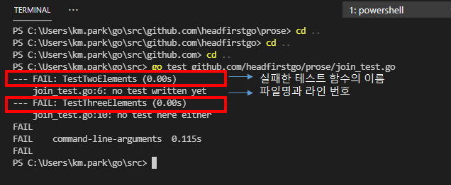
```
두 테스트 함수 모두 전달된 testing.T 값에서 Error 메서드를 호출하고 있기 때문에
모든 테스트가 실패
여기서 Error 메소드를 제거하면 성공하는 결과가 나올 것이다.
```
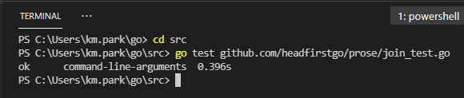
## 실제 반환 값 테스트하기  

```go
package prose

import (
	"testing"
)

func TestTwoElements(t *testing.T) {
	list := []string{"apple", "orange"}
	if JoinWithCommas(list) != "apple and orange" {
		t.Error("didnt match expected vaule")
	}
}

func TestThreeElements(t *testing.T) {
	list := []string{"apple", "orange", "pear"}
	if JoinWithCommas(list) != "apple, orange, and pear" {
		t.Error("didnt match expected vaule")
	}
}
```
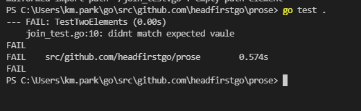
```
현재는 2번 테스트 케이스에서 오류가 생긴다.
```
## 연습 문제  
```
작업공간 / src / arithmetic / math.go
package arithmetic

func Add(a float64, b float64)float64{
	return a + b
}
func Substract(a float64, b float64)float64{
	return a - b
}

작업 공간 / src / arithmetic / math_test go 
에 어떤식으로 테스트를 해야하는가?

package arithmetic

import "testing"

func TestAdd(t *testing.T){
	if t.Add(1, 2) != 3{
		t.Error("1 + 2 !=3")
	}
}
func TestSubstract(t * testing.T){
	if t.Subsract(8, 4)!=4{
		t.Error("8 - 4 != 4")
	}
}
```
##  Errorf 메서드를 사용해 실패 메시지 상세히 적기  
```
현재 위에처럼 하면 제대로 어떻게 다른지 확인 못함
testing.T 매게 변수에는 Errorf 메서드도 있는데,
Error와는 달리 Errorf는 fmt.Printf 및 fmt.Spintf 함수와 같이 형식 동사를
가진 문자열을 받음
추가를 해보자.
```
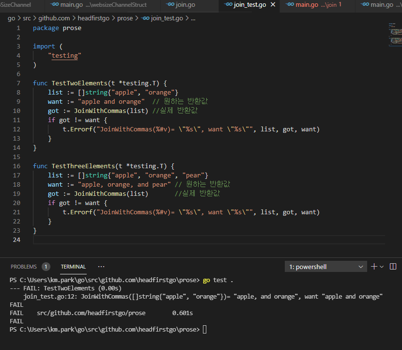
## C#의 자동테스트와 이것과 유사한것 같다.  
```
[Fact]
public void Test2()
{
    int a = 3; int b = 4; //list := []string{"apple", "orange"}
    int expected = 7;//want := "apple and orange"  // 원하는 반환값

    var calc = new AddClass();
    var actual = calc.int_add(a,b);
    //got := JoinWithCommas(list) //실제 반환값
    
    Assert.Equal(expected, actual);
    
}

이렇게 비슷한것 같다.
```
## 테스트 헬퍼 (helper) 함수   
```
_test.go 파일에 테스트 함수만 작성할 수 있는 것은 아님
테스트 코드 간에 반복되는 코드를 줄이기 위해 테스트 파일에서 해당 코드만 따로
헬퍼 함수로 분리할 수 있음

중요한것은 go test 명령어는 Test로 시작하는 함수만 사용하기 때문에 붙어야함

c# :  [FACT] go: Test로 시작하는것

아까전 소스를 보면 t.Errorf 호출이 중복되고 있는데 
이를 해결하기 위해 문자열 생성 코드를 errorString 이라는 별도 함수로 분리하는 것
```
## errorString  
```
errorString 함수는 JoinWithCommas에 전달된 슬라이스와
got변수 및 want 변수의 값을 받는다.
따라서 이제 testing.T 값에서 Errorf를 호출하는 대신
fmt.Sprintf를 사용하여 생성한 에러 메세지를 반환해주는 errorString을 사용 가능

테스트 코드에서 반환받은 실패 메시지와 함께 Error를 호출할 수 있음
```
```go
package prose

import (
	"fmt"
	"testing"
)

func errorString(list []string, got string, want string) string {
	return fmt.Sprintf("JoinWithCommas(%#v)= \"%s\", want \"%s\"", list, got, want)
}

func TestTwoElements1(t *testing.T) {
	list := []string{"apple", "orange"}
	want := "apple and orange"  // 원하는 반환값
	got := JoinWithCommas(list) //실제 반환값
	if got != want {
		t.Error(errorString(list, got, want))
		//t.Errorf("JoinWithCommas(%#v)= \"%s\", want \"%s\"", list, got, want)
	}
}

func TestThreeElements1(t *testing.T) {
	list := []string{"apple", "orange", "pear"}
	want := "apple, orange, and pear" // 원하는 반환값
	got := JoinWithCommas(list)       //실제 반환값
	if got != want {
		t.Error(errorString(list, got, want))
		//t.Errorf("JoinWithCommas(%#v)= \"%s\", want \"%s\"", list, got, want)
	}
}
```
```
이런식으로 좀더 깔끔하게 사용할 수 있다.
```
## 테스트 통과시키기  
```
통과 시키기 위해서 2개의 경우에만 예외를 걸러주면된다. 
```
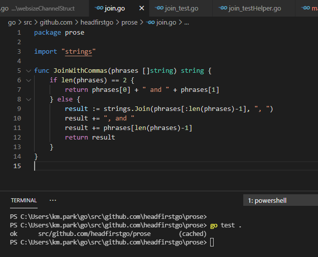
```
테스트에 통과 해서 그냥 main문을 돌려도 이상이 없을 것이다.
```
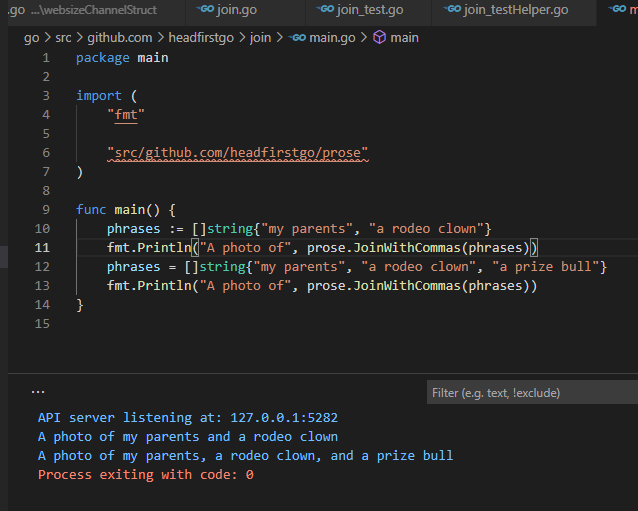
##  테스트 주도 개발  
```
1. 테스트 작성하기 
완성되지 않은 기능에 대한 테스트를 작성한 다음
테스트를 실행하여 테스트가 실패하는지 확인
2. 통과 시키기 
기능에 대한 코드를 구현
이 단계에서는 코드의 형태나 효율을 신경 안쓰고 코드가 잘 동작하도록 만드는것 목표
코드 완성 후 테스트를 실행하여 통과하는지 확인
3. 코드 리펙토링
코드를 리펙토링하고 변경하고 개선할 수 있음
처음에 테스트가 실패한 것을 확인해 봤기 때문에 
코드를 제대로 구현했는지 안했는지 확인 가능

이것처럼 코드가 깨질 염려 없이 코드를 변경할 수 있는 자유가 바로 단위 테스트를 
작성하는 진정한 이유
안전함과 제대로 작동함을 확신하고 구현할 수 있음
```
## 또 다른 버그 수정하기  
```
두개 처리하면서도 한개는 어떻게 될까 했었는데 한개의 경우에도 
버그가 생긴다. 우선 한개의 경우에 대해서 테스트를 만들자.
```
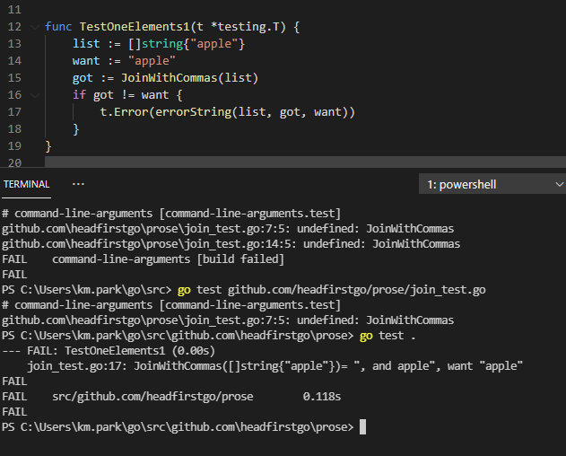  
```
단일 문자열이 들어간 경우 저런 에러가 발생한다 그렇다면 
다시 한개의 경우만 걸러주면 된다.
```

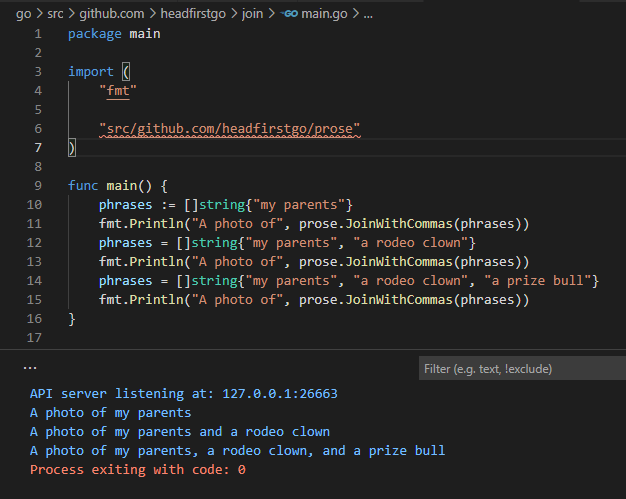
```
이렇게 하면 전체적으로 수정이 완료된 버그 없는 소스가 완성된 것이다.
테스트 코드가 있으면 느리지 않나 하는 질문을 할 수 있다. 

그렇지만 이함수들은 go test 명령에만 동작하는 것이지
go build, go install에 동작하지 않으니 속도 측면에 문제가 있지 않을까
걱정 안해도 된다.
```
## 부분 테스트 집합 실행  
```
때로는 전체가 아닌 특정 테스트만 실행해야하는 상황이 생길 수 있음
go test 명령어는 이를 위한 두 개의 명령줄 플래그를 제공하고 있음
플래그란 보통 -(대시)로 시작하는 하나 이상의 문자로 이루어진 인자를 말함
커맨드 라인 프로그램에 전달하여 프로그램의 행동을 변경하기 위한 용도로 사용

go test 명령어에서 유용하게 사용할 수 있는 첫번째 플래그는 
verbose를 뜻하는  -v 플래그 이다.

이 플래그를 추가하면 테스트 함수의 이름과 테스트 결과가 출력
```

```
하나 이상의 테스트 이름을 알고 있는 경우에는 
-run 옵션에 해당 테스트 이름을 추가함으로써
실행할 테스트의 집합을 제한 할 수 있음
```

```
이런식으로 하면 Two가 포함된 테스트를 실행
```
## 테이블 주도 테스트  
```
현재 만들어 둔 세 테스트 함수 간에는 코드가 중복된다. 
실제로는 이코드는 슬라이스를 전달하여 반환된 값이 예상한 문자열 값과 동일한지 비교
```
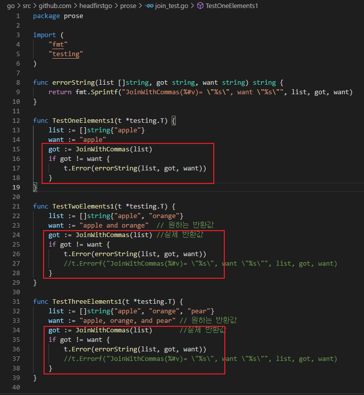
```
위의 소스를 보게 되면
세 테스트 함수를 개별로 관리하는 대신 입력 데이터와 해당 입력에 대한 예상 값을
테이블 형태로 만들어 하나의 테스트 함수에서
테이블의 각 행을 테스트 하는 방식으로 변경 가능

테이블 형태에 대한 표준은 없지만 흔히 사용되는 방법은 해당 테스트에서만 특수하게
사용할 새로운 타입을 정의하여 각 테스트에 대한 입력과 예상 출력값을 저장하는 것

다음은 실제로 사용하게 될 testData라는 타입으로
이타입에는 JoinWithCommas에 전달할 문자열 슬라이스를 저장하는 list 필드와 
예상 반환값을 저장하는 want 필드가 있음

type testData struct{
	list []string //JoinWithCommas에 전달할 슬라이스
	want string   
	//위 슬라이스에 대해 JoinWithCommas가 반환하길 기대하는 문자열
}
```
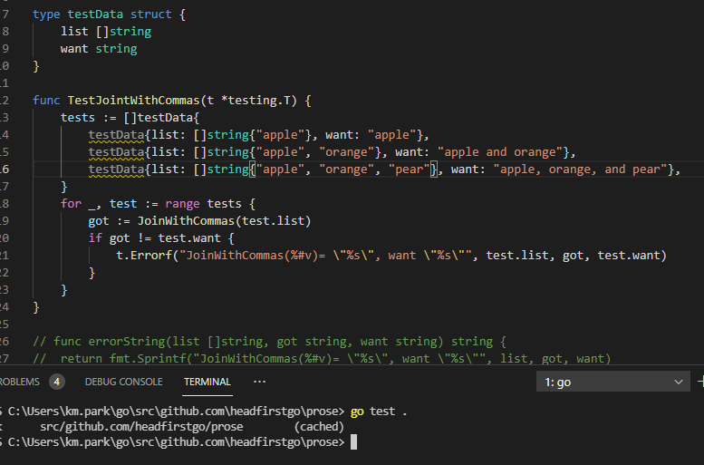
## 테스트를 사용해 패닉 발생 코드 수정  
```
만약에 빈슬라이스 전달하면 빈슬라이스 출력해야한다. 하지만 패닉이 발생을 한다.
```
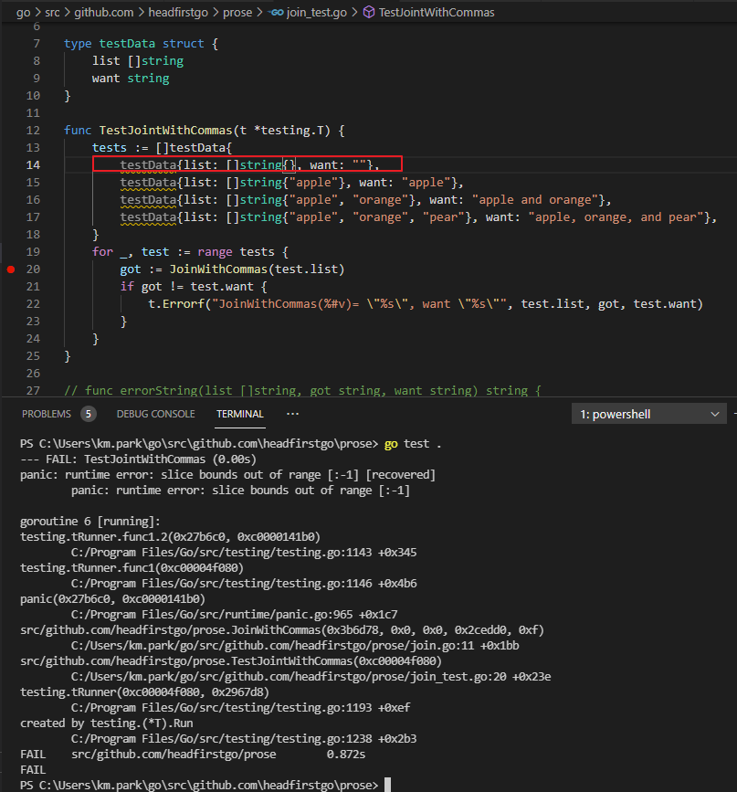
```
존재하지 않은 범위에서 접근하여 나오는 결과이다. 이것을 고치려면 
비어 있는 상태로 -1을 해서 그렇기 때문에 예외를 추가하면된다.
```
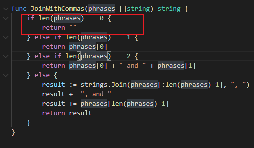
```
예외를 해주고 실행해보자.
```
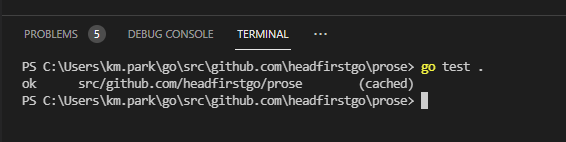
```
이제 제대로 동작하는 것이 보인다. 
```
