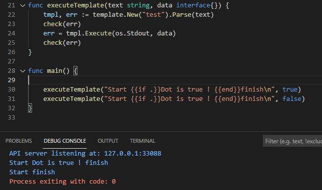

## 2021년 06월14일 golang HTML 템플릿  
```
웹 앱은 일반 텍스트가 아닌 HTML로 응답해야함 
웹 페이지에는 제목과 문단이 필요하고
사용자가 데이터를 전송할 수 있는 폼이 필요함
이를 위해서는 HTML 코드가 필요하다.

그리고 최종적으로 데이터를 HTML 코드에 삽입할 수 있어야 함
GO는 html/template 라는 패키지를 제공하고 있으며,
이 패키지는 HTML 응답에 데이터를 포함시킬 수 있는 
강력한 방법을 제공
```
## 방명록 앱  
```
방문자 는 폼에 메시지를 입력할 수 있고 이는 나중에 파일로 저장
또한 방문자는 이전의 모든 서명 목록을 볼 수 있음

우선 앱을 설정하고 방명록의 메인 페이지 요청에 응답하도록 
해야함
응답에 HTML을 추가, 몇 개의 HTML 태그를 사용한
간단한 페이지를 만들어 파일로 저장한 다음 파일에
HTML 코드를 로드하여 앱의 응답에 사용 할 것

그리고 방문자각 입력한 서명을 가져와 HTML로 보여줘야함.
html/template 패키지로 쉽게 할 수 있음

마지막으로 사용자가 폼을 전송하면 폼 내용을 새 서명으로 저장
서명 데이터는 나중에 다시 읽어 올 수 있도록 
전송된 다른 모든 서명과 함께 텍스트 파일로 저장
```
## 요청 처리 함수 와 에러 처리 함수  
```
가장 먼저 할 것 방명록의 메인 페이지를 보여 주는 것
main 함수에서 http.HandlerFunc를 호출
/guestbook 경로를 가진 모든 요청에 대해 
viewHandler라는 함수를 호출 할 수 있도록 설정
그리고 http.ListenAndServer를 호출해 서버 시작

이전에 학습 했던 것에서 check 함수라는 새로운 함수가 추가
잠재적으로 발생할 수 있는 많은 수의 error 반환 값을 
check로 전달해서 전달된 error가 nil이면 check는
아무 일도 하지 않으며 그 외에는 보고하고 프로그램 종료
```
## 소스코드  
```go
package main

import (
	"log"
	"net/http"
)

func check(err error) {
	if err != nil {
		log.Fatal(err)
	}
}

func viewHandler(writer http.ResponseWriter, request *http.Request) {
	placeholder := []byte("signature list goes here")
	_, err := writer.Write(placeholder)
	check(err)
}

func main() {
	http.HandleFunc("/guestbook", viewHandler)
	err := http.ListenAndServe("localhost:8080", nil)
	log.Fatal(err)
}
```
## 프로젝트 디렉터리 설정 및 앱 시연  
```
우선 위의 파일을 main.go로 했었는데 guestbook.go로 저장
myproject 폴더를 하나 만들어서 거기에 넣고 
그 해당 디렉토리로 가서 go run guestbook.go
명령을 입력해보자. 
그리고 인터넷창에 localhost:8080/guestbook 들어가보자.
```

```
여기까지 첫번째 작업이 완료.
하지만 현재는 일반 텍스트로만 응답하고 있음
다음에는 HTML을 사용하여 응답 데이터에 서식을 적용
```
## HTML로 서명 목록 만들기  
```
페이지에 제대로된 서식을 적용하려면 실제 HTML이 필요
HTML은 태그를 사용하여 텍스트에 서식을 적용

우선 view.html 파일을 만들어서 해당 디렉토리에 저장합시다.
```
## view.html 파일 작성  
```html
<h1>Guestbook</h1> 

<div>
    X total signatures - 
    <a href="/guestbook/new">Add Your Signature</a>
</div>

<div>
    <p>Signatures</p>
    <p>go</p>
    <p>here</p>
</div>
```
```
<h1>: 단계 제목 요소, 큰 굵은 글씨로 표시
<div>: 분할요소, 태그 자체가 직접 보이지 않고,
페이지를 섹션으로 나누는 데 사용
<p>: 문단 요소, 각 서명은 별도의 단락으로 취급, 개행
<a>: anchor의 약자, 링크를 생성
```

```
앞서 작성한 html를 열어 보면 이렇게 구성되어 있다.
```
## 앱에서 HTML로 응답하기  
```
go파일에서 HTML을 가져온 다음 HTML에 서명 목록을 삽입하는데,
사용할 수 있는 html/template 패키지를 제공하고 있음
지금은 일단 view.html에 있는 내용을 그대로 불러오고 
서명을 삽입하는 작업은 나중에 진행 

방식은 아래와 같이 진행 
html/template패키지를 임폴트하고, viewHandler함수 수정
viewHandler에서는 template.ParseFiles 함수를 호출하여 
로드할 파일의 이름인 view.html을 인자로 전달

ParseFile는 view.html의 내용을 읽어 와 Template값을 생성
Template의 포인터와 함께 error 값을 반환
반환 받은 error 값은 check함수로 전달

그리고 Template 값에서 결과값을 가져오려면 두 개의 인자와 
함께 Execute 메서드를 호출 해야함 

- 첫 번째 인자는 결과값을 쓰기 위한 대상으로 
ResponseWriter값을 전달
- 두 번째 인자는 템플릿에 삽입할 데이터를 전달하는 용도이지만
현재는 아무것도 삽입안하고 nil만 전달 
```

## "text/template" 패키지  
```
다음으로 할일은 html/template 패키지를 사용하여 
성명목록을 HTML에 삽입하는 것
HTML은 서명 목록이 변경되면 같이 변경됨
```
## text/template 패키지 사용해보기  
```go
package main

import (
	"html/template"
	"log"
	"os"
)

func check(err error) {
	if err != nil {
		log.Fatal(err)
	}
}

func main() {
	text := "Here's my template!\n"
	tmpl, err := template.New("test").Parse(text)
	check(err)
	err = tmpl.Execute(os.Stdout, nil)
	check(err)
}
```

## Execute 매서드에 io.Writer 인터페이스 사용  
```
서로 다른 http.ResponseWriter랑 os.Studout 값이 
어떻게 Template의 Excute 메서드에서 모두 유효할 수 있나?

os.Stdout 값은 os 패키지의 일부
Stdout은 표준출력의 약자 이고, 파일처럼 동작하지만 
여기에 쓰인 모든 데이터는 디스크에 저장되지 않고
터미널에 출력됨
(fmt.Println이나 fmt.Printf와 같은 함수들은 
내부적으로 os.Stdout에 데이터를 쓰고 있음)

그렇다면 http.ResponseWriter와 os.Stdout 값은
어떻게 Template.Execute에서 모두 요휴할 수 있나?
```
**go doc text/template Template.Execute**

**go doc io Writer**

```
위의 사진을 보면  Execute의 첫 번째 인자는
io.Writer인데 이것은 두번재 사진을 보면
io.Writer 인터페이스 인것 같다. 이 인터페이스는
byte 슬라이스를 매개변수로 받고 쓰인 바이트의 길이를 나타내는
int 값과 error 값을 반환하는  Write 메서드를 가진 타입이면
만족한다.
```
## ResponsWriter와 os.Stdout은 io.Writer 만족  
```
우리는 이전에 http.ResponseWriter 값이 Write 매서드를
가지고 있음을 봤다.

func viewHandler(writer http.ResponseWriter, reques *http.Request) {
	placeholder := []byte("signture list goes here")
	_, err := writer.Write(placeholder)
	check(err)
}
문자열을 바이트 슬라이스로 변환한 다음 
Write 메서드를 사용하여 응답에 추각

func main() {
	_, err := os.Stdout.Write([]byte("hello"))
	check(err)
}
데이터를 터미널에 씀 
```
```
http.ResponseWriter 값과 os.Stdout 모두 io.Write
인터페이스를 만족하여 Template 값의 Excute 메서드에 
전달할 수 있음을 의미

Execute는 전달되는 값이 무엇이든 간에 해당 값의
Write 메서드를 호출하여 템프릿을 쓰게 될 것
http.ResponseWriter에 전달하면 템플릿은 
HTTP 응답에 쓰이고, os.Stdout에 전달하면
템플릿은 터미널의 출력에 쓰일 것

text := "Here's my template!\n"
tmpl, err := template.New("test").Parse(text)
check(err)
err = tmpl.Execute(os.Stdout, nil)
check(err)
```
##  액션으로 템플릿에 데이터 삽입  
```
Template의 Execute 메서드의 두 번째 인자로는 
템플릿에 삽입할 데이터를 전달할 수 있음

인자 타입은 빈 인터페이스로 아무 값이나 전달 할 수 있음
```
```
템플릿 데이터를 삽입하려면 템플릿 텍스트에 
액션을 추가해야 함 액션은 {{}} 이중 중괄호 안에 
삽입할 데이터 또는 템플릿에서 수행할 연산을 지정할 수 있음
템플릿이 액션을 만나면 액션의 내용을 평가하여 
그 결과를 액션이 있던 템플릿 위치에 삽입

액션에서는 단일 마침표를 사용하여 Execute메서드로 
전달된 데이터 값을 참조할 수 있음
이렇게 전달된 데이터를 도트라고 함

다음 코드는 템플릿에 액션 하나를 설정 
그 다음 템플릿의 Excute 메서드를 몇번 호출해 보면 호출마다 다른 데이터 삽임
Execute는 os.Stdout에 결과값을 쓰기 전에 전달받은 데이터로 액션을 치환
```

```
값이 액션을 치환하여 템플릿에 삽입

템플릿 액션으로 할 수 있는 일은 아주 많음 
아래 만들 함수는 Parse에 전달할 템플릿 문자열과 템플릿의 Execute 메서드에
전달할 데이터 값을 매개변수로 받음
이전과 마찬가지로 각 템플릿의 결과값은 os.Stdout에 씀
```

## if 액션으로 템플릿에 선택 영역 만들기  
```
템플릿에{{if}} 액션과 대응되는 {{end}} 마커 사이에 위치한 영역은 
if 조건문이 참인 경우에만 템플릿에 포함됨
다음 코드에서 동일한 템플릿 텍스트를 두 번 실행하고 있는데
하나는 도트를 true로 다른 하나는 false로 설정
{{if}} 액션 덕분에 Dot it true 라는 텍스트는 토트가 true일때만 출력됨
```

## "range" 액션으로 템플릿 영역 반복하기  
```
템플릿에서 {{range}} 액션과 이에 대응되는 {{end}} 마커 사이에 위치한 영역은
배열, 슬라이스, 맵, 채널을 순회하면서 반복됨 
range 액션 영역 내에 위치한 모든 액션도 마찬가지로 순회 횟수만큼 반복

반복되는 영역에서 도트 값은 컬렉션의 현재 값으로 설정되기 때문에 순회하면서
컬렉션의 각 원소 값을 출력하거나 다른 작업을 수행하는 데 사용할 수 있음

{{range}}액션을 가지고 루프를 순회하기 전/ 후 에 도트 값은 슬라이스 그자체가됨
하지만 루프 내에서 도트는 슬라이스의 현재 원소를 가리킴 
```
```go
package main

import (
	"html/template"
	"log"
	"os"
)

func check(err error) {
	if err != nil {
		log.Fatal(err)
	}
}

func executeTemplate(text string, data interface{}) {
	tmpl, err := template.New("test").Parse(text)
	check(err)
	err = tmpl.Execute(os.Stdout, data)
	check(err)
}

func main() {
	templateText := "Before loop: {{.}}\n{{range .}}In loop :{{.}}\n{{end}}After loop: {{.}}\n"
	executeTemplate(templateText, []string{"do", "re", "mi"})
}
```

```
	templateText = "Price:\n{{range .}}${{.}}\n{{end}}"
	executeTemplate(templateText, []float64{1.25, 0.99, 27})
```

```
	templateText = "Prices:\n{{range .}}${{.}}\n{{end}}"
	executeTemplate(templateText, []float64{})
	executeTemplate(templateText, nil)
	
// 액션에 전달된 값이 비어 있거나 nil이면 루프는 실행되지 않음
```

## 액션으로 템플릿에 구조체 필드 삽입하기  
```
기본 타입은 한 가지 타입의 값만 갖기 때문에 템플릿을 채우는 데 필요한 다양한
정보를 가질 수 없음 템플릿을 사용할 땐 보통 구조체 타입을 많이 사용

토트값이 구조체인 경우, 도트 뒤 필드명을 붙이는 액션으로 템플릿에 필드 값을 삽입
할 수 있음

아래는 Part 구조체 타입을 생성한 다음 Part의 Name 및 Count 필드를 
출력할 템플릿을 설정함
```


## Subscriber 구조체 타입과 그것을 출력하는 템플릿  


```
이렇게 한개만 나오는것은 true와 false로 출력 여부 설정해서 이다.
```
## 파일에서 서명 목록 일어 오기  
```
먼저 템블릿에 데이터를 삽입하려면 서명 목록 데이터가 필요 
프로젝트 디렉터리에 몇 줄의 텍스트를 signatures.txt 파일로 저장
이 데이터를 서명 데이터로 사용할 것

서명 데이터를 앱으로 가져와야하는데 guestbook.go에 getStrings라는 함수 추가
파일이 존재 하지 않으면 getString는 에러를 보고하는 대신 nil값 반환
이는 osOpen에서 반환받는 error 값을 os.IsNotExist 함수에 전달함으로써 확인
이 함수는 전달받은 에러가 파일이 존재하지 않을 때 발생하는 에러일 경우 true반환
```

```go
package main

import (
	"bufio"
	"fmt"
	"html/template"
	"log"
	"net/http"
	"os"
)

func check(err error) {
	if err != nil {
		log.Fatal(err)
	}
}

func getStrings(fileName string) []string {
	var lines []string
	file, err := os.Open(fileName)
	if os.IsNotExist(err) {
		return nil
	}
	check(err)
	defer file.Close()
	scanner := bufio.NewScanner(file)
	for scanner.Scan() {
		lines = append(lines, scanner.Text())
	}
	check(scanner.Err())
	return lines
}

func viewHandler(writer http.ResponseWriter, request *http.Request) {
	signatures := getStrings("signatures.txt")
	fmt.Printf("%#v\n", signatures)
	html, err := template.ParseFiles("view.html")
	check(err)
	err = html.Execute(writer, nil)
	check(err)
}

func main() {
	http.HandleFunc("/guestbook", viewHandler)
	err := http.ListenAndServe("localhost:8080", nil)
	log.Fatal(err)
}
```

## 서명 목록과 서명 개수를 가진 구조체
```
이제 서명 슬라이스를 HTML 템플릿의 Execute메서드로 전달하여 템플릿에 서명
목록을 삽입할 수 있음
하지만 방명록 메인 페이지에서는 서명 목록과 함께 
서명의 총 개수 또한 보여주고 싶은데 

그러나 템플릿의 Excute 메서드에서는 하나의 값만 전달하기에 
서명 목록과 함께 서명의 총 개수를 함께 저장할 수 있는 구조체 타입이 필요함

우선 
type Guestbook struct{
	SignatureCount int
	Signautes      []string
}
viewHandler를 수정해보자.
```

## 템플릿에 서명 목록 추가하기  
```
view.html 템플릿을 수정합시다.
템플릿의 Execute 메서드로 Guestbook 구조체를 전달하고 있으므로, 
템플릿 내에서 도트는 Guestbook 구조체 값을 갖게 됨

먼저 첫 번째 div 요소의 X total signatures에서 X부분을 Guestbook의 
SignatureCount 필들르 삽입하는 액션인 {{.SignatureCount}}로 치환

두 번째 div 요소에서는 서명마다 p 요소를 하나씩 나열하고 있는데,
이번에는 range액션인 {{range .Signatures}}를 사용하여 Signatures 
슬라이스의 각 서명을 순회

div 끝나기 전에 {{end}}마크 꼭 추가하기 

range 액션 내부에는 도트를 출력하는 액션을 가진 p요소 
<p>{{.}}</p>가 들어 있음 
도트는 루프 내에서 슬라이스의 각 원소로 설정되므로 p요소는 슬라이스의 
각 서명에 대한 텍스트가 포함되어 출력
```


````
이렇게 적용이 된다. 
````
## 연습문제  
### bill.go   
```go
package main

import (
	"html/template"	
	"log"
)


type Invoice struct {
	Name    string
	Paid    bool
	Charges []float64
	Total   float64
}

func check(err error) {
	if err != nil {
		log.Fatal(err)
	}
}


func main() {
	html, err := template.ParseFiles("bill.html")
	check(err)
	bill := Invoice{
		Name: "Mary Gibbs",
		Paid: true,
		Charges: []float64{23.19, 1.13, 42.79}
		Total: 67.11,
	}
	err = html.Execute(os.Stdout, bill)
}
```
## 결과값  
```html
<h1>Invoice</h1>
<p>Name: Mary Gibbs</p>

<p>Paid - Thank you!</p>

<h1>Fees</h1>

<p>$23.19<p>
<p>$1.13<p>
<p>$42.79</P>

<p>Total: $67.11</p>

위의 결과 가 나오게 아래 html을 작성해라
```
## bill.html  
```html
<h1>Invoice</h1>
<p>Name: {{.Name}}</p>

{{if .Paid}}
<p>Paid - Thank you!</p>
{{end}}

<h1>Fees</h1>

{{range .Charges}}
<p>{{.}}</p>

<p>Total: ${{.Total}}</p>
```
## HTML 폼으로 사용자 데이터 받기  
```
방문자가 서명을 입력할 수 있는 HTML 폼을 만들자
폼을 사용하면 사용자가 하나 이상의 데이터를 입력한 뒤 전송 버튼을 눌러
서버로 데이터를 전송할 수 있음

우선 프로젝트 디렉터리에 new.html이라는 파일을 만들어서 
다음 html코드를 작성하합시다.

- <form>: 이 요소는 다른 폼 구성 요소들을 하나로 묶어 줌
- "text" 타입 속성을 가진 <input>: 사용자가 문자열을 입력할 수 있는 텍스트 필드
name 속성은 서버로 전송되는 필드 갑에 대한 라벨로 사용
(맵의 키라고 생각하면 된다.)
- "submit" 타입 속성을 가진 <input>: 사용자가 클릭하여 폼 데이터를 
- 전송할 수 있는 버튼을 생성
```

## HTML 폼에 응답  
```
이전의 Add Your Signature 링크를 클릭하면 연동되게 해봅시다.

func newHandler(writer http.ResponseWriter, request *http.Request) {
	html, err := template.ParseFiles("new.html")
	check(err)
	err = html.Execute(writer, nil)
	check(err)
}
//guestbook.go에 선언해주고 
main문쪽에 
http.Handlefunc("/guestbook/new",newHandler)

해주면 링크를 눌렀을때 이동이 가능하다.
```
## 폼 전송 요청  
```
이제 마지막 작업을 합시다. 
누군가 URL로 직접 접속하거나 링크를 클릭하여 들어 가서 
서명을 입력하고 버튼 누르면 제대로 동작하게 합시다. 
```
## 폼 전송을 위한 경로 및 HTTP 메서드  
```
폼을 전송하기 위해서는 서버 요청을 두 번 해야함 
하나는 폼을 가져오는 요처,
다른 하나는 사용자가 입력한 데이터를 서버로 전송하는 요청

폼의 HTML을 수정하여 두 번째 요청을 전송할 위치와 방법을 지정해 보자.

new.html부분에 아래와 같이 수정합니다.
```

## 메소드 설명 GET와 POST  
```
HTTP 요청이 사용할 수 있는 몇 가지 메서드를 정의 
GET: 보통 URL을 입력하거나 링크를 클릭하는 등 브라우저가 서버에 무언가를
가져와야 할 때 사용, 요청은 HTML 페이지, 이미지 또는 기타 리소스 등이 될 수 있음

POST: 보통 새로운 데이터로 폼을 전송하는 등 브라우저가 서버에 데이터를 추가해야
할 때 사용

현재는 방명록 세명 데이터를 추가하고 있으므로 POST 요청을 통해 전송하는게 적절
폼은 기본적으로 GET 요청으로 전송되기 때문에 form 요소에 POST method 속성을
명시적으로 추가해야함

현재 폼에 새로고침하고 입력해서 전송하면 
404 에러가 반환된다. /new 경로에 대한 핸들러를 아직 만들지 않아 그렇고,
POST요청으로 폼을 전송하기 때문에 폼 데이터가 더 이상 URL 끝에 
추가되지 않음을 볼 수 있음
```

## 요청에 담긴 폼 필드 값 가져오기  
```
폼을 POST 요청으로 전송하고 있기 때문에 폼 데이터는 요청 경로의
매게 변수가 아닌, 요청 그자체에 담김

요청 핸들러를 생성해주자.

func createHandler(writer http.ResponseWriter, request *http.Request) {
	signature := request.FormValue("signature")
	_, err := writer.Write([]byte(signature))
	check(err)
}

	http.HandleFunc("/guestbook/create", createHandler)
```
```
위와 같이 guestbook.go에 선언을 해주고 폼에 입력후 전송하면된다.
```

```
일단 제대로 구현했는데 안되는 이유는 모르겠다.
(전송이 안됨 확인 해야할듯)
```
## 폼 데이터 저장하기  
```
createHandler 함수는 폼 데이터 요청을 받아 요청에서 방명록 서명 데이터를 
꺼내 올 수 있음
다음으로 할 일은 꺼내 온 데이터를 signature.txt 파일에 추가하는 것
이 작업은 createHandler 함수에서 처리할 수 있음

우선 서명 필드만 가져오면 되니 ResponseWriter의 Write 메서드 호출 코드는 지움
작업 할 것
1. signature.txt를 열어준다. 파일이 존재하지 않을 경우 파일을 생성
2. 파일 끝에 텍스트 한 줄을 추가
3. 파일을 닫음
```


```
위와 같이 동작을 한다. /create부분에 안찍히는 것은 
더 이상 http.ResponseWriter에 아무런 데이터도 쓰지 않기 때문
```
## http 리다이렉트  
```
create 부분에서 우리가전송한 것을 확인하는 곳으로 이동 시켜보자.

func createHandler(writer http.ResponseWriter, request *http.Request) {
	signature := request.FormValue("signature")
	options := os.O_WRONLY | os.O_APPEND | os.O_CREATE
	file, err := os.OpenFile("signatures.txt", options, os.FileMode(0600))
	check(err)
	_, err = fmt.Fprintln(file, signature)
	check(err)
	err = file.Close()
	check(err)
	http.Redirect(writer, request, "/guestbook", http.StatusFound)
}

	http.Redirect(writer, request, "/guestbook", http.StatusFound)
이것을 마지막에 추가하면된다.
```

```
소스 코드는 맞는데 이게 입력시 txt파일에 입력이 공백으로 들어가는현상이 있긴함
이점은 다시 구현하면서 문제점 찾아야할듯 
이것 빼고는 전체적으로 제대로 동작함
```

