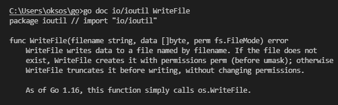

## 2021년 06월15일 golang 사용 패키지   
## import "io/util"  

## import "unicode/utf8"  
```
	acsString := "BDEG"
	utfString := "БГДЁ"
	fmt.Println(utf8.RuneCountInString(acsString))
	fmt.Println(utf8.RuneCountInString(utfString))
	
	//제대로 룬의 길이 반환
```