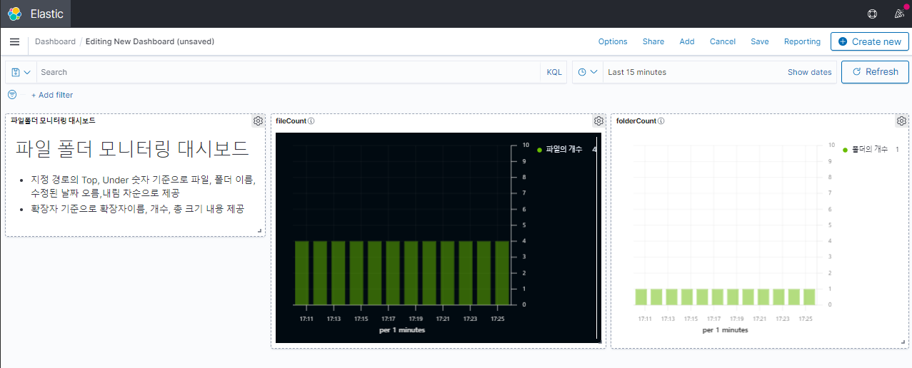

## 2021년07월27일-키바나인덱스패턴  
## 인덱스 패턴 만들기  


- Stack Management로 들어간다.  

- Index Patterns를 누른다.   

- Create Index pattern 클릭   

- 위와 같이 lsbeat-* 라고 해주고 다음 단계 버튼을 누른다.     

- 타임스탬프로 클릭해준다.

- 그렇게 되면 이렇게 만들어진다.  
## 데이터 확인 하기  

- Discover부분에 들어간다.

- 화살표를 누르고 우리가 앞서 만든 lsbeat-*를 클릭한다.  

- 위와 같이 제대로 비트가 동작한게 보인다.
- 위는 기본으로 제공되는 비트의 예시이고 뒤에서는 만든 비트를 화면에 구현하면 된다. 
## lsbeat - 만든 비트에 적용 하기 
```go
	event := beat.Event{
			Timestamp: time.Now(),
			Fields: common.MapStr{
				"type":    b.Info.Name,
				"counter": counter,
			},
		}
		bt.client.Publish(event)
		logp.Info("Event sent")
		counter++
```
- 위의 부분이 데이터를 전송하는 부분이다.   
- 데이터를 넘겨보자.   
```go
		event := beat.Event{
			Timestamp: time.Now(),
			Fields: common.MapStr{
				"type":      b.Info.Name,
				"fileTop":   file.Top,
				"fileUnder": file.Under,
			},
		}
		bt.client.Publish(event)
		logp.Info("Event sent")
```
- 우선 동작확인만 해보자    

- 위와 같이 제대로 넘어가는게 보인다. 그럼 데이터를 잘 넘기면 끝  

- 데이터가 잘넘어가는데 이를 대시보드에 잘 넣을수 있게 만들어야함 

```
//before
"extensionFile": writerExtensionFile,

//after				
"extensionFileName":    writerExtensionFile.name,
"extensionFileCnt":     writerExtensionFile.cnt,
"extensionFilesumSize": writerExtensionFile.sumSize,
```
- 한번에 데이터 넘기려고 했는데 제대로 실행이 안됨
- 그래서 아래와 같이 부분을 나눠서 데이터 보내서 제대로 보내짐  
## 무작정 Dashboards 만들기 
- 이렇게 까지는 구현이 가능하다.  

- 일단 근데 문제는 아래사진을 보면 넘어오는 데이터가 타입이 없이 넘어오는 느낌?

- 잘보면 기본으로 있던것은 t로 되어있고 직접넣은것은 저렇게 상자다.

- 이부분에도 바꿔줘야하는것 같다. 
- filed.yml에서 해야하는데 위에서는 적용이 안됨
- 다른 방법이나 자료형을 바꾸는것 적용해야함 
