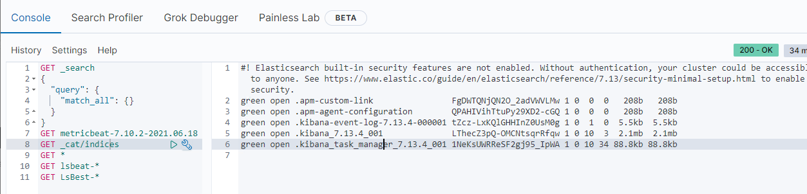

## 2021년07월27일LsBeat네트워크  
```
2021-07-26T23:54:22.864Z        ERROR   [publisher_pipeline_output]     pipeline/output.go:154        Failed to connect to backoff(elasticsearch(http://localhost:9200)): Get "http://localhost:9200": dial tcp [::1]:9200: connect: cannot assign requested address
```
- 현재 위와 같은문제가 발생 
## 문제  
- 추측 컨테이너가 개별이라서 서로의 존재를 몰라서 통신이 불가
## 문제 해결 방법
- [x] 1.문제를 해결하기 위한 방법으로 컨테이너를 같은 네트워크에 묶기
- [x] 2.또는, 도커컴포스 파일 만들때 한번에 만들어서 같은 네트워크로 묶기 
## 1. 같은 네트워크로 컨테이너 묶기  

### 네트워크 검색  
```go
docker network ls
```
- 위의 명령어를 이용해서 현재 네트워크를 검색한다
### 네트워크 정보확인
```go
docker network inspect <네트워크 이름 또는 ID>
```
- 네트워크를 상세정보를 확인해서 어떤 컨테이너가 있는지 보자.
```go
docker network inspect bridge
```

- 이곳에는 beatsTest가 있다.
```go
docker network inspect docker_odfe-net
```

- 이곳에는 키바나와 일라스틱서치가 있음
- 그렇다면 bridge 쪽에 beatsTest 연결을 해제하고 docker_odfe-net에 연결을해보자.
### 네트워크 연결 또는 해제  
```go
docker network connect <연결한 네트워크이름> <연결할 컨테이너이름>
- golang은 설치가 되지만 문제는 apt-get이 호환이 안됨
- cenOS7 에서는 apt-get 사용 못하고 docker로 설치해도 실행이 안됨 

docker network disconnect <해제한 네트워크이름> <해제한 컨테이너이름>
```
```go
docker network disconnect bridge beatsTest
docker network connect docker_odfe-net beatsTest
```
- 위와같이 해제하고 연결해서 확인해보자.  

```go
docker network inspect docker_odfe-net
```

- 위와 같이 확인해보면 제대로 비트가 들어간것이 보인다. 


-  같은 네트워크를 공유하니 핑테스트가 가능하다. 이제는  에러가 생기지 않는지 확인해보자.  

- 이래도 아직 에러가 발생한다. 
  - 그럼 컴포즈 파일로 네크워크 연결한 방법을 해보자.
## 2. 도커컴포즈 파일로 네트워크 연결  
- 비슷하게 네트워크로 연결하는것이라 안된
## 3. 그냥 일반적인 일라스틱, 키바나 설치  
[일라스틱](https://www.elastic.co/kr/downloads/past-releases/elasticsearch-7-13-4)
[키바나](https://www.elastic.co/kr/downloads/past-releases/kibana-7-13-4)

- c드라이브로 이동 해서 압축풀기  
- C:\elasticsearch-7.9.0\bin 경로로 이동하여 아래와같이 입력하여 elasticsearch를 실행
- cmd 에서 실행 권장, bin까지 가서 elasticsearch 입력


- 그다음 키바나 실행  



- 재설치 진행해도 안됨
## 4.elasticsearch컨테이너 안에서 진행
- golang은 설치가 되지만 문제는 apt-get이 호환이 안됨
- cenOS7 에서는 apt-get 사용 못하고 docker로 설치해도 실행이 안됨 
## 5. 네트워크 연결 하고 yml host 변경하기  
- 우선은 같은 네트워크를 공유 한 상태로 만든다. 
```go
docker network inspect docker_odef-net
```

- 위와 같이 키바나, 일라스틱 서치는 같은 곳에 들어 있는데 비트를 같은 네트워크에 연결을 해주면 위와 같은 상태이다. 
- 여기서 이제 lsbeat.yml 파일에서 host 부분이 localhost:9200 인데 이를 일라스틱이름인 odfe-node1으로 해주면 된다. 
### lsbeat.yml  

- 위와 같이 해준다. 위에서 ping 테스트 할때도 이름으로 해서 ping 테스트가 됬기 때문에 위와 같이 적용 
### 키바나 상태 확인  
```sql
GET _cat/indices
```
- 인덱스가 검색이 되는데 아래와 같이 나오면 성공  

