## 2021년08월11일_큐레이터 설정Cron설정및lsbeat리팩토링

## 리눅스 우분투 쪽에 큐레이터 설치하기  

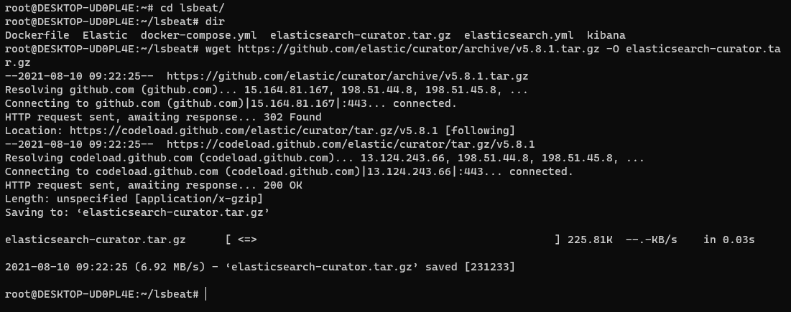

```json
wget https://github.com/elastic/curator/archive/v5.8.1.tar.gz -O elasticsearch-curator.tar.gz
```

- 현재 우선 큐레이터를 설치 파일을 받아옴

```go
 wget https://packages.elastic.co/curator/5/windows/elasticsearch-curator-5.8.4-amd64.zip
```

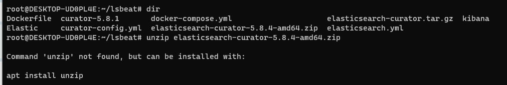

```go
apt install unzip
```

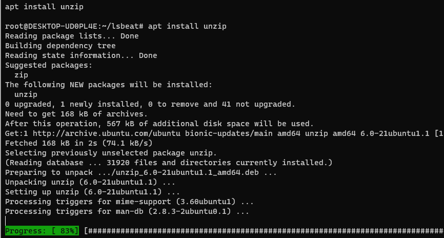

```go
unzip elasticsearch-curator-5.8.4-amd64.zip
```

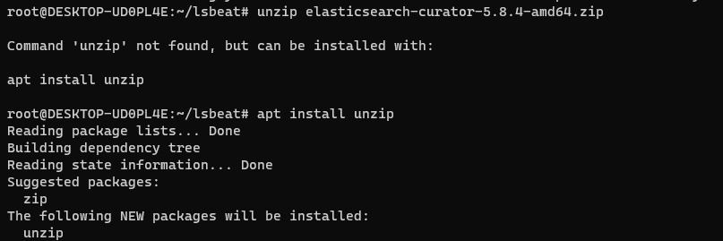

## curator-config.yml

```yaml
---
# Remember, leave a key empty if there is no value.  None will be a string,
# not a Python "NoneType"
client:
  hosts:
    - 127.0.0.1
  port: 9200
  url_prefix:
  use_ssl: False
  certificate:
  client_cert:
  client_key:
  ssl_no_validate: False
  http_auth:
  timeout: 30
  master_only: False

logging:
  loglevel: INFO
  logfile:
  logformat: default
  blacklist: ['elasticsearch', 'urllib3']
```

## delete.yml

```yaml
---
# Remember, leave a key empty if there is no value.  None will be a string,
# not a Python "NoneType"
#
# Also remember that all examples have 'disable_action' set to True.  If you
# want to use this action as a template, be sure to set this to False after
# copying it.
actions:
  1:
   action: delete_indices
   options:
     ignore_empty_list: True
     disable_action: False 
   filters:
   - filtertype: pattern
     kind: prefix
     value: lsbeat-
     exclude:
   - filtertype: age
     source: name
     direction: older
     timestring: '%Y.%m.%d'
     unit: days
     unit_count: 6
     exclude:
```

```go
curator --config C:\Users\km.park\Desktop\lsbeat\curator-config.yml --dry-run C:\Users\km.park\Desktop\lsbeat\delete.yml
```

- 위에 명령어가 윈도위에서 했던것 인데, 우분투에서 변경하면 아래와 같음

```go
curator --config \\root\\lsbeat\\curator-config.yml --dry-run \\root\\lsbeat\\delete.yml
```

- 이렇게 하면 경로가 없다고 나옴

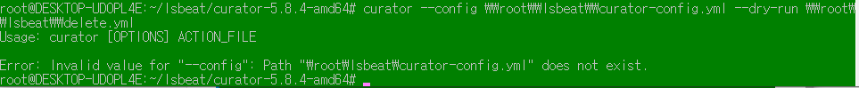

```go
curator --config curator-config.yml --dry-run delete.yml
```

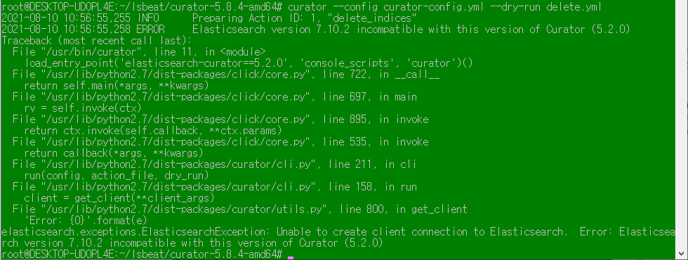

- 우분투에서 경로를 제대로 못받아오는것 같기도 함

## docker-compose.yml

```yaml
version: '3.3'

services:
 curator:
    image: bobrik/curator:latest
    container_name: curator
    user: $USER
    volumes:
      - /data/volume/curator:/volume
    entrypoint: ["curator", "--config", "curator-config.yml", "--dry-run", "delete.yml"]
    network_mode: docker_odfe-net
```

- 제대로 안되는 이유를 모르겠음 경로를 못찾는 듯

## Cron 설치 (자동화 준비)

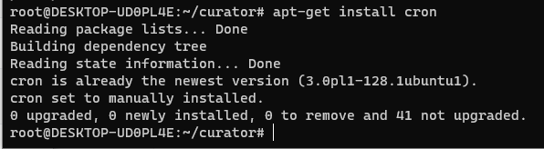

```go
apt-get install cron
```

## etc로 이동

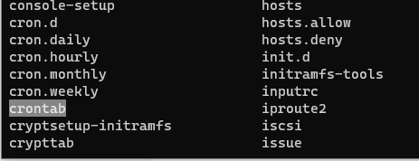

- 이곳에 crontab이라는게 있음

```go
crontab -e
```

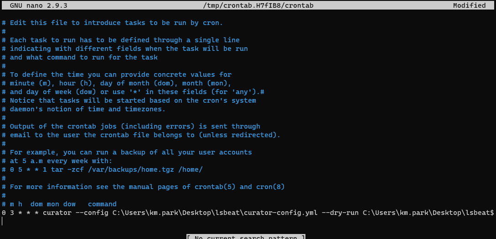

```
0 3 * * * curator --config C:\Users\km.park\Desktop\lsbeat\curator-config.yml --dry-run C:\Users\km.park\Desktop\lsbeat\delete.yml
```

- 이렇게 적어주면 새벽 3시에 자동으로 동작시키는것 
- 우선 저 자체 링크가 안되니 동작확인을 위해
- curator 이후 부분을 apt-get update로 변경

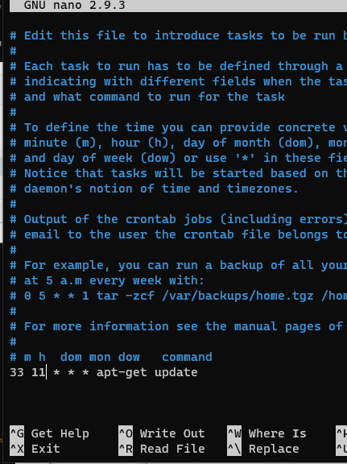

- 현재 시간 기준으로 11시 33분에 진행

```go
crontab -l 
```

- 위 명령어 하면 동작명령을 확인 할 수 있음

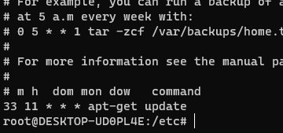

- 동작을 시키는것은 아래와 같음

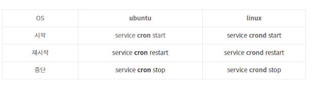

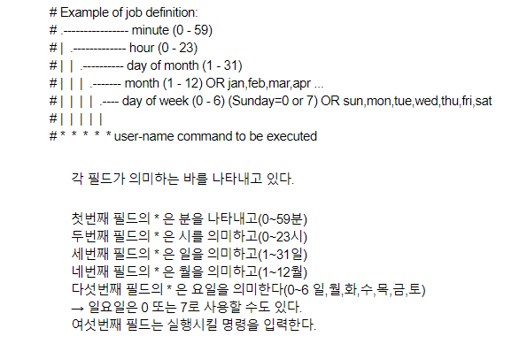

- 하는 방식은 맞고 제대로 동작하는지 확인 하기 위해서 아래와 같이 하면됨 

```go
crontab -e
```

- 여기로 해서 접근해서 우선 아래와 같이 작성해준다.

```go
*/1 * * * * date >> date.log
```

- 일분마다 date.log에 기록

## cron 실행 

```go
service cron start

//상태 확인 service cron status
```

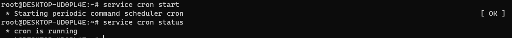

- 이렇게 나오면 정상임

## crong 스케줄 확인 

```go
crontab -l
```

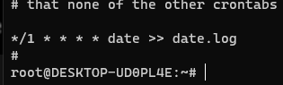

- 이렇게 까지 됬으면 이제 제대로 date.log에 일분마다 기록하는지 확인 해보자.

## 홈 디렉토리로 가기

``` go
cd ~

ls
```

- 제일 위에 명령어로 홈 디렉토리로 가고 그 곳에서  보면 date.log 가 있음

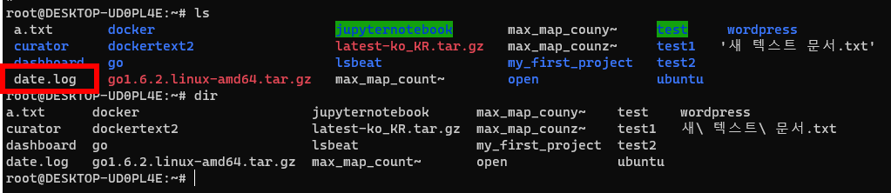

## 로그기록 확인하기  

```go
tail date.log 

tail -f date.log
```

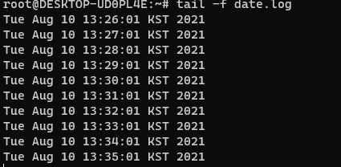

- -f 팔로우 같은것으로 계속 실시간으로 보여줌 
- 제대로 동작하는 것을 볼 수 있음

## 오류가 로그에 안찍힐 때 

- date 자체의 출력은 standard out 이지만 에러는 standard error 이다.

```go
date. log 2>&1
```

- 2 : 표준에러
- 1: 표준 출력 (&1) &까지해야지 제대로 표준 출력임
- 즉, 표준 에러를 표준 출력으로 리다이얼 해주라는것 

[참고 동영상](https://edu.goorm.io/learn/lecture/12984/%EC%83%9D%ED%99%9C%EC%BD%94%EB%94%A9-%EB%A6%AC%EB%88%85%EC%8A%A4-linux/lesson/563293/%EC%A0%95%EA%B8%B0%EC%A0%81%EC%9C%BC%EB%A1%9C-%EC%8B%A4%ED%96%89-cron)

## 우분투에서 큐레이터 동작 시키기 

```go
curator --config ~/lsbeat/curator-config.yml --dry-run ~/lsbeat/delete.yml
```

- 큐레이터 설치된 폴더에서 동작하는 명령어 
- 현재 에러는 아래와 같음 

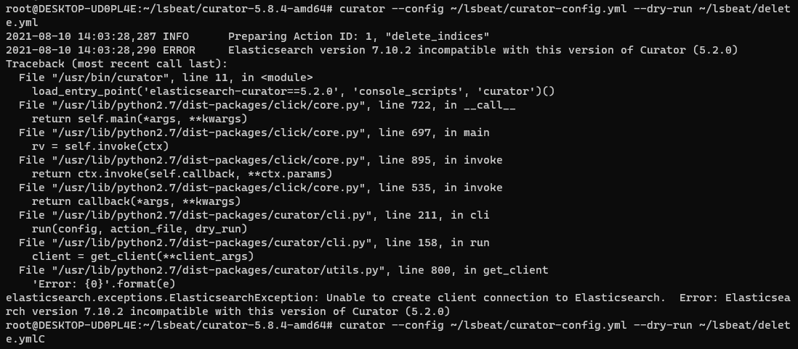

- 현재 일라스틱이랑 연결이 제대로 안되는것 같음  

## 다시 처음 부터 다시 설정하기 

### createindexactionfile.yml

```yaml
   actions:
     1:
       action: create_indices
       description: Create the index as named, with the specified extra settings.
       options:
         name: curatorindex
         extra_settings:
            settings:
              number_of_shards: 2
              number_of_replicas: 1
         disable_action: False
```

```go
curator --config /root/lsbeat/curator-config.yml /root/lsbeat/createindexactionfile.yml
```

- 현재 우분투에 큐레이터 잘못 설치되어 있음

## 문제 점 

```
apt-get install elasticsearch-curator
```

- 이렇게 그냥 설치를 했던 적이 있어서 
- version이 5.2.0이 설치됨 
- 이후에 특정 버전 설치하기 위해서 해봐도 제대로 설치가 안됨
- 그래서 우선 기존에 있는 큐레이터 전부 삭제 

```go
sudo apt-get purge --auto-remove elasticsearch-curator
```

- 위 명령어로 큐레이터 전부 삭제 

## 기존에 설치된 항목으로 인덱스 생성 진행 

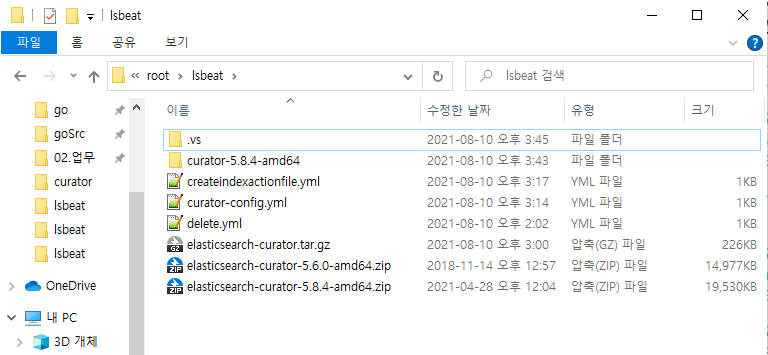


- 일전에 curator-5.8.4-amd64를 설치함
- 하지만 powershell로만 실행이 되기때문에 이게 curator라고 하면 명령어 제대로 안됨

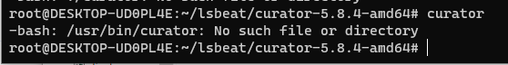

- 위와 같이 나옴 

## visual Code를 이용해서 설치 진행 

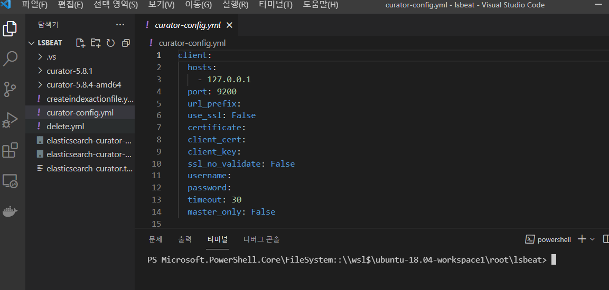

- 비주얼 코드로 해당 디렉토리를 실행

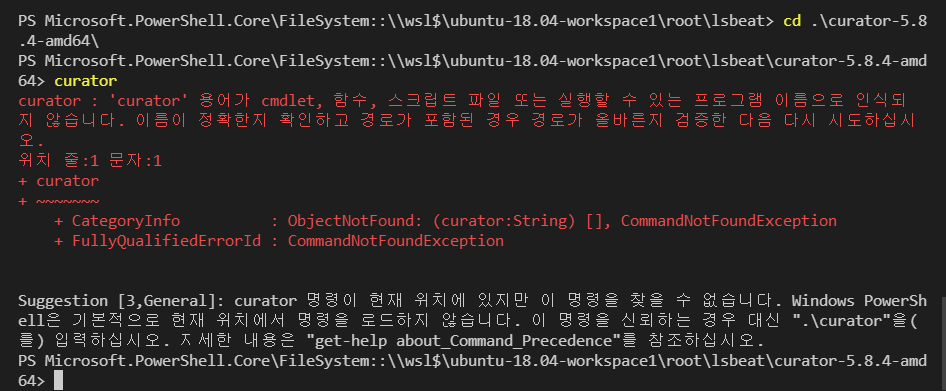

- 큐레이터 설치 폴더로 이동해서 같은 명령어 해도 제대로 실행 안되
- 여기서는 그대신 ./curator 라고 하면 명령어 동작함 

```go
./curator --version
```

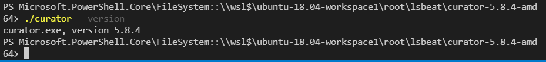

- 자세히 보면 위의 명령어가 실행 되는것이 보임 

- 일단 명령어 전부 치기전에 키바나에서 인덱스 확인 

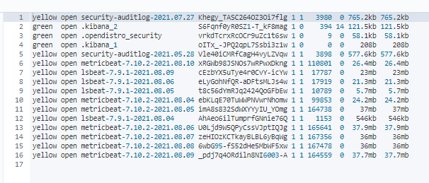

- 현재는 큐레이터 인덱스 패턴 존재하지 않음 

## 큐레이터 인덱스 생성 하기

```go
./curator --config /root/lsbeat/curator-config.yml /root/lsbeat/createindexactionfile.yml
```

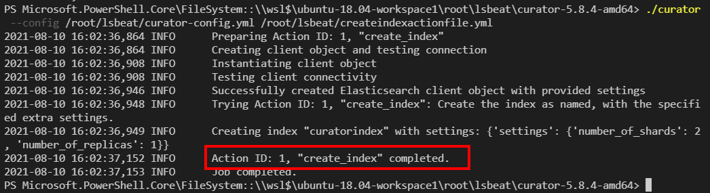

- 이렇게 되면 제대로 동작됨 그리고 키바나 인덱스 패턴 확인 

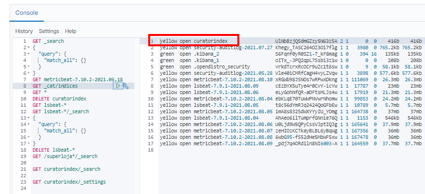

- 현재 보면 큐레이터 인덱스 생성됨

```go
GET curatorindex/_search

GET curatorindex/_settings
```

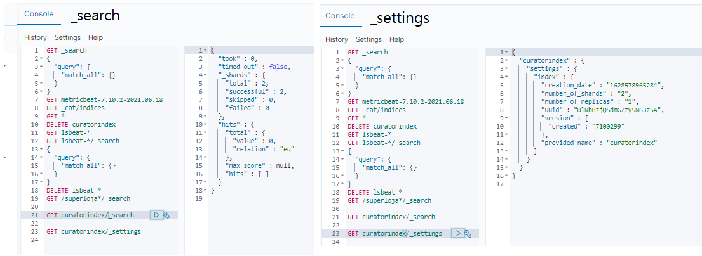

## 큐레이터 동작 확인 

```go
./curator --config /root/lsbeat/curator-config.yml --dry-run /root/lsbeat/delete.yml
```

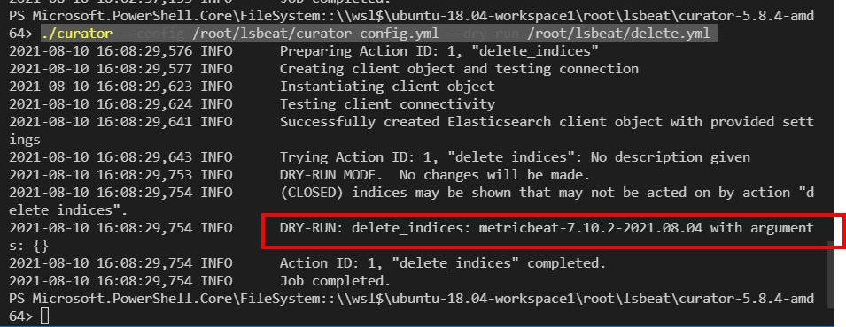

- 현재 시점으로 6일전 매트릭비트 인덱스 패턴 삭제 확인 08월10일 이라서 08월04일이 확인됨
- 여기서 --dry-run을 지우면 진짜로 삭제가 진행됨

## 또다른 문제

- 현재는 설치된 폴더에서 진행 했는데 이것이 저 명령어 그대로 cron에서 동작하지에 대해서 확인이 필요
- 그렇지 않는다면 5.2.0 버전이 아닌것을 설치하는법을 찾아봐야함 

```go
*/1 * * * * /root/lsbeat/curator-5.8.4-amd/curator --config /root/lsbeat/curator-config.yml --dry-run /root/lsbeat/delete.yml
```

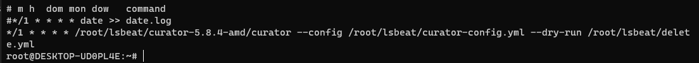

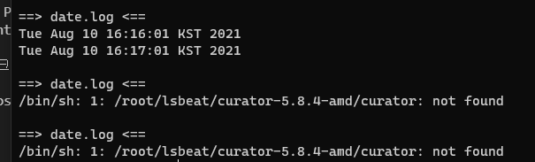

- 현재 찾을 수 없는 에러 생김 

## pip로 설치 

```go
pip install -U elasticsearch-curator==5.8.3
```

- apt-get으로 는 무조건 5.2.0 버전 설치 하지만 이렇게 하니 5.8.3 버전 설치됨 

##  Command not found  문제

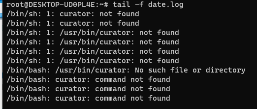

- cron 부분에서 자동화 하려고 보니 현재 이부분에서 오류 발생 
- command 명령어를 못찾음 하지만 이렇게 하면 해결 가능 

```go
PATH=/usr/bin:/bin:/usr/sbin:/sbin:/usr/local/bin
LD_LIBRARY_PATH=/usr/local/lib
```

- 저렇게 경로를 지정해줘야함
- 기본 crontab의 기본 PATH는 /usr/bin 밖에 없음
- 그래서 /usr/local/bin/ 등 다른 경로에 있는 command에 대해서는 crontab이 인식하지 못함 
- 대게 pip로 설치를 하게 되면 그 경로는 /usr/local/bin/<설치한 것>  이니까 저런 오류가 생김

저렇게 까지 하면 아래와 같은 결과를 얻을 수있음

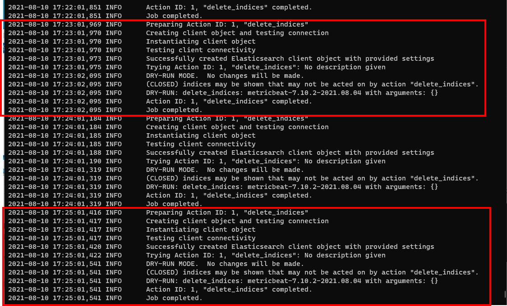

- 현재는 지우기전에 확인만 하게 해놓은 거라 실제적으로 지워지지는 않음
- 그냥 1분동안 로그기록을 찍어줌 지워야하는것이 이거라는것을 명시함

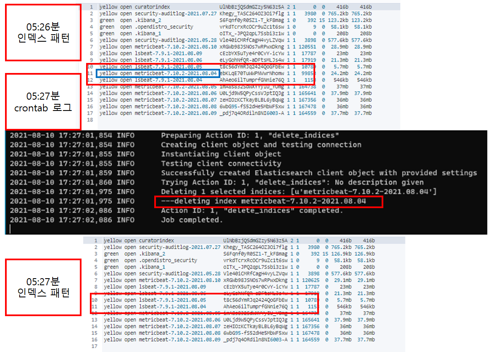

- 정확히 08.04일 매트릭 비트가 지워진것이 확인 됨 
- 6일 이상이 지난 데이터를 삭제를 했으니 제대로 동작함을 알 수 있음

