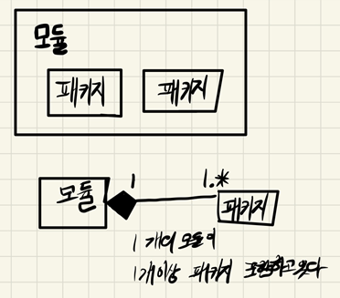
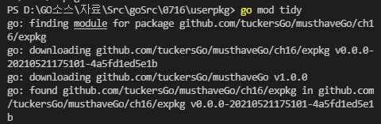
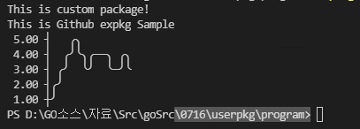
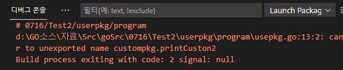
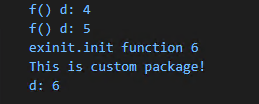

## 2021년 07월16일 모듈과 패키지  
## 모듈의 역사  
- Go 1.11 이전 모듈은 없었음 
  - GOPATH안에 모든 폴더 넣어야했음 
- Go 1.11 모듈이 소개됨, 하지만 미완성
- Go 1.13 모듈의 완성
- Go 1.16 모듈이 기본 사양이 됨 
## 모듈은 패키지의 모음  
- 모듈안에 패키지들이 들어있다.   

## 패키지 란?
- 코드를 묶는 단위
- 모든 코드는 반드시 패키지로 묶여야 한다.  
## 프로그램이란  
- 실행파일 관점에서 실행 파일 + 데이터파일 의 합
- 실행 시작 지점을 포함한 패키지
- 즉, main함수를 포함한 main 패키지를 빌드하는것을 프로그램이라고함
##  Main 패키지가 아닌 그 외 패키지
- 실행 시작 지점을 포함하지 않은 패키지로 프로그램의 보조 패키지로 동작
- import해서 사용하는 패키지 이것은 모듈 안에 있다. 
## 겹치는 패키지명
```go 
import (
	"text/template"
    "html/template"
)
//별칭 설정 
import (
	"text/template"
    htemplate "html/template"
)
func main(){
    template.New("foo").Parse(`{{define "T"}}Hello`)
    htemplate.New("foo").Parse(`{{define "T"}}Hello`)
}
```
## 사용하지 않는데 import하는 경우 
```
import(
	_ "string"
)
```
- 왜 사용하지 않는 패키지를 포함해야하는가?
  -  패키지 초기화에 따른 부가효과를 위해서 그렇다. 
  - init()라는게 자동으로 실행되는데 이것을 사용하기 위함 
## Test1
## custompkg.go  
```go 
package custompkg

import "fmt"

func PrintCustom() {
	fmt.Println("This is custom package!")
}
```
## usepkg.go
```go
package main

import (
	"0716/userpkg/custompkg"
	"fmt"

	"github.com/guptarohit/asciigraph"
	"github.com/tuckersGo/musthaveGo/ch16/expkg"
)

func main() {
	custompkg.PrintCustom()
	expkg.PrintSample()
	data := []float64{1, 2, 3, 54, 5, 4, 3, 34, 4, 4, 3, 3, 34, 3}
	graph := asciigraph.Plot(data)
	fmt.Println(graph)
}
```
- go mod init 07016/userpkg
  - 모듈 설정 init뒤에는 사용자가 설정 
- go mod tidy 
  - 이 모듈이 사용하고 있는 외부 패키지 전부 다운
  
- 위의 패키지는 어디에 들어 있냐면 GOPATH에 들어가 있다.
## 빌드 후 실행  
- 우선 \0716\userpkg\program 위치로 옵니다.
- go build 
  - 명령을 실행하면 exe 파일이 만들어짐
- ./program.exe 
  - 프로그램 실행 
- 결과 

## 패키지 외부 공개  
- 패키지내 타입, 전역변수, 상수, 함수, 메서드 등을 외부로 공개해서 사용할 수 있음
- 대문자로 시작하면 외부 공개
- 소문자로 시작하면 비공개  
## Test2 
## custompkg.go   
```go 
package custompkg

import "fmt"

func PrintCustom() {
	fmt.Println("This is custom package!")
}
func printCuston2() {
	fmt.Println("This is custom package2!")
}
```
## usepkg.go  
```go
package main

import (
	"0716/Test2/userpkg/custompkg"
	"fmt"

	"github.com/guptarohit/asciigraph"
	"github.com/tuckersGo/musthaveGo/ch16/expkg"
)

func main() {
	custompkg.PrintCustom()
	custompkg.printCuston2()
	expkg.PrintSample()
	data := []float64{1, 2, 3, 4, 5, 4, 3, 4, 4, 4, 3, 3, 4, 3}
	graph := asciigraph.Plot(data)
	fmt.Println(graph)
}
```

- 위와 같이 당연히 에러가 발생  
## 패키지 초기화  
- 패키지가 프로그램에 포함되어 초기화 될때 패키지내 init()가 한번만 호출
- init()통해서 패키지내 전역 변수를 초기화 한다. 
## Test3  
## exinit.go  
```go
package exinit

import "fmt"

var (
	a = c + b
	b = f()
	c = f()
	d = 3
)

func init() {
	d++
	fmt.Println("exinit.init function", d)
}
func f() int {
	d++
	fmt.Println("f() d:", d)
	return d
}

func PrintD() {
	fmt.Println("d:", d)
}
```
## userpkg.go  
```go
package main

import (
	"0716/Test1/userpkg/custompkg"
	"0716/Test3/exinit"
)

func main() {
	custompkg.PrintCustom()
	exinit.PrintD()
}
```


```go
var (
	a = c + b
	b = f()
	c = f()
	d = 3
)

func f() int {
	d++
	fmt.Println("f() d:", d)
	return d
}
```
- 이렇게 패키지를 정의해놓으면 위에 들어가서 초기화를 진행
- 처음 a = c + b 에서 a를 결정하려면 c와 b를 알아야하는데 
c = f()이여서 f()으로 들어간다. 
- f()에가서 보니 d = 3이었다가 ++되서 4가되어 4를 리턴함 
  c 는 그래서 **4**가 되는 것이고 
- b를 확인하려고 가니 f() 이고 이전의 d가 4 여서 5가되고 
- b는 결국 **5**가됨
- a 는 c + b , 4 + 5 라서 **9**가됨 
- 그리고 패키지 안에 init  가 있으면 그것을 실행 해줌
- 여기서 포인트는 이패키지를 다른 패키지에서 써도 init는 딱 한번만 진행이된다.
- exint 패키지 가 있고 custompkg가 서로를 임폴트하면 그것은 허용하지 않음

## 테스트 코드  

 [Package.Moudel.zip](Package.Moudel.zip) 
