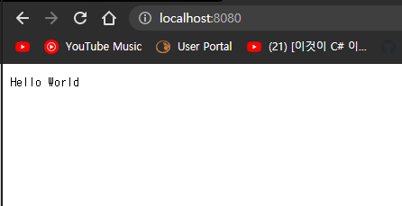
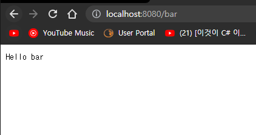
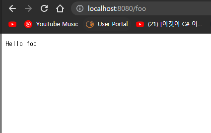
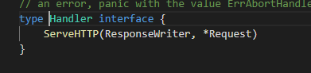

# 2021년07월25일-GoLang_WebHandler  
## Go로 만드는 웹  
- 웹은 기본적인 스킬이고 능력이 있으면 좋다.   
- 미래사회의 기본적인 스킬  
## HTML  
- Hyper Text Markup Language  
- Hyper Text : Text이기 하지만 Hyper링크를 가진 텍스트이다.  
- 번외 -> HTTP : Hypertext transfer protocol  : 하이퍼 텍스트를 리스폰스나 리퀘스트하는것을 어떻게 보낼것인가 하는 규약  
- 과거에는 Server Render 이라고 Request를 보내게되면 서버가 HTML 파일을 텍스트로 만들어서 Response보냄
- 지금은 Client Render 이라고하는데 Request를 하면 서버에서 요새는 부분적인 HTML이라고 틀을 제공 이런 틀을 부분적으로 Response하면서 틀을 채우는데 json Data로 Client를 그려주는 형태  
## 요즘  
- Frontend는 화면 구성 Backend 서버에서 데이터만 잘보내줌 (대용량 부하를 어떻게 랜더링 할지에대해서 )
- 고언어는 쉽게 고성능 서벌 백엔드에 특화 되어 있는 언어이다.
## WEB1-1  
```go
package main

import (
	"fmt"
	"net/http"
)

func main() {
	http.HandleFunc("/", func(w http.ResponseWriter, r *http.Request) {
		fmt.Fprint(w, "Hello World")
	})
	http.ListenAndServe(":8080", nil)
}
```
- 우선 이렇게 구현하고 실행  
- http://localhost:8080 입력해서 서버에 들어가본다.  
- 원래는 3000이였는데 안되면 8080으로 해보면됨다. 

- HandleFunc 이것은 어떤 리퀘스트가 들어왔을때 어떤 일을 할 것인지 핸들러 등록하는것   
- func(w http.ResponseWriter, r *http.Request)  이것은 정해진 펑션이고  w http.ResponseWriter은 Response를 Writing할 수 있는 w 인자가 하나있고, 
-  r *http.Request 사용자가 전달한 Request정보를 가지고 있는 r   
-  fmt.Fprint(w, "Hello World")은 문자열을 w에 해당하는 문자열 출력하라는 것
-  	http.ListenAndServe(":8080", nil) 서버를 구동하는 하는 것
## WEB1-2  
```go
package main

import (
	"fmt"
	"net/http"
)

func main() {
	http.HandleFunc("/", func(w http.ResponseWriter, r *http.Request) {
		fmt.Fprint(w, "Hello World")
	})
	http.HandleFunc("/bar", func(w http.ResponseWriter, r *http.Request) {
		fmt.Fprint(w, "Hello bar")
	})
	http.ListenAndServe(":8080", nil)
}
```
- localhost:8080/bar의 출력을 봐보자     

## WEB1-3  
``` go
package main

import (
	"fmt"
	"net/http"
)

type fooHandler struct{}

func (f *fooHandler) ServeHTTP(w http.ResponseWriter, r *http.Request) {
	fmt.Fprint(w, "Hello foo")
}
func main() {
	http.HandleFunc("/", func(w http.ResponseWriter, r *http.Request) {
		fmt.Fprint(w, "Hello World")
	})
	http.HandleFunc("/bar", func(w http.ResponseWriter, r *http.Request) {
		fmt.Fprint(w, "Hello bar")
	})

	http.Handle("/foo", &fooHandler{})

	http.ListenAndServe(":8080", nil)
}
```

- 처음에 했던 두개는 핸들러를 펑션 형태로 등록하는것  
- 인스턴스 형태로 등록할 때는 3번쨰 방법을 사용  

- 위와 같이 핸들러는 인터페이스이고 함수를 하나를 가진 인터페이스이다.