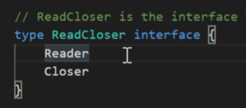

## 2021년07월27일-GoLangWeb_JsonTransfer  

```go
package main

import (
	"fmt"
	"net/http"
)

type fooHandler struct{}

func (f *fooHandler) ServeHTTP(w http.ResponseWriter, r *http.Request) {
	fmt.Fprint(w, "Hello foo")
}
func main() {
	http.HandleFunc("/", func(w http.ResponseWriter, r *http.Request) {
		fmt.Fprint(w, "Hello World")
	})
	http.HandleFunc("/bar", func(w http.ResponseWriter, r *http.Request) {
		fmt.Fprint(w, "Hello bar")
	})
	http.Handle("/foo", &fooHandler{})
	http.ListenAndServe(":3000", nil)
}
```
- 지금까지는 정적으로 했는데 이제는 Mux를 이용해서 이렇게 해볼 수 있다.
## Web1
```go
package main

import (
	"fmt"
	"net/http"
)

type fooHandler struct{}

func (f *fooHandler) ServeHTTP(w http.ResponseWriter, r *http.Request) {
	fmt.Fprint(w, "Hello foo")
}
func barHandler(w http.ResponseWriter, r *http.Reqest) {
	fmt.Fprint(w, "Hello bar")
}
func main() {

	mux := http.NewServeMux()

	mux.HandleFunc("/", func(w http.ResponseWriter, r *http.Request) {
		fmt.Fprint(w, "Hello World")
	})
	mux.HandleFunc("/bar", barHandler)
	mux.Handle("/foo", &fooHandler{})
	http.ListenAndServe(":3000", mux)
}
```
- 위 방식을 라우터를 만들어서 넘겨주는 방식으로 사용함 
## 실행결과   

- 이전과 동작은 비슷  
## Web2
- Request에 필요한 argument 를 넣어서 읽을수 있는데 아래 처럼 하면된다. 
```go
//request에 아규먼트 읽어오는것
package main

import (
	"fmt"
	"net/http"
)

type fooHandler struct{}

func (f *fooHandler) ServeHTTP(w http.ResponseWriter, r *http.Request) {
	fmt.Fprint(w, "Hello foo")
}
func barHandler(w http.ResponseWriter, r *http.Request) {
	name := r.URL.Query().Get("name")
	if name == "" {
		name = "World"
	}
	fmt.Fprintf(w, "Hello bar %s!", name)
}
func main() {

	mux := http.NewServeMux()

	mux.HandleFunc("/", func(w http.ResponseWriter, r *http.Request) {
		fmt.Fprint(w, "Hello World")
	})
	mux.HandleFunc("/bar", barHandler)
	mux.Handle("/foo", &fooHandler{})
	http.ListenAndServe(":8080", mux)
}

```

- 그냥 아규먼트 없이 실행시 world 출력

- 아규먼트 넣고 출력시 제대로 출력되는것이 보임  

- 그리고 이처럼 주고 받는 방식에는 binary 있지만 둘다 형식 맞춰야 해서 string 형식 포맷 사용
- string 형식 포맷 : XML <tag></tag> 사용 해서 사이즈 커져서 json 더 많이 사용
- json : jave script Object Notationd의 약자이다. 키와 벨류 형식으로 되어있음 
## web3 
- json형태로 주고 받기  
```go
//json 형태로 주고 받기
package main

import (
	"encoding/json"
	"fmt"
	"net/http"
	"time"
)

type User struct {
	FirstName string
	LastName  string
	Email     string
	CreateAt  time.Time
}

type fooHandler struct{}

func (f *fooHandler) ServeHTTP(w http.ResponseWriter, r *http.Request) {
	user := new(User)
	err := json.NewDecoder(r.Body).Decode(user)
	if err != nil {
		w.WriteHeader(http.StatusBadRequest)
		fmt.Fprint(w, err)
		return
	}
	user.CreateAt = time.Now()
	data, _ := json.Marshal(user)
	w.WriteHeader(http.StatusOK)
	fmt.Fprint(w, string(data))
}

func barHandler(w http.ResponseWriter, r *http.Request) {
	name := r.URL.Query().Get("name")
	if name == "" {
		name = "World"
	}
	fmt.Fprintf(w, "Hello bar %s!", name)
}
func main() {

	mux := http.NewServeMux()

	mux.HandleFunc("/", func(w http.ResponseWriter, r *http.Request) {
		fmt.Fprint(w, "Hello World")
	})
	mux.HandleFunc("/bar", barHandler)
	mux.Handle("/foo", &fooHandler{})
	http.ListenAndServe(":8080", mux)
}

```
- 	제이슨 형식이 이곳의 json.NewDecoder(r.Body) 에 r.Body 리퀘스트 바디에들어있음 Body는 io.reader이다. NewDecoder는 인자를 i.oreader를 받음     

- 위처럼 io  Reader를 포함하는 인터페이스 임

- 현재는 데이터가 없어서 저렇게 나옴
- url에 직접 칠 수 없으니 만들어주는것 사용 (구글에 chrome http client app 검색)

- 이것을 설치하면된다. 

- 저링크에 저렇게 나오는데 클릭해서 사용하면되고 또는 postman을 이용해도 된다.  

- 위에 보면 비어있는데 go랑 형식이 달라서 그런다. 그래서 하는 방법은 
```go
type User struct {
	FirstName string `json:"first_name"`
	LastName  string `json:"last_name"`
	Email     string `json:"email"`
	CreateAt  time.Time
}
```
- 이렇게 해주는것을 어노테이션이라고 하는데 무튼 저렇게 하면 된다. 다시 실행해보자 

- 이렇게 하면 데이터는 제대로 들어간다. 
- 근데 일자로 나오는데 현재 json으로 인식 못해서 알려줘야한다. 
## web4 
- json 형식인것 알려주기  
```go
	w.Header().Add("content-type", "application/json")
```
- 이렇게 써주면된다. json 구현한 부분에 
```go
//json인것 알려주기
package main

import (
	"encoding/json"
	"fmt"
	"net/http"
	"time"
)

type User struct {
	FirstName string `json:"first_name"`
	LastName  string `json:"last_name"`
	Email     string `json:"email"`
	CreateAt  time.Time
}

type fooHandler struct{}

func (f *fooHandler) ServeHTTP(w http.ResponseWriter, r *http.Request) {
	user := new(User)
	err := json.NewDecoder(r.Body).Decode(user)
	if err != nil {
		w.WriteHeader(http.StatusBadRequest)
		fmt.Fprint(w, err)
		return
	}
	user.CreateAt = time.Now()
	data, _ := json.Marshal(user)

	w.Header().Add("content-type", "application/json")

	w.WriteHeader(http.StatusOK)
	fmt.Fprint(w, string(data))
}

func barHandler(w http.ResponseWriter, r *http.Request) {
	name := r.URL.Query().Get("name")
	if name == "" {
		name = "World"
	}
	fmt.Fprintf(w, "Hello bar %s!", name)
}
func main() {

	mux := http.NewServeMux()

	mux.HandleFunc("/", func(w http.ResponseWriter, r *http.Request) {
		fmt.Fprint(w, "Hello World")
	})
	mux.HandleFunc("/bar", barHandler)
	mux.Handle("/foo", &fooHandler{})
	http.ListenAndServe(":8080", mux)
}
```


- 위와 같이 제대로 들어온다. 