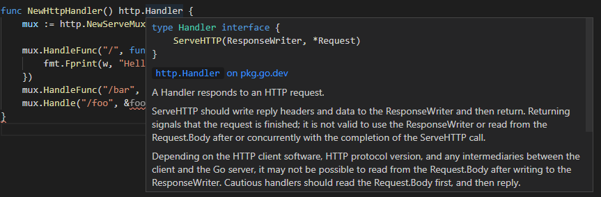
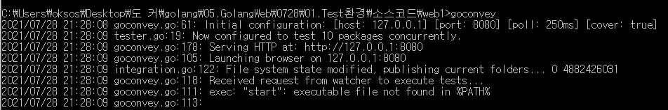
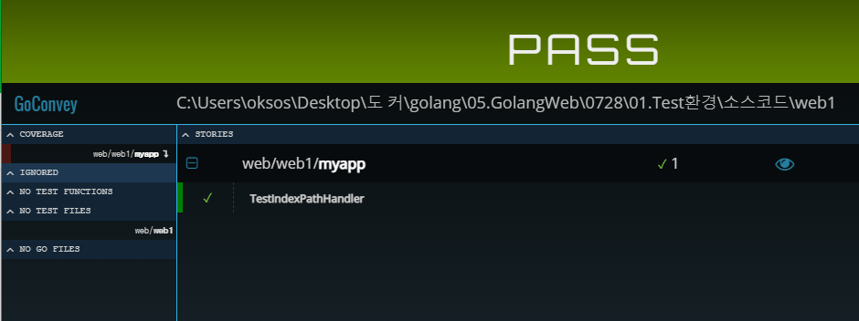
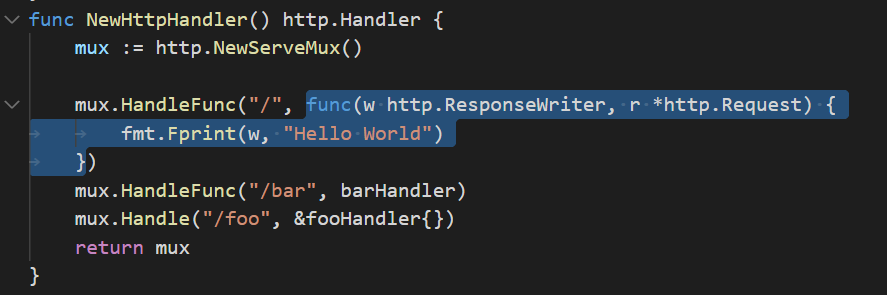
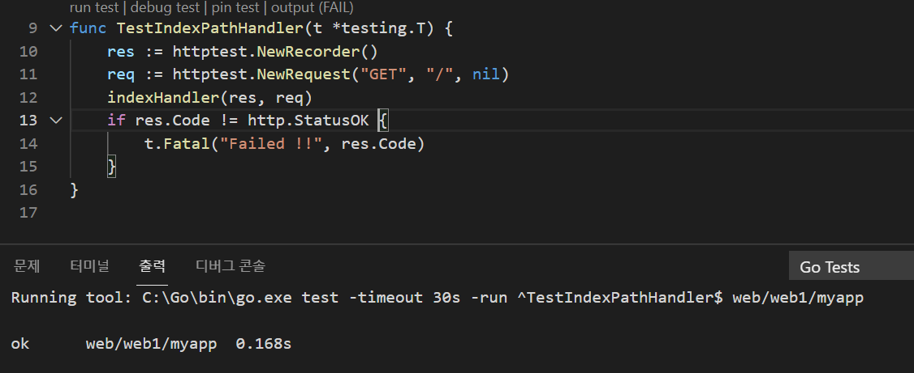
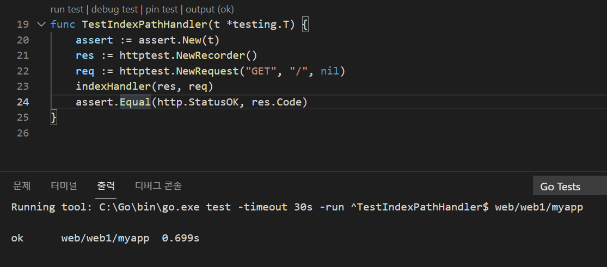
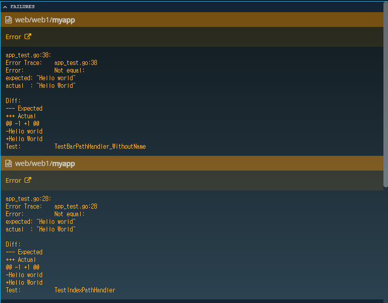
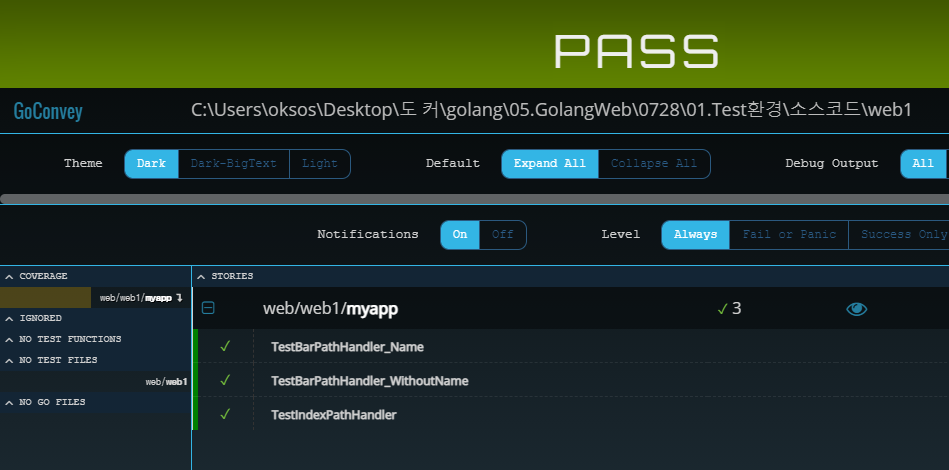

## 2021년07월28일_GoLangWeb-Test환경  
```go
func NewHttpHandler() http.Handler {...}
```
- 여기서http.Handler는  인터페이스 아래와 같이 ServeHTTP를 가지고 있음 

- mux가 go 인터페이스를 상속하고 있는것   
## 현재 디렉토리 상태 
- web1 
  - myapp
    - app_test.go 
    - app.go
  - main.go
## myapp/ app.go  
```go
//패키지를 분리할 예정
package myapp

import (
	"encoding/json"
	"fmt"
	"net/http"
	"time"
)

type User struct {
	FirstName string `json:"first_name"`
	LastName  string `json:"last_name"`
	Email     string `json:"email"`
	CreateAt  time.Time
}

type fooHandler struct{}

func (f *fooHandler) ServeHTTP(w http.ResponseWriter, r *http.Request) {
	user := new(User)
	err := json.NewDecoder(r.Body).Decode(user)
	if err != nil {
		w.WriteHeader(http.StatusCreated)
		fmt.Fprint(w, err)
		return
	}
	user.CreateAt = time.Now()
	data, _ := json.Marshal(user)

	w.Header().Add("content-type", "application/json")

	w.WriteHeader(http.StatusOK)
	fmt.Fprint(w, string(data))
}

func barHandler(w http.ResponseWriter, r *http.Request) {
	name := r.URL.Query().Get("name")
	if name == "" {
		name = "World"
	}
	fmt.Fprintf(w, "Hello %s!", name)
}
func NewHttpHandler() http.Handler {
	mux := http.NewServeMux()

	mux.HandleFunc("/", func(w http.ResponseWriter, r *http.Request) {
		fmt.Fprint(w, "Hello World")
	})
	mux.HandleFunc("/bar", barHandler)
	mux.Handle("/foo", &fooHandler{})
	return mux
}
```
## main.go  
```go
//json인것 알려주기
package main

import (
	"net/http"
	"web/web1/myapp"
)

func main() {

	http.ListenAndServe(":3000", myapp.NewHttpHandler())
}
```
## 테스트 코드 만들기 , myapp/ app_test.go   
```go
package myapp

import "testing"

func TestIndexPathHandler(t *testing.T) {

}
```
- 우선 형태는 위와같음  
-  그리고 우선 다운받을 패키지가 있다. 옆 링크를 눌러서 들어가자 [convey패키지](https://github.com/smartystreets/goconvey)  
-  go get github.com/smartystreets/goconvey 를 입력해주면 되는데 cmd에 입력을 해줘야함   

- 해당 소스 있는곳에서 goconvey해주면 백그라운드로 웹서버가 하나 돌게된다.
- localhost:8080 으로 들어가며 아래와 같이 나온다. 

- 현재 성공하는 경우는 예외 상황이 없기에 성공한것이다.  
## 테스트코드 작성하기 
### app.go 부분에 

- 저 함수를 따로 만들것이다. 
```go
func indexHandler(w http.ResponseWriter, r *http.Request) {
	fmt.Fprint(w, "Hello World")
}
//이렇게 만들고
mux.HandleFunc("/",indexHandler )
//아까 메소드 있었던 부분은 위와같이 다시 해준다.
```

### app_test.go  
```go
package myapp

import (
	"net/http"
	"net/http/httptest"
	"testing"
)

func TestIndexPathHandler(t *testing.T) {
	res := httptest.NewRecorder()
	req := httptest.NewRequest("GET", "/", nil)
	indexHandler(res, req)
	if res.Code != http.StatusOK {
		t.Fatal("Failed !!", res.Code)
	}
}
```
- 매번 이렇게 확인되는게 귀찮을 수 있으니 다른 패키지 설치하자  
- [테스트 할 수 있는 패키지](https://github.com/stretchr/testify/tree/master/assert)  
- assert부분만 가져올것이다. 
-  go get github.com/stretchr/testify/assert
-  설치를 하고 테스트 코드를 바꿔보자  

- 위에처럼 해도된다.  
## 테스트 실제 body 비교하기  
```go
	data, _ := ioutil.ReadAll(res.Body)
	assert.Equal("Hello World", string(data))
```
- 이렇게 이부분을 추가하면된다.  
## barHandler에 대한 테스트 코드작성    
```go
func TestBarPathHandler_WithoutName(t *testing.T) {
	assert := assert.New(t)
	res := httptest.NewRecorder()
	req := httptest.NewRequest("GET", "/bar", nil)
	indexHandler(res, req)

	assert.Equal(http.StatusOK, res.Code)
	data, _ := ioutil.ReadAll(res.Body)
	assert.Equal("Hello World", string(data))
}
```

- 지금보면 Fail이 난다. 
- ! 가빠진것을 알 수 있다.  
```go
// 이렇게만하면 아래같이해도 에러 발생하지 않는다. mux를 사용해야함
// req := httptest.NewRequest("GET", "/", nil)
// 	assert.Equal("Hello world!", string(data))
indexHandler(res, req)

// 아래와 같이 해야 제대로 동작하는 것이다.  
mux := NewHttpHandler()
mux.ServeHTTP(res,req)
```
## bar에 name 보내는 경우  
``` go
func TestBarPathHandler_Name(t *testing.T) {
	assert := assert.New(t)
	res := httptest.NewRecorder()
	req := httptest.NewRequest("GET", "/bar?name=3dpit", nil)

	mux := NewHttpHandler()
	mux.ServeHTTP(res, req)

	assert.Equal(http.StatusOK, res.Code)
	data, _ := ioutil.ReadAll(res.Body)
	assert.Equal("Hello 3dpit!", string(data))
}
```
- 이렇게 하면 된다.  테스트 코드 작성 방법  
  