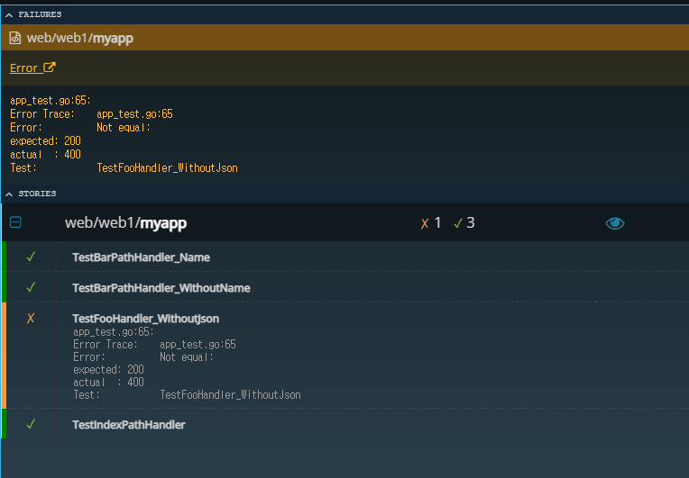
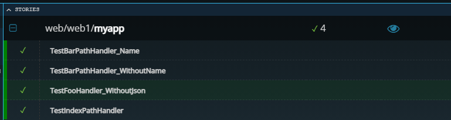
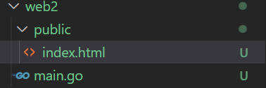
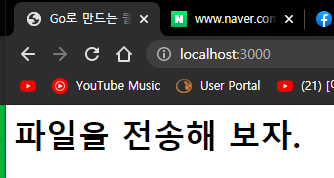
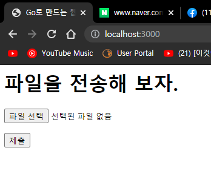
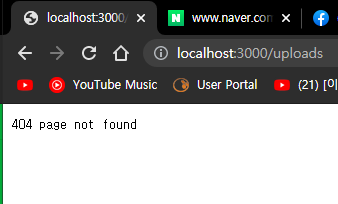
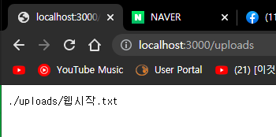
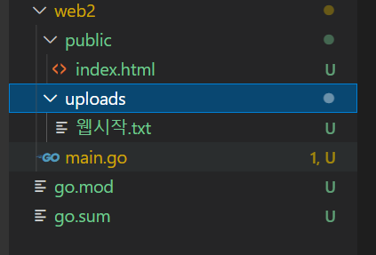
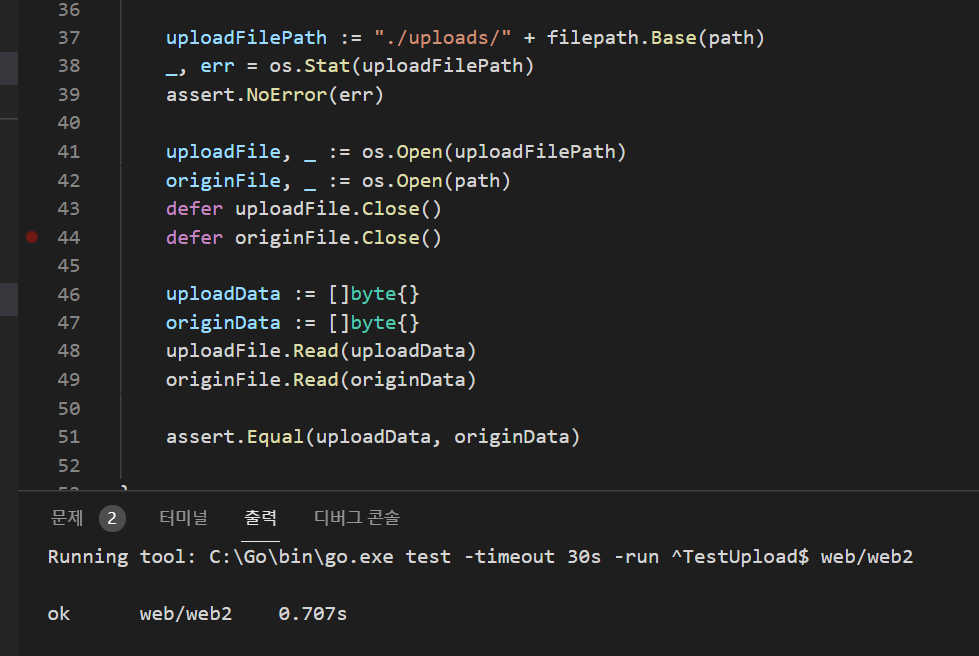

## 2021년07월28일_GoLangWeb-FileUpload  
##  이전에 추가 못한 foo 테스트 코드 작성  
```go
func TestFooHandler_WithoutJson(t *testing.T) {
	assert := assert.New(t)
	res := httptest.NewRecorder()
	req := httptest.NewRequest("GET", "/foo", nil)

	mux := NewHttpHandler()
	mux.ServeHTTP(res, req)

	assert.Equal(http.StatusOK, res.Code)
}
```

- 일부러 틀린 코드 작성 저렇게 하면 안된다. 실패가 나는게 맞기 때문에 
```go
func TestFooHandler_WithoutJson(t *testing.T) {
	assert := assert.New(t)
	res := httptest.NewRecorder()
	req := httptest.NewRequest("GET", "/foo", nil)

	mux := NewHttpHandler()
	mux.ServeHTTP(res, req)

	assert.Equal(http.StatusBadRequest, res.Code)
}
```
- 위는 맞는 코드이다.  

```go
func TestFooHandler_WithJson(t *testing.T) {
	assert := assert.New(t)
	res := httptest.NewRecorder()
	req := httptest.NewRequest("POST", "/foo",
		strings.NewReader(`{
			"first_name": "test12334",
			"last_name" : "park121",
			"email": "test12@naver.com"
		}`))

	mux := NewHttpHandler()
	mux.ServeHTTP(res, req)

	assert.Equal(http.StatusCreated, res.Code)
	user := new(User)
	err := json.NewDecoder(res.Body).Decode(user)

	assert.Nil(err)
	assert.Equal("test12334", user.FirstName)
	assert.Equal("park121", user.LastName)
}
```
- 이렇게 하면 json을 가져와서 확인도 가능하다.  
## 기본적인 파일 웹서버  
```go 
package main

import "net/http"

func main() {
	http.Handle("/", http.FileServer(http.Dir("public")))

	http.ListenAndServe(":3000",nil)
}
```

- public 폴더를 생성하고 아래에index.html 을 만들어서 다음과 간단히 만들어보자. 
``` html
<html>
<head>
<title> Go로 만드는 웹</title>
</head>
<body>
<p><h1>파일을 전송해 보자. </h1></p> 
</body>
</html>
```
- 서버를 켜서 확인해보자.  

```html
<html>
<head>
<title> Go로 만드는 웹</title>
</head>
<body>
<p><h1>파일을 전송해 보자. </h1></p> 
<form action="/uploads" method="POST" accept-charset="utf-8" enctype="multipart/form-data">
<p><input type="file" id="upload_file" name="upload_file"/></p>
<p><input type="submit" name="upload"/></p>
</form>
</body>
</html>
```

- 파일을 넣고 제출을 누르면 

- upload 핸들러가 없기때문에 저렇게 나온다. 만들어보자.
```go
func uploadsHandler(w http.ResponseWriter, r *http.Request) {
	uploadFile, header, err := r.FormFile("upload_file")
	if err != nil {
		w.WriteHeader(http.StatusBadRequest)
		fmt.Fprint(w, err)
		return
	}
	defer uploadFile.Close()
	dirname := "./uploads"
	os.MkdirAll(dirname, 0777) //read, write excute?가 다됨  해당 폴더가 없으면 생성
	filepath := fmt.Sprintf("%s/%s", dirname, header.Filename)
	file, err := os.Create(filepath)
	defer file.Close()
	if err != nil {
		w.WriteHeader(http.StatusInternalServerError)
		fmt.Fprint(w, err)
		return
	}
	io.Copy(file, uploadFile)
	w.WriteHeader(http.StatusOK)
	fmt.Fprint(w, filepath)
}
```

- 핸들러 만든 상태에서 파일넣고 제출하면 저렇게 나온다.   

- 그렇게 하면 저렇게 웹시작.txt 가 들어가게된다.  
## 테스트 코드를 작성해보자    
```go
func TestUpload(t *testing.T) {
	assert := assert.New(t)
	path := `C:\Users\oksos\Desktop\study\웹시작.txt`
	file, _ := os.Open(path)
	defer file.Close()

	os.RemoveAll("./uploads")

	buf := &bytes.Buffer{}
	writer := multipart.NewWriter(buf)
	multi, err := writer.CreateFormFile("upload_file", filepath.Base(path))
	assert.NoError(err)
	io.Copy(multi, file)
	writer.Close()

	res := httptest.NewRecorder()
	req := httptest.NewRequest("POST", "/uploads", buf)
	req.Header.Set("Content-type", writer.FormDataContentType())
	uploadsHandler(res, req)
	assert.Equal(http.StatusOK, res.Code)
}
```
- MIME 포맷 이라고 멀티파트 웹으로 파일같은 데이터 전송할때  필요한것 
- multipart.NewWriter()
- writr.CreateFormFile("upload_file",filepath.Base(path)) // .Base()하면 경로의 파일이름만 자른다. 
- req.Header.Set("Content-type", writer.FormDataContentType()) //이것 써줘야 폼 데이터인식함 
- 여기까지하면 파일을 지우고 현재 폴더에 진짜 넣어줌 
- 이제는 제대로 들어왔는지 확인해보자  
```go
	uploadFilePath := "./uploads/" + filepath.Base(path)
	_, err = os.Stat(uploadFilePath)
	assert.NoError(err)

	uploadFile, _ := os.Open(uploadFilePath)
	originFile, _ := os.Open(path)
	defer uploadFile.Close()
	defer originFile.Close()

	uploadData := []byte{}
	originData := []byte{}
	uploadFile.Read(uploadData)
	originFile.Read(originData)

	assert.Equal(uploadData, originData)
```
- 	_, err := os.Stat(uploadFilePath) 여기서  _  이공간에 stat는 인포를 가져오는데 생략 
## 전체 소스  
```go
package main

import (
	"bytes"
	"io"
	"mime/multipart"
	"net/http"
	"net/http/httptest"
	"os"
	"path/filepath"
	"testing"

	"github.com/stretchr/testify/assert"
)

func TestUpload(t *testing.T) {
	assert := assert.New(t)
	path := `C:\Users\oksos\Desktop\study\웹시작.txt`
	file, _ := os.Open(path)
	defer file.Close()

	os.RemoveAll("./uploads")

	buf := &bytes.Buffer{}
	writer := multipart.NewWriter(buf)
	multi, err := writer.CreateFormFile("upload_file", filepath.Base(path))
	assert.NoError(err)
	io.Copy(multi, file)
	writer.Close()

	res := httptest.NewRecorder()
	req := httptest.NewRequest("POST", "/uploads", buf)
	req.Header.Set("Content-type", writer.FormDataContentType())
	uploadsHandler(res, req)
	assert.Equal(http.StatusOK, res.Code)

	uploadFilePath := "./uploads/" + filepath.Base(path)
	_, err = os.Stat(uploadFilePath)
	assert.NoError(err)

	uploadFile, _ := os.Open(uploadFilePath)
	originFile, _ := os.Open(path)
	defer uploadFile.Close()
	defer originFile.Close()

	uploadData := []byte{}
	originData := []byte{}
	uploadFile.Read(uploadData)
	originFile.Read(originData)

	assert.Equal(uploadData, originData)

}
```



- 여기까지 테스트 코드 까지 완료된것이다.  