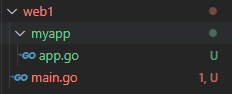
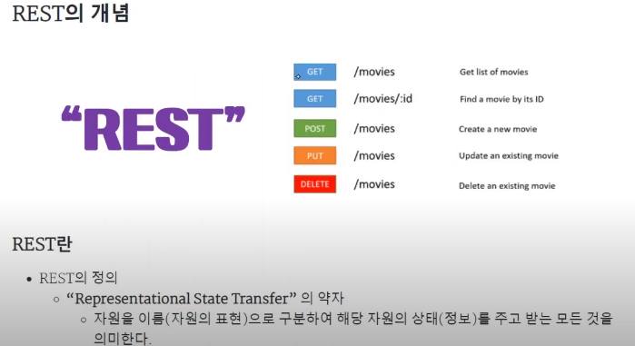
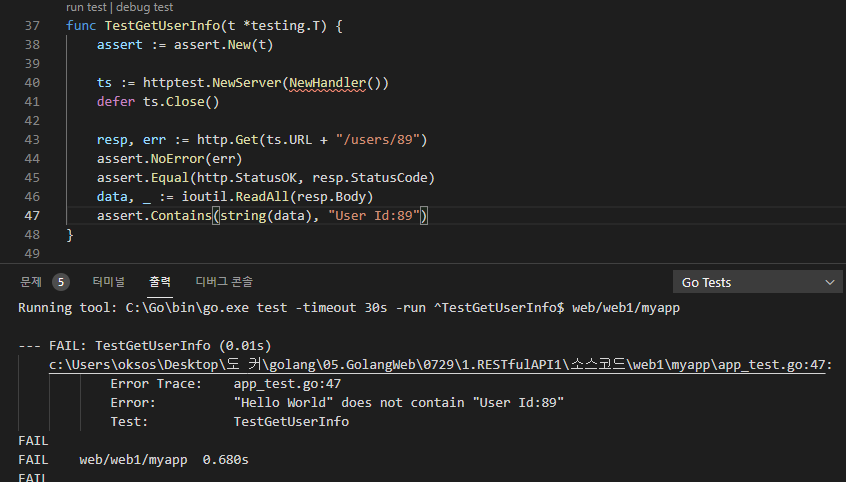
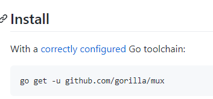
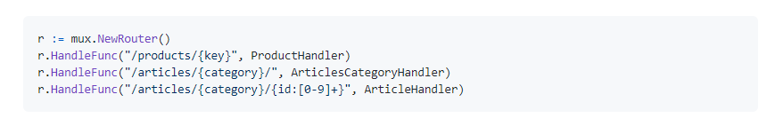
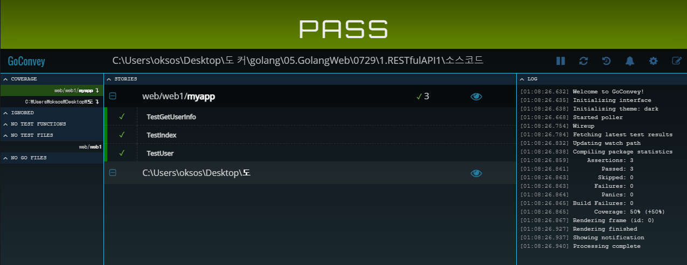

## 2021년07월29일_GoLangWeb-RESTfulAPI1  
## 기본 틀  
### 파일 구성  
  
## main.go  
```go
package main

import (
	"net/http"
	"web/web1/myapp"
)

func main() {
	http.ListenAndServe(":3000", myapp.NewHandeler())
}
```
## myapp/ app.go  
```go
package myapp

import "net/http"

//NewHandler make a new myapp Handler
func NewHandeler() http.Handler {
	mux := http.NewServeMux()

	return mux
}
- 여기까지 기본틀
```
## app_test.go //에러검사, Status확인
```go
func TestIndex(t *testing.T) {
	assert := assert.New(t)

	ts := httptest.NewServer(NewHandler())//mock 코드라고 실제 웹서버는 아님
	defer ts.Close()

	resp, err := http.Get(ts.URL)
	assert.NoError(err)
	assert.Equal(http.StatusOK, resp.StatusCode)
}
```
## myapp/ app.go  
```go
package myapp

import (
	"fmt"
	"net/http"
)

func indexHandler(w http.ResponseWriter, r *http.Request) {
	fmt.Fprint(w, "Hello World")
}

//NewHandler make a new myapp Handler
func NewHandler() http.Handler {
	mux := http.NewServeMux()

	mux.HandleFunc("/", indexHandler)
	return mux
}
```
- 테스트 코드를 위해 indexHandler 추가 
## 첫번째의 문자열 제대로 들어가는지 테스트  
- 문자열 제대로 나오는지 테스트 
- 	data, _ := ioutil.ReadAll(resp.Body), assert.Equal("Hello World", string(data)) 추가
```go
package myapp

import (
	"io/ioutil"
	"net/http"
	"net/http/httptest"
	"testing"

	"github.com/stretchr/testify/assert"
)

func TestIndex(t *testing.T) {
	assert := assert.New(t)

	ts := httptest.NewServer(NewHandler())
	defer ts.Close()

	resp, err := http.Get(ts.URL)
	assert.NoError(err)
	assert.Equal(http.StatusOK, resp.StatusCode)
	data, _ := ioutil.ReadAll(resp.Body)
	assert.Equal("Hello World", string(data))
}
```
## 두번째 테스트 코드  
```go
func TestUser(t *testing.T) {
	assert := assert.New(t)

	ts := httptest.NewServer(NewHandler())
	defer ts.Close()

	resp, err := http.Get(ts.URL+"/users")
	assert.NoError(err)
	assert.Equal(http.StatusOK, resp.StatusCode)
}
```
- 위에서 	resp, err := http.Get(ts.URL+"/users") 이부분에 저렇게 되면 통과가 안되는게 정상 하지만 지금은 통과함 
- 그것은 따로 / 뒤에 붙는 핸들러가 없으면 상위 핸들러가 호출되서 그런거임 
## app.go 부분에 user 추가  
```go
func userHandler(w http.ResponseWriter, r *http.Request) {
	fmt.Fprint(w, "Get UserInfo by /users/{id}")
}

mux.HandleFunc("/usrs", userHandler)
// 위에 두개 추가 
// 전체 소스 
package myapp

import (
	"fmt"
	"net/http"
)

func indexHandler(w http.ResponseWriter, r *http.Request) {
	fmt.Fprint(w, "Hello World")
}
func userHandler(w http.ResponseWriter, r *http.Request) {
	fmt.Fprint(w, "Get UserInfo by /users/{id}")
}

//NewHandler make a new myapp Handler
func NewHandler() http.Handler {
	mux := http.NewServeMux()

	mux.HandleFunc("/", indexHandler)
	mux.HandleFunc("/users", userHandler)
	return mux
}
```
## user 테스트 코드  
```go
func TestUser(t *testing.T) {
	assert := assert.New(t)

	ts := httptest.NewServer(NewHandler())
	defer ts.Close()

	resp, err := http.Get(ts.URL + "/users")
	assert.NoError(err)
	assert.Equal(http.StatusOK, resp.StatusCode)
	data, _ := ioutil.ReadAll(resp.Body)
	assert.Contains(string(data), "Get UserInfo")
}
```


- 자원에 대한 CRUD, 조작하는걸 URL에 표시하자. 하는것
  
  ## 테스트3   getUserInfo
```go
func TestGetUserInfo(t *testing.T) {
	assert := assert.New(t)

	ts := httptest.NewServer(NewHandler())
	defer ts.Close()

	resp, err := http.Get(ts.URL + "/users/89")
	assert.NoError(err)
	assert.Equal(http.StatusOK, resp.StatusCode)
	data, _ := ioutil.ReadAll(resp.Body)
	assert.Contains(string(data), "User Id:89")
}
```
  
- fail이 나게 되는데 당연히 난다. 핸들러가 없기도 하고 그렇게 구현하지 않아서 
## 무조건 통과시키기  
```go
func getuserInfo89Handler(w http.ResponseWriter, r *http.Request) {
	fmt.Fprint(w, "User Id:89")
}

mux.HandleFunc("/users/89", getuserInfo89Handler)
```
-  테스트 코드는 통과가 되지만 매번 id가 바뀌면 유연하게 대처를 하지 못함
## 리팩토링 하기  
```go
r.URL.Path
```
- 저렇게 접근해서 id 찾아도 되지만 패키지 이용하자. 
[고릴라 먹스 사이트](https://github.com/gorilla/mux)
- go get -u github.com/gorilla/mux

```go
	mux := http.NewServeMux() //이거대신에 아래를 사용할 것이다.
	mux := mux.NewRouter()
```

- 여기 보면 id 가져오는 법이 있다. 일종의 정규표현식으로 숫자를 받아오는것 
```go
mux.HandleFunc("/users/89", getuserInfo89Handler)//아래로 바꾸면된다.
mux.HandleFunc("/users/{id:[0-9]+}", getuserInfo89Handler)
```
- 저렇게 id를 쓰면되고
```go
func getuserInfo89Handler(w http.ResponseWriter, r *http.Request) {
	fmt.Fprint(w, "User Id:89")
}

func getuserInfoHandler(w http.ResponseWriter, r *http.Request) {
  vars := mux.Vars(r)
	fmt.Fprint(w, "User Id:", vars["id"])
}
```
- vars를 이용해서 저렇게 해주면 id를 알아서 파싱해서 가져옴 
## app.go 최종 소스  
```go
package myapp

import (
	"fmt"
	"net/http"

	"github.com/gorilla/mux"
)

func indexHandler(w http.ResponseWriter, r *http.Request) {
	fmt.Fprint(w, "Hello World")
}
func userHandler(w http.ResponseWriter, r *http.Request) {
	fmt.Fprint(w, "Get UserInfo by /users/{id}")
}
func getuserInfoHandler(w http.ResponseWriter, r *http.Request) {
	fmt.Fprint(w, "User Id:89")
}

//NewHandler make a new myapp Handler
func NewHandler() http.Handler {
	mux := mux.NewRouter()

	mux.HandleFunc("/", indexHandler)
	mux.HandleFunc("/users", userHandler)
	mux.HandleFunc("/users/89", getuserInfoHandler)

	return mux
}
```

