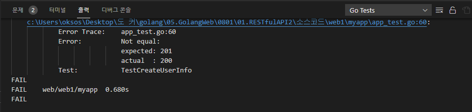
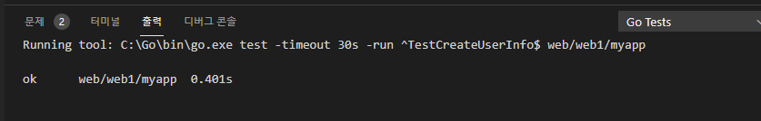
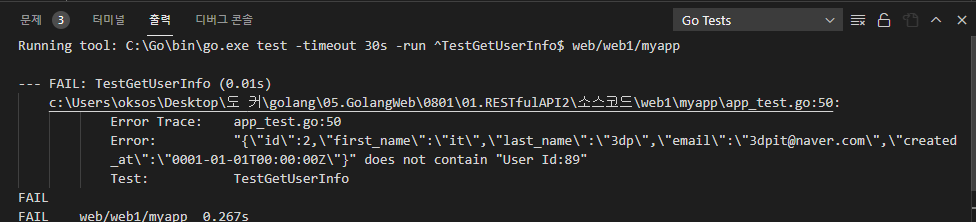

## 2021년08월01일_GoLangWeb-RESTfulAPI2
- 지난번에 Get해서 실제 id만 출력함
- Create 즉,Post하는것을 만들어야 id의 UserInfo를 읽어올 수 있다.  
## POST 부분인 Create 부분에 대한 테스트 코드 작성  
```go

func TestCreateUserInfo(t *testing.T) {
	assert := assert.New(t)

	ts := httptest.NewServer(NewHandler())
	defer ts.Close()

	resp, err := http.Post(ts.URL+"/users", "application/json",
		strings.NewReader(`{"first_name":"it", "last_name":"3dp", "email":"3dpit@naver.com"}`))
	assert.NoError(err)
	assert.Equal(http.StatusCreated, resp.StatusCode)
}

```

- 현재 위와 같이 하면 저렇게 200을 원하는데 201이 나오게 된다. 
- resp, err := http.Post(ts.URL+"/users", "application/json", 현재 이렇게 /users로 했는데 이때 어떤 매소드로 보내는것에 따라 즉, Get, Post에 따라서 핸들러가 달라져야한다. 
- 여기서  핸들러는 이부분이다.   mux.HandleFunc("/users", userHandler)
- 고릴라 먹스는 이것을 지원한다. 
```go
	mux.HandleFunc("/users", userHandler).Methods("GET")
```
- 위와 같이 해줌으로써 어떤메소드일 때 이 핸들러인것을 명시함   
```go
func createUserHandler(w http.ResponseWriter, r *http.Request) {
}
	mux.HandleFunc("/users", createUserHandler).Methods("POST")
```
- 클라이언트가 json 형식으로 유저정보를 보낸다.  이때 json을 읽어내야하는데 읽을 수 있게 User struct가 필요함
```go
type User struct {
	ID        int       `json:"id"`
	FirstName string    `json:"first_name"`
	LastName  string    `json:"last_name"`
	Email     string    `json:"email"`
	CreateAT  time.Time `json:"created _at"`
}

func createUserHandler(w http.ResponseWriter, r *http.Request) {
	user := new(User)
	err := json.NewDecoder(r.Body).Decode(user)
	if err != nil {
		w.WriteHeader(http.StatusBadRequest)
		fmt.Fprint(w, err)
		return
	}
	//Created User
	user.ID = 2
	user.CreateAT = time.Now()
	w.Header().Add("Content-Type", "application/json")
	w.WriteHeader(http.StatusCreated)
	data, _ := json.Marshal(user)
	fmt.Fprint(w, string(data))
}
```
- 위와 같이 유저 struct를 생성
- 우선 제이슨 읽어와서 에러면 리턴시키고 없으면 유저 생성 하는 소스이다. 

- 우선 테스트 코드가 통과한다
## 테스트코드 추가
```go
	user := new(User)
	err = json.NewDecoder(resp.Body).Decode(user)
	assert.NoError(err)
	assert.NotEqual(0, user.ID)
// 유저 생성해서 에러 확인, 현재 생성된상태니까 0이 아닌지 확인

	id := user.ID
	resp, err = http.Get(ts.URL + "/users/" + strconv.Itoa(id))
	assert.NoError(err)
	assert.Equal(http.StatusOK, resp.StatusCode)
	user2 := new(User)
	err = json.NewDecoder(resp.Body).Decode(user2)
	assert.NoError(err)
	assert.Equal(user.ID, user2.ID)
	assert.Equal(user.FirstName, user2.FirstName)
// 이전에 get을 이용해서 현재 id를 넣고 에러 확인 , 상태 확인
// 새로운 유저생성하고 에러확인 user, user2는 같은것이기 때문에 같은지 확인  
```
- 현재 위에처럼 하면 에러가 생기는데 이유는 get부분에 보면 아래와 같이 user가 먼저 시작 이부분을 수정해야한다.  
```go
func getuserInfoHandler(w http.ResponseWriter, r *http.Request) {
	vars := mux.Vars(r)
	fmt.Fprint(w, "User Id:", vars[])
}
```
-  U로 시작해서 제대로 안됨 그래서 수정해야함  
## 변경된 getUserInfoHandler
```go
func getuserInfoHandler(w http.ResponseWriter, r *http.Request) {
	user := new(User)
	user.ID = 2
	user.FirstName = "it"
	user.LastName = "3dp"
	user.Email = "3dpit@naver.com"

	w.Header().Add("Content-Type", "application/json")
	w.WriteHeader(http.StatusOK)
	data, _ := json.Marshal(user)
	fmt.Fprint(w, string(data))
}
```
- 일단 무조건 통과시키기 위한 코드 
- 그렇지만 getUser Test에서 에러 발생 


```go
func TestGetUserInfo(t *testing.T) {
	assert := assert.New(t)

	ts := httptest.NewServer(NewHandler())
	defer ts.Close()

	resp, err := http.Get(ts.URL + "/users/89")
	assert.NoError(err)
	assert.Equal(http.StatusOK, resp.StatusCode)
	data, _ := ioutil.ReadAll(resp.Body)
	assert.Contains(string(data), "User Id:89")

	resp, err = http.Get(ts.URL + "/users/56")
	assert.NoError(err)
	assert.Equal(http.StatusOK, resp.StatusCode)
	data, _ = ioutil.ReadAll(resp.Body)
	assert.Contains(string(data), "User Id:56")
}
```

- 이전에 테스트 코드가 그랬는데 현재 89가 없어서 No user  ID로 나와야함

```go
func TestGetUserInfo(t *testing.T) {
	assert := assert.New(t)

	ts := httptest.NewServer(NewHandler())
	defer ts.Close()

	resp, err := http.Get(ts.URL + "/users/89")
	assert.NoError(err)
	assert.Equal(http.StatusOK, resp.StatusCode)
	data, _ := ioutil.ReadAll(resp.Body)
	assert.Contains(string(data), "No User Id:89")

	resp, err = http.Get(ts.URL + "/users/56")
	assert.NoError(err)
	assert.Equal(http.StatusOK, resp.StatusCode)
	data, _ = ioutil.ReadAll(resp.Body)
	assert.Contains(string(data), "No User Id:56")
}
```

- 프로덕션 코드에 맵을 만들어서 있으면 user id 나오게 아니면 no user id 구현할것임  

```go
var userMap map[int]*User
var lastID int

func getUserInfoHandler(w http.ResponseWriter, r *http.Request) {
	vars := mux.Vars(r)
	id, err := strconv.Atoi(vars["id"])
	if err != nil {
		w.WriteHeader(http.StatusBadRequest)
		fmt.Fprint(w, err)
		return
	}
	user, ok := userMap[id]
	if !ok {
		w.WriteHeader(http.StatusOK)
		fmt.Fprint(w, "No User Id:", id)
		return
	}
  
	w.Header().Add("Content-Type", "application/json")
	w.WriteHeader(http.StatusOK)
	data, _ := json.Marshal(user)
	fmt.Fprint(w, string(data))
}

func createUserHandler(w http.ResponseWriter, r *http.Request) {
...
	//Created User
	lastID++
	user.ID = lastID
	user.CreateAT = time.Now()
	userMap[user.ID] = user
...
}

func NewHandler() http.Handler {
	userMap = make(map[int]*User)
  lastID = 0
...
}
```

- 여기까지 성공

## 전체 코드 

## app.go

```go
package myapp

import (
	"encoding/json"
	"fmt"
	"net/http"
	"strconv"
	"time"

	"github.com/gorilla/mux"
)

//User struct
type User struct {
	ID        int       `json:"id"`
	FirstName string    `json:"first_name"`
	LastName  string    `json:"last_name"`
	Email     string    `json:"email"`
	CreateAT  time.Time `json:"created _at"`
}

var userMap map[int]*User
var lastID int

func indexHandler(w http.ResponseWriter, r *http.Request) {
	fmt.Fprint(w, "Hello World")
}

func userHandler(w http.ResponseWriter, r *http.Request) {
	fmt.Fprint(w, "Get UserInfo by /users/{id}")
}

func getUserInfoHandler(w http.ResponseWriter, r *http.Request) {
	vars := mux.Vars(r)
	id, err := strconv.Atoi(vars["id"])
	if err != nil {
		w.WriteHeader(http.StatusBadRequest)
		fmt.Fprint(w, err)
		return
	}
	user, ok := userMap[id]
	if !ok {
		w.WriteHeader(http.StatusOK)
		fmt.Fprint(w, "No User Id:", id)
		return
	}

	w.Header().Add("Content-Type", "application/json")
	w.WriteHeader(http.StatusOK)
	data, _ := json.Marshal(user)
	fmt.Fprint(w, string(data))
}

func createUserHandler(w http.ResponseWriter, r *http.Request) {
	user := new(User)
	err := json.NewDecoder(r.Body).Decode(user)
	if err != nil {
		w.WriteHeader(http.StatusBadRequest)
		fmt.Fprint(w, err)
		return
	}

	//Created User
	lastID++
	user.ID = lastID
	user.CreateAT = time.Now()
	userMap[user.ID] = user

	w.Header().Add("Content-Type", "application/json")
	w.WriteHeader(http.StatusCreated)
	data, _ := json.Marshal(user)
	fmt.Fprint(w, string(data))
}

//NewHandler make a new myapp Handler
func NewHandler() http.Handler {
	userMap = make(map[int]*User)
	lastID = 0
	mux := mux.NewRouter()

	mux.HandleFunc("/", indexHandler)
	mux.HandleFunc("/users", userHandler).Methods("GET")
	mux.HandleFunc("/users", createUserHandler).Methods("POST")
	mux.HandleFunc("/users/{id:[0-9]+}", getUserInfoHandler)

	return mux
}
```

## app_test.go

```go
package myapp

import (
	"encoding/json"
	"io/ioutil"
	"net/http"
	"net/http/httptest"
	"strconv"
	"strings"
	"testing"

	"github.com/stretchr/testify/assert"
)

func TestIndex(t *testing.T) {
	assert := assert.New(t)

	ts := httptest.NewServer(NewHandler())
	defer ts.Close()

	resp, err := http.Get(ts.URL)
	assert.NoError(err)
	assert.Equal(http.StatusOK, resp.StatusCode)
	data, _ := ioutil.ReadAll(resp.Body)
	assert.Equal("Hello World", string(data))
}

func TestUser(t *testing.T) {
	assert := assert.New(t)

	ts := httptest.NewServer(NewHandler())
	defer ts.Close()

	resp, err := http.Get(ts.URL + "/users")
	assert.NoError(err)
	assert.Equal(http.StatusOK, resp.StatusCode)
	data, _ := ioutil.ReadAll(resp.Body)
	assert.Contains(string(data), "Get UserInfo")
}

func TestGetUserInfo(t *testing.T) {
	assert := assert.New(t)

	ts := httptest.NewServer(NewHandler())
	defer ts.Close()

	resp, err := http.Get(ts.URL + "/users/89")
	assert.NoError(err)
	assert.Equal(http.StatusOK, resp.StatusCode)
	data, _ := ioutil.ReadAll(resp.Body)
	assert.Contains(string(data), "No User Id:89")

	resp, err = http.Get(ts.URL + "/users/56")
	assert.NoError(err)
	assert.Equal(http.StatusOK, resp.StatusCode)
	data, _ = ioutil.ReadAll(resp.Body)
	assert.Contains(string(data), "No User Id:56")
}

func TestCreateUserInfo(t *testing.T) {
	assert := assert.New(t)

	ts := httptest.NewServer(NewHandler())
	defer ts.Close()

	resp, err := http.Post(ts.URL+"/users", "application/json",
		strings.NewReader(`{"first_name":"it", "last_name":"3dp", "email":"3dpit@naver.com"}`))
	assert.NoError(err)
	assert.Equal(http.StatusCreated, resp.StatusCode)

	user := new(User)
	err = json.NewDecoder(resp.Body).Decode(user)
	assert.NoError(err)
	assert.NotEqual(0, user.ID)

	id := user.ID
	resp, err = http.Get(ts.URL + "/users/" + strconv.Itoa(id))
	assert.NoError(err)
	assert.Equal(http.StatusOK, resp.StatusCode)

	user2 := new(User)
	err = json.NewDecoder(resp.Body).Decode(user2)
	assert.NoError(err)
	assert.Equal(user.ID, user2.ID)
	assert.Equal(user.FirstName, user2.FirstName)
}
```

