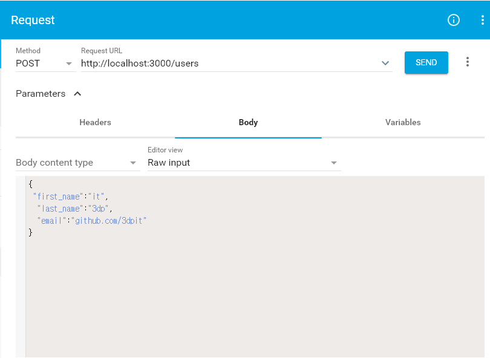
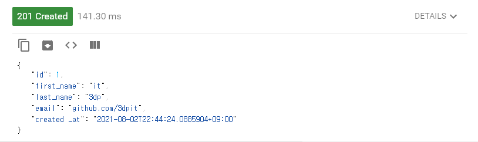
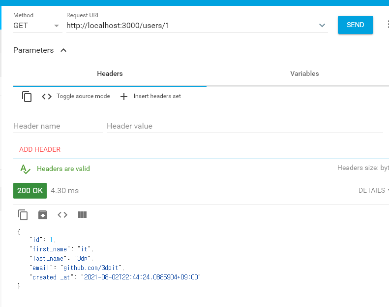
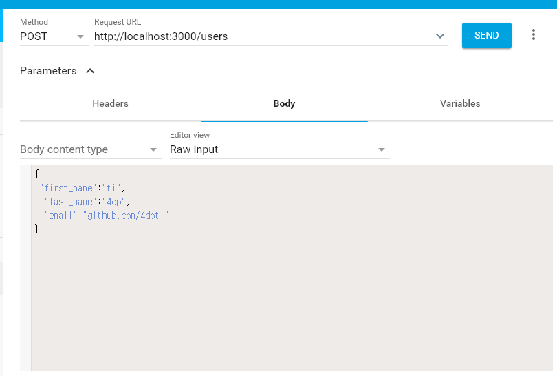
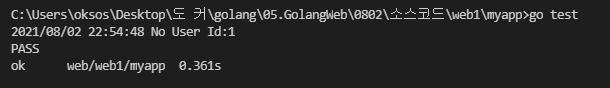
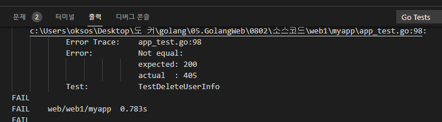
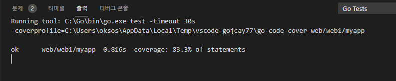

## 2021년08월02일_GoLangWeb-RESTfulAPI3

## 동작확인 

- chrome://apps/  
- 주소창에 위에 주소를 쳐서 ARC를 켭시다. 물론 postman 사용 가능  

## POST 동작 확인  



- 이렇게 나오는게 정상이다.  



## GET 동작확인  



##  한번더 생성 



## DELETE 만들기  

## TEST코드 작성  

- 원래  DELTE라는것은 없다. 그렇다면 어떻게 할 것인가?

```go
	req, _:=http.NewRequest("DELETE", ts.URL+"/users/1", nil)
	resp, err:=http.DefaultClient.Do(req)
```

- 위에처럼 해줘야한다.  

```go
func TestDeleteUserInfo(t *testing.T) {
	assert := assert.New(t)

	ts := httptest.NewServer(NewHandler())
	defer ts.Close()

	req, _ := http.NewRequest("DELETE", ts.URL+"/users/1", nil)
	resp, err := http.DefaultClient.Do(req)
	assert.NoError(err)
	assert.Equal(http.StatusOK, resp.StatusCode)
}
```

- 이렇게 그냥 매서드만 보냈는데 통과하게 된다. 이는 정말 이상한것 이다. 

```go
	data, _ := ioutil.ReadAll(resp.Body)
	log.Print(string(data))
```



- 로그를 찍어보니  No User Id:1이 나오는데 이는  아래를 이렇게 고쳐야한다. 

```go
	mux.HandleFunc("/users/{id:[0-9]+}", getUserInfoHandler)

mux.HandleFunc("/users/{id:[0-9]+}", getUserInfoHandler).Methods("GET")
```



- 위에처럼  이렇게 된것이 정상이다.  
- 매소드를 안써서 GET이 아니여도 Get에 대한 메소드와 별반 차이 없이 실행이되서 통과되는것 우리는 DELETE를 만들기 때문에 매소드에 DELETE로 핸들러를 만들어주자.  

##  app.go 부분에 아래와 같이 추가한다. 

```go
func deleteUserInfoHandler(w http.ResponseWriter, r *http.Request) {
	vars := mux.Vars(r)
	id, err := strconv.Atoi(vars["id"])
	if err != nil {
		w.WriteHeader(http.StatusBadRequest)
		fmt.Fprint(w, err)
		return
	}
	_, ok := userMap[id]
	if !ok {
		w.WriteHeader(http.StatusOK)
		fmt.Fprint(w, "No User ID:", id)
		return
	}
	delete(userMap, id)
	w.WriteHeader(http.StatusOK)
	fmt.Fprint(w, "Delete User ID:", id)
}


func NewHandler() http.Handler {
  ...
	mux.HandleFunc("/users/{id:[0-9]+}", deleteUserHandler).Methods("DELETE")
}
```

- 간단히 말하면 아이디 받아와서 없으면 No User 출력
- 지우고 나서 Delete User 출력하는 식이다. 

## 최종 테스트 코드  

```go
func TestDeleteUser(t *testing.T) {
	assert := assert.New(t)

	ts := httptest.NewServer(NewHandler())
	defer ts.Close()

	req, _ := http.NewRequest("DELETE", ts.URL+"/users/1", nil)
	resp, err := http.DefaultClient.Do(req)
	assert.NoError(err)
	assert.Equal(http.StatusOK, resp.StatusCode)
	data, _ := ioutil.ReadAll(resp.Body)
	log.Print(string(data))
	// 현재는 지울것이 없었다는게 정상임
	assert.Contains(string(data), "No User ID:1")

	//등록하는것
	resp, err = http.Post(ts.URL+"/users", "application/json",
		strings.NewReader(`{"first_name":"it", "last_name":"3dp", "email":"3dpit@naver.com"}`))
	assert.NoError(err)
	assert.Equal(http.StatusCreated, resp.StatusCode)

	user := new(User)
	err = json.NewDecoder(resp.Body).Decode(user)
	assert.NoError(err)
	assert.NotEqual(0, user.ID)

	req, _ = http.NewRequest("DELETE", ts.URL+"/users/1", nil)
	resp, err = http.DefaultClient.Do(req)
	assert.NoError(err)
	assert.Equal(http.StatusOK, resp.StatusCode)
	data, _ = ioutil.ReadAll(resp.Body)
	log.Print(string(data))
	assert.Contains(string(data), "Deleted User ID:1")
	//생성된 상태에서 지우는 것이라서 그런것
}
```

- 생성해보고 지우는 것 까지 테스트 진행

