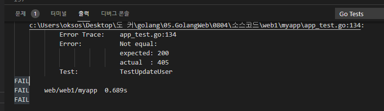
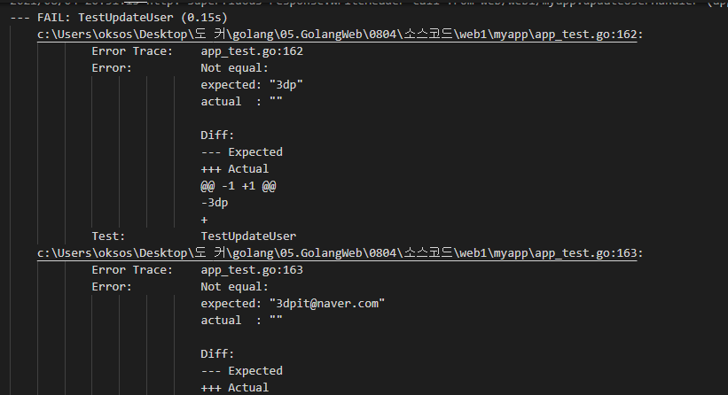
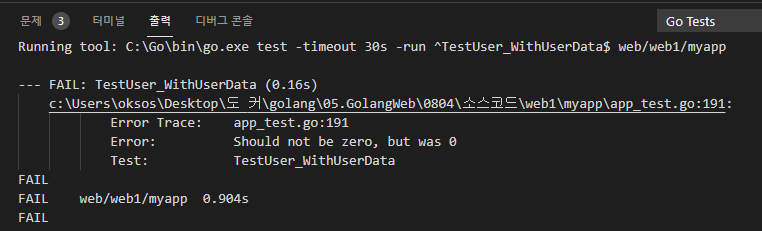

## 2021년08월04일_GoLangWeb-RESTfulAPI4 

## PUT 업데이트 환경을 만들어보자  

### 테스트 코드 작성  

```go
func TestUpdateUser(t *testing.T) {
	assert := assert.New(t)

	ts := httptest.NewServer(NewHandler())
	defer ts.Close()

	req, _ := http.NewRequest("PUT", ts.URL+"/users",
		strings.NewReader(`{"id":1, "first_name":"updated","last_name":"updated","email":"updated@naver.com"}`))
	resp, err := http.DefaultClient.Do(req)
	assert.NoError(err)
	assert.Equal(http.StatusOK, resp.StatusCode)
	data, _ := ioutil.ReadAll(resp.Body)
	assert.Contains(string(data), "No User ID:1")
}
```

- 위와 같이 테스트 코드 작성 우선 이전의 DELETE와는 다르게 PUT 해주고 어떤식이 나오게 할지 에 대해서 정함  



- 이렇게 보면 현재는 핸들러를 등록하지 않았기 때문에 이렇게 나오는 것이다.  

## 업데이트 방식  

- update or Create 
  - 업데이트 하려고 했는데 없으면 만들어버릴 수 있음
- update 없음 Error 
  - 없는 경우 에러를 발생하는 것으로 함

## 업데이트 핸들러  

```go
func updateUserHandler(w http.ResponseWriter, r *http.Request) {
	updateUser := new(User)
	err := json.NewDecoder(r.Body).Decode(updateUser)
	if err != nil {
		w.WriteHeader(http.StatusBadRequest)
		fmt.Fprint(w, err)
		return
	}
	_, ok := userMap[updateUser.ID]
	if !ok {
		w.WriteHeader(http.StatusOK)
		fmt.Fprint(w, "No User ID:", updateUser.ID)
    return
	}
}
```

## 테스트 코드 추가  

```go
	//등록하는것
	resp, err = http.Post(ts.URL+"/users", "application/json",
		strings.NewReader(`{"first_name":"it", "last_name":"3dp", "email":"3dpit@naver.com"}`))
	assert.NoError(err)
	assert.Equal(http.StatusCreated, resp.StatusCode)

	user := new(User)
	err = json.NewDecoder(resp.Body).Decode(user)
	assert.NoError(err)
	assert.NotEqual(0, user.ID)

	updateStr := fmt.Sprintf(`{"id":%d, "first_name":"updated"}`, user.ID)
	req, _ = http.NewRequest("PUT", ts.URL+"/users",
		strings.NewReader(updateStr))
	resp, err = http.DefaultClient.Do(req)
	assert.NoError(err)
	assert.Equal(http.StatusOK, resp.StatusCode)
```

- 등록하고 에러 있느지 확인하고 바뀐 결과를 보내주고 에러 확인 진행  

```go
	updateUser := new(User)
	err = json.NewDecoder(resp.Body).Decode(updateUser)
	assert.NoError(err)
```

- 이것을 추가하고 돌리게 되면 에러가 생기는데 핸들러에서 있는지만 확인 했지 업데이트를 하지 않아서 그런다.  

```
	w.Header().Add("Content-Type", "application/json")
 //json 타입이라고 명시해주는 것 
  userMap[updateUser.ID] = updateUser
//클라이언트가 원하는것 으로 바꿈 
	w.WriteHeader(http.StatusOK)
	data, _ := json.Marshal(updateUser)
	fmt.Fprint(w, string(data))
// 데이터 마샬링 해서 데이터 보여주는 식
```

## update 핸들러  

```go
func updateUserHandler(w http.ResponseWriter, r *http.Request) {
	updateUser := new(User)
	err := json.NewDecoder(r.Body).Decode(updateUser)
	if err != nil {
		w.WriteHeader(http.StatusBadRequest)
		fmt.Fprint(w, err)
		return
	}
	_, ok := userMap[updateUser.ID]
	if !ok {
		w.WriteHeader(http.StatusOK)
		fmt.Fprint(w, "No User ID:", updateUser.ID)
    return
	}
	userMap[updateUser.ID] = updateUser
	w.Header().Add("Content-Type", "application/json")
	w.WriteHeader(http.StatusOK)
	data, _ := json.Marshal(updateUser)
	fmt.Fprint(w, string(data))
}
```

## 테스트 코드 부분  

```go
	assert.Equal(updateUser.ID, user.ID)
	assert.Equal("updated", updateUser.FirstName)
	assert.Equal(user.LastName, updateUser.LastName)
	assert.Equal(user.Email, updateUser.Email)
```

- 이렇게 해서 바뀐거 제대로 바뀌었는지 확인 해야함  



- 현재 이렇게 보게 되면 라스트 네임과 이메일이 지워져 있는데 이유는 무엇일지 생각해보자.
- first네임만 보내서 다른것을 디폴트로 바꿔버려서 핸들러에서 맵을 바꿔서 써버려서 빈 항목만 바꿔야함 
- 그래서 핸들러를 수정해보자. 

## update 핸들러  

```go
//before
	_, ok := userMap[updateUser.ID]
	if !ok {
		w.WriteHeader(http.StatusOK)
		fmt.Fprint(w, "No User ID:", updateUser.ID)
    return
	}
	userMap[updateUser.ID] = updateUser
	w.Header().Add("Content-Type", "application/json")
	w.WriteHeader(http.StatusOK)
	data, _ := json.Marshal(updateUser)
	fmt.Fprint(w, string(data))
//after
	user, ok := userMap[updateUser.ID]
	if !ok {
		w.WriteHeader(http.StatusOK)
		fmt.Fprint(w, "No User ID:", updateUser.ID)
    return
	}
	if updateUser.FirstName != "" {
		user.FirstName = updateUser.FirstName
	}
	if updateUser.LastName != "" {
		user.LastName = updateUser.LastName
	}
	if updateUser.FirstName != "" {
		user.Email = updateUser.Email
	}
	w.Header().Add("Content-Type", "application/json")
	w.WriteHeader(http.StatusOK)
	data, _ := json.Marshal(user)
	fmt.Fprint(w, string(data))
```

- 이렇게 하면 통과 하는데 

## 업데이트 문제 

```go
updateStr := fmt.Sprintf(`{"id":%d, "first_name":"updated","last_name":""}`, user.ID)
```

- "last_name":""  이렇게 넣고 싶다면 이경우 문제 생긴다. 그래서 원래는 업데이트 구조체를 따로 만든다.  

```go
type UpdateUser struct {
	ID               int       `json:"id"`
	UpdatedFirstName bool      `json:"updated_first_name"`
	FirstName        string    `json:"first_name"`
	UpdatedLastName  bool      `json:"updated_last_name"`
	LastName         string    `json:"last_name"`
	UpdatedEmail     bool      `json:"updated_email"`
	Email            string    `json:"email"`
	CreateAT         time.Time `json:"created _at"`
}
```

- 이렇게 따로 만들어서  바꾸고 싶은것을 true 로 바꿔주면 된다. 

## GET 핸들러 수정하기  

```go
	mux.HandleFunc("/users", userHandler).Methods("GET")
```

- 위를 수정할 것이다.  

```go
func userHandler(w http.ResponseWriter, r *http.Request) {
	fmt.Fprint(w, "Get UserInfo by /users/{id}")
}
```

- 원래는 이렇게만 있으면 안된다 .

```go
func userHandler(w http.ResponseWriter, r *http.Request) {
	if len(userMap) == 0 {
		w.WriteHeader(http.StatusOK)
		fmt.Fprint(w, "No Users")
		return
	}
}
```

- 이렇게 바꿔주고 test 코드도 바꿔야한다. 

```go
//before
func TestUser(t *testing.T) {
	assert := assert.New(t)

	ts := httptest.NewServer(NewHandler())
	defer ts.Close()

	resp, err := http.Get(ts.URL + "/users")
	assert.NoError(err)
	assert.Equal(http.StatusOK, resp.StatusCode)
	data, _ := ioutil.ReadAll(resp.Body)
	assert.Contains(string(data), "Get UserInfo")
}
//after
func TestUser(t *testing.T) {
	assert := assert.New(t)

	ts := httptest.NewServer(NewHandler())
	defer ts.Close()

	resp, err := http.Get(ts.URL + "/users")
	assert.NoError(err)
	assert.Equal(http.StatusOK, resp.StatusCode)
	data, _ := ioutil.ReadAll(resp.Body)
	assert.Equal(string(data), "No Users")
}
```

- 그리고 실제로는 리스트가 제대로 와야하는데 그것을 확인 하기 위해서 아래와 같이 테스트 코드 구현 

```go
	//등록하는것
	resp, err := http.Post(ts.URL+"/users", "application/json",
		strings.NewReader(`{"first_name":"it", "last_name":"3dp", "email":"3dpit@naver.com"}`))
	assert.NoError(err)
	assert.Equal(http.StatusCreated, resp.StatusCode)

	//등록하는것
	resp, err = http.Post(ts.URL+"/users", "application/json",
		strings.NewReader(`{"first_name":"ti", "last_name":"4dp", "email":"4dpit@naver.com"}`))
	assert.NoError(err)
	assert.Equal(http.StatusCreated, resp.StatusCode)

	resp, err = http.Get(ts.URL + "/users")
	assert.NoError(err)
	assert.Equal(http.StatusOK, resp.StatusCode)
```

- 등록해서 실제 에러가 없고 제대로 동작하는지 확인  

```go
	data, err := ioutil.ReadAll(resp.Body)
	assert.NoError(err)
	assert.NotZero(len(data))
```

- 현재는 리스펀스 바디에 데이터 있어야하고  에러가 없어야하고 , 데이터 사이즈가 0가 아니어야함



- 현재 이렇게 하면 에러가 생기는데 이유는 아래와 같다. 
- usersHandler 부분을 보면  0이아닌 경우 동작이 없어서 그런다. 그래서 추가하자.

```go
func userHandler(w http.ResponseWriter, r *http.Request) {
	if len(userMap) == 0 {
		w.WriteHeader(http.StatusOK)
		fmt.Fprint(w, "No Users")
		return
	}
	users := []*User{}
	for _, u := range userMap {
		users = append(users, u)
	}
  	data, _ := json.Marshal(users)
	w.Header().Add("Content-Type", "application/json")
	w.WriteHeader(http.StatusOK)
	fmt.Fprint(w, string(data))
}

```

- 위와 같이 추가하면 테스트 코드가 성공한다. 

## 여기까지 테스트 코드  

```go
func TestUser_WithUserData(t *testing.T) {
	assert := assert.New(t)

	ts := httptest.NewServer(NewHandler())
	defer ts.Close()

	//등록하는것
	resp, err := http.Post(ts.URL+"/users", "application/json",
		strings.NewReader(`{"first_name":"it", "last_name":"3dp", "email":"3dpit@naver.com"}`))
	assert.NoError(err)
	assert.Equal(http.StatusCreated, resp.StatusCode)

	//등록하는것
	resp, err = http.Post(ts.URL+"/users", "application/json",
		strings.NewReader(`{"first_name":"ti", "last_name":"4dp", "email":"4dpit@naver.com"}`))
	assert.NoError(err)
	assert.Equal(http.StatusCreated, resp.StatusCode)

	resp, err = http.Get(ts.URL + "/users")
	assert.NoError(err)
	assert.Equal(http.StatusOK, resp.StatusCode)

	data, err := ioutil.ReadAll(resp.Body)
	assert.NoError(err)
	assert.NotZero(len(data))
}


// 제대로 데이터 들어오는지 확인 
	// data, err := ioutil.ReadAll(resp.Body)
	// assert.NoError(err)
	// assert.NotZero(len(data))
	users := []*User{}
	err = json.NewDecoder(resp.Body).Decode(&users)
	assert.NoError(err)
	assert.Equal(2, len(users))
```

- 아래부분만 최종적으로 데이터 2개를 보냈기때문에 저렇게만 확인하면 끝

## 전체 app.go 소스  

```go
package myapp

import (
	"encoding/json"
	"fmt"
	"net/http"
	"strconv"
	"time"

	"github.com/gorilla/mux"
)

//User struct
type User struct {
	ID        int       `json:"id"`
	FirstName string    `json:"first_name"`
	LastName  string    `json:"last_name"`
	Email     string    `json:"email"`
	CreateAT  time.Time `json:"created _at"`
}
type UpdateUser struct {
	ID               int       `json:"id"`
	UpdatedFirstName bool      `json:"updated_first_name"`
	FirstName        string    `json:"first_name"`
	UpdatedLastName  bool      `json:"updated_last_name"`
	LastName         string    `json:"last_name"`
	UpdatedEmail     bool      `json:"updated_email"`
	Email            string    `json:"email"`
	CreateAT         time.Time `json:"created _at"`
}

var userMap map[int]*User
var lastID int

func indexHandler(w http.ResponseWriter, r *http.Request) {
	fmt.Fprint(w, "Hello World")
}

func userHandler(w http.ResponseWriter, r *http.Request) {
	if len(userMap) == 0 {
		w.WriteHeader(http.StatusOK)
		fmt.Fprint(w, "No Users")
		return
	}
	users := []*User{}
	for _, u := range userMap {
		users = append(users, u)
	}
	data, _ := json.Marshal(users)
	w.Header().Add("Content-Type", "application/json")
	w.WriteHeader(http.StatusOK)
	fmt.Fprint(w, string(data))
}

func getUserInfoHandler(w http.ResponseWriter, r *http.Request) {
	vars := mux.Vars(r)
	id, err := strconv.Atoi(vars["id"])
	if err != nil {
		w.WriteHeader(http.StatusBadRequest)
		fmt.Fprint(w, err)
		return
	}
	user, ok := userMap[id]
	if !ok {
		w.WriteHeader(http.StatusOK)
		fmt.Fprint(w, "No User Id:", id)
		return
	}

	w.Header().Add("Content-Type", "application/json")
	w.WriteHeader(http.StatusOK)
	data, _ := json.Marshal(user)
	fmt.Fprint(w, string(data))
}

func createUserHandler(w http.ResponseWriter, r *http.Request) {
	user := new(User)
	err := json.NewDecoder(r.Body).Decode(user)
	if err != nil {
		w.WriteHeader(http.StatusBadRequest)
		fmt.Fprint(w, err)
		return
	}

	//Created User
	lastID++
	user.ID = lastID
	user.CreateAT = time.Now()
	userMap[user.ID] = user

	w.Header().Add("Content-Type", "application/json")
	w.WriteHeader(http.StatusCreated)
	data, _ := json.Marshal(user)
	fmt.Fprint(w, string(data))
}

func deleteUserHandler(w http.ResponseWriter, r *http.Request) {
	vars := mux.Vars(r)
	id, err := strconv.Atoi(vars["id"])
	if err != nil {
		w.WriteHeader(http.StatusBadRequest)
		fmt.Fprint(w, err)
		return
	}
	_, ok := userMap[id]
	if !ok {
		w.WriteHeader(http.StatusOK)
		fmt.Fprint(w, "No User ID:", id)
		return
	}
	delete(userMap, id)
	w.WriteHeader(http.StatusOK)
	fmt.Fprint(w, "Deleted User ID:", id)
}
func updateUserHandler(w http.ResponseWriter, r *http.Request) {
	updateUser := new(User)
	err := json.NewDecoder(r.Body).Decode(updateUser)
	if err != nil {
		w.WriteHeader(http.StatusBadRequest)
		fmt.Fprint(w, err)
		return
	}
	user, ok := userMap[updateUser.ID]
	if !ok {
		w.WriteHeader(http.StatusOK)
		fmt.Fprint(w, "No User ID:", updateUser.ID)
		return
	}
	if updateUser.FirstName != "" {
		user.FirstName = updateUser.FirstName
	}
	if updateUser.LastName != "" {
		user.LastName = updateUser.LastName
	}
	if updateUser.Email != "" {
		user.Email = updateUser.Email
	}
	w.Header().Add("Content-Type", "application/json")
	w.WriteHeader(http.StatusOK)
	data, _ := json.Marshal(user)
	fmt.Fprint(w, string(data))
}

//NewHandler make a new myapp Handler
func NewHandler() http.Handler {
	userMap = make(map[int]*User)
	lastID = 0
	mux := mux.NewRouter()

	mux.HandleFunc("/", indexHandler)
	mux.HandleFunc("/users", userHandler).Methods("GET")
	mux.HandleFunc("/users", createUserHandler).Methods("POST")
	mux.HandleFunc("/users", updateUserHandler).Methods("PUT")
	mux.HandleFunc("/users/{id:[0-9]+}", getUserInfoHandler).Methods("GET")
	mux.HandleFunc("/users/{id:[0-9]+}", deleteUserHandler).Methods("DELETE")

	return mux
}
```

## 전체 app_test.go 소스 

```go
package myapp

import (
	"encoding/json"
	"fmt"
	"io/ioutil"
	"log"
	"net/http"
	"net/http/httptest"
	"strconv"
	"strings"
	"testing"

	"github.com/stretchr/testify/assert"
)

func TestIndex(t *testing.T) {
	assert := assert.New(t)

	ts := httptest.NewServer(NewHandler())
	defer ts.Close()

	resp, err := http.Get(ts.URL)
	assert.NoError(err)
	assert.Equal(http.StatusOK, resp.StatusCode)
	data, _ := ioutil.ReadAll(resp.Body)
	assert.Equal("Hello World", string(data))
}

func TestUser(t *testing.T) {
	assert := assert.New(t)

	ts := httptest.NewServer(NewHandler())
	defer ts.Close()

	resp, err := http.Get(ts.URL + "/users")
	assert.NoError(err)
	assert.Equal(http.StatusOK, resp.StatusCode)
	data, _ := ioutil.ReadAll(resp.Body)
	assert.Equal(string(data), "No Users")
}

func TestGetUserInfo(t *testing.T) {
	assert := assert.New(t)

	ts := httptest.NewServer(NewHandler())
	defer ts.Close()

	resp, err := http.Get(ts.URL + "/users/89")
	assert.NoError(err)
	assert.Equal(http.StatusOK, resp.StatusCode)
	data, _ := ioutil.ReadAll(resp.Body)
	assert.Contains(string(data), "No User Id:89")

	resp, err = http.Get(ts.URL + "/users/56")
	assert.NoError(err)
	assert.Equal(http.StatusOK, resp.StatusCode)
	data, _ = ioutil.ReadAll(resp.Body)
	assert.Contains(string(data), "No User Id:56")
}

func TestCreateUserInfo(t *testing.T) {
	assert := assert.New(t)

	ts := httptest.NewServer(NewHandler())
	defer ts.Close()

	resp, err := http.Post(ts.URL+"/users", "application/json",
		strings.NewReader(`{"first_name":"it", "last_name":"3dp", "email":"3dpit@naver.com"}`))
	assert.NoError(err)
	assert.Equal(http.StatusCreated, resp.StatusCode)

	user := new(User)
	err = json.NewDecoder(resp.Body).Decode(user)
	assert.NoError(err)
	assert.NotEqual(0, user.ID)

	id := user.ID
	resp, err = http.Get(ts.URL + "/users/" + strconv.Itoa(id))
	assert.NoError(err)
	assert.Equal(http.StatusOK, resp.StatusCode)

	user2 := new(User)
	err = json.NewDecoder(resp.Body).Decode(user2)
	assert.NoError(err)
	assert.Equal(user.ID, user2.ID)
	assert.Equal(user.FirstName, user2.FirstName)
}

func TestDeleteUser(t *testing.T) {
	assert := assert.New(t)

	ts := httptest.NewServer(NewHandler())
	defer ts.Close()

	req, _ := http.NewRequest("DELETE", ts.URL+"/users/1", nil)
	resp, err := http.DefaultClient.Do(req)
	assert.NoError(err)
	assert.Equal(http.StatusOK, resp.StatusCode)
	data, _ := ioutil.ReadAll(resp.Body)
	log.Print(string(data))
	// 현재는 지울것이 없었다는게 정상임
	assert.Contains(string(data), "No User ID:1")

	//등록하는것
	resp, err = http.Post(ts.URL+"/users", "application/json",
		strings.NewReader(`{"first_name":"it", "last_name":"3dp", "email":"3dpit@naver.com"}`))
	assert.NoError(err)
	assert.Equal(http.StatusCreated, resp.StatusCode)

	user := new(User)
	err = json.NewDecoder(resp.Body).Decode(user)
	assert.NoError(err)
	assert.NotEqual(0, user.ID)

	req, _ = http.NewRequest("DELETE", ts.URL+"/users/1", nil)
	resp, err = http.DefaultClient.Do(req)
	assert.NoError(err)
	assert.Equal(http.StatusOK, resp.StatusCode)
	data, _ = ioutil.ReadAll(resp.Body)
	log.Print(string(data))
	assert.Contains(string(data), "Deleted User ID:1")
	//생성된 상태에서 지우는 것이라서 그런것
}
func TestUpdateUser(t *testing.T) {
	assert := assert.New(t)

	ts := httptest.NewServer(NewHandler())
	defer ts.Close()

	req, _ := http.NewRequest("PUT", ts.URL+"/users",
		strings.NewReader(`{"id":1, "first_name":"updated","last_name":"updated","email":"updated@naver.com"}`))
	resp, err := http.DefaultClient.Do(req)
	assert.NoError(err)
	assert.Equal(http.StatusOK, resp.StatusCode)
	data, _ := ioutil.ReadAll(resp.Body)
	assert.Contains(string(data), "No User ID:1")

	//등록하는것
	resp, err = http.Post(ts.URL+"/users", "application/json",
		strings.NewReader(`{"first_name":"it", "last_name":"3dp", "email":"3dpit@naver.com"}`))
	assert.NoError(err)
	assert.Equal(http.StatusCreated, resp.StatusCode)

	user := new(User)
	err = json.NewDecoder(resp.Body).Decode(user)
	assert.NoError(err)
	assert.NotEqual(0, user.ID)

	updateStr := fmt.Sprintf(`{"id":%d, "first_name":"updated"}`, user.ID)
	req, _ = http.NewRequest("PUT", ts.URL+"/users",
		strings.NewReader(updateStr))
	resp, err = http.DefaultClient.Do(req)
	assert.NoError(err)
	assert.Equal(http.StatusOK, resp.StatusCode)

	updateUser := new(User)
	err = json.NewDecoder(resp.Body).Decode(updateUser)
	assert.NoError(err)
	assert.Equal(updateUser.ID, user.ID)
	assert.Equal("updated", updateUser.FirstName)
	assert.Equal(user.LastName, updateUser.LastName)
	assert.Equal(user.Email, updateUser.Email)

}

func TestUser_WithUserData(t *testing.T) {
	assert := assert.New(t)

	ts := httptest.NewServer(NewHandler())
	defer ts.Close()

	//등록하는것
	resp, err := http.Post(ts.URL+"/users", "application/json",
		strings.NewReader(`{"first_name":"it", "last_name":"3dp", "email":"3dpit@naver.com"}`))
	assert.NoError(err)
	assert.Equal(http.StatusCreated, resp.StatusCode)

	//등록하는것
	resp, err = http.Post(ts.URL+"/users", "application/json",
		strings.NewReader(`{"first_name":"ti", "last_name":"4dp", "email":"4dpit@naver.com"}`))
	assert.NoError(err)
	assert.Equal(http.StatusCreated, resp.StatusCode)

	resp, err = http.Get(ts.URL + "/users")
	assert.NoError(err)
	assert.Equal(http.StatusOK, resp.StatusCode)

	// data, err := ioutil.ReadAll(resp.Body)
	// assert.NoError(err)
	// assert.NotZero(len(data))
	users := []*User{}
	err = json.NewDecoder(resp.Body).Decode(&users)
	assert.NoError(err)
	assert.Equal(2, len(users))

}
```

