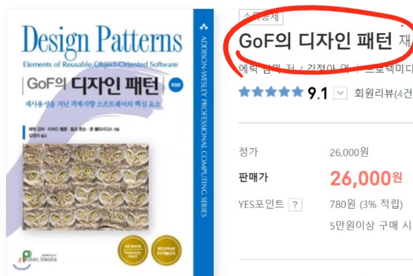
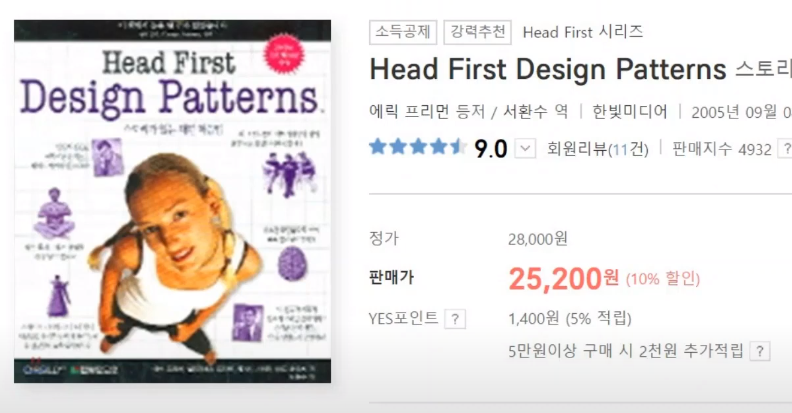
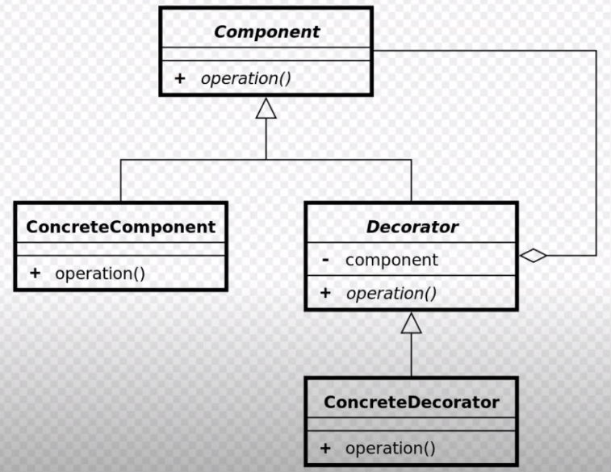
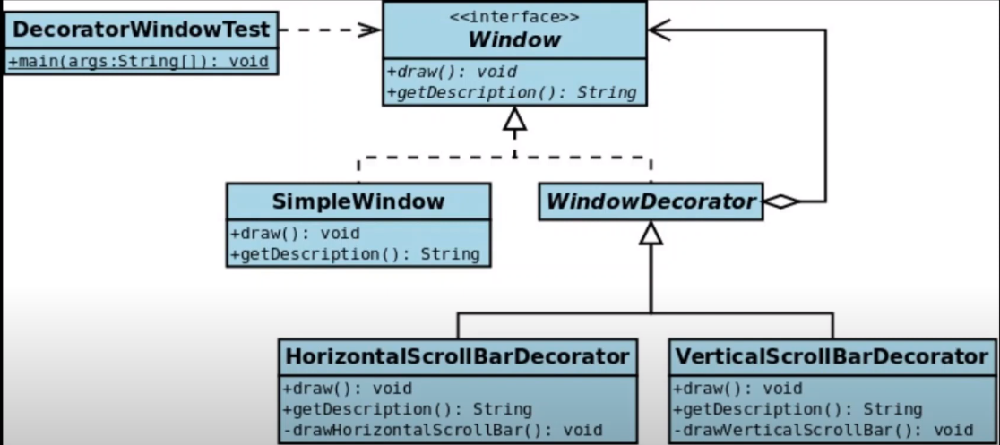
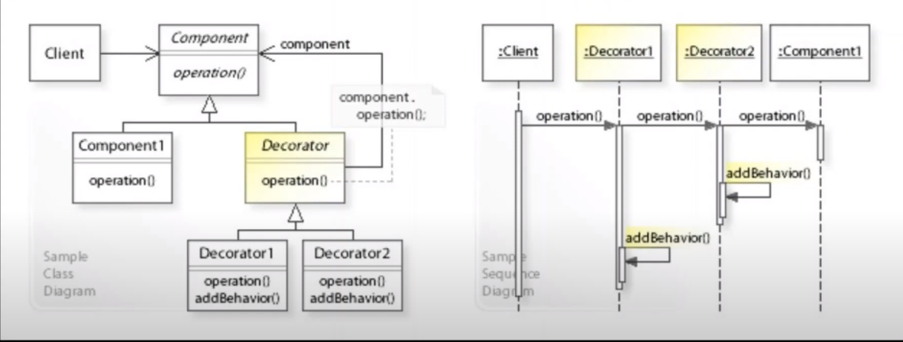
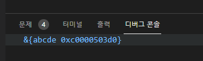
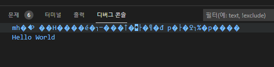

## 2021년08월05일_GoLangWeb-Decorator패턴
## Decorator  
- Decorator는 프로그래밍 패턴중 하나
- 꾸미기, 볼펜이 있을때, 그냥 볼펜이 있고, 털달린 볼펜이 있고 장신구 있는 것 있는데 이 두개 볼펜 비교시
- 글을 쓴다는 기본 기능은 똑같음 , 기본 기능은 유지하고 꾸미기(부가 기능)이 추가됨, 기본 기능과 상관 없는 다른 기능을 데코레이터
- 기본 기능 두고 꾸미는것을 말함 \
- 우리가 데이터 보낼때, 그냥 보내는 것이 아니고 부가기능을 추가 할 수 있음
- 압축을 한다거나 암호화 한다거나 그 데이터가 나가는 기능을 추적할 수 있게 log를 달겠다. 또는 마케팅 할때 마케팅 서버에 알려주겠다 하는 부가기능을 하고 데이터를 보내는 과정? 
- 원데이터 가만 두고 추가해서 보내는 것 
- 이런 추가하는 것을 데코레이터라고 한다. 
- 이것을 왜 쓰는지? 이것을 하나로 만들면 되겠다 하는데  부가 기능은 잘 바뀌는 특징이 있음 그래서 이것을 하나로 만들어놓으면 그냥 기본 기능은 그냥있는데 부가기능이 바껴서 매번 바껴서 변경에 닫혀있지 않아 solid 원칙에 어긋남
- 하지만 이것을 따로 만들면 압축을 zip으로 했다 가 다른것을로 해도 되고 암호화도 128에서 256으로 한다거나
- log도 파일에서 DB로 바꾼다거나 추가한다거나. 즉, 개별적으로 만들면 기본 기능은 건들필요없이 변경 가능
- 이것을 어떻게 구현할 것인가. 이것을 코딩으로만들어놓은것 디자인 패턴이다.
## 코딩의 중요
- 코딩에서는 아키텍처가 중요하다. 그냥 맨땅의 헤딩을 하면 잘 안될 수 있다.
- 그래서 잘쓰는것은 패턴화 시켜서 그대로 쓰면 좋다. 해놓으면 같은 기능을 잘 쉽게 쓸 수 있다. 

- 좋은 디자인패턴의 책  (예제가 없어서 어려울 수 있음)



- 그중에 이책이 좀더 좋다고 한다. 예제가 풍부하고 쉽게 되어 있음  
- 그중 디자인 패턴중 하나가 데코레이터 패턴이다.  



- 데코레이션 패턴 다이어그램이다. 

-  컨포넌트는 (인터페이스) - 오퍼레이션이라는 인터페이스 펑션을 가지고 있음
- 그리고 그것을 구현한것이 두개가 ConcreteComponent, Decorator가 있음
- 첫번째가 ConcreteComponent가 있는데 이는 구현해서 operation()이있고 이녀석은 기본 기능을 구현하고 있고,
- 두번쨰가 Decorator가 구현 이것은 component를 멤버 variable로 가지고 있고, 이것은 멤버로 component를 가지고 있어서 이것안에 operation이 동작하고 Decorator의 operation이 동작하는 식이다. 
- 그리고 그 Decorator를 구현하고 있는것 ConcreteDecorator는 부가기능이다. (압축, 암호화 이런것등등 함) 이것 역시 component 의 operation동작후 자기 자신의 operation을 실행 함 



- 위의 경우를 예로 들면 window라는 것은 draw와 getDescription를 가지고 있다. 
- 여기서 이름 구현하는 SimpleWindow라는것은 그냥 단순히 그냥 그리는 기능을 가진것이다. 
- 근데 우리가 여기에다가 횡스크롤 이런것과 종스크롤 을 넣고 싶은데 이 스크롤은  윈도우의 기능이 아니다. 즉 부가기능이다. 그래서 이것을 상속해서 windowDecorator가 있는데 이것은 멤버로 window를 가지고 아래 횡, 종 스크롤을 구현하고 있음 
- window -> 종스크롤 -> 횡스크롤 -> simplewindow  각각 종스크롤 draw호출 횡스크롤 draw호출, simple의 draw호출되는데 이렇게 해서 simpleWindow의 draw가 먼저 호출이 되고, 이것이 끝나면 리턴이 되는데  횡스크롤이 본인의 스크롤바를 그리고 라턴되고 , 종스크롤이 본인의 스크롤바를 그린다. 그 하나의 화면을 만들어서 리턴을 하는 식



- 왼쪽은 클래스 다이어그램, 오른쪽 시퀀스 다이어그램  

- 현재 클라이언트는 Decorator1 밖에 모른다. 이 1은 Decorator에 component를 멤버로 가지고 있음 1은 2를 가지고 있음, 2는 기본 기능하는 Component1을 가지고 있음 서로 묶여 있는 형태
- 클라이언트는 operation()만하면 그냥 그려지겠지만 생각 Decorator1역시도 뭘하는지 모르지만 그냥 기능만 구현 무튼 component1까지 가면 그리고 리턴하면 각 돌아오면서 각 자기의 기능을 함 압축을 하거나 암호화하는 등등임

## Decorator 예제  

```
Data ->  Encrypt -> zip -> send 

Data <- Recrypt <- unzip <-receive 하는 식
```

- 위와 같이 구현해볼 예정이다.  

## 압축 관련 전체 소스 / lzw.go

```go
package lzw

import (
	"bytes"
	"compress/lzw"
	"fmt"
	"io/ioutil"
)

// Write zip the data using lzw
func Write(data []byte) ([]byte, error) {
	buf := new(bytes.Buffer)
	writer := lzw.NewWriter(buf, lzw.LSB, 8)
	n, err := writer.Write(data)
	if n != len(data) {
		return nil, fmt.Errorf("Not enough write:%d dataSize:%d", n, len(data))
	}
	if err != nil {
		return nil, err
	}
	writer.Close()
	return buf.Bytes(), nil
}

// Read unzip the data using lzw
func Read(data []byte) ([]byte, error) {
	r := bytes.NewReader(data)
	reader := lzw.NewReader(r, lzw.LSB, 8)
	origData, err := ioutil.ReadAll(reader)
	if err != nil {
		return nil, err
	}
	return origData, nil
}

```

## main.go  

```go
type Component interface {
	Operator(string)
}

var sendData string

type SendComponent struct{}

func (self *SendComponent) Operator(data string) {
	// Send data
	sendData = data
}

type ZipComponent struct {
	com Component
}

func (self *ZipComponent) Operator(data string) {
	zipData, err := lzw.Write([]byte(data))
	if err != nil {
		panic(err)
	}
	self.com.Operator(string(zipData))
}

```

- 여기까지 우선 압축하는 것 

## 암호화하는 소스 cipher.go  

```go
package cipher

import (
	"crypto/aes"
	"crypto/cipher"
	"crypto/md5"
	"crypto/rand"
	"encoding/hex"
	"io"
)

func createHash(key string) string {
	hasher := md5.New()
	hasher.Write([]byte(key))
	return hex.EncodeToString(hasher.Sum(nil))
}

// Encrypt encrypt data using aes
func Encrypt(data []byte, passphrase string) ([]byte, error) {
	block, err := aes.NewCipher([]byte(createHash(passphrase)))
	if err != nil {
		return nil, err
	}
	gcm, err := cipher.NewGCM(block)
	if err != nil {
		return nil, err
	}
	nonce := make([]byte, gcm.NonceSize())
	if _, err = io.ReadFull(rand.Reader, nonce); err != nil {
		return nil, err
	}
	ciphertext := gcm.Seal(nonce, nonce, data, nil)
	return ciphertext, nil
}

// Decrypt decrypt data using aes
func Decrypt(data []byte, passphrase string) ([]byte, error) {
	key := []byte(createHash(passphrase))
	block, err := aes.NewCipher(key)
	if err != nil {
		return nil, err
	}
	gcm, err := cipher.NewGCM(block)
	if err != nil {
		return nil, err
	}
	nonceSize := gcm.NonceSize()
	nonce, ciphertext := data[:nonceSize], data[nonceSize:]
	plaintext, err := gcm.Open(nil, nonce, ciphertext, nil)
	if err != nil {
		return nil, err
	}
	return plaintext, nil
}
```

## main.go  

```go
type EncryptComponent struct {
	ket string
	com Component
}

func (self *EncryptComponent) Operator(data string) {
	encryptData, err := cipher.Encrypt([]byte(data), self.key)
	if err != nil {
		panic(err)
	}
	self.com.Operator(string(encryptData))
}
```

- 암호화 하는 부분 추가  

``` go
func main() {
	sender := &EncryptComponent{key: "abcde",
		com: &ZipComponent{
			com: &SendComponent{}
		}
	}
}
```

- 이렇게 하면 암호화하는 컴포넌트가 압축하는 컴포넌트를 가지고 있고 압축하는 컴포넌트는 send 컴포넌트를 가지고 있게 된다. 



- 이렇게 되면 압축된 모습이다. 

## 암호해제 컴포넌트 만들기  

```go
type DecryptComponent struct {
	key string
	com Component
}

func (self *DecryptComponent) Operator(data string) {
	decryptData, err := cipher.Decrypt([]byte(data), self.key)
	if err != nil {
		panic(err)
	}
	self.com.Operator(string(decryptData))
}
```

## 압축해제 컴포넌트 만들기  

```go
type UnzipComponent struct {
	com Component
}

func (self *UnzipComponent) Operator(data string) {
	unzipData, err := lzw.Read([]byte(data))
	if err != nil {
		panic(err)
	}
	self.com.Operator(string(unzipData))
}
```

## 읽어오는 컴포넌트  

```go
var recvData string

type ReadComponent struct{}

func (self *ReadComponent) Operator(data string) {
	recvData = data
}
```

## main 문 암호화 , 압축 해제 소스  

```go
	receiver := &UnzipComponent{
		com: &DecryptComponent{
			key: "abcde",
			com: &ReadComponent{},
		},
	}

	receiver.Operator(sendData)
	fmt.Println(recvData)
```



- 이렇게 해서 해제까지 완료된 모습이 나온다.  

## main문 최종 소스  

```go
package main

import (
	"fmt"
	"web/web1/cipher"
	"web/web1/lzw"
)

type Component interface {
	Operator(string)
}

var sendData string
var recvData string

type SendComponent struct{}

func (self *SendComponent) Operator(data string) {
	// Send data
	sendData = data

}

type ZipComponent struct {
	com Component
}

func (self *ZipComponent) Operator(data string) {
	zipData, err := lzw.Write([]byte(data))
	if err != nil {
		panic(err)
	}
	self.com.Operator(string(zipData))
}

type EncryptComponent struct {
	key string
	com Component
}

func (self *EncryptComponent) Operator(data string) {
	encryptData, err := cipher.Encrypt([]byte(data), self.key)
	if err != nil {
		panic(err)
	}
	self.com.Operator(string(encryptData))
}

type DecryptComponent struct {
	key string
	com Component
}

func (self *DecryptComponent) Operator(data string) {
	decryptData, err := cipher.Decrypt([]byte(data), self.key)
	if err != nil {
		panic(err)
	}
	self.com.Operator(string(decryptData))
}

type UnzipComponent struct {
	com Component
}

func (self *UnzipComponent) Operator(data string) {
	unzipData, err := lzw.Read([]byte(data))
	if err != nil {
		panic(err)
	}
	self.com.Operator(string(unzipData))
}

type ReadComponent struct{}

func (self *ReadComponent) Operator(data string) {
	recvData = data
}

func main() {
	sender := &EncryptComponent{key: "abcde",
		com: &ZipComponent{
			com: &SendComponent{}}}
	sender.Operator("Hello World")
	fmt.Println(sendData)

	receiver := &UnzipComponent{
		com: &DecryptComponent{
			key: "abcde",
			com: &ReadComponent{},
		},
	}

	receiver.Operator(sendData)
	fmt.Println(recvData)
}
```