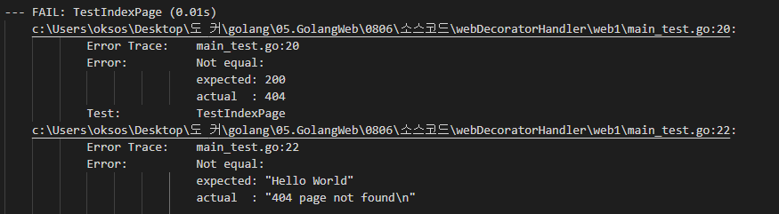
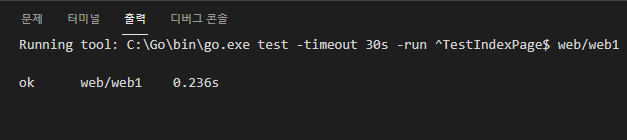
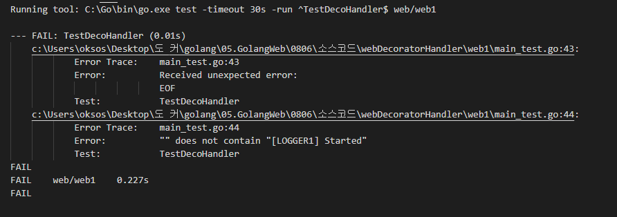
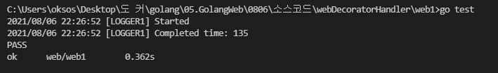
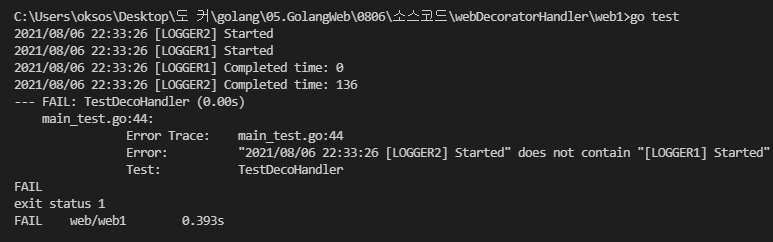

## 2021년08월06일_GoLangWeb-WebDecoratorHandler

## Web서버에서 왜? Decorator를 사용하는가? 

- Client가 -> Request를 보내면 서버가 어떤 문서를 만들어서 데이터를 response 해주는것이 다임
- 단순한 일을 하는것인데 왜 ? 데코레이터가 필요하는가?
- 기본 기능은 유지하고 데코레이터 추가하는것 이고  암호화, 압축, 요청하는실행하는 과정  log로 기록해서 문제시 사용하는 용도, 마케팅적인 요소, 웹쇼핑몰 만들때 많이 누르는것 많이 클릭하는것 같은것을 분석하는 서버에 보내는것 같은 것인데. 이런것이 웹서버의 기본 기능이라고 할 수 없다.
- 이런 기능은 마케팅 서버에 보내는 보내는것 같은것은 부가 기능이라고 한다. 
- 부가기능 넣고 빼고 없애고 하는것은 자주 일어나는 일이다. 
- 부가기능이 계속 업데이트 될 수 있어서 기본 기능을 추가해서 하면안된다. 그래서 Decorator로 갈아서 해야한다.
- 그렇게 해야 좀더 편하게 구현 할 수 있음  

## 기본 서버 구성 

### main.go 

```go
package main

import "net/http"

func NewHandler() http.Handler {
	mux := http.NewServeMux()
	return mux
}

func main() {

	mux := NewHandler()
	http.ListenAndServe(":3000", mux)
}
```

### myapp/ app.go

```go
package myapp

import "net/http"

func NewHandler() http.Handler {
	mux := http.NewServeMux()
	return mux
}
```

- 이렇게 하는데 그럼 일단 main.go를 바꿔서 여기 app.go에 있는 핸들러를 호출하는 식으로 변경하자. 

## 수정된 main.go

```go
package main

import (
	"net/http"
	"web/myapp"
)

func NewHandler() http.Handler {
	mux := myapp.NewHandler()
	return mux
}

func main() {

	mux := NewHandler()
	http.ListenAndServe(":3000", mux)
}
```

## 테스트 코드 만들기  

###  main_test.go

```go
func TestIndexPage(t *testing.T) {
	assert := assert.New(t)

	ts := httptest.NewServer(NewHandler())
	defer ts.Close()

	resp, err := http.Get(ts.URL)
	assert.NoError(err)
	assert.Equal(http.StatusOK, resp.StatusCode)
	data, _ := ioutil.ReadAll(resp.Body)
	assert.Equal("Hello World", string(data))
}
```



- 현재 404에러가 있음 핸들러 등록을 안해서 그런것

## app.go 수정하기  

``` go
package myapp

import (
	"fmt"
	"net/http"
)

func indexHandler(w http.ResponseWriter, r *http.Request) {
	fmt.Fprint(w, "Hello World")
}

func NewHandler() http.Handler {
	mux := http.NewServeMux()
	mux.HandleFunc("/", indexHandler)
	return mux
}
```



## 이제 main.go 부분의 NewHandler() 에 log를 달아보자  

```go
func logger(w http.ResponseWriter, r *http.Request, h http.Handler) {
	start := time.Now()
	log.Print("[LOGGER1] Started")
	h.ServeHTTP(w, r)
  log.Println("[LOGGER1] Completed time:", time.Since(start).Milliseconds())
}
```

- 처음 로그 시작끝을 찍고, time.Since(start).Milliseconds로 하면 시작시점부터의 시간이 출력이됨 

## 데코만들기  decoHandler/ doco.go

```go
log.SetOutPut()
```

- 로그를 어떻게 찍느냐 하면 log.SetOutput( )이라는것이있다.
- 위에 이것은 그냥 화면에 출력하는것이라 이것을 버퍼에 출력하는 법은 아래와 같다. 

``` go
buf := &bytes.Buffer{}
log.SetOutput(buf)
```

- 결과적으로 buf에 저장이 되고 이것을 한줄씩 읽어야 한다. 이것은 바이너리 버퍼 이기 때문이다.
- 그래서 아래와 같이 하면된다. 

```go
r:=bufio.NewReader(buf)
line, _, err:=r.ReadLine()
assert.NoError(err)
```

## 테코의 테스트   

```go
func TestDecoHandler(t *testing.T) {
	assert := assert.New(t)

	ts := httptest.NewServer(NewHandler())
	defer ts.Close()

	buf := &bytes.Buffer{}
	log.SetOutput(buf)

	resp, err := http.Get(ts.URL)
	assert.NoError(err)
	assert.Equal(http.StatusOK, resp.StatusCode)

	r := bufio.NewReader(buf)
	line, _, err := r.ReadLine()
	assert.NoError(err)
	assert.Contains(string(line), "[LOGGER1] Started")
	line, _, err = r.ReadLine()
	assert.NoError(err)
	assert.Contains(string(line), "[LOGGER1] Completed")
}
```

- 현재는 버퍼에 아무것도 없어서 err에 eof 가 찍히고 한다. 
- 이것을 통과 시켜보자. 



## deco.go

```go
package decoHandler

import "net/http"

type DecoratorFunc func(http.ResponseWriter, *http.Request, http.Handler)

type DecoHandler struct {
	fn DecoratorFunc
	h  http.Handler
}

func (self *DecoHandler) ServeHTTP(w http.ResponseWriter, r *http.Request) {
	self.fn(w, r, self.h)
}
func NewDecoHandler(h http.Handler, fn DecoratorFunc) http.Handler {
	return &DecoHandler{
		fn: fn,
		h:  h,
	}
}
```

- 데코레이터 핸들러이다. 

## main.go의 newHandler를 감싸보자  

```go
func NewHandler() http.Handler {
	mux := myapp.NewHandler()
	h := decoHandler.NewDecoHandler(mux, logger)
	return h
}
```

- 테스트 코드를 찍어보면 다음과 같다.



- 제대로 되는것을 알 수 있다.  

## 데코레이터 추가  

```go
func logger2(w http.ResponseWriter, r *http.Request, h http.Handler) {
	start := time.Now()
	log.Print("[LOGGER2] Started")
	h.ServeHTTP(w, r)
	log.Println("[LOGGER2] Completed time:", time.Since(start).Milliseconds())
}
func NewHandler() http.Handler {
	h := myapp.NewHandler()
	h = decoHandler.NewDecoHandler(h, logger)
	h = decoHandler.NewDecoHandler(h, logger2)
	return h
}
```

- 한번 감싸고 한번더 감싼다고 생각해보자  



- 현재 보면 기존 테스트가 오류가 나게 되어 있는데 
- 일단 동작형태만 보게되면  
- log2가 log1을 가지고 있고 log1이 핸들러를 가지고 있는데 log 2의 h.ServeHTTP가 먼저 불려져서 여기서 start2가 찍히고 처음 핸들러는 log1인데 이때 log1start찍히고, h.ServeHTTP호출이 되고, 그 아래 log.Print가 기본우리가 만들 기본mux 핸들러이고 이거실행하고 그것이 기본 기능 수행 log2의 h.ServeHTTTP하고 log1completed 호출후 log2 completed가 나오는 식이다. 
- 나중에 암호화, 압축 이런 데코레이터를 핸들러 손대지 않고 추가하는 식으로 구현이 가능하다. 

