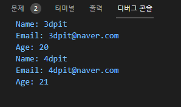

## 2021년08월07일_GoLangWeb-Template

## Template

- 우리말로 틀? 붕어빵 틀 같은것
- 어떤 내용을 넣는것에 따라 결과물이 달라지는것
- 자체 api가 제공하는 template 가 있는데 강력하다.
- 왜? 어디에 쓰는가? 
- 우리가 HTML 를 만드는데 거기서 변경되는 것이 있고 아닌게 있다고 했을때 변경되지 않는것 템플릿화 하고 변경되는것 채워나갈 수 있도록 template를 만든다. 

## 템플릿 사용  | web1

```go
package main

import (
	"html/template"
	"os"
)

type User struct {
	Name  string
	Email string
	Age   int
}

func main() {
	user := User{Name: "3dpit", Email: "3dpit@naver.com", Age: 20}
	tmpl, err := template.New("Tmpl1").Parse("Name: {{.Name}}\nEmail: {{.Email}}\nAge: {{.Age}}\n")
	if err != nil {
		panic(err)
	}
	tmpl.Execute(os.Stdout, user)
}
```

- 이렇게 구성이 된다. 
- template.New("Tmpl1") // 템플릿 이름을 설정 그 뒤에 Parse는 {{.Name}}이라면 여기에 주어진 것을 넣어라는 식
- 그래서 tmpl.Execute(os.Stdout, user) // os.Stdout는 기본 출력이고 , user 부분이 넣어주는 부분인데 그것에 맞게 값이 들어가는 결과를 얻을 수 있다.


## 데이터  추가 해서 동작 확인 

```go
package main

import (
	"html/template"
	"os"
)

type User struct {
	Name  string
	Email string
	Age   int
}

func main() {
	user := User{Name: "3dpit", Email: "3dpit@naver.com", Age: 20}
	user2 := User{Name: "4dpit", Email: "4dpit@naver.com", Age: 21}
	tmpl, err := template.New("Tmpl1").Parse("Name: {{.Name}}\nEmail: {{.Email}}\nAge: {{.Age}}\n")
	if err != nil {
		panic(err)
	}
	tmpl.Execute(os.Stdout, user)
	tmpl.Execute(os.Stdout, user2)
}
```



- 이처럼 틀은 같은데 내용물이 달라지는것을 말한다. 

## 따로 템플릿 분리  | web2


- 우선 위에처럼 template 폴더를 만들어주고 templ1.tmpl 파일을 생성 , 확장자는 아무것이나 상관 없다고함 

## templ1.tmpl

```go
Name: {{.Name}}
Email: {{.Email}}
Age: {{.Age}}
```

- 위의 파일을 읽어와서 템플릿을 사용해보자. 

## main.go

```go
package main

import (
	"html/template"
	"os"
)

type User struct {
	Name  string
	Email string
	Age   int
}

func main() {
	user := User{Name: "3dpit", Email: "3dpit@naver.com", Age: 20}
	user2 := User{Name: "4dpit", Email: "4dpit@naver.com", Age: 21}
	tmpl, err := template.New("Tmpl1").ParseFiles("template/templ1.tmpl")
	if err != nil {
		panic(err)
	}
	tmpl.ExecuteTemplate(os.Stdout, "templ1.tmpl", user)
	tmpl.ExecuteTemplate(os.Stdout, "templ1.tmpl", user2)

```


- 이부분 	tmpl, err := template.New("Tmpl1").ParseFiles("template/templ1.tmpl") 이렇게  Parse가 ParseFiles로 바뀌고 해당 파일의 경로를 적는다. 이것이 여러개 일 수 있음
- ​	tmpl.ExecuteTemplate(os.Stdout, "templ1.tmpl", user) 이것은 Excute가 ExcuteTemplate로 변경 "templ1.tmpl" 이것의 경우 여러개 일 수 있어서 지정해줘야 한다. 

## 펑션 추가해서 기능 주기  | web3

```go
func (u User) IsOld() bool {
	return u.Age > 30
}
```

- use가 30이상인 경우를 Age가 아니라 oldAge로 표시 

## 템플릿 변경 

```go
//templ1.tmpl
Name: {{.Name}}
Email: {{.Email}}
{{if .IsOld}}
oldAge: {{.Age}}
{{else}}
Age: {{.Age}}
{{end}}
//main.go
func main(){
...
  	user2 := User{Name: "4dpit", Email: "4dpit@naver.com", Age: 31}
...
}
```

- 위와 같이 변경해주고 보면 아래와 같은 결과 


- 템플릿 if , else , end 조건 때문에 띄어짐 이것을 위해서 뒤에 - 붙이면 뒤에 공백 제거 앞에 - 붙이면 앞 공백 제거

## templ1.tmpl   |  쓸때 없는 공백 제거  

```go
// 강의에서 구분법 이상하게 Name이 붙음 1번사진
Name: {{.Name}}
Email: {{.Email}}
{{if .IsOld -}}
oldAge: {{.Age}}
{{else -}}
Age: {{.Age}}
{{- end}}

//실제로 이렇게 해야 구분됨 2번사진
Name: {{.Name}}
Email: {{.Email}}
{{if .IsOld -}}
oldAge: {{.Age}}
{{else -}}
Age: {{.Age}}
{{end}}
```

### 1번사진


### 2번 사진 


## html 태그 추가하기  |  web4

## templ1.tmpl

```go
Name: {{.Name}}
Email: {{.Email}}
{{if .IsOld -}}
oldAge: {{.Age}}
{{else -}}
Age: {{.Age}}
{{end}}

<a href="/user?email={{.Email}}">user</a>

```

- 여기 템플릿에서 공백도 하나의 개행으로 간주하니 참고 바람


- 보면 @가 제외가 된것이다. 이것이 html/template를 쓰면 이렇고  text/template를 쓰면 아래와 같다.  


## script  태크안에서 템플릿 실행되는 경우  

```go
Name: {{.Name}}
Email: {{.Email}}
{{if .IsOld -}}
oldAge: {{.Age}}
{{else -}}
Age: {{.Age}}
{{- end}}

<a href="/user?email={{.Email}}">user</a>
<script>
var email={{.Email}}
var name={{.Name}}
var age={{.Age}}
</script>

```


- html 태그가 상황에 따라서 문자열 같은 경우 "" 로 해주고 특수문자같은경우 포함해주고 안해주고 이런것을 함 

## 템플릿 하나 더 추가  

## templ2.tmpl | web5

- 바깥쪽을 감싸고 있는 부분 만들기  

```go
<html>
<head>
<title>Template</title>
</head>
<body>
{{template "templ1.tmpl" .}}
</body>
</html>
```

- 이렇게 해주면 템플릿 1 자체를 가져와버림  

## main.go  

```go
//html 태그 추가하기
package main

import (
	"html/template"
	"os"
)

type User struct {
	Name  string
	Email string
	Age   int
}

func (u User) IsOld() bool {
	return u.Age > 30
}
func main() {
	user := User{Name: "3dpit", Email: "3dpit@naver.com", Age: 20}
	user2 := User{Name: "4dpit", Email: "4dpit@naver.com", Age: 31}
	tmpl, err := template.New("Tmpl1").ParseFiles("template/templ1.tmpl", "template/templ2.tmpl")
	if err != nil {
		panic(err)
	}
	tmpl.ExecuteTemplate(os.Stdout, "templ2.tmpl", user)
	tmpl.ExecuteTemplate(os.Stdout, "templ2.tmpl", user2)
}
```

## 결과  


-  위에 지정했던 것 처럼 body 안에 들어간 모습을 볼 수 있다. 
- 무튼 이런식으로 영역을 따로 따로 해서 사용하면됨 


- 위처럼 한다던지 할 수 있는 것

## 리스트 넘길때 템플릿  | web6 

##  main.go  

```go
// 리스트 가져와서 넣기
package main

import (
	"html/template"
	"os"
)

type User struct {
	Name  string
	Email string
	Age   int
}

func (u User) IsOld() bool {
	return u.Age > 30
}
func main() {
	user := User{Name: "3dpit", Email: "3dpit@naver.com", Age: 20}
	user2 := User{Name: "4dpit", Email: "4dpit@naver.com", Age: 31}
	users := []User{user, user2}
	tmpl, err := template.New("Tmpl1").ParseFiles("template/templ1.tmpl", "template/templ2.tmpl")
	if err != nil {
		panic(err)
	}
	// tmpl.ExecuteTemplate(os.Stdout, "templ2.tmpl", user)
	// tmpl.ExecuteTemplate(os.Stdout, "templ2.tmpl", user2)
	tmpl.ExecuteTemplate(os.Stdout, "templ2.tmpl", users)
}
```

```go
{{template "templ1.tmpl" .}}
//위에 이것을 리스트 이기 때문에 

{{range .}
{{template "templ1.tmpl" .}}
{{end}}
 // 이렇게 감싸줌
```

## 최종 templ2.tmpl

```go
<html>
<head>
<title>Template</title>
</head>
<body>
{{range .}}
{{template "templ1.tmpl" .}}
{{end}}
</body>
</html>
```


- 리스트 경우 . ( dot)은 항목을 1 템플릿에 넣는것이다. 
- 이런 막강한 기능이 템플릿이다. 