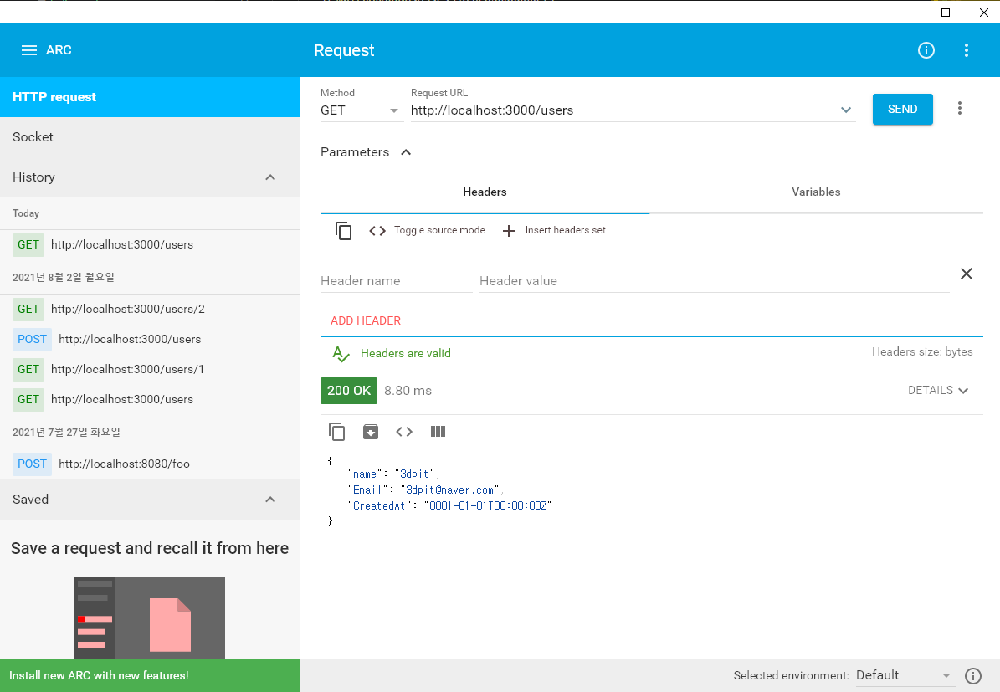
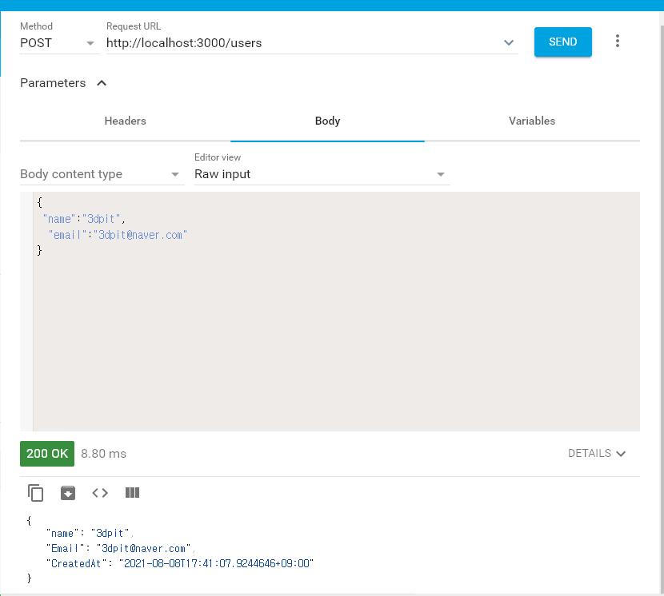
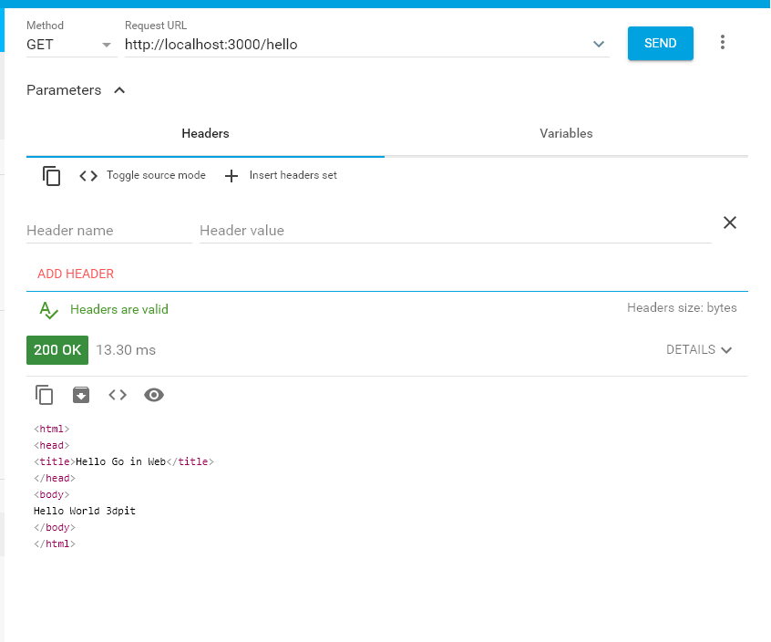
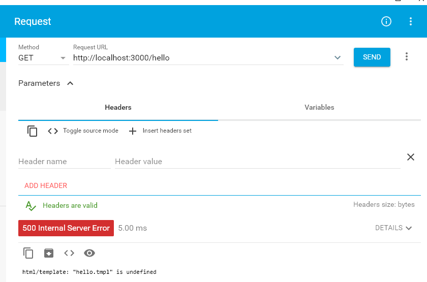
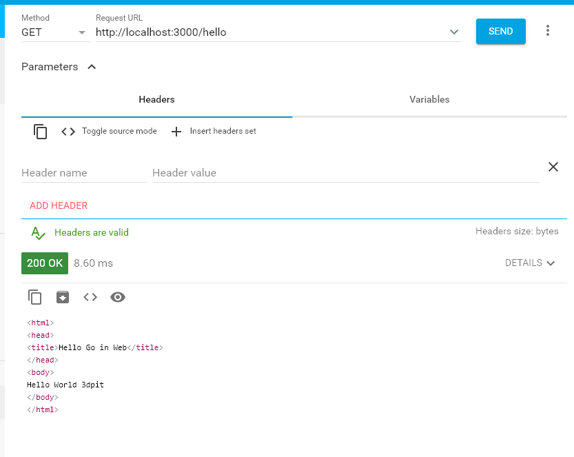
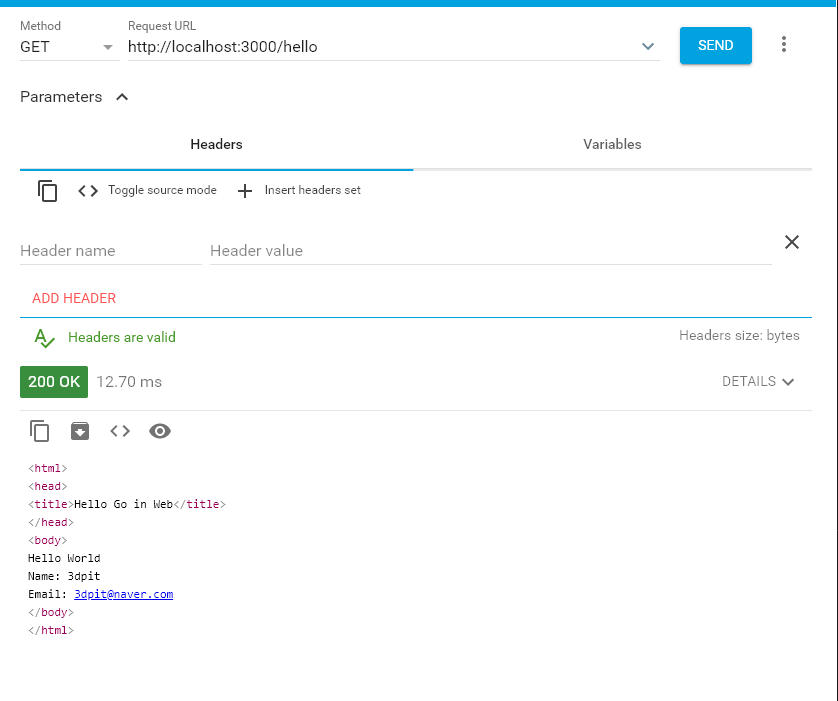
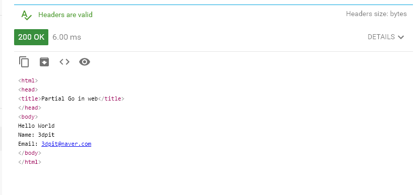
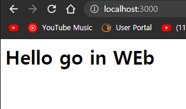
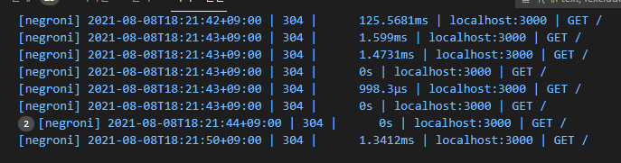

## 2021년08월08일_GoLangWeb-Render,Pat,Negroni

## main.go | web1

```go
package main

import (
	"encoding/json"
	"fmt"
	"net/http"
)

type User struct {
	Name  string `json:"name"`
	Email string `json:"email`
}

func getUserInfoHandler(w http.ResponseWriter, r *http.Request) {
	user := User{Name: "3dpit", Email: "3dpit@naver.com"}

	w.Header().Add("Content-type", "application/json")
	w.WriteHeader(http.StatusOK)
	data, _ := json.Marshal(user)
	fmt.Fprint(w, string(data))
}

func main() {
	mux := http.NewServeMux()

	mux.HandleFunc("/users", getUserInfoHandler).Methods("GET")
	mux.HandleFunc("/users", addUserHandler).Methods("POST")

	http.ListenAndServe(":3000", mux)
}

```

- 이렇게 고릴라 먹스를 이용해서 GET POST해도되지만 
- 고릴라 pat이란것으로도 사용가능 
- go get github.com/gorilla/pat 를 해서 가져오고

## 고릴라 펫 사용

```go
package main

import (
	"encoding/json"
	"fmt"
	"net/http"

	"github.com/gorilla/pat"
)

type User struct {
	Name  string `json:"name"`
	Email string `json:"email`
}

func getUserInfoHandler(w http.ResponseWriter, r *http.Request) {
	user := User{Name: "3dpit", Email: "3dpit@naver.com"}

	w.Header().Add("Content-type", "application/json")
	w.WriteHeader(http.StatusOK)
	data, _ := json.Marshal(user)
	fmt.Fprint(w, string(data))
}

func main() {
	// mux := http.NewServeMux()
	mux := pat.New()

	// mux.HandleFunc("/users", getUserInfoHandler).Methods("GET")
	// mux.HandleFunc("/users", addUserHandler).Methods("POST")
	mux.Get("/users", getUserInfoHandler)
	mux.Post("/users", addUserHandler)

	http.ListenAndServe(":3000", mux)
}
```

## addUserHandler

```go
func addUserHandler(w http.ResponseWriter, r *http.Request) {
	user := new(User)
	err := json.NewDecoder(r.Body).Decode(user)
	if err != nil {
		w.WriteHeader(http.StatusBadRequest)
		fmt.Fprint(w, err)
		return
	}
	user.CreatedAt = time.Now()

	w.Header().Add("Content-type", "application/json")
	w.WriteHeader(http.StatusOK)
	data, _ := json.Marshal(user)
	fmt.Fprint(w, string(data))
}
```

## 템플릿 추가 | hello.tmpl

```go
<html>
<head>
<title>Hello Go in Web</title>
</head>
<body>
Hello World {{.}}
</body>
</html>
```

## helloHandler()

```go
func helloHandler(w http.ResponseWriter, r *http.Request) {
	tmpl, err := template.New("Hello").ParseFiles("templates/hello.tmpl")
	if err != nil {
		w.WriteHeader(http.StatusInternalServerError)
		fmt.Fprint(w, err)
		return
	}
	tmpl.ExecuteTemplate(w, "hello.tmpl", "3dpit")
}
```

## GET  실행



## Post 실행  



## hello 실행



- 매번 제이슨쓰고 템플릿 리턴하는게 귀찮을수 있고 반복되는 소스가 있으니 간단히 해줄 수 있는것이 있다.
- unrolled/render 라고함
- go get github.com/unrolled/render 로 설치해준다.

## web2

```go
var rd *render.Render

func getUserInfoHandler(w http.ResponseWriter, r *http.Request) {
	user := User{Name: "3dpit", Email: "3dpit@naver.com"}
	rd.JSON(w, http.StatusOK,user)
// w.Header().Add("Content-type", "application/json")
	// w.WriteHeader(http.StatusOK)
	// data, _ := json.Marshal(user)
	// fmt.Fprint(w, string(data))
	rd.JSON(w, http.StatusOK,user)
}
func addUserHandler(w http.ResponseWriter, r *http.Request) {
...
	if err != nil {
		// w.WriteHeader(http.StatusBadRequest)
		// fmt.Fprint(w, err)
		rd.Text(w, http.StatusBadRequest, err.Error())
		return
	}
	user.CreatedAt = time.Now()
...
}
func helloHandler(w http.ResponseWriter, r *http.Request) {
	// tmpl, err := template.New("Hello").ParseFiles("templates/hello.tmpl")
	// if err != nil {
	// 	// w.WriteHeader(http.StatusInternalServerError)
	// 	// fmt.Fprint(w, err)
	// 	rd.Text(w, http.StatusBadRequest, err.Error())
	// 	return
	// }
	rd.HTML(w, http.StatusOK, "hello.tmpl", "3dpit")
	//tmpl.ExecuteTemplate(w, "hello.tmpl", "3dpit")
}
func main(){
  	rd = render.New()
...
}
```

```go
  // w.Header().Add("Content-type", "application/json")
	// w.WriteHeader(http.StatusOK)
	// data, _ := json.Marshal(user)
	// fmt.Fprint(w, string(data))
	rd.JSON(w, http.StatusOK,user)

	// w.WriteHeader(http.StatusBadRequest)
	// fmt.Fprint(w, err)
	rd.Text(w, http.StatusBadRequest, err.Error())

	// tmpl, err := template.New("Hello").ParseFiles("templates/hello.tmpl")
	// if err != nil {
	// 	// w.WriteHeader(http.StatusInternalServerError)
	// 	// fmt.Fprint(w, err)
	// 	rd.Text(w, http.StatusBadRequest, err.Error())
	// 	return
	// }
	//tmpl.ExecuteTemplate(w, "hello.tmpl", "3dpit")
	rd.HTML(w, http.StatusOK, "hello.tmpl", "3dpit")

```

- 저렇게 여러줄을  한 줄로 바꿀 수 있음

## 실행



- 현재 이렇게 보면 에러 뜨는데 이것이 
-   rd.HTML(w, http.StatusOK, "hello.tmpl", "3dpit") 에서  rd.HTML(w, http.StatusOK, "hello", "3dpit")
- 템플릿의 확장자를 빼줘야한다. 



- tmpl이 자체 확장자로 들어가 있는데 html로 확장자를 가진 템플릿인경우에 500 인터널 에러가 생기는데
- html로 읽게하려면 옵션을 추가해야한다. 

```go
rd = render.New() 
// 위에를 아래로 바꿔줘야한다. 
rd = render.New(render.Options{
		Extensions: []string{".html", ".tmpl"},
	})
```

## web3 | 옵션 추가

```go
// 확장자 html로 읽어오는 옵션 추가
package main

import (
	"encoding/json"
	"net/http"
	"time"

	"github.com/gorilla/pat"
	"github.com/unrolled/render"
)

var rd *render.Render

type User struct {
	Name      string    `json:"name"`
	Email     string    `json:"email`
	CreatedAt time.Time `json:"created_at`
}

func getUserInfoHandler(w http.ResponseWriter, r *http.Request) {
	user := User{Name: "3dpit", Email: "3dpit@naver.com"}

	rd.JSON(w, http.StatusOK, user)
}
func addUserHandler(w http.ResponseWriter, r *http.Request) {
	user := new(User)
	err := json.NewDecoder(r.Body).Decode(user)
	if err != nil {
		rd.Text(w, http.StatusBadRequest, err.Error())
		return
	}
	user.CreatedAt = time.Now()

	rd.JSON(w, http.StatusOK, user)
}

func helloHandler(w http.ResponseWriter, r *http.Request) {
	rd.HTML(w, http.StatusOK, "hello", "3dpit")
}
func main() {
	rd = render.New(render.Options{
		Extensions: []string{".html", ".tmpl"},
	})
	mux := pat.New()
	mux.Get("/users", getUserInfoHandler)
	mux.Post("/users", addUserHandler)
	mux.Get("/hello", helloHandler)

	http.ListenAndServe(":3000", mux)
}
```

## 템플릿 경로가 다른 경우  | web4

- 디렉토리도 templates로 고정 되어있는데
- template로 하면 에러 발생

```go
	rd = render.New(render.Options{
		Directory:  "template",
		Extensions: []string{".html", ".tmpl"},
	})
```

- 위 같이 디렉토리 추가

## main.go | web4

```go
// 확장자 html로 읽어오는 옵션 추가
package main

import (
	"encoding/json"
	"net/http"
	"time"

	"github.com/gorilla/pat"
	"github.com/unrolled/render"
)

var rd *render.Render

type User struct {
	Name      string    `json:"name"`
	Email     string    `json:"email`
	CreatedAt time.Time `json:"created_at`
}

func getUserInfoHandler(w http.ResponseWriter, r *http.Request) {
	user := User{Name: "3dpit", Email: "3dpit@naver.com"}

	rd.JSON(w, http.StatusOK, user)
}
func addUserHandler(w http.ResponseWriter, r *http.Request) {
	user := new(User)
	err := json.NewDecoder(r.Body).Decode(user)
	if err != nil {
		rd.Text(w, http.StatusBadRequest, err.Error())
		return
	}
	user.CreatedAt = time.Now()

	rd.JSON(w, http.StatusOK, user)
}

func helloHandler(w http.ResponseWriter, r *http.Request) {
	rd.HTML(w, http.StatusOK, "hello", "3dpit")
}
func main() {
	rd = render.New(render.Options{
		Directory:  "template",
		Extensions: []string{".html", ".tmpl"},
	})
	mux := pat.New()
	mux.Get("/users", getUserInfoHandler)
	mux.Post("/users", addUserHandler)
	mux.Get("/hello", helloHandler)

	http.ListenAndServe(":3000", mux)
}
```

## main.go | web5 

```go
// 템플릿 body 추가
package main

import (
	"encoding/json"
	"net/http"
	"time"

	"github.com/gorilla/pat"
	"github.com/unrolled/render"
)

var rd *render.Render

type User struct {
	Name      string    `json:"name"`
	Email     string    `json:"email`
	CreatedAt time.Time `json:"created_at`
}

func getUserInfoHandler(w http.ResponseWriter, r *http.Request) {
	user := User{Name: "3dpit", Email: "3dpit@naver.com"}

	rd.JSON(w, http.StatusOK, user)
}
func addUserHandler(w http.ResponseWriter, r *http.Request) {
	user := new(User)
	err := json.NewDecoder(r.Body).Decode(user)
	if err != nil {
		rd.Text(w, http.StatusBadRequest, err.Error())
		return
	}
	user.CreatedAt = time.Now()

	rd.JSON(w, http.StatusOK, user)
}

func helloHandler(w http.ResponseWriter, r *http.Request) {
	user := User{Name: "3dpit", Email: "3dpit@naver.com"}
	rd.HTML(w, http.StatusOK, "body", user)
}
func main() {
	rd = render.New(render.Options{
		Directory:  "template",
		Extensions: []string{".html", ".tmpl"},
		Layout:     "hello",
	})
	mux := pat.New()
	mux.Get("/users", getUserInfoHandler)
	mux.Post("/users", addUserHandler)
	mux.Get("/hello", helloHandler)

	http.ListenAndServe(":3000", mux)
}

```

## body.html 추가

```html
Name: {{.Name}}
Email: {{.Email}}
```

## hello.html 

```html
<html>
<head>
<title>Hello Go in Web</title>
</head>
<body>
Hello World 
{{ yield }}
</body>
</html>
```

- 여기서 body가 메인 , hello가 레이아웃이 될 것이다. 
- 추가할 부분 바디를 넣을 부분을 yield 라고 해준다.

```go
func helloHandler(w http.ResponseWriter, r *http.Request) {
	rd.HTML(w, http.StatusOK, "hello", "3dpit")
}
// 아래와 같이 body로 변경 
func helloHandler(w http.ResponseWriter, r *http.Request) {
	user := User{Name: "3dpit", Email: "3dpit@naver.com"}
	rd.HTML(w, http.StatusOK, "body", user)}

func main() {
	rd = render.New(render.Options{
		Directory:  "template",
		Extensions: []string{".html", ".tmpl"},
		Layout:     "hello",
	})
}
```

- Layout:     "hello", 을 추가하면된다. 



## 추가적 기능 | web6

- title이나 head 나  css등을 따로 하고 싶은 경우 
- `<title> {{ partial "title" }} </title>`
- 위와 같이 하면되는데 이때 title 템플릿을 만들때 이름은 title-body.html 로 해줘야함
- -body는 이것이 메인이라 body가 들어가는것 

## hello.html

```go
<html>
<head>
<title>{{partial "title"}}</title>
</head>
<body>
Hello World 
{{ yield }}
</body>
</html>
```

## title-body.html

```html
Partial Go in web
```



## negroni | web7

- 이것을 하기 앞서서 이것은 대게 많은 미들웨어 제공
- 그중에 우리가 file로 했던것 

## public 폴더에 index.html

```html
<html>
    <head>
<title>Go in Web 11</title>
<body>
     <h1> Hello go in WEb</h1>
</body>
    </head>
</html>
```

## main.go

```go
	mux.Handle("/", http.FileServer(http.Dir("public")))
	http.ListenAndServe(":3000", mux)
```

- 이렇게 했을때 아래와 같이 나온다.



- go get github.com/urfave/negroni 를 설치 해보자

```go
	n := negroni.Classic()
	n.UseHandler(mux)
	http.ListenAndServe(":3000", n)
```

- 이렇게  핸들러를 넣어주면 랩핑을 해줌 우리가 데코레이터 했을때 처럼 랩핑해서 부가기능 추가해주는것

- Classic 이것은 자체 로커를 제공하고 파일 서버를 제공하기 때문에 아래와 같이 나온다. 
- negroni는 public 폴더아래 있는거 알아서 제공함



- 기본적으로 로거 기능도 제공을 한다.

- 파일서버, 로거 기능등을 제공한다.
