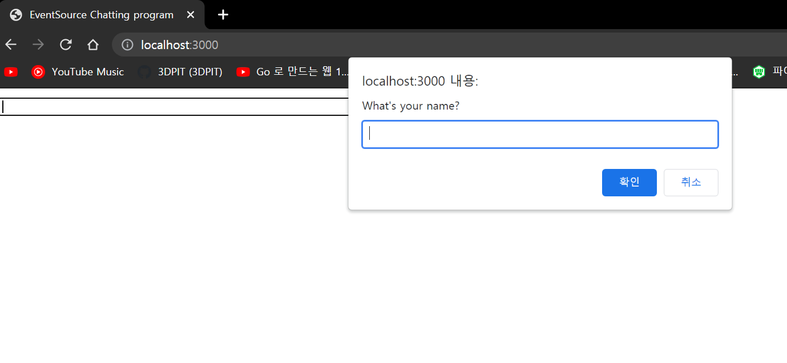

## 2021년08월09일_GoLangWeb-EventSource를이용한채팅  

## EventSource

- server-sent events에 대한 웹 콘텐츠 인터페이스이다.
- 인스턴스는 text/event-stream 포맷으로 이벤트를 보내는 HTTP서버에 지속적인 연결을 함
- 요즘들어서 동적웹에 대한 니즈가 요구됨 거기에 나온것 HTML 5 표준에서 추가된 것 Websocket, EventSource 
- 서버에서만 send 하고 클라이언트에서는 send가 안되는 것
- 그래서 server sent events 이다.

##  Websocket

- 소켓처럼 하겠다는것 우리가 네트워크 할때 TCP socket을 만드는데 양쪽에 소켓을 만들어서 연결해서 서로 주고 받을 수 있는 것

## 채팅 서버 만들기  |  main.go

```go
package main

import (
	"net/http"

	"github.com/gorilla/pat"
	"github.com/urfave/negroni"
)

func main() {
	mux := pat.New()

	n := negroni.Classic()
	n.UseHandler(mux)

	http.ListenAndServe(":3000", n)
}
```

## public 폴더 생성하고 index.html 

```html
<html>
<head>
<title>EventSource Chatting program</title>
</head>
<body>
    <div id="chat-log"></div>
    <div id="user-name"></div>
    <form id="input-form">
        <input type ="text" id="chat-msg" size="64" autofocus/>
        <input type="submit" value ="Send"/>
    </form>
</body>
</html>
```


- 실행하면 위와 같이 나온다. 

## J쿼리랑 자바 스크립트로 간단하게 구현하기

```javascript
<script src="https://ajax.googleapis.com/ajax/libs/jquery/3.4.1/jquery.min.js"></script>
```

- jquery 소스있는 경로 

```javascript
<script src="chat.js"></script>
```

- 우리가 만들 것 
- `</head>` 가 끝나는 부분위에 적으면된다.

```javascript
    var $chatlog = $('#chat-log')
//     <div id="chat-log"></div> 이부분을 가져오는 것
```

```javascript
    var isBlank = function(string){
        return string == null || string.trim() ==="";
    };
```

- == 값만 검사, === 값이랑 타입까지 검사  

```javascript
    while(isBlank(username)){
        username = prompt("What's your name?")
        if(!isBlank(username)){
            $('#user-name').html('<b>'+ username+'</b>')
        }
    }
```

- 유저 이름 있으면 진하게 표시 `<b> </b>` 진하게 표시해라 이런것



- 이렇게 나오고 이름을 입력을 하면 이렇게 된다. 


- 저렇게 진하게 표시가 된다. 

```javascript
    $('#input-form').on('submit',function(e){
        $.post('/messages',{
            msg: $chatmsg.val(),
            name: username
        });
        $chatmsg.val("")
        $chatmsg.focus()
    });
```

- 이것은 submit을 누르면 함수가 동작하는데 $ 는 jquery가져오는것 post를 하는데  /messages에 입력되는 메세지랑

  유저 이름 해서 보내라 그리고 초기화하고 다시 넣을수 있게 포커스까지 함


- 다시 웹사이트 들어가서 하면 저렇게 404에러가 생기는데 핸들러를 안만들어서 그런다.

## 핸들러 만들기  

```go
func postMessageHandler(w http.ResponseWriter, r *http.Request) {
	msg := r.FormValue("msg")
	name := r.FormValue("name")
	log.Println("postMessageHandler", msg, name)
}
func main() {
	mux := pat.New()
	mux.Post("/messages", postMessageHandler)
  ...
}
```

- 일단 은 핸들러를 만들어서 아래가 제대로 찍히는지 확인  


- 이렇게 찍히면 여기까지 성공  
