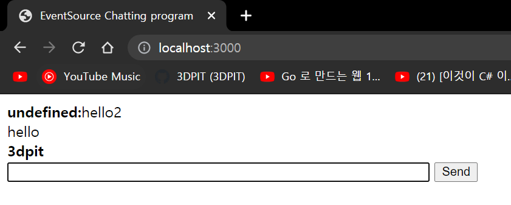
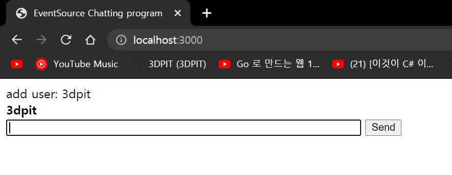
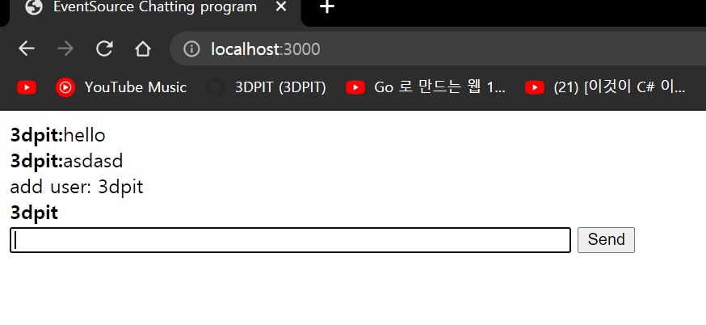
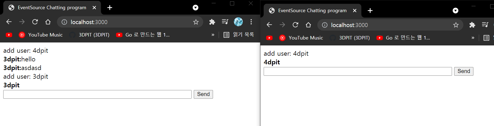
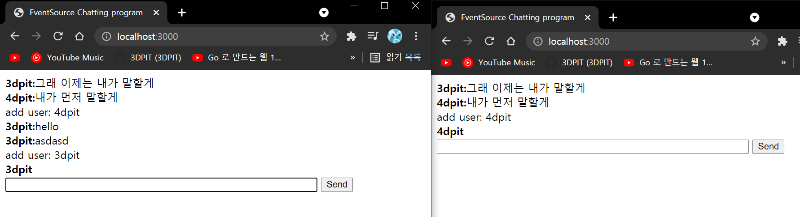
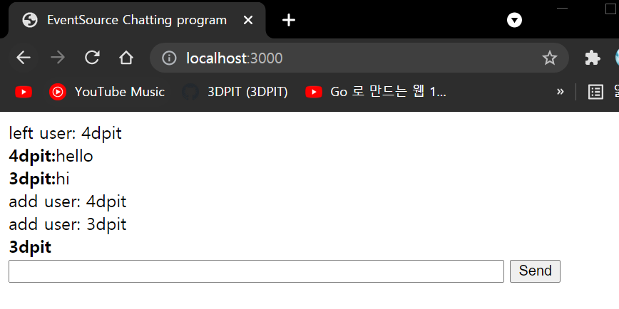

## 2021년08월09일_GoLangWeb-EventSource를이용한채팅2  
```go
func postMessageHandler(w http.ResponseWriter, r *http.Request) {
	msg := r.FormValue("msg")
	name := r.FormValue("name")
	//log.Println("postMessageHandler", msg, name)
	sendMessage(name, msg)
}

func sendMessage(name, msg string) {
	//send message to every clients
}
```

- log 지우고 send 메소드 생성  

## chat.js | web2

```javascript
    var addMessage = function(data){
        var text ="";
        if(!isBlank(data.name)){
            text ='<strong>' + data.name + ':</strong>';
        } 
        text += data.msg
        $chatlog.prepend('<div><span>'+ text + '</span></div>');
    };
```

- 이렇게 하면 유저 이름에 뒤에 이어서 어떤 문자가 입력으로 들어왔는지 출력해주는것 

## 데이터 넣어서 확인 해보기  

```javascript
    addMessage({
        msg:'hello',
        name:'aaa'
    })
    addMessage({
        msg:'hello2'
    })
```



- add 메소드 정상적으로 작동확인

## 이벤트 소스 열기 

```javascript
    var es = new EventSource('/stream')
    es.onopen = function(e){
        $.post('users/',{
            name: username
        });
    }
```

- 이벤트 소스가 열리면 users/에다가 post 유저네임을 보내는 것  

## 쉽게 eventsource 사용하기 | web2  /main.go

- 패키지를 하나 추가 할 것이다. antage/eventsource 를 추가하자.
- go get github.com/antage/eventsource

```go
es := eventsource.New(nil, nil)
defer es.Close()

mux.Handle("/stream", es)
```

- 이벤트 소스 생성 
- 클라이언트가 /stream을 요청할 때 es가 자동으로 커넥트를 맺게함
- es를 통해서 send이벤트로 메세지 보냄  es.SendEventMessage("hello world") 

```go
func addUserHandler(w http.ResponseWriter, r *http.Request) {
	username := r.FormValue("name")
	sendMessage("", fmt.Sprintf("add user: %s", username))
}	

func main(){
  ...
mux.Post("/users",addUserHandler)
  ...
}
```

- 이렇게 하면 sendMessage가 이벤트 전체 eventsource에 커넥트된 모든 유저에게 메세지를 보내게 됨

- 핸들러들은 멀티 스레트 환경에서 돌고 있기 때문에 다른 스레드에 큐형태로 한줄로 보내는것이 좋다. 

```go
type Message struct {
	Name string `json:"name"`
	Msg  string `json:"msg"`
}

var msgCh chan Message

func sendMessage(name, msg string) {
	//send message to every clients
	msgCh <- Message{name, msg}
}

func main() {
	msgCh = make(chan Message)
...
}
```

- 그래서 메세지 타입하나 생성함, 그리고 채널하나더 만들어서 send메세지가 될때 채널에 집어넣어서 다른 고쓰레드에서 채널에 팝해서 사용할 수 있게 추가

```go
func processMsgCh(es eventsource.EventSource) {
	for msg := range msgCh {
		data, _ := json.Marshal(msg)
		es.SendEventMessage(string(data), "", strconv.Itoa(time.Now().Nanosecond()))
	}
}
```

- 채널에 팝해서 이벤트 소스로 보내는 부분 
- es.이벤트 메세지 가 (데이터, 이벤트, 유니크ID)
- 유니크ID 현재시간으로 하는게 좋음

```go
	go processMsgCh(es)
```

- 고 채널 시작 

## 실수

```javascript
   $('#input-form').on('submit',function(e){
        $.post('/messages',{
            msg: $chatmsg.val(),
            name: username
        });
        $chatmsg.val("")
        $chatmsg.focus()
     return false; //return true;
    });
```

- ​     return false; //return true;  없었는데 여기서 true면 다른 페이지로 넘어가지 false로 지정

## chat.js

```javascript
    var es = new EventSource('/stream')
    es.onopen = function(e){
        $.post('users/',{
            name: username
        });
    }
    es.onmessage= function(e){
    var msg = JSON.parse(e.data)
    addMessage(msg)
    }
```

- 데이터 받아와서 addMessage 펑션으로 추가하기 





- 이렇게 까지 되면 잘된것이다. 
- 두개의 창을 켜고 보면



- 위에 들어온것이 표시됨



- 이렇게 서로 대화 할 수 있음 

## 나갔음을 표시하기  

```javascript
    window.onbeforeunload = function(){
        $.ajax({
            url: "users?username=" + username,
            type: "DELETE"
        });
        es.close()
        };
    }
```

- DELETE를 만들어서 할것임 무튼 이렇게해서 구현하고 main.go에서 마무리한다.

```go
func leftUserHandler(w http.ResponseWriter, r *http.Request) {
	username := r.FormValue("username")
	sendMessage("", fmt.Sprintf("left user: %s", username))
}

func main(){
...
  	mux.Delete("/users", leftUserHandler)
...
}
```

- 이렇게 해주면된다.



- 나간것 까지 표시가 된다. 