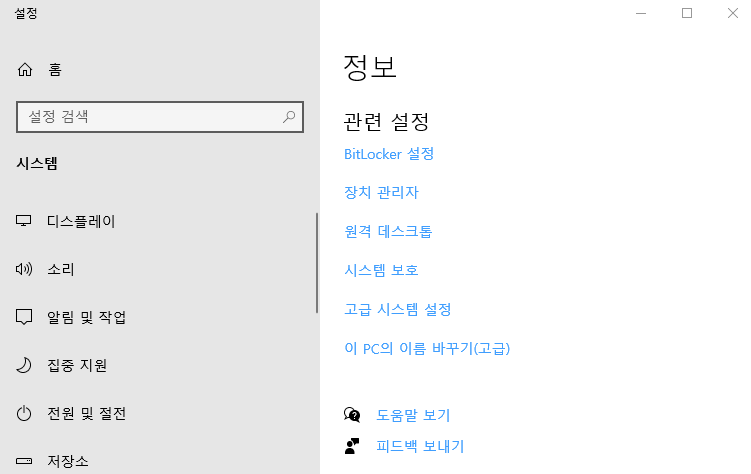

## 2021년08월10일_GoLangWeb-OAuth2.0

## OAuth

-  구글 로그인, 페이스북, 카카오톡, 다른 사이트 로그인으로 가입하는 간편 로그인같은것 
- 자체 회원가입 시스템 이외에 위의 사이트로 가입하는것

## 왜 나왔나?

- 개인 정보 , ID, 비밀번호 저장해야하는데 , 큰회사는 괜찮지만 작은회사는 힘들수 있음
- 개인정보에 대한 법을 다 지키면서 데이터를 관리하는것이 쉽지 않음
- 고객들도 작은 사이트 이용하는데 회원가입 하는것이 귀찮다.
- 한곳에서 하나의 아이디 있으면 편하기때문에 
- 큰회사들은 자신의 포탈이 커져야함 이런걸 작은회사에 제공하면 서로 윈윈하는 효과가 있음
- 관리 책임과 비용 문제가 있어서 공짜가 문제이지 않나? 하는데 어느정도는 민감한 정보가 아니면 공짜로 이용하게 해주고 하루 이용량은 무료로 제공함

## 동작


- 큰회사에서 콜백 URL 등록해놓고 보냄 그러면 유저가 화면에 회원가입하고 완료되면 콜백 URL보고 있다가 callback으로 알려줌 그러면서 refresh키와 API key를 줌
- APIkey는 일정 시간이 지나면 소멸 이때 refreshkey로 다시 살리고 인증을 진행해서 로그인 하는 방식

- 하려면 OAuth API 키가 필요하다. 

## OAuth API키 받기  

[Google API 받기](https://console.developers.google.com)


- 이런 화면이 나옴 그럼 여기서 OAuth동의 화면 누름


- 외부만 선택됨 여기서 만들기 클릭


- 이렇게 제작하면 됨 그리고 필수 항목만 작성하면 저장


- 여기에 들어가서 +사용자 인증 정보 만들기 클릭 하면됨


- OAuth 클라이언트 ID 만들기 클릭


- 여기서 웹 애플리케이션 클릭


- 이렇게 설정을 해주면된다. 


- 클라이언트 ID랑 보안키를 따로 저장해놓는다. 

- 윈도우 + E 눌러서 탐색기 켜고 내 PC에서 오른쪽 마우스 버튼 클릭해서 속성 클릭



- 고급 시스템 설정 클릭 해서 환경변수 클릭


- GOOGLE_CLIENT_ID 
- GOOGLE_SECRET_KEY 를 넣어주면된다.

## 웹 만들기 | main.go


- 파일 구성은 이렇게 해놓자

```go
package main

import (
	"net/http"

	"github.com/gorilla/pat"
	"github.com/urfave/negroni"
)

func main() {
	mux := pat.New()

	n := negroni.Classic()
	n.UseHandler(mux)
	http.ListenAndServe(":3000", n)
}
```

## public / index.html

```html
<html>
<head>
<title>Go Oauth2.0 Test</title> 
</head>
<body>
<p><a href='./auth/google/login'>Google Login</a></p>
</body>
</html>
```

##  main.go 추가

```go
var googleOauthConfig = oauth2.Config{}

func googleLoginHandler(w http.ResponseWriter, r *http.Request) {

}

func main() {
	mux := pat.New()
	mux.HandleFunc("/auth/google/login", googleLoginHandler)
  ...
}
```

- 이떄 go get golang.org/x/oauth2
- go get cloud.google.com/go 를 받아온다.

## googleOauthConfig()

```go
var googleOauthConfig = oauth2.Config{
	RedirectURL:  "https://localhost:3000/auth/google/callback",
	ClientID:     os.Getenv("GOOGLE_CLIENT_ID"),
	ClientSecret: os.Getenv("GOOGLE_SECREAT_KEY"),
	Scopes:       []string{"https://www.googleapis.com/auth/userinfo.email"},
	Endpoint:     google.Endpoint,
}
```

- 위와 같이 설정을 해준다. 

```go
func googleLoginHandler(w http.ResponseWriter, r *http.Request) {
	state := generateStateOauthCookie(w)
	url := googleOauthConfig.AuthCodeURL(state)
	http.Redirect(w, r, url, http.StatusTemporaryRedirect)
}

```

- googleOauthConfig.AuthCodeURL() 여기가 어떤 경로로 보낼지 알려줌
- 아래는 보내는 것이고 왜 리다이렉트 하는지 알려주는것
- 그리고 AuthCodeURL()에 인자로 status 넣어야함


- CSRF 어택을 방지 (CSRF는 URL 변조 공격인데 해킹의 일종)
- 비어있지 않아야하고 콜백 왔을때 확인 할 수 있어야함
- 유저의 브라우저에 쿠기에 temporary 키를 심고 Redirect에서 콜백이 왔을 떄 쿠기를 비교하는 방식으로 해보자.


- 저 state에서 받아서 AuthCodeURL로 넘겨줄것이다.
- 우선 state에 넣어주는 함수를 만들어보자

##  generateStateOauthCookie()

```go
func generateStateOauthCookie(w http.ResponseWriter) string {
	expiration := time.Now().Add(1 * 24 * time.Hour)

	b := make([]byte, 16)
	rand.Read(b)
	state := base64.URLEncoding.EncodeToString(b)
	cookie := &http.Cookie{Name: "oauthstate", Value: state, Expires: expiration}
	http.SetCookie(w, cookie)
	return state
}
```

-   mux.HandleFunc("/auth/google/callback", googleAuthCallback) 핸들러 추가

## googleAuthCallback() 구현

```go
func googleAuthCallback(w http.ResponseWriter, r *http.Request) {
	oauthstate, _ := r.Cookie("oauthstate")

	if r.FormValue("state") != oauthstate.Value {
		log.Printf("invalid google oauth state cookie:%s state:%s\n", oauthstate.Value, r.FormValue("state"))
		http.Redirect(w, r, "/", http.StatusTemporaryRedirect)
		return
	}
	data, err := getGoogleUserInfo(r.FormValue("code"))
	if err != nil {
		log.Println(err.Error())
		http.Redirect(w, r, "/", http.StatusTemporaryRedirect)
		return
	}
	fmt.Fprint(w, string(data))
}
```

- r에서 구글에서 state 값을 보내줌
- 그 값이랑 우리가 만든 쿠기가 다르면 문제가 있는건데 여기서 에러 반환하면 해커가 알기 쉽기 때문에 그냥 / 여기로 이동시키고 해줘서 알 수 없게함
-   data, err := getGoogleUserInfo(r.FormValue("code")) 이부분은 r에서  리퀘스트 코드가져와서 구글한테 다시 요청 할 수있음

## getGoogleUserInfo 만들기 

```go
const oauthGoogleUrlAPI = "https://www.googleapis.com/oauth2/v2/userinfo?access_token="

func getGoogleUserInfo(code string) ([]byte, error) {
	token, err := googleOauthConfig.Exchange(context.Background(), code)
	if err != nil {
		return nil, fmt.Errorf("Failed  to Exchange %s\n", err.Error())
	}
	resp, err := http.Get(oauthGoogleUrlAPI + token.AccessToken)
	if err != nil {
		return nil, fmt.Errorf("Failed  to Exchange %s\n", err.Error())
	}
	return ioutil.ReadAll(resp.Body)

}
```

- const oauthGoogleUrlAPI = "https://www.googleapis.com/oauth2/v2/userinfo?access_token="
- 여기서 우리는 token을 넘겨주면 구글에서는 리턴값으로 userinfo를 알려줌


- AccessToken이 만료되면 RefreshToken을 해서 만료되는거 다시 갱신하면되는데 우리는 무튼 AccessToken을 보내야함

## 결과 

