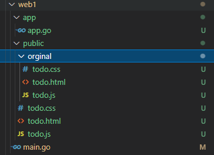
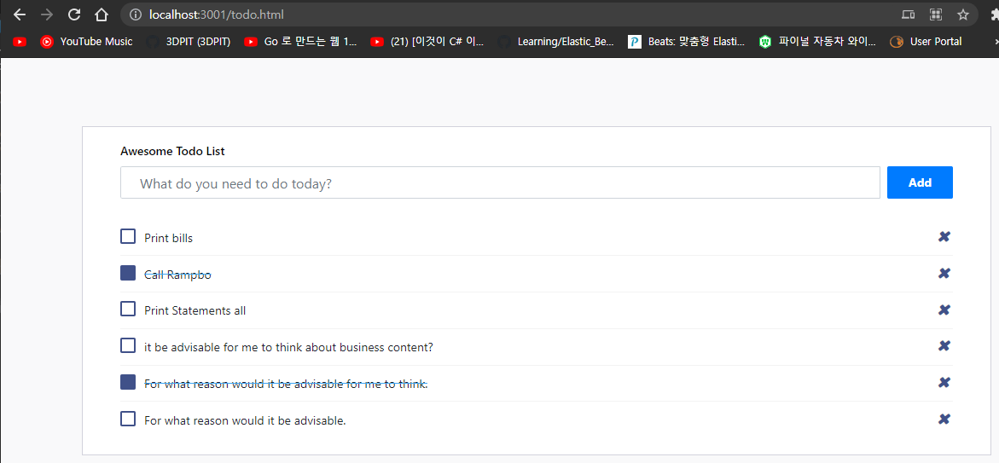
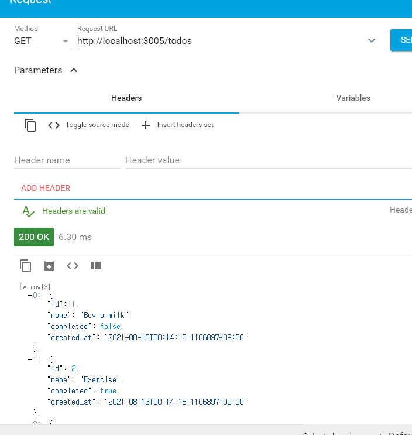
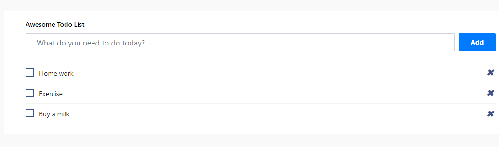

## 2021년08월11일_GoLangWeb-Todo웹  

- 부트스트랩을 이용할것 
- 우선 부트스트랩에 있는 것으로 활용함

## main.go

```go
package main

import (
	"net/http"
	"web/web1/app"

	"github.com/urfave/negroni"
)

func main() {

	m := app.MakeHandler()
	n := negroni.Classic()
	n.UseHandler(m)

	http.ListenAndServe(":3001", n)
}

```

## app/ app.go

```go
package app

import (
	"net/http"

	"github.com/gorilla/mux"
)

func MakeHandler() http.Handler {
	r := mux.NewRouter()
	return r
}
```

##  todo.css

```css
body {
    background-color: #f9f9fa
}

.flex {
    -webkit-box-flex: 1;
    -ms-flex: 1 1 auto;
    flex: 1 1 auto
}

@media (max-width:991.98px) {
    .padding {
        padding: 1.5rem
    }
}

@media (max-width:767.98px) {
    .padding {
        padding: 1rem
    }
}

.padding {
    padding: 5rem
}

.card {
    box-shadow: none;
    -webkit-box-shadow: none;
    -moz-box-shadow: none;
    -ms-box-shadow: none
}

.pl-3,
.px-3 {
    padding-left: 1rem !important
}

.card {
    position: relative;
    display: flex;
    flex-direction: column;
    min-width: 0;
    word-wrap: break-word;
    background-color: #fff;
    background-clip: border-box;
    border: 1px solid #d2d2dc;
    border-radius: 0
}

.pr-3,
.px-3 {
    padding-right: 1rem !important
}

.card .card-body {
    padding: 1.25rem 1.75rem
}

.card-body {
    flex: 1 1 auto;
    padding: 1.25rem
}

.card .card-title {
    color: #000000;
    margin-bottom: 0.625rem;
    text-transform: capitalize;
    font-size: 0.875rem;
    font-weight: 500
}

.add-items {
    margin-bottom: 1.5rem;
    overflow: hidden
}

.d-flex {
    display: flex !important
}

.add-items input[type="text"] {
    border-top-right-radius: 0;
    border-bottom-right-radius: 0;
    width: 100%;
    background: transparent
}

.form-control {
    border: 1px solid #f3f3f3;
    font-weight: 400;
    font-size: 0.875rem
}

.form-control {
    display: block;
    width: 100%;
    padding: 0.875rem 1.375rem;
    font-size: 1rem;
    line-height: 1;
    color: #495057;
    background-color: #ffffff;
    background-clip: padding-box;
    border: 1px solid #ced4da;
    border-radius: 2px;
    transition: border-color 0.15s ease-in-out, box-shadow 0.15s ease-in-out
}

.add-items .btn {
    margin-left: .5rem
}

.btn {
    font-size: 0.875rem;
    line-height: 1;
    font-weight: 400;
    padding: .7rem 1.5rem;
    border-radius: 0.1275rem
}

.list-wrapper {
    height: 100%;
    max-height: 100%
}

.add-items {
    margin-bottom: 1.5rem;
    overflow: hidden
}

.add-items input[type="text"] {
    border-top-right-radius: 0;
    border-bottom-right-radius: 0;
    width: 100%;
    background: transparent
}

.add-items .btn,
.add-items .fc button,
.fc .add-items button,
.add-items .ajax-upload-dragdrop .ajax-file-upload,
.ajax-upload-dragdrop .add-items .ajax-file-upload,
.add-items .swal2-modal .swal2-buttonswrapper .swal2-styled,
.swal2-modal .swal2-buttonswrapper .add-items .swal2-styled,
.add-items .wizard>.actions a,
.wizard>.actions .add-items a {
    margin-left: .5rem
}

.rtl .add-items .btn,
.rtl .add-items .fc button,
.fc .rtl .add-items button,
.rtl .add-items .ajax-upload-dragdrop .ajax-file-upload,
.ajax-upload-dragdrop .rtl .add-items .ajax-file-upload,
.rtl .add-items .swal2-modal .swal2-buttonswrapper .swal2-styled,
.swal2-modal .swal2-buttonswrapper .rtl .add-items .swal2-styled,
.rtl .add-items .wizard>.actions a,
.wizard>.actions .rtl .add-items a {
    margin-left: auto;
    margin-right: .5rem
}

.list-wrapper {
    height: 100%;
    max-height: 100%
}

.list-wrapper ul {
    padding: 0;
    text-align: left;
    list-style: none;
    margin-bottom: 0
}

.list-wrapper ul li {
    font-size: .9375rem;
    padding: .4rem 0;
    border-bottom: 1px solid #f3f3f3
}

.list-wrapper ul li:first-child {
    border-bottom: none
}

.list-wrapper ul li .form-check {
    max-width: 90%;
    margin-top: .25rem;
    margin-bottom: .25rem
}

.list-wrapper ul li .form-check label:hover {
    cursor: pointer
}

.list-wrapper input[type="checkbox"] {
    margin-right: 15px
}

.list-wrapper .remove {
    cursor: pointer;
    font-size: 1.438rem;
    font-weight: 600;
    width: 1.25rem;
    height: 1.25rem;
    line-height: 20px;
    text-align: center
}

.list-wrapper .completed {
    text-decoration: line-through;
    text-decoration-color: #3da5f4
}

.list-wrapper ul li .form-check {
    max-width: 90%;
    margin-top: .25rem;
    margin-bottom: .25rem
}

.list-wrapper ul li .form-check,
.list-wrapper ul li .form-check .form-check-label,
.email-wrapper .mail-sidebar .menu-bar .profile-list-item a .user .u-name,
.email-wrapper .mail-sidebar .menu-bar .profile-list-item a .user .u-designation,
.email-wrapper .mail-list-container .mail-list .content .sender-name,
.email-wrapper .message-body .attachments-sections ul li .details p.file-name,
.settings-panel .chat-list .list .info p {
    text-overflow: ellipsis;
    overflow: hidden;
    max-width: 100%;
    white-space: nowrap
}

.form-check {
    position: relative;
    display: block;
    margin-top: 10px;
    margin-bottom: 10px;
    padding-left: 0
}

.list-wrapper ul li .form-check,
.list-wrapper ul li .form-check .form-check-label,
.email-wrapper .mail-sidebar .menu-bar .profile-list-item a .user .u-name,
.email-wrapper .mail-sidebar .menu-bar .profile-list-item a .user .u-designation,
.email-wrapper .mail-list-container .mail-list .content .sender-name,
.email-wrapper .message-body .attachments-sections ul li .details p.file-name,
.settings-panel .chat-list .list .info p {
    text-overflow: ellipsis;
    overflow: hidden;
    max-width: 100%;
    white-space: nowrap
}

.form-check .form-check-label {
    min-height: 18px;
    display: block;
    margin-left: 1.75rem;
    font-size: 0.875rem;
    line-height: 1.5
}

.form-check-label {
    margin-bottom: 0
}

.list-wrapper input[type="checkbox"] {
    margin-right: 15px
}

.form-check .form-check-label input {
    position: absolute;
    top: 0;
    left: 0;
    margin-left: 0;
    margin-top: 0;
    z-index: 1;
    cursor: pointer;
    opacity: 0;
    filter: alpha(opacity=0)
}

input[type="radio"],
input[type="checkbox"] {
    box-sizing: border-box;
    padding: 0
}

.list-wrapper ul li .form-check,
.list-wrapper ul li .form-check .form-check-label,
.email-wrapper .mail-sidebar .menu-bar .profile-list-item a .user .u-name,
.email-wrapper .mail-sidebar .menu-bar .profile-list-item a .user .u-designation,
.email-wrapper .mail-list-container .mail-list .content .sender-name,
.email-wrapper .message-body .attachments-sections ul li .details p.file-name,
.settings-panel .chat-list .list .info p {
    text-overflow: ellipsis;
    overflow: hidden;
    max-width: 100%;
    white-space: nowrap
}

.form-check .form-check-label input[type="checkbox"]+.input-helper:before {
    content: "";
    width: 18px;
    height: 18px;
    border-radius: 2px;
    border: solid #405189;
    border-width: 2px;
    -webkit-transition: all;
    -moz-transition: all;
    -ms-transition: all;
    -o-transition: all;
    transition: all;
    transition-duration: 0s;
    -webkit-transition-duration: 250ms;
    transition-duration: 250ms
}

.form-check .form-check-label input[type="checkbox"]+.input-helper:before,
.form-check .form-check-label input[type="checkbox"]+.input-helper:after {
    position: absolute;
    top: 0;
    left: 0
}

.form-check .form-check-label input[type="checkbox"]+.input-helper:after {
    -webkit-transition: all;
    -moz-transition: all;
    -ms-transition: all;
    -o-transition: all;
    transition: all;
    transition-duration: 0s;
    -webkit-transition-duration: 250ms;
    transition-duration: 250ms;
    font-family: Material Design Icons;
    opacity: 0;
    filter: alpha(opacity=0);
    -webkit-transform: scale(0);
    -ms-transform: scale(0);
    -o-transform: scale(0);
    transform: scale(0);
    content: '\F12C';
    font-size: .9375rem;
    font-weight: bold;
    color: #ffffff
}

.form-check .form-check-label input[type="checkbox"]+.input-helper:before,
.form-check .form-check-label input[type="checkbox"]+.input-helper:after {
    position: absolute;
    top: 0;
    left: 0
}

.form-check .form-check-label input[type="checkbox"]:checked+.input-helper:before {
    background: #405189;
    border-width: 0
}

.form-check .form-check-label input[type="checkbox"]+.input-helper:before {
    content: "";
    width: 18px;
    height: 18px;
    border-radius: 2px;
    border: solid #405189;
    border-width: 2px;
    -webkit-transition: all;
    -moz-transition: all;
    -ms-transition: all;
    -o-transition: all;
    transition: all;
    transition-duration: 0s;
    -webkit-transition-duration: 250ms;
    transition-duration: 250ms
}

.form-check .form-check-label input[type="checkbox"]+.input-helper:after {
    font-family: FontAwesome;
    content: "\f095";
    display: inline-block;
    padding-right: 3px;
    vertical-align: middle;
    color: #fff
}

.text-primary,
.list-wrapper .completed .remove {
    color: #405189 !important
}

.list-wrapper .remove {
    cursor: pointer;
    font-size: 1.438rem;
    font-weight: 600;
    width: 1.25rem;
    height: 1.25rem;
    line-height: 20px;
    text-align: center
}

.ml-auto,
.list-wrapper .remove,
.mx-auto {
    margin-left: auto !important
}

.mdi-close-circle-outline:before {
    content: "\F15A"
}

.list-wrapper ul li {
    font-size: .9375rem;
    padding: .4rem 0;
    border-bottom: 1px solid #f3f3f3
}

.mdi:before {
    font-family: FontAwesome;
    content: "\f00d";
    display: inline-block;
    padding-right: 3px;
    vertical-align: middle;
    font-size: .756em;
    color: #405189
}

.list-wrapper ul {
    padding: 0;
    text-align: left;
    list-style: none;
    margin-bottom: 0
}

.flex-column-reverse {
    flex-direction: column-reverse !important
}

.d-flex,
.loader-demo-box,
.distribution-chart-legend .distribution-chart,
.distribution-chart-legend .distribution-chart .item,
.list-wrapper ul li,
.email-wrapper .mail-sidebar .menu-bar .profile-list-item a,
.email-wrapper .mail-sidebar .menu-bar .profile-list-item a .user,
.email-wrapper .mail-list-container .mail-list .details,
.email-wrapper .message-body .attachments-sections ul li .thumb,
.email-wrapper .message-body .attachments-sections ul li .details .buttons,
.lightGallery .image-tile .demo-gallery-poster,
.swal2-modal,
.navbar .navbar-menu-wrapper .navbar-nav,
.navbar .navbar-menu-wrapper .navbar-nav .nav-item.nav-profile,
.navbar .navbar-menu-wrapper .navbar-nav .nav-item.dropdown .navbar-dropdown .dropdown-item {
    display: flex !important
}
```

## todo.html

```html
<!doctype html>
<html lang="en">
  <head>
    <!-- Required meta tags -->
    <meta charset="utf-8">
    <meta name="viewport" content="width=device-width, initial-scale=1, shrink-to-fit=no">

    <!-- Bootstrap CSS -->
    <link rel="stylesheet" href="https://stackpath.bootstrapcdn.com/bootstrap/4.4.1/css/bootstrap.min.css" integrity="sha384-Vkoo8x4CGsO3+Hhxv8T/Q5PaXtkKtu6ug5TOeNV6gBiFeWPGFN9MuhOf23Q9Ifjh" crossorigin="anonymous">
    <link rel="stylesheet" href="https://cdnjs.cloudflare.com/ajax/libs/font-awesome/4.0.3/css/font-awesome.css">
    <link rel="stylesheet" href="todo.css" >

    <title>Hello, world!</title>
  </head>
  <body>
    <div class="page-content page-container" id="page-content">
    <div class="padding">
        <div class="row container d-flex justify-content-center">
            <div class="col-lg-12">
                <div class="card px-3">
                    <div class="card-body">
                        <h4 class="card-title">Awesome Todo list</h4>
                        <div class="add-items d-flex"> <input type="text" class="form-control todo-list-input" placeholder="What do you need to do today?"> <button class="add btn btn-primary font-weight-bold todo-list-add-btn">Add</button> </div>
                        <div class="list-wrapper">
                            <ul class="d-flex flex-column-reverse todo-list">
                                <li>
                                    <div class="form-check"> <label class="form-check-label"> <input class="checkbox" type="checkbox"> For what reason would it be advisable. <i class="input-helper"></i></label> </div> <i class="remove mdi mdi-close-circle-outline"></i>
                                </li>
                                <li class="completed">
                                    <div class="form-check"> <label class="form-check-label"> <input class="checkbox" type="checkbox" checked=""> For what reason would it be advisable for me to think. <i class="input-helper"></i></label> </div> <i class="remove mdi mdi-close-circle-outline"></i>
                                </li>
                                <li>
                                    <div class="form-check"> <label class="form-check-label"> <input class="checkbox" type="checkbox"> it be advisable for me to think about business content? <i class="input-helper"></i></label> </div> <i class="remove mdi mdi-close-circle-outline"></i>
                                </li>
                                <li>
                                    <div class="form-check"> <label class="form-check-label"> <input class="checkbox" type="checkbox"> Print Statements all <i class="input-helper"></i></label> </div> <i class="remove mdi mdi-close-circle-outline"></i>
                                </li>
                                <li class="completed">
                                    <div class="form-check"> <label class="form-check-label"> <input class="checkbox" type="checkbox" checked=""> Call Rampbo <i class="input-helper"></i></label> </div> <i class="remove mdi mdi-close-circle-outline"></i>
                                </li>
                                <li>
                                    <div class="form-check"> <label class="form-check-label"> <input class="checkbox" type="checkbox"> Print bills <i class="input-helper"></i></label> </div> <i class="remove mdi mdi-close-circle-outline"></i>
                                </li>
                            </ul>
                        </div>
                    </div>
                </div>
            </div>
        </div>
    </div>
</div>


    <!-- Optional JavaScript -->
    <!-- jQuery first, then Popper.js, then Bootstrap JS -->
    <script src="https://ajax.googleapis.com/ajax/libs/jquery/3.4.1/jquery.min.js" ></script>
    <script src="https://cdn.jsdelivr.net/npm/popper.js@1.16.0/dist/umd/popper.min.js" integrity="sha384-Q6E9RHvbIyZFJoft+2mJbHaEWldlvI9IOYy5n3zV9zzTtmI3UksdQRVvoxMfooAo" crossorigin="anonymous"></script>
    <script src="https://stackpath.bootstrapcdn.com/bootstrap/4.4.1/js/bootstrap.min.js" integrity="sha384-wfSDF2E50Y2D1uUdj0O3uMBJnjuUD4Ih7YwaYd1iqfktj0Uod8GCExl3Og8ifwB6" crossorigin="anonymous"></script>
    <script src="todo.js"></script>
</body>
</html>
```

## todo.js

```js
(function($) {
    'use strict';
    $(function() {
    var todoListItem = $('.todo-list');
    var todoListInput = $('.todo-list-input');
    $('.todo-list-add-btn').on("click", function(event) {
    event.preventDefault();
    
    var item = $(this).prevAll('.todo-list-input').val();
    
    if (item) {
    todoListItem.append("<li><div class='form-check'><label class='form-check-label'><input class='checkbox' type='checkbox' />" + item + "<i class='input-helper'></i></label></div><i class='remove mdi mdi-close-circle-outline'></i></li>");
    todoListInput.val("");
    }
    
    });
    
    todoListItem.on('change', '.checkbox', function() {
    if ($(this).attr('checked')) {
    $(this).removeAttr('checked');
    } else {
    $(this).attr('checked', 'checked');
    }
    
    $(this).closest("li").toggleClass('completed');
    
    });
    
    todoListItem.on('click', '.remove', function() {
    $(this).parent().remove();
    });
    
    });
    })(jQuery);
```

- 대략  폴더 구성은 이렇다.





```go
https://localhost:3001/todo.html
```

## 리다이렉트

```go
package app

import (
	"net/http"

	"github.com/gorilla/mux"
)

func indexHandelr(w http.ResponseWriter, r *http.Request) {
	http.Redirect(w, r, "/todo.html", http.StatusTemporaryRedirect)
}

func MakeHandler() http.Handler {
	r := mux.NewRouter()

	r.HandleFunc("/", indexHandelr)
	return r
}

```

- 이런식으로 하면 위에 /todo.html을 안 붙여도 가능홤

## todl.js

```js
    var addItem = function(item){
        todoListItem.append("<li><div class='form-check'><label class='form-check-label'><input class='checkbox' type='checkbox' />" + item.name + "<i class='input-helper'></i></label></div><i class='remove mdi mdi-close-circle-outline'></i></li>");
    }

    $.get('/todos', function(items){
        items.forEach(e =>{
            addItem(e)
        })
    })
```

- 항목을 추가하는 부분이고 todos라는 핸들러를 만들어보자.

## 3tier-web

- 프론트, 백엔드, 디비를 만함

```go
var rd *render.Render

type Todo struct {
	ID        int       `json:"id"`
	Name      string    `json:"name"`
	Completed bool      `json:"completed"`
	CreatedAt time.Time `json:"created_at"`
}

var todoMap map[int]*Todo

func getTodoListHandler(w http.ResponseWriter, r *http.Request) {
	list := []*Todo{}
	for _, v := range todoMap {
		list = append(list, v)
	}
	rd.JSON(w, http.StatusOK, list)
}


func MakeHandler() http.Handler {
	todoMap = make(map[int]*Todo)
	...
}
```

- 위와 같이 추가를 해주고 나서 테스트 할 수있는 데이터를 넣자.

```go
func addTestTodos() {
	todoMap[1] = &Todo{1, "Buy a milk", false, time.Now()}
	todoMap[2] = &Todo{2, "Exercise", true, time.Now()}
	todoMap[3] = &Todo{2, "Home work", false, time.Now()}
}
```

- 위의 데이터를 확인해보자



- 이렇게 데이터가 올라오는게 보임



- 현재 이렇게 하면 완료 여부가 표시가 안되서 이부분을 추가하자.

  ## todo.js 부분

  ```js
          var addItem = function(item) {
              if (item.completed) {
                  todoListItem.append("<li class='completed'><div class='form-check'><label class='form-check-label'><input class='checkbox' type='checkbox' checked='checked' />" + item.name + "<i class='input-helper'></i></label></div><i class='remove mdi mdi-close-circle-outline'></i></li>");
              } else {
                  todoListItem.append("<li><div class='form-check'><label class='form-check-label'><input class='checkbox' type='checkbox' />" + item.name + "<i class='input-helper'></i></label></div><i class='remove mdi mdi-close-circle-outline'></i></li>");
              }
          };ssssssssssssssssssssssssssssssss
  ```

  

  

  