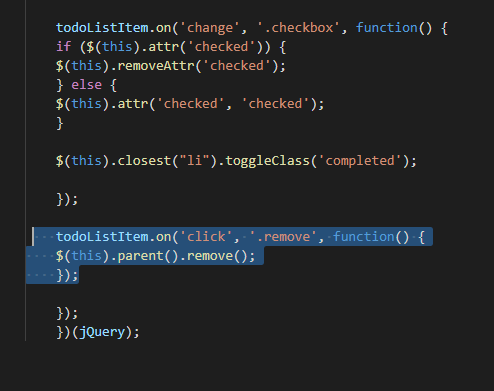

## 2021년08월18일_GoLangWeb-ToDoWeb2

## add 버튼을 누르게 되면 서버로 전송하는것

``` js
    var item = $(this).prevAll('.todo-list-input').val();
    
        if (item) {
            $.post("/todos",{name:item}, function(e){
                addItem({name: item, completed: false})
            })
            //todoListItem.append("<li><div class='form-check'><label class='form-check-label'><input class='checkbox' type='checkbox' />" + item + "<i class='input-helper'></i></label></div><i class='remove mdi mdi-close-circle-outline'></i></li>");
        todoListInput.val("");
        }
    
    });
```

- 일단 위와 같이 해야하고 
- 이렇게 하면 서버로 전송이 안되는데 아직 핸들러를 안만들어서 이다.

## app.go

- post 핸들러 만들기

```go
func addTodoListHandler(w http.ResponseWriter, r *http.Request) {
	name := r.FormValue("name")
	id := len(todoMap) + 1
	todo := &Todo{id, name, false, time.Now()}
	todoMap[id] = todo
	rd.JSON(w, http.StatusOK, todo)
}

func MakeHandler() http.Handler {
...
	r.HandleFunc("/todos", addTodoListHandler).Methods("POST")
...
}

```

- 이렇게 하면됨

```go
        if (item) {
            $.post("/todos",{name:item}, function(e){
                addItem({name: item, completed: false})
            })
```

- 이전에 이렇게 했던것은 서버가 보내준 응답이 e에 들어있는데 서버의 아이디 값을 사용 못해서 아래와 같이 바꾸자.

```go
    var item = $(this).prevAll('.todo-list-input').val();
    
        if (item) {
            $.post("/todos",{name:item}, additem)
            //todoListItem.append("<li><div class='form-check'><label class='form-check-label'><input class='checkbox' type='checkbox' />" + item + "<i class='input-helper'></i></label></div><i class='remove mdi mdi-close-circle-outline'></i></li>");
        todoListInput.val("");
        }
    
    });
    
    var addItem = function(item){
        if (item.completed){
            todoListItem.append("<li class='completed'"+" id='"+item.id + "'><div class='form-check'><label class='form-check-label'><input class='checkbox' type='checkbox' />" + item.name + "<i class='input-helper'></i></label></div><i class='remove mdi mdi-close-circle-outline'></i></li>");

        }else{
        todoListItem.append("<li"+" id='"+item.id + "'><div class='form-check'><label class='form-check-label'><input class='checkbox' type='checkbox' />" + item.name + "<i class='input-helper'></i></label></div><i class='remove mdi mdi-close-circle-outline'></i></li>");
        }
    }
```

- if 문에 id 추가 시키고 , 아래도 li태그에 추가
- 이 아이디를 통해서 서버에 요청하고 할 수 있음


- 이렇게 아이디가 붙게 된다.

## 지우는 부분 만들기



- 저 부분을 수정할것
-  $(this).closest("li").attr('id') 이처럼 가장 가까운 항목의 아이디를 받아야함

```js
    todoListItem.on('click', '.remove', function() {
        // url: todos/id method: DELETE
        var id = $(this).closest("li").attr('id');
        var $self = $(this);
        $.ajax({
            url: "todos/" + id,
            type: "DELETE",
            success: function(data) {
                if (data.success) {
                    $self.parent().remove();
                }
            }
        })
        //$(this).parent().remove();
    });

});
})(jQuery);
```

- this의 경우 바뀔수 있어서 저렇게 self로 따로 저장하고 나머지는 위와 같이 한다.

## delete 핸들러 추가 

```go
type Success struct {
	Success bool `json:"success"`
}

func removeTodoHandler(w http.ResponseWriter, r *http.Request) {
	vars := mux.Vars(r)
	id, _ := strconv.Atoi(vars["id"])
	if _, ok := todoMap[id]; ok {
		delete(todoMap, id)
		rd.JSON(w, http.StatusOK, Success{true})
	} else {
		rd.JSON(w, http.StatusOK, Success{false})
	}
}

	r.HandleFunc("/todos/{id:[0-9]+}", removeTodoHandler).Methods("DELETE")
```

## 체크 부분

```js
    todoListItem.on('change', '.checkbox', function() {

        var id = $(this).closest("li").attr('id');
        var $self = $(this);
        var complete = true;
        if ($(this).attr('checked')){
            complete =false;
        }
        $.get("complete-todo/" +id+"?complete="+complete, function(data){
            if (complete){
                $self.attr('checked', 'checked');
            }else{
                $self.removeAttr('checked');
            }
            $self.closest("li").toggleClass('completed');
        })
    });
    
```

- 위와 같이 이렇게 해서 id , complete  상태를  해주면 된다. 

## 완료 핸들러

```go
func completeTodoHandler(w http.ResponseWriter, r *http.Request) {
	vars := mux.Vars(r)
	id, _ := strconv.Atoi(vars["id"])
	complete := r.FormValue("complete") == "true"
	if todo, ok := todoMap[id]; ok {
		todo.Completed = complete
		rd.JSON(w, http.StatusOK, Success{true})
	} else {
		rd.JSON(w, http.StatusOK, Success{false})
	}
}

	r.HandleFunc("/complete-todo/{id:[0-9]+}", completeTodoHandler).Methods("GET")


```

- 동작을 잘 확인해보면 된다. 