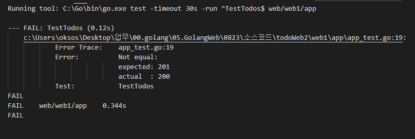
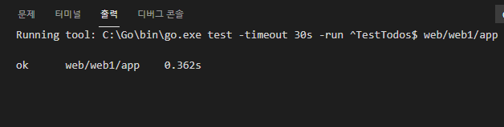

## 2021년08월23일_GoLangWeb-Refactoring

- 하기 전에 테스트 코드 작성 

## app_test.go

```go
func TestTodos(t *testing.T) {
	assert := assert.New(t)
	ts := httptest.NewServer(MakeHandler())
	defer ts.Close()

	resp, err := http.PostForm(ts.URL+"/todos", url.Values{"name": {"Test todo"}})
	assert.NoError(err)
	assert.Equal(http.StatusCreated, resp.StatusCode)
}
```

- 현재 그대로 하면 에러 발생



- addTestTodos() 지우고 그리고   rd.JSON(w, http.StatusOK, todo) , StatusOK가 아니고 StatusCreated

- 이렇게 해줘야 제대로 동작한다. 그이유는 테스트 코드에서 created의 코드를 받았기 때문에

```go
	var todo Todo
	err = json.NewDecoder(resp.Body).Decode(&todo)
	assert.NoError(err)
	assert.Equal(todo.Name, "Test todo")
```

- 이부분을 추가해서 실제로 제대로 값이 나오는지 확인하는 테스트

```go
	//id1 := todo.ID
	resp, err = http.PostForm(ts.URL+"/todos", url.Values{"name": {"Test todo2"}})
	assert.NoError(err)
	assert.Equal(http.StatusCreated, resp.StatusCode)
	err = json.NewDecoder(resp.Body).Decode(&todo)
	assert.NoError(err)
	assert.Equal(todo.Name, "Test todo2")

	//id2 := todo.ID
	resp, err = http.Get(ts.URL + "/todos")
	assert.NoError(err)
	assert.Equal(http.StatusOK, resp.StatusCode)
	todos := []*Todo{}
	json.NewDecoder(resp.Body).Decode(&todos)
	assert.NoError(err)
	assert.Equal(len(todos), 2)
```

- 두개를 채웠을때 제대로 2개가 들어가 있는지 확인

```go
	for _, t := range todos {
		if t.ID == id1 {
			assert.Equal("Test todo", t.Name)
		} else if t.ID == id2 {
			assert.Equal("Test todo2", t.Name)
		} else {
			assert.Error(fmt.Errorf("testID should be id1 or id2"))
		}
	}
```

## complete 확인

```go
	resp, err = http.Get(ts.URL + "/complete-todo/" + strconv.Itoa(id1) + "?complete=true")
	assert.NoError(err)
	assert.Equal(http.StatusOK, resp.StatusCode)
```

- 이것을 어떻게 확인 할 것인가? GET todo를 다시해서 확인해보자.

```go
	resp, err = http.Get(ts.URL + "/todos")
	assert.NoError(err)
	assert.Equal(http.StatusOK, resp.StatusCode)
	todos = []*Todo{}
	json.NewDecoder(resp.Body).Decode(&todos)
	assert.NoError(err)
	assert.Equal(len(todos), 2)

	for _, t := range todos {
		if t.ID == id1 {
			assert.True(t.Completed)
		}
	}
```

- 보냈을때 complete된것이 참임을 확인

## Delete 확인

```go
	req, _ := http.NewRequest("DELETE", ts.URL+"/todos/"+strconv.Itoa(id1), nil)
	resp, err = http.DefaultClient.Do(req)
	assert.NoError(err)
	assert.Equal(http.StatusOK, resp.StatusCode)
```

- 이를 확인 위해 다시 GET 가져와서 확인 
- 두개에서 1개로 되어 있어야함

```go
	resp, err = http.Get(ts.URL + "/todos")
	assert.NoError(err)
	assert.Equal(http.StatusOK, resp.StatusCode)
	todos = []*Todo{}
	json.NewDecoder(resp.Body).Decode(&todos)
	assert.NoError(err)
	assert.Equal(len(todos), 1)

	for _, t := range todos {
		assert.Equal(t.ID, id2)
	}
```

- 현재 까지 테스트 코드 만들어 놓음 그래야 바꿔도 같다는것을 검증 할 수 있음

## 현재 App.go 메모리상 todoMap 분리

### modle/ model.go

```go
package model

import "time"

type Todo struct {
	ID        int       `json:"id"`
	Name      string    `json:"name"`
	Completed bool      `json:"completed"`
	CreatedAt time.Time `json:"created_at"`
}
var todoMap map[int]*Todo

```

-   list := []*Todo{} 이런것    list := []*model.Todo{}로 변경

```go
	for _, v := range todoMap {
		list = append(list, v)
	}
```

- 이부분은  model.go에서 펑션 만들어서 사용

### model.go / GetTodos()

```go
func GetTodos() []*Todo {
	return nil
}
```

- 이렇게 해서 app.go 부분을 이렇게 바꾸자

## App.go | getTodoListHandler

```go
func getTodoListHandler(w http.ResponseWriter, r *http.Request) {
	// list := []*modle.Todo{}
	// for _, v := range todoMap {
	// 	list = append(list, v)
	// }
	list := model.GetTodos()
	rd.JSON(w, http.StatusOK, list)
}
```

## model.go / GetTodos()

```go
func AddTodo(name string) *Todo {
	return nil
}
```

## App.go | addTodoListHandler

```go
func addTodoListHandler(w http.ResponseWriter, r *http.Request) {
	name := r.FormValue("name")
	// id := len(todoMap) + 1
	// todo := &Todo{id, name, false, time.Now()}
	// todoMap[id] = todo
	todo := model.AddTodo(name)
	rd.JSON(w, http.StatusCreated, todo)
}
```

## model.go / RemoveTodos()

```go
func RemoveTodo(id int) bool {
	return false
}
```

## App.go | removeTodoListHandler

```go
func removeTodoHandler(w http.ResponseWriter, r *http.Request) {
	vars := mux.Vars(r)
	id, _ := strconv.Atoi(vars["id"])
	ok := model.RemoveTodo(id)
	if ok{
		rd.JSON(w, http.StatusOK, Success{true})
	}else {
		rd.JSON(w, http.StatusOK, Success{false})
	}
	// if _, ok := todoMap[id]; ok {
	// 	delete(todoMap, id)
	// 	rd.JSON(w, http.StatusOK, Success{true})
	// } else {
	// 	rd.JSON(w, http.StatusOK, Success{false})
	// }
}
```

## model.go / CompleteTodos()

```go
func CompleteTodo(id int, complete bool) bool {
	return false
}
```

## App.go | completeTodosTodoListHandler

```go
func completeTodoHandler(w http.ResponseWriter, r *http.Request) {
	vars := mux.Vars(r)
	id, _ := strconv.Atoi(vars["id"])
	complete := r.FormValue("complete") == "true"
	ok := model.CompleteTodo(id, complete)
	if ok {
		rd.JSON(w, http.StatusOK, Success{true})
	} else {
		rd.JSON(w, http.StatusOK, Success{false})
	}
	// if todo, ok := todoMap[id]; ok {
	// 	todo.Completed = complete
	// 	rd.JSON(w, http.StatusOK, Success{true})
	// } else {
	// 	rd.JSON(w, http.StatusOK, Success{false})
	// }
}

```

- 이전의 App.go는 메모리와 Map을 둘다 가지고 있었음
- 서로 의존성이 강하게 존재 하고 있었음 그것을 끊어주는 작업을 함
- 우리가 메모리를 안쓰고 fileDB를 쓸 것이므로

## 전체 Model.go 수정

```go
package model

import (
	"time"
)

type Todo struct {
	ID        int       `json:"id"`
	Name      string    `json:"name"`
	Completed bool      `json:"completed"`
	CreatedAt time.Time `json:"created_at"`
}

var todoMap map[int]*Todo

func init() {
	todoMap = make(map[int]*Todo)
}

func GetTodos() []*Todo {
	list := []*Todo{}
	for _, v := range todoMap {
		list = append(list, v)
	}
	return list
}

func AddTodo(name string) *Todo {
	id := len(todoMap) + 1
	todo := &Todo{id, name, false, time.Now()}
	todoMap[id] = todo
	return todo
}

func RemoveTodo(id int) bool {
	if _, ok := todoMap[id]; ok {
		delete(todoMap, id)
		return true
	}
	return false
}

func CompleteTodo(id int, complete bool) bool {
	if todo, ok := todoMap[id]; ok {
		todo.Completed = complete
		return true
	}
	return false
}

```

## 전체 소스

```go
package app

import (
	"net/http"
	"strconv"

	"web/web1/model"

	"github.com/gorilla/mux"
	"github.com/unrolled/render"
)

var rd *render.Render

func indexHandler(w http.ResponseWriter, r *http.Request) {
	http.Redirect(w, r, "/todo.html", http.StatusTemporaryRedirect)
}

func getTodoListHandler(w http.ResponseWriter, r *http.Request) {
	list := model.GetTodos()
	rd.JSON(w, http.StatusOK, list)
}

func addTodoListHandler(w http.ResponseWriter, r *http.Request) {
	name := r.FormValue("name")
	todo := model.AddTodo(name)
	rd.JSON(w, http.StatusCreated, todo)
}

type Success struct {
	Success bool `json:"success"`
}

func removeTodoHandler(w http.ResponseWriter, r *http.Request) {
	vars := mux.Vars(r)
	id, _ := strconv.Atoi(vars["id"])
	ok := model.RemoveTodo(id)
	if ok {
		rd.JSON(w, http.StatusOK, Success{true})
	} else {
		rd.JSON(w, http.StatusOK, Success{false})
	}

}

func completeTodoHandler(w http.ResponseWriter, r *http.Request) {
	vars := mux.Vars(r)
	id, _ := strconv.Atoi(vars["id"])
	complete := r.FormValue("complete") == "true"
	ok := model.CompleteTodo(id, complete)
	if ok {
		rd.JSON(w, http.StatusOK, Success{true})
	} else {
		rd.JSON(w, http.StatusOK, Success{false})
	}

}

func MakeHandler() http.Handler {
	//todoMap = make(map[int]*Todo)

	rd = render.New()
	r := mux.NewRouter()

	r.HandleFunc("/todos", getTodoListHandler).Methods("GET")
	r.HandleFunc("/todos", addTodoListHandler).Methods("POST")
	r.HandleFunc("/todos/{id:[0-9]+}", removeTodoHandler).Methods("DELETE")
	r.HandleFunc("/complete-todo/{id:[0-9]+}", completeTodoHandler).Methods("GET")
	r.HandleFunc("/", indexHandler)

	return r
}

```

- 이렇게 해서 테스트 코드를 돌리면 아래와 같다.



- 보면 굳이 서버를 띄우지 않더라도 리팩토링 후 결과가 제대로 동작하는지 알 수 있음