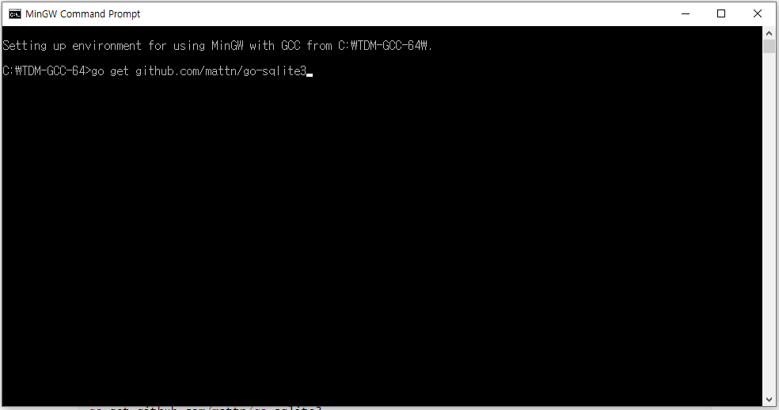
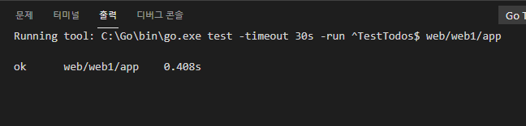
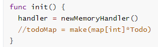

## 2021년08월25일_GoLangWeb-SQLite3설치

- RDBMS 는 관계형 데이터 베이스라고 함
- 데이터베이스의 관계를 정할수 있는 DB , SQL Query를 사용할 수 있는 것

- MysQL , MsSQL, Oracle DB, Amazon(aurora) 등 있음

- SQLite 는 파일로 만 동작하는 DB고 RDBMS, SQL query제공해서 간단하게 사용 가능하기 좋음

## go에서 사용하는 go-sqlLite3

- CGo를 사용 이것은 C-Library 사용하게 해줌
- 표준-c 컴파일러가 필요한데 window에는 없는데 , gcc, clang을 사용하지만 
- 고랭은 gnu c compile , gcc를 사용
- ms window는 지원을 하지 않음 ㅜㅜ
- 그래서 사람들이 ms window에서도gcc 동작 할 수 있게 mingW라는걸 만듦 여기서 gcc를 돌려야함
- 복잡하긴하다.

## tdm-gcc 설치 

[설치링크](https://jmeubank.github.io/tdm-gcc/)

```go
go get github.com/mattn/go-sqlite3
```



- MinGW 를 실행해서 명령어 실행 후 설치

## model.go

```go
package model

import (
	"time"
)

type Todo struct {
	ID        int       `json:"id"`
	Name      string    `json:"name"`
	Completed bool      `json:"completed"`
	CreatedAt time.Time `json:"created_at"`
}

type dbHandler interface {
	getTodos() []*Todo
	addTodo(name string) *Todo
	removeTodo(id int) bool
	completeTodo(id int, complete bool) bool
}
type memoryHandler struct {
	todoMap map[int]*Todo
}

func (m *memoryHandler) getTodos() []*Todo {
	list := []*Todo{}
	for _, v := range m.todoMap {
		list = append(list, v)
	}
	return list
}

func (m *memoryHandler) addTodo(name string) *Todo {
	id := len(m.todoMap) + 1
	todo := &Todo{id, name, false, time.Now()}
	m.todoMap[id] = todo
	return todo
}

func (m *memoryHandler) removeTodo(id int) bool {
	if _, ok := m.todoMap[id]; ok {
		delete(m.todoMap, id)
		return true
	}
	return false
}

func (m *memoryHandler) completeTodo(id int, complete bool) bool {
	if todo, ok := m.todoMap[id]; ok {
		todo.Completed = complete
		return true
	}
	return false
}
func newMemoryHandler() dbHandler {
	m := &memoryHandler{}
	m.todoMap = make(map[int]*Todo)
	return m
}

var handler dbHandler

func init() {
	handler = newMemoryHandler()
	//todoMap = make(map[int]*Todo)
}
func GetTodos() []*Todo {
	return handler.getTodos()
}
func AddTodo(name string) *Todo {
	return handler.addTodo(name)
}

func RemoveTodo(id int) bool {
	return handler.removeTodo(id)
}

func CompleteTodo(id int, complete bool) bool {
	return handler.completeTodo(id, complete)
}
```

- 이런식으로 인터페이스 생성해서 리팩토링 진행



- 테스트 코드 확인 해보니 이상 없음

## memoryHandler.go 

```go
package model

import "time"

type memoryHandler struct {
	todoMap map[int]*Todo
}

func (m *memoryHandler) getTodos() []*Todo {
	list := []*Todo{}
	for _, v := range m.todoMap {
		list = append(list, v)
	}
	return list
}

func (m *memoryHandler) addTodo(name string) *Todo {
	id := len(m.todoMap) + 1
	todo := &Todo{id, name, false, time.Now()}
	m.todoMap[id] = todo
	return todo
}

func (m *memoryHandler) removeTodo(id int) bool {
	if _, ok := m.todoMap[id]; ok {
		delete(m.todoMap, id)
		return true
	}
	return false
}

func (m *memoryHandler) completeTodo(id int, complete bool) bool {
	if todo, ok := m.todoMap[id]; ok {
		todo.Completed = complete
		return true
	}
	return false
}
func newMemoryHandler() dbHandler {
	m := &memoryHandler{}
	m.todoMap = make(map[int]*Todo)
	return m
}

```

- model.go의 일부분 이동 시킴

- 최종적으로는 handler = newMemoryHandler() 를
- handler = newSqliteHandler()로 바꾸면된다. 

## sqliteHandler.go

```go
package model

type sqliteHandler struct {
}

func (s *sqliteHandler) getTodos() []*Todo {
	return nil
}
func (s *sqliteHandler) addTodo(name string) *Todo {
	return nil
}
func (s *sqliteHandler) removeTodo(id int) bool {
	return false
}
func (s *sqliteHandler) completeTodo(id int, complete bool) bool {
	return false
}
```



- 이 부분을 handler = newSqliteHandler() 로 바꿔준다.

- sqliteHandler.go 부분에 아래를 쓴다.

```go
func newSqliteHandler() dbHandler {
	return &sqliteHandler{}
}
```

- 안의 내용물을 채워보자.

```go
import (
	"database/sql"

	_ "github.com/mattn/go-sqlite3"
)
```

- 어떤 sql을 쓰던지 제일 위에가 나오고 그것을 쓰면서 아래는 명시적으로는 사용하지 않겠지만 위에를 사용하면서 암시적으로 사용하겠다고 하는것

```go
package model

import (
	"database/sql"

	_ "github.com/mattn/go-sqlite3"
)

type sqliteHandler struct {
	db *sql.DB
}

func (s *sqliteHandler) getTodos() []*Todo {
	return nil
}
func (s *sqliteHandler) addTodo(name string) *Todo {
	return nil
}
func (s *sqliteHandler) removeTodo(id int) bool {
	return false
}
func (s *sqliteHandler) completeTodo(id int, complete bool) bool {
	return false
}

func (s *sqliteHandler) close() {
	s.db.Close()
}
func newSqliteHandler() dbHandler {
	database, err := sql.Open("sqlite3", "./test.db")
	if err != nil {
		panic(err)
	}
	//테이블을 만들기 위한 스키마
	statement, _ := database.Prepare(
		`CREATE TABLE IF NOT EXISTS todos (
			id        INTEGER  PRIMARY KEY AUTOINCREMENT,
			name      TEXT,
			completed BOOLEAN,
			createdAt DATETIME
		)`)
	statement.Exec()
	return &sqliteHandler{db: database}
}
```

- 디비 설정은 여기까지 완료 했고, 이제 뒤에 이어서 내용만 채워주면된다.