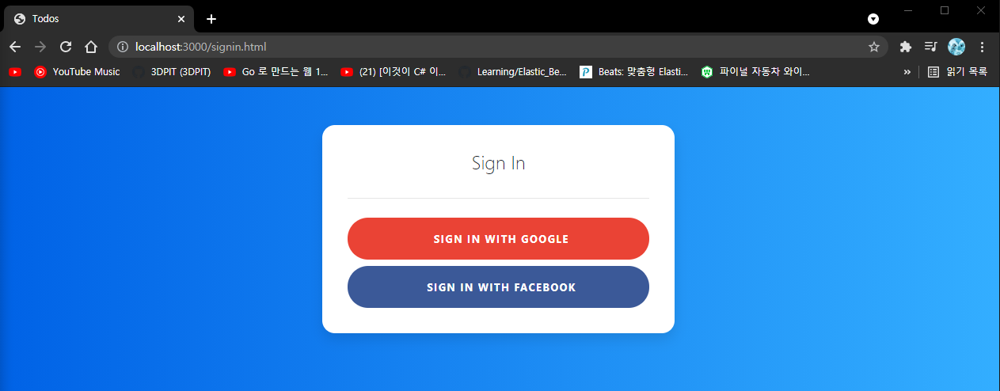
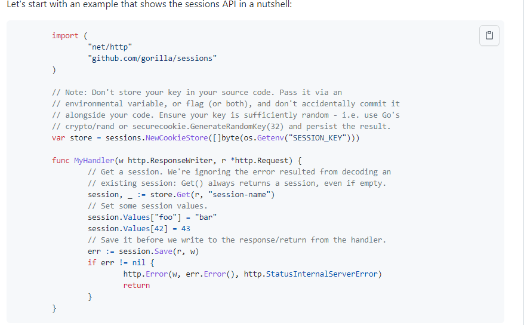
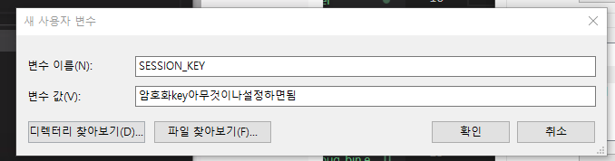
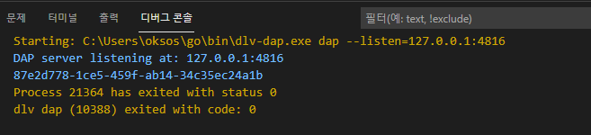
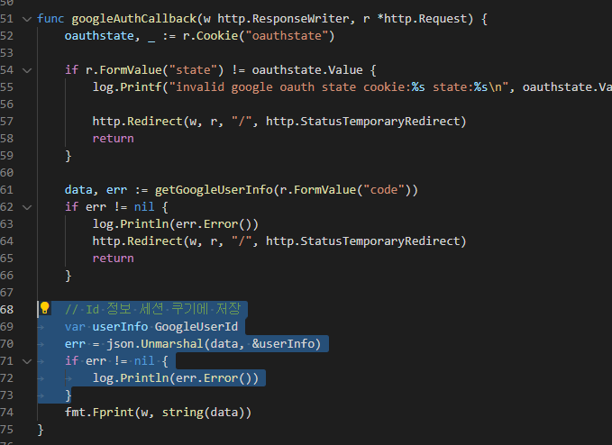
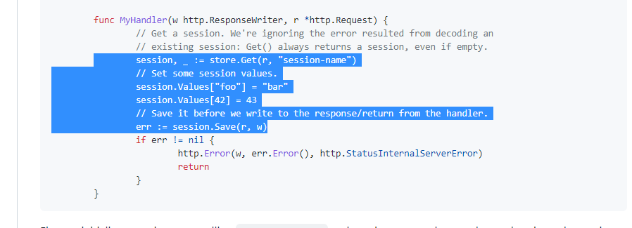
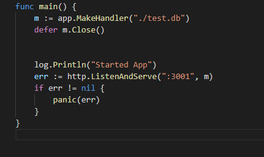

## 2021년08월29일_GoLangWeb-LoginPage  

## signin.go

```go
package app

import (
	"context"
	"crypto/rand"
	"encoding/base64"
	"fmt"
	"io/ioutil"
	"log"
	"net/http"
	"os"
	"time"

	"golang.org/x/oauth2"
	"golang.org/x/oauth2/google"
)

var googleOauthConfig = &oauth2.Config{
	RedirectURL:  "http://localhost:3000/auth/google/callback",
	ClientID:     os.Getenv("GOOGLE_CLIENT_ID"),
	ClientSecret: os.Getenv("GOOGLE_SECRET_KEY"),
	Scopes:       []string{"https://www.googleapis.com/auth/userinfo.email"},
	Endpoint:     google.Endpoint,
}

func googleLoginHandler(w http.ResponseWriter, r *http.Request) {
	state := generateStateOauthCookie(w)
	url := googleOauthConfig.AuthCodeURL(state)
	http.Redirect(w, r, url, http.StatusTemporaryRedirect)
}

func generateStateOauthCookie(w http.ResponseWriter) string {
	expiration := time.Now().Add(1 * 24 * time.Hour)

	b := make([]byte, 16)
	rand.Read(b)
	state := base64.URLEncoding.EncodeToString(b)
	cookie := &http.Cookie{Name: "oauthstate", Value: state, Expires: expiration}
	http.SetCookie(w, cookie)
	return state
}

func googleAuthCallback(w http.ResponseWriter, r *http.Request) {
	oauthstate, _ := r.Cookie("oauthstate")

	if r.FormValue("state") != oauthstate.Value {
		log.Printf("invalid google oauth state cookie:%s state:%s\n", oauthstate.Value, r.FormValue("state"))
		http.Redirect(w, r, "/", http.StatusTemporaryRedirect)
		return
	}

	data, err := getGoogleUserInfo(r.FormValue("code"))
	if err != nil {
		log.Println(err.Error())
		http.Redirect(w, r, "/", http.StatusTemporaryRedirect)
		return
	}

	fmt.Fprint(w, string(data))
}

const oauthGoogleUrlAPI = "https://www.googleapis.com/oauth2/v2/userinfo?access_token="

func getGoogleUserInfo(code string) ([]byte, error) {
	token, err := googleOauthConfig.Exchange(context.Background(), code)
	if err != nil {
		return nil, fmt.Errorf("Failed to Exchange %s\n", err.Error())
	}

	resp, err := http.Get(oauthGoogleUrlAPI + token.AccessToken)
	if err != nil {
		return nil, fmt.Errorf("Failed to Get UserInfo %s\n", err.Error())
	}

	return ioutil.ReadAll(resp.Body)
}
```

## app.go | makeHandler

```go
	r.HandleFunc("/auth/google/login", googleLoginHandler)
	r.HandleFunc("/auth/google/callback", googleAuthCallback)
```

- 이렇게 추가하면됨

## signin.css

```css
:root {
    --input-padding-x: 1.5rem;
    --input-padding-y: .75rem;
  }
  
  body {
    background: #007bff;
    background: linear-gradient(to right, #0062E6, #33AEFF);
  }
  
  .card-signin {
    border: 0;
    border-radius: 1rem;
    box-shadow: 0 0.5rem 1rem 0 rgba(0, 0, 0, 0.1);
  }
  
  .card-signin .card-title {
    margin-bottom: 2rem;
    font-weight: 300;
    font-size: 1.5rem;
  }
  
  .card-signin .card-body {
    padding: 2rem;
  }
  
  .form-signin {
    width: 100%;
  }
  
  .form-signin .btn {
    font-size: 80%;
    border-radius: 5rem;
    letter-spacing: .1rem;
    font-weight: bold;
    padding: 1rem;
    transition: all 0.2s;
  }
  
  .form-label-group {
    position: relative;
    margin-bottom: 1rem;
  }
  
  .form-label-group input {
    height: auto;
    border-radius: 2rem;
  }
  
  .form-label-group>input,
  .form-label-group>label {
    padding: var(--input-padding-y) var(--input-padding-x);
  }
  
  .form-label-group>label {
    position: absolute;
    top: 0;
    left: 0;
    display: block;
    width: 100%;
    margin-bottom: 0;
    /* Override default `<label>` margin */
    line-height: 1.5;
    color: #495057;
    border: 1px solid transparent;
    border-radius: .25rem;
    transition: all .1s ease-in-out;
  }
  
  .form-label-group input::-webkit-input-placeholder {
    color: transparent;
  }
  
  .form-label-group input:-ms-input-placeholder {
    color: transparent;
  }
  
  .form-label-group input::-ms-input-placeholder {
    color: transparent;
  }
  
  .form-label-group input::-moz-placeholder {
    color: transparent;
  }
  
  .form-label-group input::placeholder {
    color: transparent;
  }
  
  .form-label-group input:not(:placeholder-shown) {
    padding-top: calc(var(--input-padding-y) + var(--input-padding-y) * (2 / 3));
    padding-bottom: calc(var(--input-padding-y) / 3);
  }
  
  .form-label-group input:not(:placeholder-shown)~label {
    padding-top: calc(var(--input-padding-y) / 3);
    padding-bottom: calc(var(--input-padding-y) / 3);
    font-size: 12px;
    color: #777;
  }
  
  .btn-google {
    color: white;
    background-color: #ea4335;
  }
  
  .btn-facebook {
    color: white;
    background-color: #3b5998;
  }
  
  /* Fallback for Edge
  -------------------------------------------------- */
  
  @supports (-ms-ime-align: auto) {
    .form-label-group>label {
      display: none;
    }
    .form-label-group input::-ms-input-placeholder {
      color: #777;
    }
  }
  
  /* Fallback for IE
  -------------------------------------------------- */
  
  @media all and (-ms-high-contrast: none),
  (-ms-high-contrast: active) {
    .form-label-group>label {
      display: none;
    }
    .form-label-group input:-ms-input-placeholder {
      color: #777;
    }
  }
```

## signin.html

```html
<!doctype html>
<html lang="en">
  <head>
    <!-- Required meta tags -->
    <meta charset="utf-8">
    <meta name="viewport" content="width=device-width, initial-scale=1, shrink-to-fit=no">

    <!-- Bootstrap CSS -->
    <link rel="stylesheet" href="https://stackpath.bootstrapcdn.com/bootstrap/4.4.1/css/bootstrap.min.css" integrity="sha384-Vkoo8x4CGsO3+Hhxv8T/Q5PaXtkKtu6ug5TOeNV6gBiFeWPGFN9MuhOf23Q9Ifjh" crossorigin="anonymous">
    <link rel="stylesheet" href="https://cdnjs.cloudflare.com/ajax/libs/font-awesome/4.0.3/css/font-awesome.css">
    <link rel="stylesheet" href="signin.css" >

    <title>Todos</title>
  </head>
  <body>

  <div class="container">
    <div class="row">
      <div class="col-sm-9 col-md-7 col-lg-5 mx-auto">
        <div class="card card-signin my-5">
          <div class="card-body">
            <h5 class="card-title text-center">Sign In</h5>
            <form class="form-signin">
              <hr class="my-4">
              <button class="btn btn-lg btn-google btn-block text-uppercase" type="submit"><i class="fab fa-google mr-2"></i> Sign in with Google</button>
              <button class="btn btn-lg btn-facebook btn-block text-uppercase" type="submit"><i class="fab fa-facebook-f mr-2"></i> Sign in with Facebook</button>
            </form>
          </div>
        </div>
      </div>
    </div>
  </div>
</body>
</html>
```

```html
//이전
<button class="btn btn-lg btn-google btn-block text-uppercase" type="submit"><i class="fab fa-google mr-2"></i> Sign in with Google</button>

//바꾼 후
<button onclick="window.location.href='/auth/google/login';return false;" class="btn btn-lg btn-google btn-block text-uppercase" type="submit"><i class="fab fa-google mr-2"></i> Sign in with Google</button>

```



```html
localhost:3000/signin.html
```

- 이렇게 접속하면 저런 창을 볼 수 있음

## 세션정보 저장 후 이용하기

- signin 하면 session이 생기는데 그런 ID가 생김
- 이때 창이 뜨게 된다 tab은 바뀌는데 로그인 상태는 유지가되어야한다.
- 그래서 이 정보를 쿠키에 집어 넣는다. (session ID)를 집어넣음
- 즉 브라우저가 그 데이터 가지고 있고 , 그 쿠키데이터 가지고 가는데 그 쿠키 정보 가지고 판단하는것  
- 로그인 되었는지 아닌지 대신 해킹에 취약하다.
- 쿠기를 못가게 하는것 암호화 , 즉 암호화한 정보를 웹서버에 보내고 쿠키데이터 읽어서 로그인 유무 파악
- 나중에 https 되면 http 프로토콜 자체가 보안 이슈가 되어서 즉 이 평문 프로토콜이 암호화 되서 넘어가서 해킹이 어렵다.

```go
go get github.com/gorilla/sessions
```

- 고릴라 세션을 사용할 것

[고릴라 세션 git사이트](https://github.com/gorilla/sessions) 이곳에서 보면 아래와 같은 것을 복사해서 쓰자.



- app.go 부분에 아래를 전역변수로 추가

```go
	var store = sessions.NewCookieStore([]byte(os.Getenv("SESSION_KEY")))
```



- 환경변수에 세션 추가 대신 이것은 아무거나 해도되는데 노출되면 해석되니까 조심

## 간단한 UUID 만들기 

```go
go get github.com/google/uuid
```

- uuid 만드는 패키지 설치 하고 하면 아래와 같은 소스 작성시 됨

```go
package main

import (
	"fmt"

	"github.com/google/uuid"
)

func main() {
	id := uuid.New()
	fmt.Println(id.String())
}

```



- 유니버셜 유니크 ID 이기때문에 유일하다. 매번 바뀐다
- 이것을 환경변수로 적용하면된다. 배포시 노출되면 정기적으로 바꾸면됨

## signin.go | googleAuthCallback

```go
type GoogleUserId struct {
	ID            string `json:"id"`
	Email         string `json:"email`
	VerifiedEmail bool   `json:"verified_email"`
	Picture       string `json:"picture`
}
```

- 이 구조체를 이용해서 확인할것



- 이렇게 추가 함

## googleAuthCallback

```go
func googleAuthCallback(w http.ResponseWriter, r *http.Request) {
	oauthstate, _ := r.Cookie("oauthstate")

	if r.FormValue("state") != oauthstate.Value {
		errMsg := fmt.Sprintf("invalid google oauth state cookie:%s state:%s\n", oauthstate.Value, r.FormValue("state"))
		log.Printf(errMsg)
		http.Error(w, errMsg, http.StatusInternalServerError)
		return
	}

	data, err := getGoogleUserInfo(r.FormValue("code"))
	if err != nil {
		log.Println(err.Error())
		http.Error(w, err.Error(), http.StatusInternalServerError)
		return
	}

	// Id 정보 세션 쿠기에 저장
	var userInfo GoogleUserId
	err = json.Unmarshal(data, &userInfo)
	if err != nil {
		log.Println(err.Error())
		http.Error(w, err.Error(), http.StatusInternalServerError)
		return
	}
	fmt.Fprint(w, string(data))
}
```

- 이렇게 수정하고 하면 결과적으로 ID가 들어감



```go
	session, err := store.Get(r, "session")
	// Set some session values.
	if err != nil {
		http.Error(w, err.Error(), http.StatusInternalServerError)
		return
	}
	session.Values["ID"] = userInfo.ID
	// Save it before we write to the response/return from the handler.
	err = session.Save(r, w)
	if err != nil {
		http.Error(w, err.Error(), http.StatusInternalServerError)
		return
	}
	http.Redirect(w, r, "/", http.StatusTemporaryRedirect)
```

- 사이트의 이부분 추가해서 위와 같이 수정해서ID를 쿠키에저장

## 쿠키에서 세션 아이디 읽어오는 함수 

```go
func getSessionID(r *http.Request) string {
	session, err := store.Get(r, "session")
	// Set some session values.
	if err != nil {
		return ""
	}
	val := session.Values["ID"]
	if val == nil { // 로그인 안한것
		return ""
	}
	return val.(string)

}
```

- 원래는 이 세션 정보를 모두 페이지에서 가지고 있어야하는데 대게 번거롭다
- 그래서 우리는 데코레이션을 이용해서 거기서 판별하고 해서 로그인 여부 파악할 것

```go
	n := negroni.Classic()
	n.UseHandler(m)
```

## main.go



- main.go에 저두개 빼고, 세션에 사용 그것은 negroni자체에 미들웨어 있어서

## app.go | MakeHandler

- negroni핸들러는 먹스 사용 , 앱핸들러는 negroni 핸들러 사용
- 

```go
func CheckSignin(w http.ResponseWriter, r *http.Request, next http.HandlerFunc) {
	//if request URL is / signin.html, then next()
	if strings.Contains(r.URL.Path, "/signin.html"){
		next(w,r)
		return
	}
	// if user already signed in
	sessionID := getSessionID(r)
	if sessionID != "" {
		next(w, r)
		return
	}
	// if not user sign in
	//redirect singin.html
	http.Redirect(w, r, "/signin.html", http.StatusTemporaryRedirect)
}
```

- 저 유알엘로 접근했으면 그냥 next로 넘기고 또 아이디 있으면 넥스트
- 그리고 없는 경우 리다이렉트 시킴

## 제대로 돌아가는 소스

```go
func CheckSignin(w http.ResponseWriter, r *http.Request, next http.HandlerFunc) {
	//if request URL is / signin.html, then next()
	if strings.Contains(r.URL.Path, "/signin.html") ||
		strings.Contains(r.URL.Path, "/auth") {
		next(w, r)
		return
	}
	// if user already signed in
	sessionID := getSessionID(r)
	if sessionID != "" {
		next(w, r)
		return
	}
	// if not user sign in
	//redirect singin.html
	http.Redirect(w, r, "/signin.html", http.StatusTemporaryRedirect)
}

func MakeHandler(filepath string) *AppHandler {
	r := mux.NewRouter()
	n := negroni.New(negroni.NewRecovery(), negroni.NewLogger(), negroni.HandlerFunc(CheckSignin), negroni.NewStatic(http.Dir("public")))
...
}
	
```

- 저렇게 해서 무한 루프에 안빠짐
- 여기서 문제는 어떤 아이디여도 같은 todolist가 보이는 것