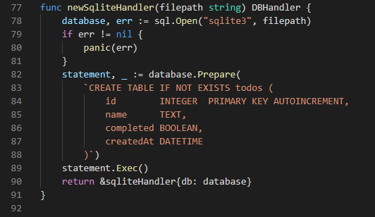
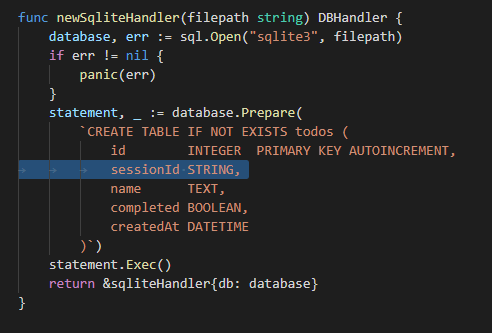
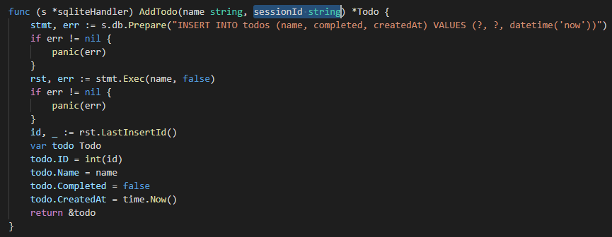
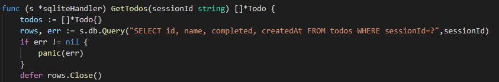
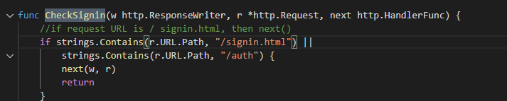

## 2021년08월29일_GoLangWeb-세션별데이터저장



- 여기에서 session ID를 추가하면됨



- 그리고 AddTodo에도 ID를 추가해야함



## sqliteHandler.go | AddTodo

```go
func (s *sqliteHandler) AddTodo(name string, sessionId string) *Todo {
	stmt, err := s.db.Prepare("INSERT INTO todos (sessionId, name, completed, createdAt) VALUES (?, ?, ?, datetime('now'))")
	if err != nil {
		panic(err)
	}
	rst, err := stmt.Exec(sessionId, name, false)
	if err != nil {
		panic(err)
	}
	id, _ := rst.LastInsertId()
	var todo Todo
	todo.ID = int(id)
	todo.Name = name
	todo.Completed = false
	todo.CreatedAt = time.Now()
	return &todo
}
```

- 위와 같이 sessionId를 추가함

## sqliteHandler.go | GetTodos

```go
func (s *sqliteHandler) GetTodos(sessionId string) []*Todo {
	todos := []*Todo{}
	rows, err := s.db.Query("SELECT id, name, completed, createdAt FROM todos WHERE sessionId=?",sessionId)
	if err != nil {
		panic(err)
	}
	defer rows.Close()
	for rows.Next() {
		var todo Todo
		rows.Scan(&todo.ID, &todo.Name, &todo.Completed, &todo.CreatedAt)
		todos = append(todos, &todo)
	}
	return todos
}
```

- 여기도 sessionId를 추가해야함

## model.go | DBHandler

```go
type DBHandler interface {
	GetTodos(sessionId string) []*Todo
	AddTodo(sessionId string,name string) *Todo
	RemoveTodo(id int) bool
	CompleteTodo(id int, complete bool) bool
	Close()
}
```

- 이부분의 핸들러도 아까 SessionId를 추가했기 때문에 추가해야함

## memoryHandler.go 

```go
func (m *memoryHandler) GetTodos(sessionId string) []*Todo {
	list := []*Todo{}
	for _, v := range m.todoMap {
		list = append(list, v)
	}
	return list
}

func (m *memoryHandler) AddTodo(sessionId string, name string) *Todo {
	id := len(m.todoMap) + 1
	todo := &Todo{id, name, false, time.Now()}
	m.todoMap[id] = todo
	return todo
}
```

- 이부분 역시 sessionId를 추가해야함

## app.go 

```go
func (a *AppHandler) getTodoListHandler(w http.ResponseWriter, r *http.Request) {
	sessionId := getSessionID(r)
	list := a.db.GetTodos(sessionId)
	rd.JSON(w, http.StatusOK, list)
}

func (a *AppHandler) addTodoHandler(w http.ResponseWriter, r *http.Request) {
	sessionId := getSessionID(r)
	name := r.FormValue("name")
	todo := a.db.AddTodo(name, sessionId)
	rd.JSON(w, http.StatusCreated, todo)
}
```

- 여기도 역시 추가해야함



- 이것의 경우 그냥 탐색을 하면 10개정도면 상관없는데 엄청 개수가 많아지면 탐색에 오래걸림
- 그렇기때문에 이진트리를 적용하고 하면 log2n정도 시간 복잡도 걸리기도 함 
- 그래서 그것을 설정해야함
- 인덱스를 만들어서 바로 찾을 수 있게하자
- 새로운 컴럼에 대해서 인덱스 만들때는 추가적으로 인덱스 만들어야함

## sqliteHandler.go

```go
func newSqliteHandler(filepath string) DBHandler {
	database, err := sql.Open("sqlite3", filepath)
	if err != nil {
		panic(err)
	}
	statement, _ := database.Prepare(
		`CREATE TABLE IF NOT EXISTS todos (
			id        INTEGER  PRIMARY KEY AUTOINCREMENT,
			sessionId STRING,
			name      TEXT,
			completed BOOLEAN,
			createdAt DATETIME
		);
		CREATE INDEX IF NOT EXISTS sessionIdIndexOnTodos ON todos
			sessionId ASC
		);`)
	statement.Exec()
	return &sqliteHandler{db: database}
}
```

- 메모리 낭비 심해서 필요한 경우에만 사용해야함
- 어떤 컬럼 인덱스 해야 효율적인지 알 수 있음

- 이렇게 하면 testcode를 작성해야함 왜냐하면 test를 다시 짜야함

## Test 코드 수정

- 테스트 코드를 보면 로그인을 하지 않은 상태이기 때문에 반복되는데 
- 임의로 로그인이 되어있다는 가정하에 하면됨

```go
func getSessionID(r *http.Request) string {
	session, err := store.Get(r, "session")
	// Set some session values.
	if err != nil {
		return ""
	}
	val := session.Values["ID"]
	if val == nil { // 로그인 안한것
		return ""
	}
	return val.(string)

}
```

- 여기가 로그인하는 부분인데 이것을 아예 바꿔버리면 보안에 문제가 있기 때문에 그러면 안되고 
- 아래와 같이 수정하면됨

```go
var getSessionID = func(r *http.Request) string {
	session, err := store.Get(r, "session")
	// Set some session values.
	if err != nil {
		return ""
	}
	val := session.Values["ID"]
	if val == nil { // 로그인 안한것
		return ""
	}
	return val.(string)

}
```

- 이렇게 하면 펑션 포인터를 가지고 있는 variable
- 함수를 콜하듯이 사용할 수 있음

```go
func TestTodos(t *testing.T) {
	getSessionID = func(r *http.Request) string {
		return "testsessionId"
	}
  ...
}
```

- 이렇게 추가하면 로그인없이 테스트 가능



- 여기서 signin.html을 signin으로 변경

- 이렇게 잘하면 두개 인터넷 창에서도 실행이 가능하다.

