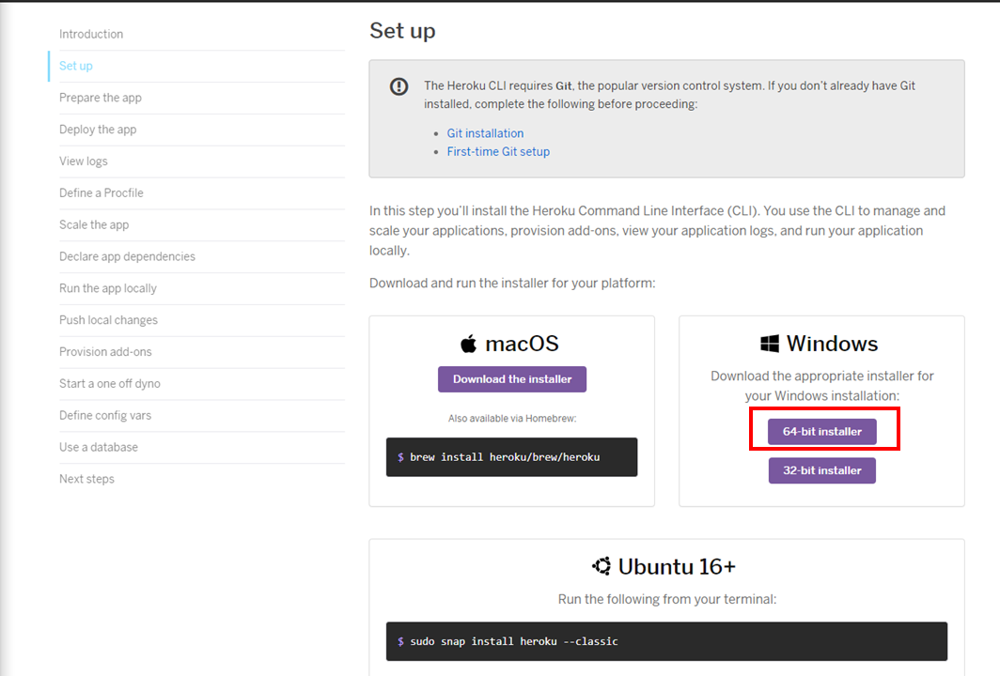
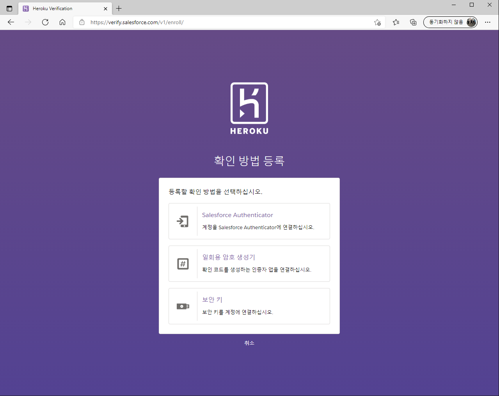

## 2021년08월29일_GoLangWeb-배포

## 웹 호스팅

- 웹 서비스 만들고 배포하는 과정
- 도메인이 필요하다. www.naver.com이라는 
- DNS가 필요 Domin Name Server , 각 도메인마다 ip주소를 매핑 하는
- Domin - iP map
- public ip가 필요하다.
- 개인 ip는 isp가 할당한 동적 ip이다.
- 개인pc로는 서비스 할 수 없고 외부에서 접근 할 수 가 없는것이다.
- public ip를 받으려며 호스팅해야함 , 회사에서 컴퓨터 임대해서 ip를 할당 받는것 ip를 연결해서domain을 얻으면 됬는데
- 요새는 가상화가 발전해서 물리컴퓨터를 통해 여러개 가상머신 어러개를 만들 수 있음 이것을 통해 물리머신을 효율적으로 사용할 수 있었다.
- 호스팅에서 클라우드 서비스형태로 바뀜 이런 서비스를 Iaas -> infra as s service라고 한다.
- 즉 인프라서비스 빌려쓰는것(cpu, memory, Hdd등)을 빌려쓰는것 대표적으로 AWS가 있음. cafe 24
- paas -> platform as a service, 이것은 플랫폼을 빌리는것 이런 webserver 가 있는데 올려달라고 하는것
- 그래서 간편해짐
- iaas는 디테일하게 쓸수 있지만 하나하나 다 적용해야한다는 단점있음
- sass -> software as a service (google drive, google doc , office 365)같은 것들

## Todos 

- cloud는 자체 방대함 (AWS)
- 우리는 여기서 배포를 하기 위해 간단하 Heroku인 pass를 사용할것
- free tier로 사용할 예정임 - 테스트 용으로는 무료임

[하라쿠설치사이트](https://devcenter.heroku.com/articles/getting-started-with-go)

## 1. 버튼 클릭


## 2. git 설치

- 이것은 알아서 git 설치하면됨
- [git 설치 링크](https://git-scm.com/downloads)

## 3. Heroku 설치




- next - install 순으로 진행하면됨

## heroku 로그인


```go
keroku login
```

- 위의 명령어를 치면 인터넷창이뜸


- 로그인 눌러서 로그인 진행


- continue 클릭



- 이렇게 이런것이 나옴
- 사실 그냥 취소해도 로그인되는듯
- 창을 종료시킴 그럼 로그인됨


- 이렇게 로그인 완료되고 다음 단계진행


- 다음단계로 넘어감

## git 클론


```go
git clone https://github.com/heroku/go-getting-started.git
cd go-getting-started
```

- 위의 명령어 커멘드 창에 실행


## 설치 파일 확인


- 이런식으로 구성되어 있음

## heroku create


```go
heroku create
```

- 이렇게 알아서 헤로쿠에서 해주고 우리는 배포는 아래 명령어 실행

```go
git push heroku main
```


- 완료됨

## 만든 페이지 열어보기

```go
heroku open
```


- 이렇게 까지 나오면 배포가 완료된것

## 로그 확인


```go
heroku logs --tail
```

- 대게gin을 많이 씀


- 지금은 한개서버를쓰고 있고 이를 늘리기 위해서는 추가 결재가 필요
- 결재하고 이런식으로 하면됨

```go
heroku ps:scale web=2
```

## 서비스 멈추기

```go
heroku ps:scale web=0
```

- 이렇게 하면 서비스가 안돌아서 멈춘것

