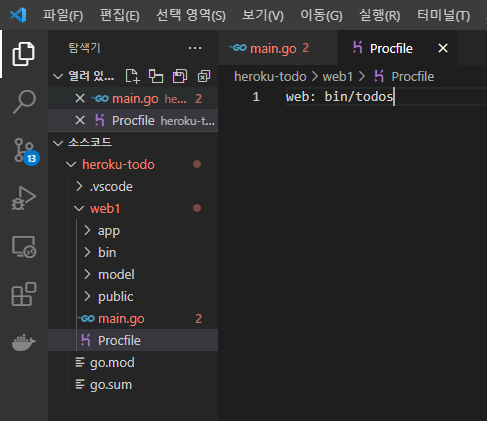

## 2021년08월30일_GoLangWeb-Todos배포


- main.go있는 폴더로 갑니다.


- 명령프롬프트 역시 해당 경로로 이동

```go
 go mod init web
```

- web 부분은 원하는 이름으로 해도됨

```go
git init

go build -o ./bin/todos.exe -v .
```

- 무튼 그러면 알아서 패키지 설치함


- bin파일이 생기는데 bin 폴더 가서 todos 입력


- 중요한것은 명령프롬프트에서 해야함 , 파워셀은 동작안됨


- bin  폴더 이전에 가서 아래 명령어 실행해서 해야 404에러 안생김

```go
cd ..

bin\todos.exe
```


## 헤로쿠 생성


```go
heroku create
```


```go
git add .
git status
```


```git
git commit -m "[21.08.30]goWebtodolist"

git push heroku master
```

- 여기까지해주면 알아서 다 설치함

```git
heroku ps

heroku logs --tail
```

- 실행 되었는지 정확히 확인

- 이렇게 하면 에러가 생겨서 제대로 실행이 안될것인데 포트번호랑 수정하자

## 에러 수정하기 


## main.go

```go
func main() {
	port := os.Getenv("PORT")

	m := app.MakeHandler(os.Getenv("DATABASE_URL"))
	defer m.Close()

	log.Println("Started App")
	err := http.ListenAndServe(":"+port, m)
	if err != nil {
		panic(err)
	}
}

```

- 이렇게 해서 변경해준다. 포트번호를 받아와서 쓰기 때문에 3000으로 하면안됨



- Procfile이 있어야함

```go
git add .

git status

git commit -m "[21.08.30] 수정"

git push heroku master
```

- 다시 위의 순서대로 진행해준다.

## heroku서버에 환경설정하기

```go
heroku config:set SESSION_KEY=fafdsafajlfkajf
```

이런식으로 입력해서 아디랑 세션키 등록해야함

```go
heroku config:set SESSION_KEY=fafdsafajlfkajf SESSION_KEY=lksjflksajfls
heroku config:set SESSION_KEY=fafdsafajlfkajf GOOGLE_CLIENT_ID=asdlkhfiuehaf
heroku config:set SESSION_KEY=fafdsafajlfkajf GOOGLE_SECRET_KEY=fkaheiukahikfuehaifu
```

## signin.go


- 이것을 잘보면 저기로 가면 안됨 로컬이므로 다시 설정

```go
	RedirectURL:  os.Getenv("DOMAIN_NAME")+"/auth/google/callback",
```

## "DOMAIN_NAME" 설정

```go
heroku apps
```

```
heroku conifg:set DOMAIN_NAME=https://guarded-plains-16394.herokuapp.com
```


- 다시 다 커밋해주고 실행시켜보자

```go
git add .

git status

git commit -m "[21.08.30] 수정"

git push heroku master
```

- 이게 하다보면 에러 생기는데
- 순서는 이렇게 해야하는 듯

```go
git init
heroku create
git add .
git status
git commit -m "aaaa"
git push heroku master
```


- 현재 이런 에러가 생김

```go
go mod tidy
```

- 이렇게 패키지 설치하고 다시 push 진행
- 이문제도 아닌듯
- 가장 큰 것은 저장소가 달라서 그럴 수도 있으니 저장소 잘확인하고 
- set config 먼저 하고 나서 마지막에 push할것

```go
git init
heroku create
heroku config:set GOOGLE_CLIENT_ID=키입력
heroku config:set GOOGLE_SECRET_KEY=키입력
heroku config:set SESSION_KEY=키입력
heroku config:set DOMAIN_NAME=해로쿠주소
git add .
git status
git commit -m "aaaa"
git push heroku master
```

- 한글로 되어있는 부분은 사용자마다 다름 잘 확인 할것

```go
heroku buildpacks:set https://github.com/heroku/heroku-buildpack-nodejs
```


- 이렇게 경로 또 추가해야함

- 현재는 이렇게 올라가면 파일디비여서 stateless 상태 정보를 저장이 안됨
- 다이노가 새로 뜰때마다 정보가 날아가기 때문에