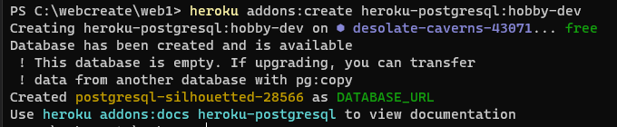

## 2021년08월31일_GoLangWeb-postgreDB

```go
heroku addons:create heroku-postgresql:hobby-dev
```

- 이렇게 하면 무료 버전으로 디비가 추가됨



```go
go get github.com/lib/pq
```

- 위의 라이브러리를 받아야 postgre sql를 사용할 수 있음


- sqliteHandeler.go를 복사해서 pqHandler.go로 이름만 바꿔준다.

## pqHandler

```go
package model

import (
	"database/sql"
	"time"

	_ "github.com/mattn/pq"
)

type pqHandler struct {
	db *sql.DB
}

func (s *pqHandler) GetTodos(sessionId string) []*Todo {
	todos := []*Todo{}
	rows, err := s.db.Query("SELECT id, name, completed, createdAt FROM todos WHERE sessionId=$1", sessionId)
	if err != nil {
		panic(err)
	}
	defer rows.Close()
	for rows.Next() {
		var todo Todo
		rows.Scan(&todo.ID, &todo.Name, &todo.Completed, &todo.CreatedAt)
		todos = append(todos, &todo)
	}
	return todos
}

func (s *pqHandler) AddTodo(name string, sessionId string) *Todo {
	stmt, err := s.db.Prepare("INSERT INTO todos (sessionId, name, completed, createdAt) VALUES ($1, $2, $3, now()) RETURNING id")
	if err != nil {
		panic(err)
	}
	//rst, err := stmt.Exec(sessionId, name, false)
	var id int
	err = stmt.QueryRow(sessionId, name, false).Scan(&id)
	if err != nil {
		panic(err)
	}
	//id, _ := rst.LastInsertId()
	var todo Todo
	todo.ID = int(id)
	todo.Name = name
	todo.Completed = false
	todo.CreatedAt = time.Now()
	return &todo
}

func (s *pqHandler) RemoveTodo(id int) bool {
	stmt, err := s.db.Prepare("DELETE FROM todos WHERE id=$1")
	if err != nil {
		panic(err)
	}
	rst, err := stmt.Exec(id)
	if err != nil {
		panic(err)
	}
	cnt, _ := rst.RowsAffected()
	return cnt > 0
}

func (s *pqHandler) CompleteTodo(id int, complete bool) bool {
	stmt, err := s.db.Prepare("UPDATE todos SET completed=$1 WHERE id=$2")
	if err != nil {
		panic(err)
	}
	rst, err := stmt.Exec(complete, id)
	if err != nil {
		panic(err)
	}
	cnt, _ := rst.RowsAffected()
	return cnt > 0
}

func (s *pqHandler) Close() {
	s.db.Close()
}

func newPQHandler(dbConn string) DBHandler {
	database, err := sql.Open("postgres", dbConn)
	if err != nil {
		panic(err)
	}
	statement, err := database.Prepare(
		`CREATE TABLE IF NOT EXISTS todos (
			id        SERIAL PRIMARY KEY,
			sessionId VARCHAR(256),
			name      TEXT,
			completed BOOLEAN,
			createdAt TIMESTAMP
		);`)
	if err != nil {
		panic(err)
	}
	_, err = statement.Exec()
	if err != nil {
		panic(err)
	}
	statement, err = database.Prepare(
		`CREATE INDEX IF NOT EXISTS sessionIdIndexOnTodos ON todos (
			sessionId ASC
		);`)
	if err != nil {
		panic(err)
	}
	_, err = statement.Exec()
	if err != nil {
		panic(err)
	}
	return &pqHandler{db: database}
}

```


## model.go 부분에 NewDBHandler를 바꿔줌

```go
func NewDBHandler(dbConn string) DBHandler {
	//handler = newMemoryHandler()
	//return newSqliteHandler(filepath)
	return newPQHandler(dbConn)
}
```

## main.go

```go
INTEGER  PRIMARY KEY AUTOINCREMENT,package main

import (
	"log"
	"net/http"
	"os"

	"3dpit/web/app"
)

func main() {
	port := os.Getenv("PORT")
	m := app.MakeHandler(os.Getenv("DATABASE_URL"))
	defer m.Close()

	log.Println("Started App")
	err := http.ListenAndServe(":"+port, m)
	if err != nil {
		panic(err)
	}
}

```

## sqllite랑 postgre의 문법이 다르니 그것을 잘 고쳐줘야함

- ? -> $1
  - ?는 안됨 $1, $2, 이렇게 정규표현식 사용
- INTEGER  PRIMARY KEY AUTOINCREMENT, -> SERIAL PRIMARY KEY,
  - Autoincrement 없어서 serial 로 해야함
- string -> VARCHAR(256),
  - string 없어서 varchar로해야함

- ```sql
  rst, err := stmt.Exec(sessionId, name, false)
  if err != nil {
  	panic(err)
  }
  id, _ := rst.LastInsertId()
  
  
  	var id int
  	err = stmt.QueryRow(sessionId, name, false).Scan(&id)
  	if err != nil {
  		panic(err)
  	}
  
  ```
  - LastInsertId를 사용 못해서 QueryRow로 해야함

- ```sql
  statement, _ := database.Prepare(
  	`CREATE TABLE IF NOT EXISTS todos (
  		id        INTEGER  PRIMARY KEY AUTOINCREMENT,
  		sessionId STRING,
  		name      TEXT,
  		completed BOOLEAN,
  		createdAt DATETIME
  	);
  	CREATE INDEX IF NOT EXISTS sessionIdIndexOnTodos ON todos (
  		sessionId ASC
  	);`)
  	
  	
  	
  	
  		statement, err := database.Prepare(
  		`CREATE TABLE IF NOT EXISTS todos (
  			id        SERIAL PRIMARY KEY,
  			sessionId VARCHAR(256),
  			name      TEXT,
  			completed BOOLEAN,
  			createdAt TIMESTAMP
  		);`)
  	if err != nil {
  		panic(err)
  	}
  	_, err = statement.Exec()
  	if err != nil {
  		panic(err)
  	}
  	statement, err = database.Prepare(
  		`CREATE INDEX IF NOT EXISTS sessionIdIndexOnTodos ON todos (
  			sessionId ASC
  		);`)
  	if err != nil {
  		panic(err)
  	}
  	_, err = statement.Exec()
  	if err != nil {
  		panic(err)
  	}
  ```

  - 한번에 못써서 나눠서 써야함