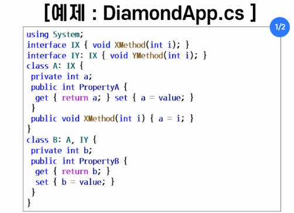

##2021년 06월17일  인터페이스  
## 인터페이스  
```
1. 사용자 접속을 기술할 수 있는 프로그래밍 단위
2. 구현되지 않은 멤버들로 구성된 순수한 설계의 표현

특징:
지정어 interface 사용
멤버로는 메소드, 프로퍼티, 인덱스, 이벤트가 올 수 있으며 모두 구현부분이 없음
다중상속 가능함
접근 수정자:
public, protected, internal, private, new

선언형태:
[interface-modifiers][partial] interface InterfaceName{
}
확장형태:
[modifiers] interface InterfaceName  : ListOfBaseInterfaces {
// method declarations
// property   ``
// indexer    ``
// event      ``
}
```
## 인터페이스 구현 규칙  
```
- 인터페이스에 있는 모든 멤버는 묵시적으로 public이므로 
접근 수정자를 public으로 명시함
- 멤버 중 하나라도 구현하지 않으면 derived 클래스는 추상 클래스가 됨

구현 형태 :
[class-modifiers] class ClassName : ListOfInterfaces{
}
```
## 클래스 확장과 동시에 인터페이스 구현  
```
[class-modifiers] class ClassName : BaseClass, ListOfInterfaces{
}
```




## 인터페이스와 추상클래스 비교  
```
공통점은 
객체를 가질 수 없음

차이점은 
인터페이스 :
다중 상속 지원
오직 메소드 선언만 가능
메소드 구현 시, override 지정어를 사용할 수 있음

추상 클래스 :
단일 상속 지원
메소드의 부분적인 구현 가능
메소드 구현시 , override 지정어 사용할 수 없음
```
## 네임 스페이스  
```
서로 연관된 클래스나 인터페이스, 구조체, 열거형, 델리게이트, 
하위 네임스페이스를 하나의 단위로 묶어주는것

예) 여러 개의 클래스와 인터페이스, 구조체, 열거형, 델리게이트 등을 
하나의 그룹으로 다루는 수단을 제공함
클래스의 이름을 지정할 때 발생 되는 이름 충돌 문젤르 해결함

선언형태:
namespace NamespaceName{
}

네임스페이스 사용:
using NamespaceName;//사용하고자하는 네임스페이스 명시
```
## 핵심요약  
## 파생 클래스   
```
C#은 이미 존재하는 클래스에 정보를 추가하여 새로운 클래스를 만들수 있음
이때 기존의 클래스를 베이스 클래스 라고 부르며 
새로 정의된 클래스를 파생 클래스라고 부름
베이스 클래스의 모든 멤버들이 파생 클래스로 옮겨지는 특성을 상속이라고 함
베이스 클래스로 부터 메소드를 상속받을 때, 파생 클래스 내에 같은 이름의
메소드가 있는 경우에 시그니처가 다르면 중복이되고, 같으면 재정의가 됨
```
## 인터페이스   
```
C#에서 인터페이스란 사용자 접속을 기술할 수 있는 프로그래밍 단위,
다시말해서 구현되지 않은 멤버들로 구성된 순수한 설계의 표현이 C#에서 
클래스는 단일 상속만 가능하기 때문에 다중 상속이 가능한 인터페이스를 지원

파생 인터페이스는 여러개의 베이스 인터페이스를 가질 수 있으며,
이와 같이 여러 개의 인터페이스로부터 상속받는 것을 다중 상속이라고 부름
```
## 네임 스페이스  
```
서로 연관된 클래스나 인터페이스, 구조체, 열거형, 델리게이트, 하위 네임스페이스를
하나의 단위로 묶는 방법
```