## 2021년 06월22일  WPF 과제 1,2  
## 프로젝트 생성하기  


## 단위테스트 파일 만들기  


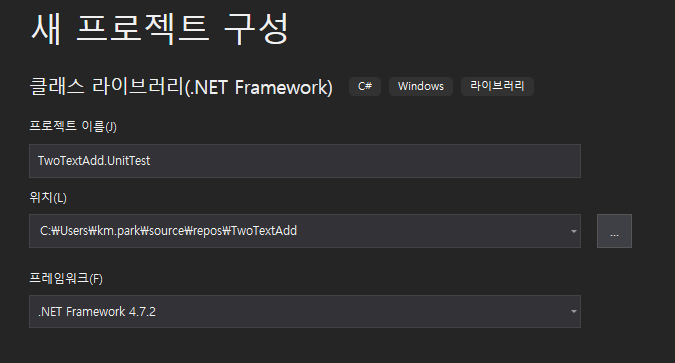

```
이름은 통일하면서 .UnitTest를 붙여준다. 
```
## 두개 텍스트박스의 숫자의 합 계산하기  
```
우선 텍스트 박스 세개가 필요하고, 버튼 한개가 필요하다. 
두개의 텍스트 박스에는 숫자가 들어가고 
버튼을 누르게 되면 
남은 텍스트 박스에 두개의 텍스트 박스의 숫자의 합이 계산되어 들어가는 프로젝트

아래와 같이 MainWindow.xaml에 
아무렇게나 화면을 구성을 합니다. 
```
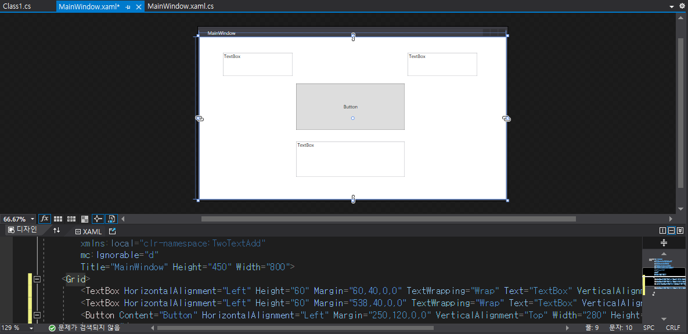
## 대표 두개의 인터페이스를 생성  
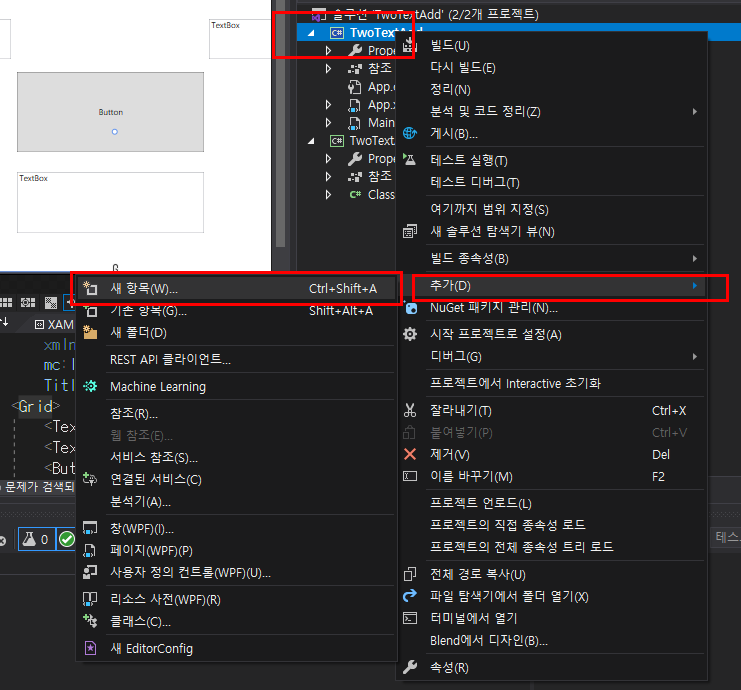

```
이렇게 해서 이름을 
CommandImpl
과
MainViewModel 
파일을 만들어줍니다.
```
## CommandImpl.cs  
```
using System;
using System.Collections.Generic;
using System.Linq;
using System.Text;
using System.Threading.Tasks;
using System.Windows.Input;

namespace TwoTextAdd
{
    class CommandImpl : ICommand
    {
        public event EventHandler CanExecuteChanged;

        public bool CanExecute(object parameter)
        //버튼 활성화 여부 파악 여기서는 안씀
        {
            throw new NotImplementedException();

        }

        public void Execute(object parameter)//이것에만 우선 집중하기 
        {
            throw new NotImplementedException();
        }
    }
}
```
## MainViewModel.cs  
```
using System;
using System.Collections.Generic;
using System.ComponentModel;
using System.Linq;
using System.Text;
using System.Threading.Tasks;

namespace TwoTextAdd
{
    public class MainViewModel : INotifyPropertyChanged
    {
        public event PropertyChangedEventHandler PropertyChanged;

        public virtual void OnPropertyChanged(string ProperName)
        {
            if (PropertyChanged != null)
            {
                PropertyChanged(this, new PropertyChangedEventArgs(ProperName));
            }
        }
    }
}
```
## MainViewModel.cs Text바인딩 준비  
```
using System;
using System.Collections.Generic;
using System.ComponentModel;
using System.Linq;
using System.Text;
using System.Threading.Tasks;

namespace TwoTextAdd
{
    public class MainViewModel : INotifyPropertyChanged
    {
        public event PropertyChangedEventHandler PropertyChanged;

        public virtual void OnPropertyChanged(string ProperName)
        {
            if (PropertyChanged != null)
            {
                PropertyChanged(this, new PropertyChangedEventArgs(ProperName));
            }
        }

        int num1;
        public int Num1//text1에 연결
        {
            get { return num1; }
            set
            {
                num1 = value;
                OnPropertyChanged(nameof(num1));
            }
        }
        int num2;
        public int Num2//text2에 연결
        {
            get { return num2; }
            set
            {
                num2 = value;
                OnPropertyChanged(nameof(num2));
            }
        }
        public MainViewModel()//생성자 
        {
            Num1 = 1;
            Num2 = 2;
        }
    }
}
```
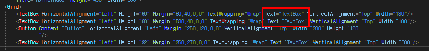
```
Text 부분을 지우고 
여기에 바인딩 할 예정임
지우고 나서 
<TextBox 뒤에서부터 작성하기 
```
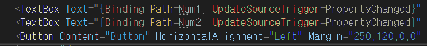

## MainWindow.xaml.cs 

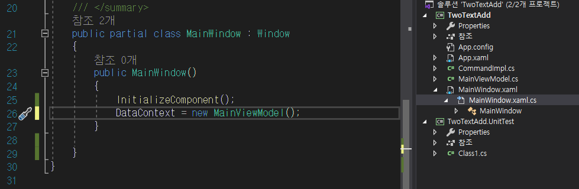

```
DataContext = new MainViewModel();
선언을 해줘야함 
```
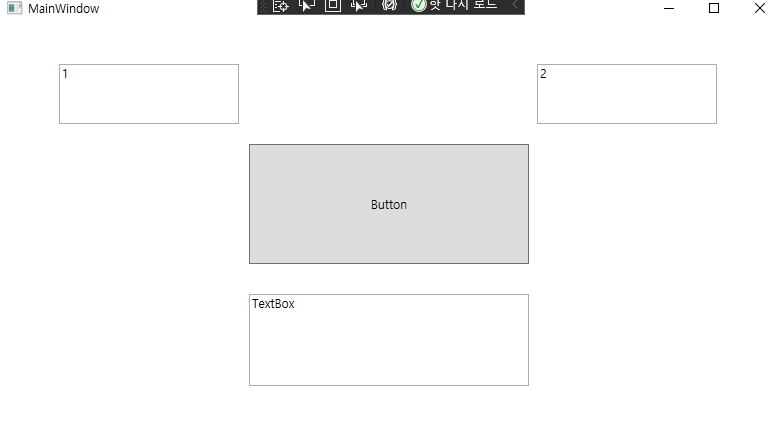
```
여기까지 구현하고 버튼을 누르게 되면 합이될 수 있도록 해보자.
```
## MainViewModel.cs  
```
        int add;
        public int Add
        {
            get { return add; }
            set
            {
                add = value;
                OnPropertyChanged(nameof(add));
            }
        }

        public ICommand NumAddBtn
        {
            get; set;
        }
        public MainViewModel()//생성자 
        {
            Num1 = 1;
            Num2 = 2;
            //Add = 4;
            NumAddBtn = new CommandImpl(NumAddUpdate);
        }

        private void NumAddUpdate()
        {
            Add =Num1+Num2;
        }
        
        이것을 추가 해준다. 그러고 동작을 확인해보면되는데 그전에 
```
## CommandImpl.cs 아래와 같이 구현한다.
```
using System;
using System.Collections.Generic;
using System.Linq;
using System.Text;
using System.Threading.Tasks;
using System.Windows.Input;

namespace TwoTextAdd
{
    class CommandImpl : ICommand
    {
        public event EventHandler CanExecuteChanged;

        Action _action;

        public CommandImpl(Action action)
        {
            _action = action;
        }

        public bool CanExecute(object parameter)//버튼 활성화 여부 파악 여기서는 안씀
        {
            //throw new NotImplementedException();
            return true;
        }

        public void Execute(object parameter)//이것에만 우선 집중하기 
        {
            //throw new NotImplementedException();
            _action();
        }
    }
}
```
## 현재1번 과제에 대한 UnitTest 진행하기  
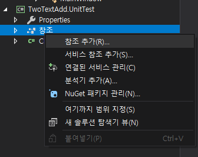
````
위에 그전에 만든 UnitTest 부분에 참조를 추가한다. 
````
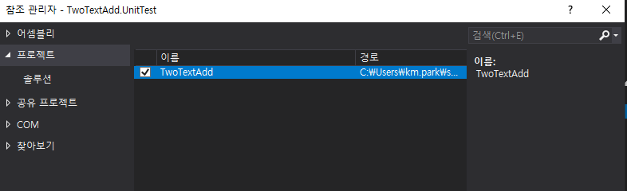
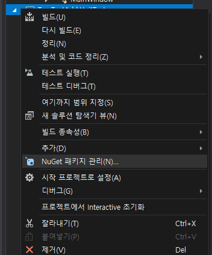
```
여기에서 3가지를 다운 받을 것이다. 
xunit, xunit.runner.visualstudio, FluentAssertions 
를 다운받는다. 

MainViewModelTest.cs 이름이 이걸로 class를 설정해야한다. 
그리고 아래에 테스트 코드를 작성한다. 
```
## MainViewModelTest.cs  
```
using FluentAssertions;
using System;
using System.Collections.Generic;
using System.Linq;
using System.Text;
using System.Threading.Tasks;
using Xunit;

namespace TwoTextAdd.UnitTest
{
    public class MainViewModelTest
    {
        [Fact]
        public void UdateAdd()
        {
            //Arrange 
            MainViewModel model = new MainViewModel();
            //Act
            model.NumAddBtn.Execute(null);
            //Assert
            model.Add.Should().Be(3);
            
        }

    }
}
```
## ListView에 항목들을 추가하는 프로젝트  
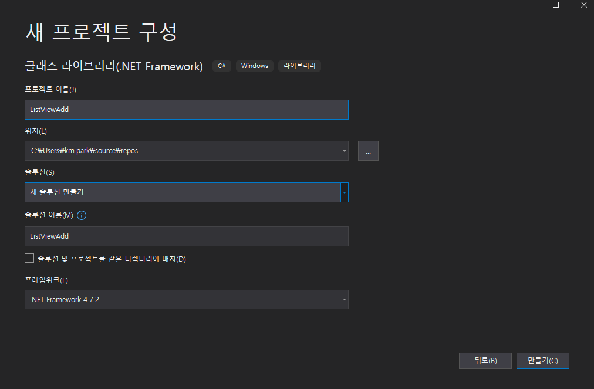
```
이름은 ListViewAdd 로해서 만들어줍니다.
이전까 똑같이 CommandImPl.cs롸 
MainViewModel.c 생성을 하고 
그것을 테스트 할 수 있는 

클래스 라이브러리 .NET Framework를 추가하는데 
이름은 ListViewAdd.UnitTestt로 해서 추가후 
그 안에 있는 cs 파일은 MainViewModelTest.cs로 해서 만들어 줍시다. 
설치할것등은 앞과 같습니다. 
```
[참고 링크 이벤트 관련](https://fluentassertions.com/eventmonitoring/)
```
using System;
using System.Collections.Generic;
using System.Collections.ObjectModel;
using System.ComponentModel;
using System.Linq;
using System.Runtime.CompilerServices;
using System.Text;
using System.Threading.Tasks;

namespace ListViewAdd
{
    public class MainViewModel : INotifyPropertyChanged
    {
        public ObservableCollection<string> ListViewValue { get; set; }
        private readonly StudentList items;

        public event PropertyChangedEventHandler PropertyChanged;

        public virtual void OnPropertyChanged(string ProperName)
        {
            if (PropertyChanged != null)
            {
                PropertyChanged(this, new PropertyChangedEventArgs(ProperName));
            }
        }
        public MainViewModel()
        {
            this.items = new StudentList();
        }
        public StudentList Items
        {
            get { return this.items; }
        }
        public class StudentList : ObservableCollection<Student>
        {
            public StudentList()
            {
                Add(new Student() { Name = "11", Age = 29, PhoneNumber = "11" });
                Add(new Student() { Name = "22", Age = 29, PhoneNumber = "22" });
                Add(new Student() { Name = "33", Age = 29, PhoneNumber = "33" });
            }

        }
        public class Student
        {
            public string Name { get; set; }
            public int Age { get; set; }
            public string PhoneNumber { get; set; }
        }

    }
}
```
## XAML 부분의 경우   
```
<Window x:Class="ListViewAdd.MainWindow"
        xmlns="http://schemas.microsoft.com/winfx/2006/xaml/presentation"
        xmlns:x="http://schemas.microsoft.com/winfx/2006/xaml"
        xmlns:d="http://schemas.microsoft.com/expression/blend/2008"
        xmlns:mc="http://schemas.openxmlformats.org/markup-compatibility/2006"
        xmlns:local="clr-namespace:ListViewAdd"
        mc:Ignorable="d"
        Title="MainWindow" Height="450" Width="800">
    <Grid>
        <ListView ItemsSource="{Binding Items}" HorizontalAlignment="Left" Height="326" Margin="143,64,0,0" VerticalAlignment="Top" Width="501">
            <ListView.View >
                <GridView>
                    <GridViewColumn Header="Name" Width="100" DisplayMemberBinding="{Binding Name}"></GridViewColumn>
                    <GridViewColumn Header="Age" Width="100" DisplayMemberBinding="{Binding Age}"></GridViewColumn>
                    <GridViewColumn Header="PhoneNumber" Width="100" DisplayMemberBinding="{Binding PhoneNumber}"></GridViewColumn>
                 </GridView>
            </ListView.View>
        </ListView>
        <Button Content="Button" HorizontalAlignment="Left" Height="49" Margin="522,10,0,0" VerticalAlignment="Top" Width="122"/>

    </Grid>
</Window>
```
```
저렇게 바인딩까지 하면 우선 이런식으로 나온다. 
```

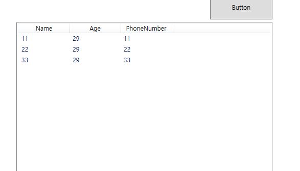

